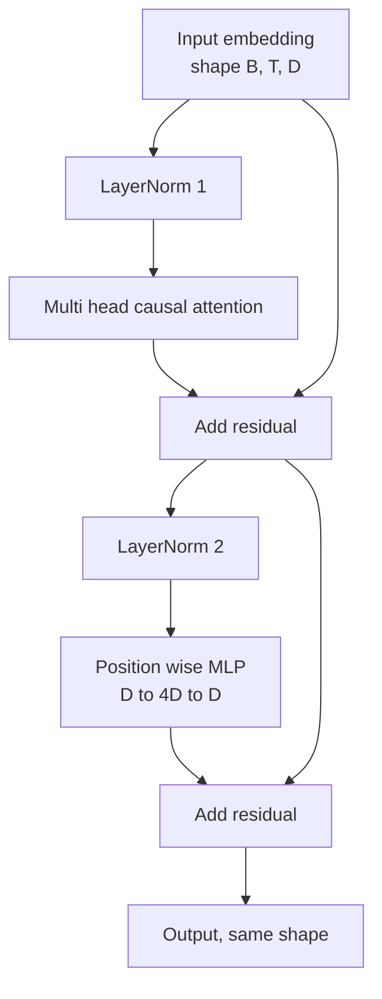
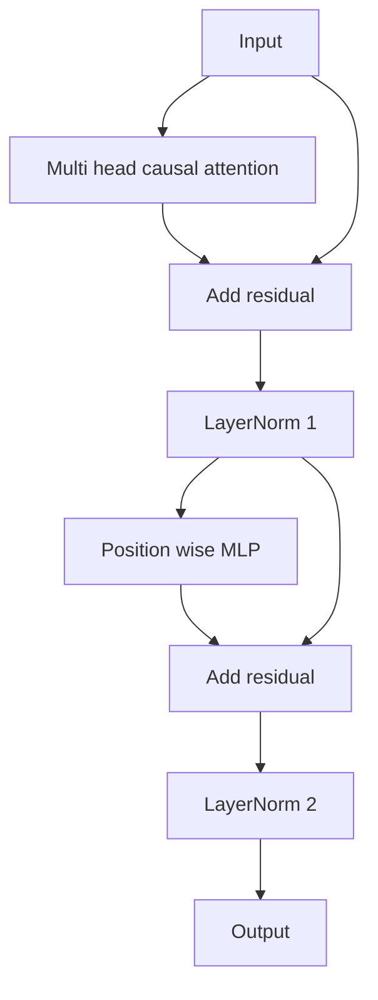

# 밑바닥부터 만드는 트랜스포머 블록(Transformer Block)

> 하나의 블록(block)은 모든 현대 디코더(decoder) LLM의 단위다. 레이어 정규화(layer norm), 멀티헤드 어텐션(multi head attention), 잔차(residual), MLP, 잔차. pre-LN 변형은 워밍업(warmup) 없이 안정적으로 학습한다. post-LN 변형은 원 논문이 출시한 것이다. 이 레슨은 둘을 나란히 만들고, 일반적인 학습률(learning rate)에서 어느 쪽이 12층 스택(stack)에서 살아남는지 보여 준다.

**Type:** Build
**Languages:** Python
**Prerequisites:** Phase 19 lessons 30 to 33 (tokenizer, embeddings, attention math, batched data loader)
**Time:** ~90분

## 학습 목표 (Learning Objectives)

- 네 가지 움직이는 부품으로 PyTorch에서 트랜스포머 블록을 만든다: LayerNorm, 멀티헤드 인과(causal) 어텐션, 잔차 연결(residual connection), 위치별(position wise) MLP.
- LayerNorm을 두 가지 구성(pre-LN과 post-LN)으로 배치하고 어느 쪽이 워밍업 없이 안정적으로 학습하는지 설명한다.
- 토큰 `i`가 토큰 `j > i`를 볼 수 없도록 멀티헤드 어텐션 안에 인과 마스킹(causal masking)을 구현한다.
- 12층 스택에서 두 변형을 통과하는 그래디언트 흐름(gradient flow)을 추적하고 얼버무리지 않고 결과를 읽는다.
- 다음 레슨이 1억 2400만 파라미터(parameter) GPT를 조립할 때 그 블록을 드롭인(drop-in) 단위로 재사용한다.

## 문제 (The Problem)

트랜스포머는 하나의 블록을 반복한 것이다. 블록을 한 번 잘못 만든 뒤 열두 번 반복하면, 첫 에폭(epoch)에 발산(diverge)하거나 그 이후 내내 워밍업 핵(hack)이 필요한 모델을 출시하게 된다. 이 레슨에서 보게 될 두 가지 실패 모드는 이국적인 것이 아니다. 학습자가 블록을 순진하게 쌓는 첫 순간에 나타난다. 하나는 미래에 어텐드(attend)하는 어텐션 층이다. 다른 하나는 깊이(depth)에서 잔차 신호를 길들일 수 없는 곳에 놓인 LayerNorm이다.

수정은 일단 보고 나면 기계적이다. 블록에는 정확히 두 개의 잔차 경로(residual path)와 정확히 두 개의 정규화 위치(normalization position)가 있다. 위치를 올바르게 선택하면 스택의 나머지는 그저 장부 기록(bookkeeping)이다.

## 개념 (The Concept)

모든 디코더 전용(decoder only) 트랜스포머 블록은 형태 `(batch, sequence, embedding)`의 텐서(tensor)를 받아 같은 형태의 텐서를 반환하는 함수다. 내부에서 두 개의 서브층(sublayer)이 일을 한다.



이것이 pre-LN 변형이다. LayerNorm은 잔차 분기 안, 서브층 앞에 앉는다. 잔차 연결은 정규화되지 않은(unnormalized) 신호를 앞으로 운반한다.

post-LN 변형은 LayerNorm을 잔차 더하기(add) 뒤로 옮긴다.



형태는 동일하다. 학습 동작은 아니다. post-LN에서는 잔차 경로로 거꾸로 흐르는 그래디언트가 LayerNorm을 통과해야 한다. 깊이 12와 학습률 `3e-4`에서, 그 그래디언트는 워밍업 스케줄(schedule)이 필요할 만큼 빠르게 줄어든다. pre-LN은 잔차 경로를 정규화하지 않은 채 두므로, 그래디언트가 임베딩(embedding) 층까지 깨끗하게 전파된다. pre-LN은 그 이유로 GPT-2 이후가 출시하는 구성이다.

### 인과 멀티헤드 어텐션 (Causal multi head attention)

어텐션 서브층은 입력을 쿼리(query), 키(key), 값(value) 텐서로 세 가지로 투영(project)한다. 각각은 `(B, T, D)`에서 `(B, H, T, D/H)`로 재형성(reshape)되며 여기서 `H`는 헤드(head) 수다. 스케일드 닷-프로덕트 어텐션(scaled dot product attention)은 헤드별로 `softmax(Q K^T / sqrt(d_k))`를 계산하고, 상삼각(upper triangle)을 음의 무한대로 마스킹하고, 소프트맥스를 통해 마스크를 적용한 뒤, `V`를 곱한다. 헤드는 단일 `(B, T, D)` 텐서로 다시 연결(concatenate)되어 한 번 더 투영된다. 마스크는 모델을 인과적으로 만드는 유일한 부분이다. 마스크를 잊으면 부정행위(cheat)하는 모델을 학습시킨다.

### MLP (The MLP)

위치별 MLP는 같은 2층 신경망을 모든 토큰에 독립적으로 적용한다. 은닉(hidden) 너비는 임베딩 너비의 네 배이고, 활성화(activation)는 GELU이며, 두 번째 선형(linear) 뒤에 드롭아웃(dropout)이 따른다. MLP 안에서는 어떤 토큰도 서로 이야기하지 않는다. 모든 토큰 혼합(mixing)은 어텐션에서 일어난다.

### 잔차 연결은 두 가지 일을 한다 (Residual connections do two things)

잔차 연결은 그래디언트 경로를 깊이에 걸쳐 가산적(additive)으로 만들어, 12개 층을 통과하며 그래디언트 노름(norm)을 척도(scale)에 맞게 유지한다. 또한 각 블록이 실행 중인 표현(representation)을 완전히 교체하는 대신 가산적 갱신(update)을 학습하게 한다. 두 효과 모두 블록이 확장(scale)되는 이유다.

## 직접 만들기 (Build It)

`code/main.py`는 다음을 구현한다.

- 학습 가능한 스케일(scale)과 시프트(shift), 편향된(biased) eps를 갖고 토큰 벡터별로 적용되는 `class LayerNorm`.
- `num_heads`, `head_dim = d_model // num_heads`, 융합(fused) QKV 투영, 등록된 인과 마스크, 어텐션 및 잔차 드롭아웃을 갖춘 `class MultiHeadAttention`.
- 두 개의 선형 층, GELU 활성화, 드롭아웃을 갖춘 `class FeedForward`.
- 두 변형 사이를 토글(toggle)하는 `pre_ln` 플래그를 갖춘 `class TransformerBlock`.
- 동일한 입력으로 6층 pre-LN 스택과 6층 post-LN 스택을 만들고 (a) 출력 형태, (b) 한 번의 역방향 패스(backward pass) 후 임베딩에서의 그래디언트 노름을 출력하는 데모.

실행:

```bash
python3 code/main.py
```

출력: 두 스택에 대한 형태 점검, 나란히 놓인 그래디언트 노름. pre-LN 스택의 임베딩 그래디언트는 같은 학습률에서 post-LN 스택보다 한 자릿수 더 크며, 이것이 pre-LN이 워밍업 없이 학습한다는 경험적(empirical) 신호다.

## 스택 (Stack)

- 텐서 수학, 자동 미분(autograd), `nn.Module` 배관을 위한 `torch`.
- `transformers` 없음, 사전 학습된(pretrained) 가중치 없음. 블록은 기본 요소(primitive)로부터 구현된다.

## 실제 현장의 프로덕션 패턴 (Production patterns in the wild)

세 가지 패턴이 교과서 블록을 출시할 수 있는 무언가로 바꾼다.

**융합 QKV 투영(Fused QKV projection).** 세 개의 별개 선형 층은 세 번의 커널(kernel) 시작과 세 번의 행렬곱(matmul)을 비용으로 치른다. 너비 `3 * d_model`의 단일 선형 층은 같은 일을 한 번의 시작으로 하고, 그런 다음 출력을 마지막 축을 따라 분할한다. 융합 경로는 모든 가속기(accelerator)에서 더 빠르며 GPT-2, LLaMA, Mistral의 참조 구현이 모두 출시하는 것과 일치한다.

**등록된 인과 마스크 버퍼(Registered causal mask buffer).** 마스크는 최대 컨텍스트 길이(context length)에만 의존한다. 생성 시점에 `register_buffer`로 한 번 할당하고, 순방향 패스마다 활성 윈도(window)를 슬라이스(slice)하고, 호출별 할당을 건너뛴다. 이것을 잊으면 마스크가 긴 컨텍스트에서 할당기(allocator) 핫스팟이 된다.

**드롭아웃은 세 곳이 아니라 두 곳(Dropout in two places, not three).** 드롭아웃은 어텐션 소프트맥스 뒤(어텐션 드롭아웃)와 MLP의 두 번째 선형 뒤(잔차 드롭아웃)에 속한다. 잔차 자체에 대한 드롭아웃은 깊이에서 그래디언트가 흐르게 하는 가산 항등성(additive identity)을 깨뜨린다. 일부 초기 구현이 이것을 잘못했고 취약한 학습으로 그 대가를 치렀다.

## 라이브러리로 써보기 (Use It)

- 이 레슨의 블록은 수정 없이 레슨 35의 GPT 조립에 곧장 꽂힌다.
- pre-LN 변형은 모든 현대 오픈 웨이트(open weights) LLM이 쓰는 것이다. post-LN 변형은 원래 2017년 어텐션 논문이 쓴 것이다. 둘 다 아는 것은 마주칠 어떤 디코더 아키텍처든 읽기에 충분하다.
- GELU를 SiLU로 바꾸면 LLaMA 계열 활성화를 얻는다. LayerNorm을 RMSNorm으로 바꾸면 LLaMA 계열 정규화를 얻는다. 같은 골격(skeleton)이다.

## 연습 문제 (Exercises)

1. 블록의 모든 선형에 `bias=False` 플래그를 추가하라. 현대 오픈 웨이트 LLM은 선형 층에 편향(bias) 없이 출시된다. 12층 768차원 모델에서 얼마나 많은 파라미터를 절약하는지 측정하라.
2. `nn.LayerNorm`을 손수 만든 RMSNorm으로 교체하고 출력 형태가 변하지 않는지 검증하라.
3. 첫 번째 헤드의 어텐션 가중치(attention weight)를 `(B, T, T)` 텐서로 반환하는 플래그를 추가하라. 상삼각을 플롯(plot)하여 소프트맥스 후 그것이 0임을 확인하라.
4. `H=6`으로 `(2, 16, 384)` 텐서를 두 변형에 통과시키고, 가중치가 동일하게 초기화되고 드롭아웃이 0으로 설정되었을 때 순방향 출력이 다른지(예: `not torch.allclose`) 단언하는 정상성 점검(sanity check)을 만들어라.

## 핵심 용어 (Key Terms)

| 용어 | 흔히 하는 말 | 실제 의미 |
|------|-----------------|------------------------|
| Pre-LN | "Pre norm" | 잔차 분기 안, 각 서브층 앞의 LayerNorm. 잔차가 정규화되지 않은 신호를 운반한다 |
| Post-LN | "Post norm" | 잔차 더하기 뒤의 LayerNorm. 2017년 논문이 출시했고 워밍업이 필요한 것 |
| 인과 마스크 (Causal mask) | "삼각형 마스크" | j가 i보다 클 때 토큰 i가 토큰 j를 읽을 수 없도록 어텐션 로짓(logit)의 상삼각을 음의 무한대로 설정한 것 |
| 융합 QKV (Fused QKV) | "결합 투영" | 너비 D의 세 선형 대신 너비 3D의 하나의 선형. 하나의 커널, 하나의 행렬곱 |
| 잔차 스트림 (Residual stream) | "스킵 연결" | 모든 블록을 위에서 아래로 흐르는 정규화되지 않은 텐서. 각 블록이 그것에 더한다 |

## 더 읽을거리 (Further Reading)

- 이 블록 아래의 어텐션 수학에 대해서는 Phase 7 lesson 02 (self attention from scratch).
- 같은 골격의 인코더 디코더 버전에 대해서는 Phase 7 lesson 05 (full transformer).
- 이 블록이 꽂히는 학습 절차에 대해서는 Phase 10 lesson 04 (pre training mini GPT).
- 이 블록 열두 개를 GPT 모델로 쌓는 Phase 19 lesson 35 (this track).
