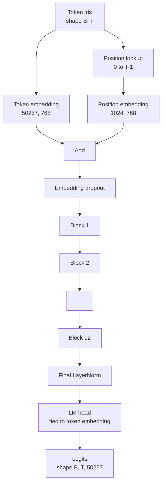
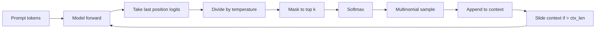

# GPT 모델 조립 (GPT Model Assembly)

> 열두 개 블록(block)을 쌓고, 토큰 임베딩(token embedding), 학습형(learned) 위치 임베딩, 최종 LayerNorm, 묶인(tied) 언어 모델 헤드(head). 그것이 전체 1억 2400만 파라미터(parameter) GPT 모델이다. 이 레슨은 그 부품들을 동작하는 클래스로 조립하고, 파라미터를 세어 모델이 참조 124M 형태와 일치하는지 확인하며, 멀티노미얼 샘플링(multinomial sampling), 온도(temperature), top-k로 텍스트를 생성한다.

**Type:** Build
**Languages:** Python
**Prerequisites:** Phase 19 lessons 30 to 34
**Time:** ~90분

## 학습 목표 (Learning Objectives)

- 레슨 34의 트랜스포머(transformer) 블록을 완전한 GPT 모델로 조립한다: 토큰 임베딩, 위치 임베딩, N개 블록, 최종 LayerNorm, 언어 모델 헤드.
- 1억 2400만 파라미터 구성을 재현한다: 어휘(vocab) 50257, 컨텍스트(context) 1024, 임베딩 768, 열두 헤드, 열두 층.
- 언어 모델 헤드 가중치(weight)를 토큰 임베딩에 묶고(tie) 그것이 이 규모에서 왜 약 3800만 파라미터를 절약하는지 설명한다.
- 슬라이딩 윈도(sliding window)로 컨텍스트 길이를 유지하면서, 멀티노미얼 샘플링, 온도 스케일링(temperature scaling), top-k 절단(truncation)으로 프롬프트(prompt)에서 텍스트를 생성한다.
- 124M 목표 대비 파라미터 수와 순방향 패스(forward pass) 비용을 측정한다.

## 문제 (The Problem)

트랜스포머 블록은 혼자서는 아무것도 하지 않는다. 토큰 id를 벡터(vector)로 바꾸고, 위치 정보를 섞어 넣고, 그것들을 스택(stack)을 통해 실행하고, 어휘 로짓(logit)으로 다시 투영(project)해야 한다. 그 네 단계 중 하나라도 잊으면 모델은 순방향에 실패하거나, 위치 정보에서 표류(drift)하거나, 말을 할 수 없다.

모델의 형태(shape) 또한 중요하다. 참조 GPT-2 small은 정확히 위 구성에서 1억 2400만 파라미터다. 그 수치들은 마법이 아니다. 어휘 50257 곱하기 임베딩 768은 토큰 테이블(table)이다. 위치 1024 곱하기 768은 위치 테이블이다. 각각 약 700만 파라미터인 열두 블록은 8400만이다. 최종 헤드는 가중치 묶기(weight tying)로 토큰 테이블을 재사용한다. 부품을 합하면 1억 2400만에 닿는다. 파라미터 수가 참조와 일치하지 않는 모델을 만드는 것은 무언가를 잘못 연결했다는 신호다.

## 개념 (The Concept)



토큰 id는 토큰 벡터가 된다. 위치 id는 위치 벡터가 된다. 둘은 더해져 스택을 통해 보내진다. 최종 LayerNorm은 모든 현대 변형에서 살아남는, 블록 바깥의 한 부품이다. LM 헤드는 토큰 임베딩 행렬(matrix)을 재사용하며, 그것이 가중치 묶기가 뜻하는 바다.

### 가중치 묶기 (Weight tying)

토큰 임베딩은 형태 `(vocab, d_model)`을 갖는다. 언어 모델 헤드는 `d_model`에서 다시 `vocab`으로 투영해야 한다. 그것들은 서로의 전치(transpose)다. 둘을 묶는다는 것은 문자 그대로 같은 파라미터 텐서(tensor)를 두 번 쓴다는 것이다. 어휘 50257과 d_model 768에서, 그 행렬은 3800만 파라미터다. 묶지 않으면 그것을 두 번 지불한다. 묶으면 한 번 지불하고, 임베딩과 헤드가 함께 갱신되기 때문에 약간 더 깨끗한 그래디언트(gradient) 신호도 얻는다.

### 위치 임베딩은 사인파가 아니라 학습형 (Position embedding is learned, not sinusoidal)

GPT-2는 학습형 위치 임베딩을 출시한다. 위치 테이블은 형태 `(1024, 768)`의 단일 파라미터 텐서다. 모델은 모든 순방향마다 위치 0부터 T-1까지를 룩업(lookup)하고 그 룩업을 토큰 임베딩에 더한다. 이것은 위치 방식 중 가장 단순한 것이며(RoPE, ALiBi, T5 상대 편향이 대안들이다), 124M 참조가 쓰는 것이다.

### 생성: 온도, top-k, 멀티노미얼 (Generation: temperature, top-k, multinomial)

생성은 자기회귀(autoregressive)다. 모든 스텝에서, 모델은 모든 위치에 대해 전체 어휘에 걸친 로짓을 반환한다. 마지막 위치만 취해, 온도로 나누고, 선택적으로 상위 k개를 제외한 모든 로짓을 음의 무한대로 마스킹하고, 소프트맥스(softmax)하여 확률을 얻고, 그 결과 분포에서 토큰 하나를 샘플링한다.



세 개의 노브(knob), 세 가지 다른 동작. 온도가 0에 가까우면 그리디(greedy)로 붕괴한다. 온도 1은 모델의 자연스러운 분포와 일치한다. top-k 1은 그리디다. top-k 40은 긴 꼬리(long tail)를 거른다. 조합이 중요하다. 다음 학습 레슨은 생성을 정성적(qualitative) 평가 신호로 사용한다.

## 직접 만들기 (Build It)

`code/main.py`는 다음을 구현한다.

- 124M 기본값을 갖춘 `class GPTConfig` 데이터클래스(dataclass): `vocab_size=50257`, `context_length=1024`, `d_model=768`, `num_heads=12`, `num_layers=12`, `mlp_expansion=4`, `dropout=0.1`, `use_bias=True`, `weight_tying=True`.
- 토큰 임베딩, 위치 임베딩, 임베딩 드롭아웃, 열두 개의 `TransformerBlock`, 최종 LayerNorm, 그리고 플래그가 설정되면 토큰 임베딩에 묶이는 `lm_head`를 갖춘 `class GPTModel`.
- 고유 파라미터 수를 반환하는(그래서 가중치 묶기가 수에 반영되는) `count_parameters` 도우미(helper).
- 온도, top-k, 멀티노미얼, 슬라이딩 윈도 컨텍스트를 하는 `generate` 함수.
- 모델을 만들고, 참조 124M 옆에 파라미터 수를 출력하고, 고정된 프롬프트에서 짧은 시퀀스를 생성하여 파이프라인(pipeline)이 종단 간으로 끝나는 것을 보여 주는 데모.

실행:

```bash
python3 code/main.py
```

출력: 124M 참조와 나란히 놓인 파라미터 수, 무작위 프롬프트에서 생성된 토큰 id, 그리고 묶기가 켜져 있을 때 LM 헤드와 토큰 임베딩이 저장소를 공유한다는 확인.

데모를 빠르게 유지하기 위해, 스크립트는 또한 작은 구성(`d_model=64`, `num_layers=2`)을 종단 간으로 실행하고 생성된 토큰 시퀀스를 인라인(inline)으로 출력한다. 124M 구성은 만들어지지만 파라미터 수와 한 번의 순방향 패스만 행사된다.

## 스택 (Stack)

- 텐서 수학, 자동 미분(autograd), 모듈 배관을 위한 `torch`.
- `code/main.py`는 레슨 34의 같은 블록 패턴을 로컬로 재구현한다.

## 실제 현장의 프로덕션 패턴 (Production patterns in the wild)

세 가지 패턴이 실행되는 모델과 출시할 수 있는 모델 사이의 차이를 만든다.

**잔차 투영(residual projection)을 작게 초기화하라.** 어텐션(attention)의 출력 투영과 MLP의 두 번째 선형(linear)은 둘 다 잔차 더하기(residual add)로 직접 들어간다. 그것들을 다른 모든 선형과 같은 표준편차로 초기화하면 깊이에 따라 자라나 최종 LayerNorm을 뜨거운 영역으로 밀어 넣는 잔차 스트림(residual stream)이 된다. 그 두 투영에 대해 표준편차를 `1 / sqrt(2 * num_layers)`로 스케일하라. 잔차 스트림이 열두 층을 통과하며 온전한 범위에 머문다.

**위치 id 텐서를 캐싱하라, 다시 계산하지 말라.** `torch.arange(T)`는 모든 순방향마다 새 메모리를 할당한다. 최대 컨텍스트에 대해 `__init__`에서 한 번 할당하고, 호출마다 첫 T개 항목을 슬라이스하고, 할당기 왕복을 건너뛰어라.

**복사가 아니라 파라미터 수준에서 가중치를 묶어라.** `lm_head.weight = token_embedding.weight`를 설정하면 텐서를 공유한다. 복사는 아니다. 옵티마이저(optimizer)는 하나의 파라미터를 갱신하면 되고 자동 미분 그래프(graph)는 하나의 누적을 필요로 한다. 복사하면 헤드가 임베딩에서 멀어지고 가중치 묶기가 아무것도 사 주지 않는다.

## 라이브러리로 써보기 (Use It)

- 이 레슨의 모델 클래스는 다음 레슨이 학습시키는 것과 같은 형태다.
- 학습형 위치 임베딩을 RoPE로 교체하면 블록이나 헤드를 건드리지 않고 LLaMA 계열을 얻는다.
- GELU를 SiLU로, LayerNorm을 RMSNorm으로 교체하면 LLaMA 계열의 나머지 변경을 얻는다.
- 생성 함수는 이 모델뿐 아니라 어떤 로짓 소스(source)와도 동작한다. 레슨 37에서 사전 학습된 GPT-2 파일로부터 로짓을 끌어와 같은 생성 루프(loop)를 재사용할 수 있다.

## 연습 문제 (Exercises)

1. LM 헤드를 토큰 임베딩에서 풀고(untie) 파라미터를 다시 세라. 차이가 50257 곱하기 768 = 3800만임을 검증하라.
2. 학습형 위치 임베딩을 생성 시점에 계산된 사인파(sinusoidal) 테이블로 교체하라. 모델이 여전히 순방향하고 파라미터 수가 786,432만큼 떨어지는지 확인하라.
3. 샘플링을 건너뛰고 argmax를 고르는 `greedy=True` 플래그를 생성에 추가하라. 시퀀스가 실행 전반에 걸쳐 결정론적(deterministic)임을 확인하라.
4. 프롬프트나 생성 이력의 어떤 토큰의 로짓을 소프트맥스 전에 상수로 나누는 `repetition_penalty` 노브를 추가하라. 고정된 프롬프트에서 1보다 큰 값이 출력의 반복 횟수를 줄이는 것을 보여라.
5. `top_k` 옆에 `top_p`(뉴클리어스, nucleus) 샘플링을 추가하라. 유지된 토큰의 확률 합이 `top_p`를 초과하는지 두 줄로 점검하라.

## 핵심 용어 (Key Terms)

| 용어 | 흔히 하는 말 | 실제 의미 |
|------|-----------------|------------------------|
| 가중치 묶기 (Weight tying) | "묶인 임베딩" | LM 헤드와 토큰 임베딩이 같은 파라미터 텐서를 공유한다. 어휘 곱하기 d_model 파라미터를 절약하고 GPT-2 참조와 일치한다 |
| 위치 임베딩 (Position embedding) | "학습형 위치" | 토큰 벡터에 더해지는 형태 (컨텍스트 길이, d_model)의 별도 테이블. 종단 간으로 학습된다 |
| 슬라이딩 윈도 컨텍스트 (Sliding window context) | "컨텍스트 상한" | 프롬프트 더하기 생성된 토큰이 컨텍스트 길이를 초과하면, 가장 오래된 토큰을 버려 활성 윈도가 맞게 한다 |
| Top-k 샘플링 | "K 절단" | 값이 가장 높은 K개 로짓을 유지하고 나머지를 음의 무한대로 마스킹한 뒤 나머지에 소프트맥스 |
| 온도 (Temperature) | "샘플링 온도" | 소프트맥스 전에 로짓을 T로 나눈다. T가 1보다 작으면 날카롭게, T가 1이면 자연스러운 분포 유지, T가 1보다 크면 평평하게 |

## 더 읽을거리 (Further Reading)

- 이 모델이 쌓는 블록에 대해서는 Phase 19 lesson 34.
- 이 모델을 교차 엔트로피(cross entropy) 손실로 구동하는 학습 루프에 대해서는 Phase 19 lesson 36.
- 사전 학습된 GPT-2 가중치를 이 정확한 아키텍처에 로드하는 것에 대해서는 Phase 19 lesson 37.
- 다음 토큰 예측의 수학에 대해서는 Phase 7 lesson 07 (GPT causal language modeling).
- 같은 아키텍처에 대한 원래 학습 절차에 대해서는 Phase 10 lesson 04 (pre training mini GPT).
