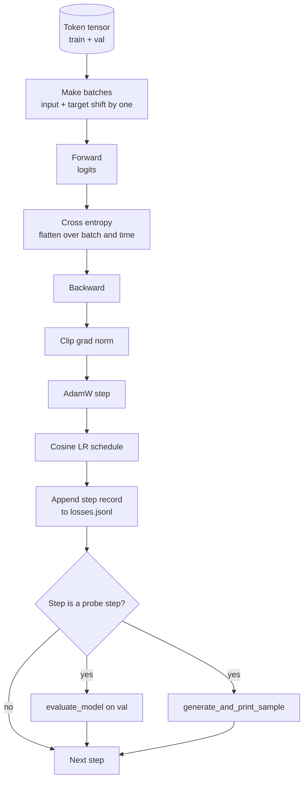

# 학습 루프와 평가 (Training Loop and Evaluation)

> 측정하지 않는 루프(loop)는 거짓말하는 루프다. 이 레슨은 GPT 모델을 구동하는 학습 루프를 만든다: 가중치 감쇠(weight decay) 분할이 있는 AdamW, 워밍업(warmup) 더하기 코사인(cosine) 학습률(learning rate) 스케줄(schedule), `calc_loss_batch` 도우미(helper), 따로 떼어 둔(held out) 데이터에 대한 `evaluate_model` 패스, K 스텝마다의 `generate_and_print_sample` 정성적(qualitative) 프로브(probe), 그리고 나중에 플롯(plot)할 수 있는 손실의 JSONL 로그. 같은 골격(skeleton)이 당신이 만들 모든 디코더(decoder) LLM을 학습시킨다.

**Type:** Build
**Languages:** Python
**Prerequisites:** Phase 19 lessons 30 to 35
**Time:** ~90분

## 학습 목표 (Learning Objectives)

- 다음 토큰 예측을 위한 올바른 입력과 타깃(target) 정렬로 교차 엔트로피(cross entropy) 손실(loss)을 계산하는 학습 루프를 만든다.
- 가중치 감쇠를 가중치 텐서(tensor)에는 적용하고 LayerNorm이나 편향(bias) 텐서에는 적용하지 않도록 AdamW를 구성한다.
- 선형 워밍업과 코사인 감쇠(decay)를 갖춘 학습률 스케줄을 구현하고, 시간에 따른 결과 LR을 읽는다.
- `evaluate_model`로 따로 떼어 둔 분할(split)에서 평가하여 평가 손실이 실행 전반에 걸쳐 비교 가능하게 한다.
- 손실 곡선이 알기 전에 발산(divergence)을 잡기 위해 `generate_and_print_sample`로 K 스텝마다 정성적 샘플을 생성한다.
- 스텝별 손실을 JSONL로 영속화(persist)하여 학습 로그를 다시 로드하고, 플롯하고, 산출물로 출시할 수 있게 한다.

## 문제 (The Problem)

손실을 출력하지만 그 외에 아무것도 하지 않는 학습 스크립트는 세 가지로 실패한다. 손실이 올바른 이유로 감소하는지 알려 줄 수 없다(모델이 학습 세트에 과적합(overfit)하고 아무것도 학습하지 못할 수 있다). 발산이 시작되는지 알려 줄 수 없다(손실이 한 스텝 튀었다가 회복할 수도, 한 스텝 튀었다가 무너질 수도 있다). 모델이 무엇을 학습했는지 알려 줄 수 없다(손실은 스칼라(scalar)다. 생성된 샘플은 한 문단이다). 세 가지 실패 모두 루프가 측정하지 않으면 숨는다.

이 레슨의 루프는 세 가지로 측정한다. 매 스텝 학습 배치(batch)에 대한 손실. K 스텝마다 따로 떼어 둔 배치에 대한 손실. K 스텝마다 고정된 프롬프트(prompt)에서 생성된 연속(continuation). 학습 로그는 JSONL로 떨어져, 그 산출물이 루프의 증언이 된다.

## 개념 (The Concept)



명백하지 않은 두 부분은 손실 정렬(loss alignment)과 AdamW 감쇠 분할(decay split)이다.

### 손실 정렬 (Loss alignment)

모델은 모든 위치에서 다음 토큰을 예측한다. 입력 배치가 토큰 `[t0, t1, t2, t3]`이면, 타깃 배치는 `[t1, t2, t3, t4]`여야 한다. 교차 엔트로피는 평탄(flat) 형태 `(batch * seq, vocab)`에 대해 평탄 타깃 `(batch * seq,)`와 계산된다. 옮기기(shift)를 잊으면 모델이 자기 자신을 예측하도록 학습되며, 이는 손실 0으로 수렴하지만 쓸모 있는 것은 아무것도 학습하지 못한다.

### AdamW 감쇠 분할 (AdamW decay split)

가중치 감쇠는 가중치 텐서를 정규화(regularize)하지만 정규화(normalization) 스케일(scale)이나 편향은 그렇게 하지 않는다. LayerNorm 스케일에 감쇠를 걸면 스케일이 서서히 0으로 몰려 정규화가 깨진다. 편향에 감쇠를 거는 것은 수학적으로 무해하지만 사이클(cycle) 낭비다. 표준 분할은 이렇다. 행렬 형태 텐서(선형 가중치, 임베딩 테이블)는 감쇠를 받고, 스케일이나 시프트(shift)처럼 보이는 무엇이든 받지 않는다.

### 워밍업 더하기 코사인 스케줄 (Warmup plus cosine schedule)

워밍업은 옵티마이저(optimizer) 상태가 채워질 시간을 갖도록 수백 스텝에 걸쳐 학습률을 0에서 목표까지 올린다. 코사인 감쇠는 나머지 스텝에 걸쳐 학습률을 다시 0 쪽으로 떨어뜨려, 마지막 단계가 작은 스텝 크기에서 가중치를 파인튜닝(fine tune)하게 한다. 그 조합은 오픈 웨이트(open weights) LLM 학습에서 가장 흔한 스케줄인데, 첫 천 스텝과 마지막 천 스텝의 취약한 순간 대부분을 제거하기 때문이다.

### 따로 떼어 둔 평가 (Held out evaluation)

`evaluate_model`은 검증(validation) 분할에서 고정된 수의 배치를 실행하고, 손실을 누적하고, 배치 수로 나누고, 반환한다. 그래디언트(gradient) 없음. 드롭아웃(dropout) 없음. 그 수치는 같은 시드(seed)와 같은 분할이 주어지면 실행 전반에 걸쳐 재현 가능하다. 따로 떼어 둔 손실을 학습 손실 옆에 보고하는 것이 과적합을 발견하는 방법이다.

### 이른 신호로서의 정성적 샘플링 (Qualitative sampling as an early signal)

학습 손실은 잘 떨어지지만 생성된 샘플이 모두 같은 토큰인 모델은 망가진 것이다. 손실 곡선은 평평해 보이지만 생성된 샘플이 일관된 단어로 날카로워지는 모델은 학습하고 있는 것이다. 정성적 프로브는 전체 곡선을 읽는 것보다 빠르게 실행되고 스칼라가 놓치는 모드(mode)를 잡는다.

## 직접 만들기 (Build It)

`code/main.py`는 다음을 구현한다.

- 긴 토큰 텐서를 입력과 타깃 쌍으로 잘라내는 `make_batches(token_ids, batch_size, context_length)`.
- 순방향하고, 평탄화하고, 스칼라 교차 엔트로피를 반환하는 `calc_loss_batch(model, inputs, targets)`.
- 그래디언트 없이 고정된 수의 검증 배치를 반복하고 평균 손실을 반환하는 `evaluate_model(model, val_loader, max_batches)`.
- 고정된 프롬프트에서 레슨 35의 생성 함수를 실행하고 결과를 출력하는 `generate_and_print_sample(model, prompt, max_new_tokens)`.
- 두 그룹의 AdamW 파라미터 리스트를 만드는 `build_param_groups(model, weight_decay)`.
- 주어진 스텝에서 LR을 반환하는 `cosine_with_warmup(step, warmup_steps, total_steps, max_lr, min_lr)`.
- 루프를 실행하고, `outputs/losses.jsonl`을 영속화하고, `eval_every` 스텝마다 평가 손실과 샘플을 출력하는 `train(...)`.
- 합성(synthetic) 데이터에서 작은 모델을 적은 수의 스텝 동안 학습시키고, JSONL 로그를 기록하고, 프로브 지점에서 평가 손실과 샘플을 출력하는 데모. 데모는 CPU에서 1분 훨씬 안에 실행된다.

실행:

```bash
python3 code/main.py
```

출력: 스텝별 손실 줄, 프로브 스텝마다의 평가 손실, 프로브 스텝마다의 생성된 샘플, 그리고 줄마다 `json.loads`로 로드할 수 있는 최종 `outputs/losses.jsonl`.

## 스택 (Stack)

- 자동 미분(autograd), 옵티마이저, 모듈을 위한 `torch`.
- `main.py`는 레슨 35의 `GPTModel`과 지원 모듈을 로컬로 재구현한다.

## 실제 현장의 프로덕션 패턴 (Production patterns in the wild)

세 가지 패턴이 교과서 루프를 밤새 돌릴 수 있는 무언가로 바꾼다.

**그래디언트 노름 클리핑(gradient norm clipping)은 타협 불가다.** 나쁜 배치(이상 데이터, LR 스파이크, 수치적 경계 사례)는 몇 시간의 학습을 날려 버리는 거대한 그래디언트를 만든다. `backward` 뒤와 `step` 앞의 `torch.nn.utils.clip_grad_norm_(params, max_norm=1.0)`은 옵티마이저를 안전한 범위에 유지한다. 클리핑 값은 자유 파라미터(free parameter)다. 1이 대부분의 설정에서 살아남는 기본값이다.

**피클(pickle)된 상태가 아니라 재개 가능한 JSONL 로깅.** `{"step": int, "train_loss": float, "lr": float}` 줄로 된 스텝별 손실 레코드는 내구적이다. 어떤 충돌도 읽을 수 있는 산출물을 남기고, grep할 수 있고, 30줄의 파이썬으로 플롯할 수 있고, 마지막 스텝을 읽어 학습을 재개할 수 있다. 피클된 상태는 파일을 만든 정확한 모듈 레이아웃(layout)에 묶어, 리팩터링 전반에 걸쳐 취약하다.

**고정된 슬라이스(slice)에서 뽑은 평가 배치.** 검증 토큰은 즉석이 아니라 스크립트 시작 시점에 배치로 잘린다. 재현성은 평가 배치가 실행마다 동일한 것에 달려 있다. 그렇지 않으면 두 실행 사이의 평가 손실을 비교하는 것이 모델만큼이나 배치 셔플(shuffle)을 측정한다.

## 라이브러리로 써보기 (Use It)

- 이 레슨의 루프는 실제 데이터에서 124M 모델을 학습시키는 것과 같은 골격이다. 합성 토큰 텐서를 `datasets` 스타일 로더(loader)로 교체하면 루프가 그대로 실행된다.
- JSONL 로그는 학습 실행을 증거로 바꾸는 산출물이다. 다음 레슨은 그것을 사용해 갓 학습된 체크포인트(checkpoint)를 사전 학습된 것과 비교한다.
- 정성적 샘플 프로브는 스칼라 손실이 대체할 수 없는 만능 장치(catch-all)다.

## 연습 문제 (Exercises)

1. 스케일과 편향 파라미터가 무감쇠(no decay) 그룹에 들어가고 선형 및 임베딩 가중치가 감쇠 그룹에 들어가는지 확인하는 `weight_decay_groups()` 단위 테스트를 추가하라.
2. 합성 무작위 토큰을 작은 텍스트 파일의 바이트로 교체하여 데모가 읽을 수 있는 무언가에서 학습하게 하라. 생성된 샘플이 파일에 존재하는 문자를 사용하는지 검증하라.
3. 코사인 스케줄에 `max_lr`의 10퍼센트인 `min_lr` 바닥을 추가하고 다시 플롯하라.
4. JSONL 로그 외에 `eval_every` 스텝마다 체크포인트를 저장하라. 모델 상태와 옵티마이저 상태를 다시 로드하는 `resume_from` 플래그를 추가하라.
5. 손실 옆에 스텝별 처리량(throughput)(초당 토큰)을 로깅하고 그것이 안정적인 대역(band)에 머무는지 확인하라.

## 핵심 용어 (Key Terms)

| 용어 | 흔히 하는 말 | 실제 의미 |
|------|-----------------|------------------------|
| 손실 정렬 (Loss alignment) | "하나 옮기기" | 위치 0..T-1의 입력 토큰, 위치 1..T의 타깃 토큰. 교차 엔트로피는 평탄화된 형태에서 계산된다 |
| 감쇠 분할 (Decay split) | "두 그룹" | AdamW는 가중치 감쇠가 있는 행렬 형태 텐서와 없는 스케일 또는 편향 텐서를 받는다 |
| 워밍업 (Warmup) | "램프" | 옵티마이저 상태가 채워질 수 있도록 학습률이 고정된 수의 스텝에 걸쳐 0에서 목표까지 오른다 |
| 평가 배치 (Eval batches) | "따로 떼어 둔 배치" | 스크립트 시작 시점에 한 번 잘린, 모든 프로브에서 동일하게 쓰이는 검증 토큰 텐서의 고정된 슬라이스 |
| 정성적 프로브 (Qualitative probe) | "샘플 출력" | 손실 단독으로는 숨는 실패 모드를 잡기 위해 K 스텝마다 출력되는 고정된 프롬프트로부터의 짧은 생성 |

## 더 읽을거리 (Further Reading)

- 루프가 구동하는 모델에 대해서는 Phase 19 lesson 35.
- 같은 모델에 사전 학습된 가중치를 로드하는 것에 대해서는 Phase 19 lesson 37.
- 실제 데이터에 대한 절차에 대해서는 Phase 10 lesson 04 (pre training mini GPT).
- 교차 엔트로피 손실 너머의 더 넓은 평가 표면에 대해서는 Phase 10 lesson 10 (evaluation).
