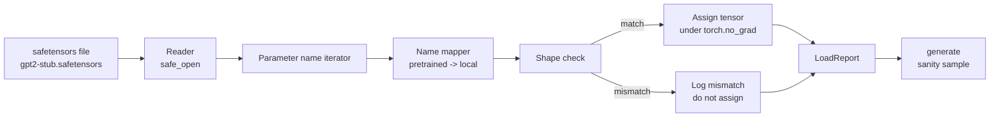

# 사전 학습된 가중치 로드하기 (Loading Pretrained Weights)

> 1억 2400만 파라미터(parameter) 모델을 밑바닥부터 학습시키는 것은 예산 결정이다. 게시된 체크포인트(checkpoint)를 로드하는 것은 화요일이다. 이 레슨은 레슨 35의 정확한 아키텍처에 GPT-2 스타일 가중치(weight)를 safetensors 파일에서 로드하고, 파라미터 이름 매핑(mapping)을 조각조각 짚어 가며, 연속(continuation)을 정상성 생성(sanity generate)하여 로드가 동작했음을 증명한다. 네트워크 없음, 서드파티 로더(loader) 없음, 불투명한 마법 없음.

**Type:** Build
**Languages:** Python
**Prerequisites:** Phase 19 lessons 30 to 36
**Time:** ~90분

## 학습 목표 (Learning Objectives)

- `safetensors` 파이썬 라이브러리로 safetensors 파일을 읽고 텐서(tensor) 이름과 형태(shape)를 살펴본다.
- 각 사전 학습된 파라미터 이름을 레슨 35 GPT 모델 안의 파라미터로 매핑한다.
- 게시된 GPT-2 가중치와 이 트랙의 모델 사이에 다른 두 이름 관습(convention)을 처리한다: `wte/wpe/h.N.attn.c_attn/c_proj`와 `mlp.c_fc/c_proj` 대 로컬 이름 `tok_embed/pos_embed/blocks.N.attn.qkv/out_proj`와 `mlp.fc1/fc2`.
- 어떤 가중치 할당이 일어나기 전에 명확한 오류로 형태 불일치(shape mismatch)를 감지하고 거부한다.
- 로드된 가중치로 짧은 연속을 생성하고 토큰이 무작위 초기화된 분포가 아니라 로드된 분포에서 나오는지 확인한다.

## 문제 (The Problem)

게시된 가중치는 우리 아키텍처에 맞게 포장되어 있지 않다. 원래 구현이 쓴 이름을 그대로 지닌다. 사전 학습된 파일은 형태 `(2304, 768)`의 `transformer.h.0.attn.c_attn.weight`를 갖는다. 반면 우리 모델은 형태 `(2304, 768)`의 `blocks.0.attn.qkv.weight`(다른 레이아웃 관습의 같은 행렬)를 기대하거나, 행렬을 전치(transpose)하여 저장하는 `nn.Linear`를 쓴다. 같은 파라미터가 미묘하게 다른 세 가지 정체성(이름, 형태, 바이트 레이아웃)으로 나타나므로 로더는 셋 모두를 조정해야 한다.

맹목적으로 복사하는 로더는 올바른 텐서를 잘못된 곳에 넣어 헛소리를 생성하는 모델을 만든다. 형태가 다를 때 복사를 거부하면서도 아무것도 로깅하지 않는 로더를 쓰면, 어떤 텐서가 안착에 실패했는지 추측할 수밖에 없다. 이 레슨의 로더는 명시적이다. 모든 할당이 로깅되고, 모든 형태가 검사되며, `LoadReport`가 히트(hit), 미스(miss), 형태 불일치를 요약하여 무슨 일이 일어났는지 읽을 수 있게 한다.

## 개념 (The Concept)



이름 매퍼(mapper)는 그저 문자열에서 문자열로 가는 함수다. 형태 검사는 하나의 if다. 할당은 자동 미분(autograd)이 로드를 추적하지 않도록 `torch.no_grad()` 안에서 일어난다. 보고서는 모든 이름의 결과를 보유한다.

### GPT-2 이름 관습 (The GPT-2 naming convention)

게시된 GPT-2 가중치는 다음과 같은 이름 아래 산다.

| 사전 학습 이름 | 형태 | 의미 |
|-----------------|-------|---------|
| `wte.weight` | (50257, 768) | 토큰 임베딩 |
| `wpe.weight` | (1024, 768) | 위치 임베딩 |
| `h.N.ln_1.weight` | (768,) | 블록 N에서 LayerNorm 1 스케일 |
| `h.N.ln_1.bias` | (768,) | 블록 N에서 LayerNorm 1 시프트 |
| `h.N.attn.c_attn.weight` | (768, 2304) | 융합 QKV 선형 가중치 |
| `h.N.attn.c_attn.bias` | (2304,) | 융합 QKV 선형 편향 |
| `h.N.attn.c_proj.weight` | (768, 768) | 어텐션 출력 투영 |
| `h.N.attn.c_proj.bias` | (768,) | 어텐션 출력 투영 편향 |
| `h.N.ln_2.weight` | (768,) | LayerNorm 2 스케일 |
| `h.N.ln_2.bias` | (768,) | LayerNorm 2 시프트 |
| `h.N.mlp.c_fc.weight` | (768, 3072) | MLP fc1 가중치 |
| `h.N.mlp.c_fc.bias` | (3072,) | MLP fc1 편향 |
| `h.N.mlp.c_proj.weight` | (3072, 768) | MLP fc2 가중치 |
| `h.N.mlp.c_proj.bias` | (768,) | MLP fc2 편향 |
| `ln_f.weight` | (768,) | 최종 LayerNorm 스케일 |
| `ln_f.bias` | (768,) | 최종 LayerNorm 시프트 |

대비해야 할 두 가지 놀라움. `c_attn`, `c_proj`, `c_fc` 선형은 `nn.Linear.weight`가 기대하는 것과 비교해 행렬이 전치된 채로 저장된다. 로더는 할당 중에 전치한다. LM 헤드(head)는 파일에 전혀 없다. 모델은 `wte`와의 가중치 묶기(weight tying)에 의존하므로, `wte`가 안착하면 헤드는 별칭(aliasing)으로 설정된다.

### 로컬 이름 관습 (The local naming convention)

이 트랙의 모델은 서술적인 이름을 쓴다.

| 로컬 이름 | 의미 |
|------------|---------|
| `tok_embed.weight` | 토큰 임베딩 |
| `pos_embed.weight` | 위치 임베딩 |
| `blocks.N.ln1.scale` | 블록 N에서 LayerNorm 1 스케일 |
| `blocks.N.ln1.shift` | LayerNorm 1 시프트 |
| `blocks.N.attn.qkv.weight` | 융합 QKV |
| `blocks.N.attn.qkv.bias` | 융합 QKV 편향 |
| `blocks.N.attn.out_proj.weight` | 어텐션 출력 투영 |
| `blocks.N.attn.out_proj.bias` | 출력 투영 편향 |
| `blocks.N.ln2.scale` | LayerNorm 2 스케일 |
| `blocks.N.ln2.shift` | LayerNorm 2 시프트 |
| `blocks.N.mlp.fc1.weight` | MLP fc1 |
| `blocks.N.mlp.fc1.bias` | MLP fc1 편향 |
| `blocks.N.mlp.fc2.weight` | MLP fc2 |
| `blocks.N.mlp.fc2.bias` | MLP fc2 편향 |
| `final_ln.scale` | 최종 LayerNorm 스케일 |
| `final_ln.shift` | 최종 LayerNorm 시프트 |

매핑은 고정된 함수다. 레슨은 그것을 로더가 반복하는 딕셔너리(dict)로 출시한다.

### 스텁 픽스처 (The stub fixture)

실제 GPT-2 가중치는 0.5 GB다. 데모는 그것을 다운로드하지 않는다. 첫 실행에서 작은 safetensors 픽스처(fixture)를 생성하는데, 정확한 GPT-2 이름 관습과 768 대신 d_model 192의 12블록 모델에 적합한 형태를 갖는다. 픽스처는 로더의 모든 코드 경로를 행사할 올바른 구조를 갖는다. 픽스처를 실제 파일로 교체하면 로더가 수정 없이 동작한다.

## 직접 만들기 (Build It)

`code/main.py`는 다음을 구현한다.

- 이 레슨이 독립적(self contained)이도록 레슨 35 `GPTModel`의 작은 복제(replica).
- 층별 항목을 펼치는 `make_pretrained_to_local(num_layers)`.
- 이름을 반복하고, 매핑하고, 형태를 검사하고, conv1d 스타일 가중치를 전치하고, `torch.no_grad()` 아래에서 할당하는 `load_safetensors(model, path)`. `LoadReport`를 반환한다.
- 정확한 사전 학습 이름 관습으로 픽스처 파일을 생성하는 `make_stub_safetensors(path, cfg)`.
- 첫 실행에서 `outputs/gpt2-stub.safetensors`를 만들고, 새 모델을 만들고, 무작위 초기화에서 생성된 연속 하나를 캡처하고, 스텁을 로드하고, 또 다른 연속을 캡처하고, 둘 다 출력하고, 둘이 다른지(로드가 실제로 모델을 바꿨는지) 검증하는 데모.

실행:

```bash
python3 code/main.py
```

출력: 픽스처 경로, 이름별 로드 로그, `LoadReport` 요약, 로드 전 연속, 로드 후 연속, 그리고 실패 경로가 행사되도록 픽스처에 의도적으로 주입된 단일 불량 텐서에 대한 형태 불일치.

## 스택 (Stack)

- 디스크상 형식과 스트리밍 리더(reader)를 위한 `safetensors`.
- 모델과 할당 수학을 위한 `torch`.
- `transformers` 없음, `huggingface_hub` 없음, 네트워크 호출 없음.

## 실제 현장의 프로덕션 패턴 (Production patterns in the wild)

직접 만들지 않은 가중치를 다룰 때 로더를 버티게 해 주는 패턴이 셋 있다.

**어떤 할당 전에든 항상 파일을 검증하라.** 파일을 열고, 모든 텐서 이름을 그 dtype과 형태와 함께 나열하고, 형태 검사로 전체 매핑을 실행하고, 성공할 때만 할당을 시작하라. 절반만 로드된 모델은 조용한 실패 기계다.

**소스 이름과 목적지 이름과 함께 모든 할당을 로깅하라.** 무언가 잘못 보일 때, 로그가 어떤 텐서가 어디에 안착했는지 알려 준다. 대안은 헥스덤프(hexdump)를 읽는 것이다. 이 레슨의 `LoadReport` 데이터클래스(dataclass)는 `loaded`, `missing`, `unexpected`, `shape_mismatch` 리스트를 추적하고 끝에 요약을 출력한다.

**LM 헤드는 별개의 복사본이 아니라 가중치 묶기 별칭(alias)이다.** `tok_embed`를 로드한 뒤 `model.lm_head.weight = model.tok_embed.weight`를 설정하는 것이 정규(canonical) 패턴이다. 임베딩 행렬을 새 `lm_head.weight` 파라미터로 복사하면 묶기가 깨지고 조용히 파라미터 수가 두 배가 된다.

## 라이브러리로 써보기 (Use It)

- 로더는 사전 학습 이름 관습을 쓰는 어떤 safetensors 파일에든 동작한다. 실제 GPT-2 파일(small / medium / large / xl)은 코드 변경 없이 동작한다. 모델 구성만 다르다.
- 같은 패턴은 이름 맵을 갱신하면 LLaMA, Mistral, Qwen 가중치로 확장된다. 형태 검사와 보고서는 동일하게 유지된다.
- 로드 후 정상성 생성은 빠른 게이트(gate)다. 로드 후 샘플이 로드 전 샘플처럼 보이면 로드가 모델을 바꾸지 않은 것이고, 매핑이 모든 텐서를 조용히 놓쳤다는 뜻이다.

## 연습 문제 (Exercises)

1. 할당 중에 각 텐서를 목표 dtype(`bfloat16`, `float16`, `float32`)으로 캐스트(cast)하는 `dtype` 인자를 로더에 추가하라. `float32` 모델이 `bfloat16`으로 다운캐스트(downcast)되어도 여전히 생성할 수 있는지 확인하라.
2. `h.N` 인덱스가 모델의 `num_layers`와 일치하지 않는 체크포인트의 로드를 거부하는 `expected_layers` 인자를 추가하라.
3. 로더를 레슨 35 생성 함수에 꽂아 두 개의 나란한 샘플을 만들어라. 하나는 무작위 초기화에서, 하나는 로드된 픽스처에서.
4. 내보내기(export) 경로를 추가하라. 현재 모델 상태를 사전 학습 이름 관습을 사용해 새 safetensors 파일로 기록하라. 로더로 왕복(round trip)하고 보고서에 형태 불일치가 0개인지 확인하라.
5. `NAME_MAP`을 확장하여 LLaMA 이름 관습(편향 없음, RMSNorm, 융합 qkv 레이아웃)을 처리하고, 직접 생성한 스텁 LLaMA 픽스처에서 로더를 다시 실행하라.

## 핵심 용어 (Key Terms)

| 용어 | 흔히 하는 말 | 실제 의미 |
|------|-----------------|------------------------|
| 이름 맵 (Name map) | "키 재매핑" | 사전 학습 텐서 이름에서 로컬 파라미터 이름으로 가는 함수. 보통 루프에 걸쳐 펼쳐진 층 인덱스당 한 항목을 갖는 문자 그대로의 딕셔너리 |
| 형태 불일치 (Shape mismatch) | "잘못된 형태" | 사전 학습된 텐서가 매핑된 이름 아래 존재하지만 그 차원이 로컬 파라미터와 어긋남. 로더는 할당을 거부하고 그 쌍을 로깅한다 |
| 로드 시 전치 (Transpose-on-load) | "Conv1d 레이아웃" | 게시된 GPT-2는 어텐션과 MLP 투영을 nn.Linear가 기대하는 것의 전치로 저장한다. 로더는 할당 중에 전치한다 |
| 가중치 묶기 별칭 (Weight tying alias) | "공유 LM 헤드" | 헤드와 임베딩이 저장소를 공유하도록 model.lm_head.weight = model.tok_embed.weight를 설정하는 것. 이것 때문에 헤드는 파일에 없다 |
| 로드 보고서 (Load report) | "커버리지 요약" | loaded, missing, unexpected, shape_mismatch 리스트를 추적하는 작은 데이터클래스. 그것을 출력하는 것이 로드 성공 여부를 알아내는 방법이다 |

## 더 읽을거리 (Further Reading)

- 가중치를 받는 아키텍처에 대해서는 Phase 19 lesson 35.
- 같은 형태의 체크포인트를 만드는 학습 루프에 대해서는 Phase 19 lesson 36.
- 메모리가 빠듯할 때 로드된 가중치로 무엇을 할지에 대해서는 Phase 10 lesson 11 (quantization).
- 로드와 추론 주위의 전체 수명 주기에 대해서는 Phase 10 lesson 13 (building a complete LLM pipeline).
