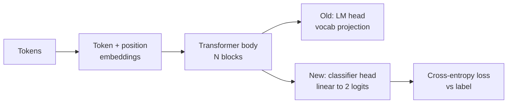
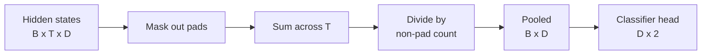
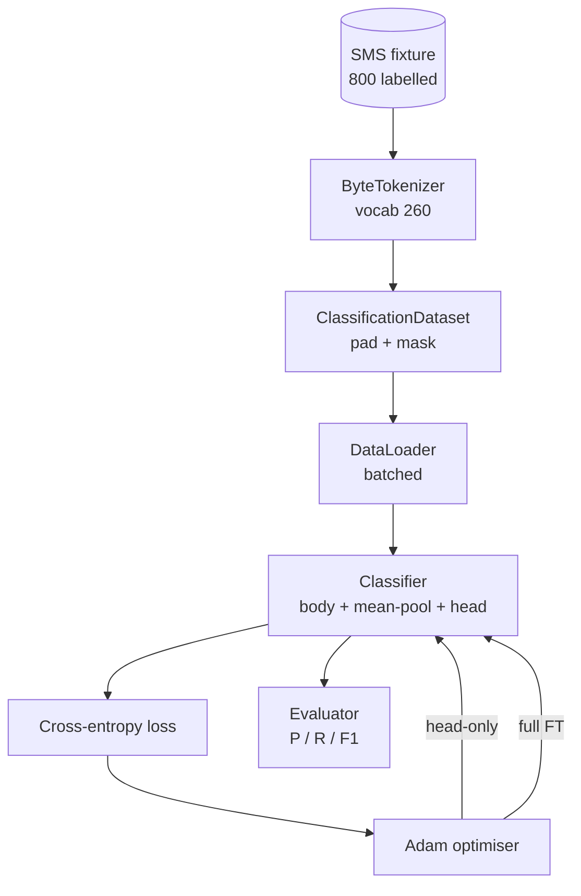

# Capstone Lesson 38: 헤드 교체(Head Swap)에 의한 분류기 파인튜닝

> Track B의 첫 캡스톤(capstone). 사전 학습된(pretrained) 언어 모델(language model)은 토큰 예측 헤드(head)로 끝나는 셀프 어텐션(self-attention) 블록(block)의 스택(stack)이다. 스팸 대 햄을 원할 때, 헤드는 틀렸지만 몸통(body)은 대부분 맞다. 이 레슨은 헤드를 떼어내고, 풀링된(pooled) 표현(representation)에 2-클래스 선형(linear) 층을 붙이고, 분류기(classifier)를 두 가지 방식으로 학습시킨다: 최종 층만, 그리고 전체 파인튜닝(full fine-tuning). 평가는 따로 떼어 둔(held-out) 분할(split)에서의 정밀도(precision), 재현율(recall), F1이다. 각 전략이 무엇을 사 주고 무엇을 비용으로 치르는지 배운다.

**Type:** Build
**Languages:** Python (torch, numpy)
**Prerequisites:** Phase 19 lessons 30-37 (NLP LLM track: tokenizer, embedding table, attention block, transformer body, pre-training loop, checkpointing, generation, perplexity)
**Time:** ~90분

## 학습 목표 (Learning Objectives)

- 몸통을 다시 초기화하지 않고 언어 모델 헤드를 분류 헤드로 교체한다.
- 두 가지 학습 체제를 구현한다: 동결된(frozen) 몸통(헤드만)과 전체 파인튜닝. 하나의 학습 루프(loop)를 공유한다.
- 패딩(pad)하고, 패딩을 마스킹하고, 어텐션 출력을 풀링하는 토크나이저(tokeniser) 인지(aware) 데이터 파이프라인(pipeline)을 만든다.
- 원시 로짓(logit)으로부터 정밀도, 재현율, F1, 혼동 행렬(confusion matrix)을 계산한다.
- 파라미터(parameter) 수, 학습 시간, 여유(head-room) 사이의 트레이드오프(trade-off)를 추론한다.

## 문제 (The Problem)

작은 트랜스포머(transformer)를 일반적인 말뭉치(corpus)에서 사전 학습했다고 하자. 출력 헤드는 마지막 은닉 상태(hidden state)를 1000-토큰 어휘(vocabulary)로 투영(project)한다. 이제 스팸 또는 햄으로 레이블링된 SMS 메시지 800개가 있고 이진(binary) 분류기가 필요하다. 선택지는 세 가지다.

잘못된 선택지는 800개 예제에서 밑바닥부터 새 분류기를 학습시키는 것이다. 사전 학습된 모델의 몸통은 이미 유용한 구조를 인코딩한다. 단어 정체성, 위치, 단순 동시 출현(co-occurrence)이 그것이다. 이를 버리면 이를 만들어 낸 연산이 낭비된다.

두 가지 올바른 선택지는 몸통을 동결한 헤드 교체와 몸통을 학습 가능하게 한 헤드 교체다. 헤드만 학습은 빠르고, 메모리에서 거의 공짜이며, 이렇게 적은 데이터로는 좀처럼 과적합(overfit)하지 않는다. 전체 파인튜닝은 더 느리고, 작은 데이터에서 과적합할 수 있지만, 하위(downstream) 도메인이 사전 학습 말뭉치에서 표류(drift)할 때 더 높은 정확도(accuracy)에 도달한다.

이 레슨은 둘 다 만들어 같은 픽스처(fixture)에서 비교할 수 있게 한다.

## 개념 (The Concept)

모델은 함수 `f_theta(tokens) -> hidden_states`다. 헤드는 함수 `g_phi(hidden) -> logits`다. 헤드를 교체한다는 것은 `theta`를 유지하고 `g_phi`를 교체하는 것이다. 몸통의 파라미터가 비싼 부분이다. 헤드는 단일 선형 층이다.

두 개의 학습 가능한 파라미터 집합이 중요하다.

- `theta`(몸통): 어텐션 블록당 수만 개의 가중치(weight).
- `phi`(헤드): `hidden_dim * num_classes` 가중치 더하기 편향(bias).

헤드만 학습에서는 `phi`에 대한 그래디언트(gradient)를 계산하고 `theta`에 대해서는 0으로 만든다. PyTorch는 몸통 파라미터에 `requires_grad=False`를 설정하여 이를 할 수 있게 한다. 그러면 옵티마이저(optimiser)는 헤드만 보고 몸통은 동결된 채 남는다.

전체 파인튜닝에서는 그래디언트가 전체 스택을 통해 거꾸로 흐르게 둔다. 몸통의 가중치가 분류 목적(objective)에 맞게 표류한다. 위험은 작은 데이터에서의 파국적 망각(catastrophic forgetting)이다. 몸통의 사전 학습이 과적합 잡음(noise)에 씻겨 나간다.

## 풀링 문제 (The Pooling Question)

분류기는 토큰당 벡터(vector)가 아니라 시퀀스(sequence)당 벡터 하나가 필요하다. 흔한 세 가지 선택:

- **평균 풀(Mean pool)**: 어텐션 마스크(mask)로 가중하여, 시퀀스에 걸쳐 은닉 상태를 평균한다.
- **CLS 풀(CLS pool)**: 특수 토큰을 앞에 붙이고 그 출력만 사용한다. BERT가 하는 것이다.
- **마지막 토큰 풀(Last-token pool)**: 마지막 비패딩(non-padding) 토큰을 사용한다. GPT 계열 분류기가 하는 것이다.

이 레슨은 명시적 어텐션 마스크 가중을 갖는 평균 풀링을 사용한다. 가장 단순하고, 시퀀스 길이에 걸쳐 안정적인 신호를 주며, CLS 토큰을 사전 학습할 필요가 없다.

## 데이터 (The Data)

400개 스팸과 400개 햄으로 균형 잡힌 SMS 메시지 800개가 `code/main.py`에서 결정론적(deterministically)으로 생성된다. 생성기는 고정된 시드(seed)를 쓰고, 템플릿(template)을 골라 슬롯 필러(slot filler)를 치환하며, 5에서 25 토큰 길이의 메시지를 방출한다. 실제 데이터셋에는 이 픽스처에는 없는 잡음이 있다. 픽스처의 요점은 재현성(reproducibility)이다.

데이터는 80/20으로 분할된다. 학습 640개, 테스트 160개. 분할은 계층화(stratified)되어 테스트 세트가 50/50 균형을 유지한다. 알려진 균형을 갖는 따로 떼어 둔 세트는 정밀도와 재현율을 정직한 수치로 읽을 수 있게 한다.

## 지표 (The Metrics)

클래스 1을 양성 클래스(positive class, 스팸)로 하는 이진 분류. 횟수(count)는 이렇다.

- `TP`: 스팸으로 예측, 스팸이었다.
- `FP`: 스팸으로 예측, 햄이었다.
- `FN`: 햄으로 예측, 스팸이었다.
- `TN`: 햄으로 예측, 햄이었다.

세 가지 대표 지표:

- `precision = TP / (TP + FP)`. 스팸으로 표시된 메시지 중 실제로 그런 것의 비율은?
- `recall = TP / (TP + FN)`. 실제 스팸 중 모델이 표시한 비율은?
- `F1 = 2 * P * R / (P + R)`. 둘의 조화 평균(harmonic mean).

혼동 행렬은 네 횟수를 2x2 격자로 출력한다. 데모는 두 학습 체제 모두에 대해 이것을 stdout에 기록한다.

## 아키텍처 (Architecture)

몸통은 의도적으로 작은 트랜스포머다. 어휘 260, 은닉 64, 4 헤드, 2 블록, 최대 시퀀스 32. CPU에서 90초 안에 두 체제를 모두 수렴(convergence)까지 학습시킬 만큼 작다. 레슨에서 사전 학습되지는 않는다. 대신, `pretrain_quick` 도우미(helper)가 같은 픽스처의 텍스트에서 LM 학습을 다섯 에폭(epoch) 수행하여 몸통에 비자명한(non-trivial) 출발점을 준다. 덕분에 레슨이 독립적(self-contained)으로 유지된다.

## 무엇을 만들 것인가 (What you will build)

구현은 하나의 `main.py`와 하나의 테스트 모듈(`code/tests/test_main.py`)이다.

1. `ByteTokenizer`: 바이트를 id로 매핑하고 패드 id를 예약한다.
2. `Block`: 멀티헤드 어텐션과 피드포워드(feed-forward) 층을 갖는 트랜스포머 블록. Pre-norm.
3. `LMBody`: 토큰 + 위치 임베딩(embedding) 더하기 블록 스택. 은닉 상태를 반환한다.
4. `MeanPool`: 시퀀스 축에 걸친 마스크 가중 평균.
5. `Classifier`: 몸통, 풀, 선형 헤드. 몸통은 체제 전반에 걸쳐 같은 인스턴스다.
6. `freeze_body`와 `unfreeze_body`: 몸통 파라미터의 `requires_grad`를 토글(toggle)한다.
7. `train_classifier`: 하나의 공유 루프. 어느 파라미터 그룹이 학습 가능하든 그에 맞게 구성된 모델과 옵티마이저를 받는다.
8. `evaluate`: 테스트 세트를 실행하고 `Metrics(precision, recall, f1, confusion)`를 반환한다.
9. `run_demo`: 몸통을 간략히 사전 학습한 뒤, 헤드만 학습하고 평가하고, 그다음 전체를 학습하고, 두 보고서를 모두 출력하고, 0으로 종료한다.

## 비교가 중요한 이유 (Why the comparison matters)

헤드만 체제는 보통 더 빠르게 학습하고 더 우아하게 과소적합(underfit)한다. 이 픽스처에서는 헤드만 학습 20 에폭 후 보통 정밀도 0.9 근처, 재현율 0.85 근처를 본다. 전체 파인튜닝은 약 세 배 더 오래 걸리고, 무작위 시드에 따라 어느 쪽이든 몇 포인트 안에 안착한다.

레슨은 승자를 고르지 않는다. 수치와 비용을 읽도록 가르친다. 800개 예제와 작은 몸통에서는 헤드만이 올바른 선택이다. 80,000개 예제와 더 큰 몸통에서는 전체 파인튜닝이 보답하기 시작한다. 이 레슨에서 가져갈 계약은 API다. 같은 `train_classifier` 함수가 둘 다 처리하고, 토글은 한 번의 호출이다.

## 스트레치 목표 (Stretch goals)

- 마지막 블록만 동결 해제하는 세 번째 체제를 추가하라. 이것은 때로 부분 파인튜닝(partial fine-tuning)이라 불린다. 전체 FT보다 비용이 적고 헤드만보다 더 많이 학습한다.
- 학습률 스케줄러(learning-rate scheduler)를 추가하라. 헤드에 코사인(cosine) 스케줄 더하기 몸통에 더 작은 상수율(constant rate)은 흔한 프로덕션(production) 설정이다.
- 평균 풀링을 학습형 어텐션 풀(learned attention pool)로 교체하라. 학습형 쿼리(query) 하나를 갖는 작은 어텐션 층. 이것은 더 긴 시퀀스에서 평균 풀을 자주 이긴다.

구현은 훅(hook)을 제공한다. 테스트는 계약을 고정(pin)한다. 수치를 끌어올리는 것은 각자의 몫이다.
