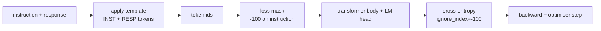
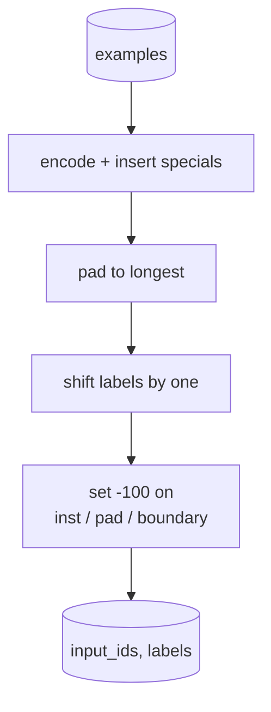
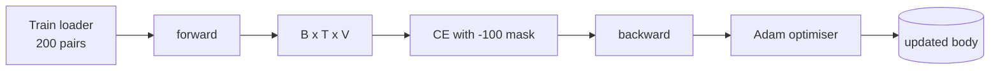

# Capstone Lesson 39: 지도 파인튜닝(Supervised Fine-Tuning)에 의한 인스트럭션 튜닝

> 사전 학습된(pretrained) 베이스 모델(base model)은 시퀀스(sequence)를 확장할 수 있지만 인스트럭션(instruction)을 따를 수는 없다. 지도 파인튜닝(supervised fine-tuning)은 이것을 고치는 가장 작은 변화다. 인스트럭션과 원하는 응답(response)의 짝지어진 예제를 모델에 공급하고, 몸통(body)이 응답 토큰을 예측하도록 학습시킨다. 요령은 손실(loss)이 인스트럭션이 아니라 응답만 세기를 원한다는 것이다. 이 레슨은 인스트럭션 토큰을 `ignore_index=-100`으로 마스킹(masking)하는 커스텀 콜레이트(collate) 함수를 갖춘 Alpaca 스타일 SFT 루프(loop)를 만들고, 200개의 인스트럭션-응답 쌍에서 학습시키며, 정확 일치(exact-match)를 사용해 따로 떼어 둔(held-out) 분할(split)에서 평가한다.

**Type:** Build
**Languages:** Python (torch, numpy)
**Prerequisites:** Phase 19 lessons 30-37 (NLP LLM track: tokenizer, embedding table, attention block, transformer body, pre-training loop, checkpointing, generation, perplexity)
**Time:** ~90분

## 학습 목표 (Learning Objectives)

- 짝지어진 인스트럭션-응답 데이터를 명시적 경계 토큰(boundary token)을 갖는 단일 인과(causal) 시퀀스로 형식화한다.
- 교차 엔트로피(cross-entropy)가 응답 토큰만 세도록 인스트럭션 토큰을 마스킹하는 콜레이트 함수를 만든다.
- SFT 목적(objective) 아래에서 작은 트랜스포머(transformer) 몸통을 학습시키고 평가 지표(metric)가 움직이는 것을 지켜본다.
- 응답 시작 경계를 존중하는 그리디(greedy) 및 온도 샘플링(temperature-sampled) 생성을 구현한다.
- 생성된 완성물(completion)에 대해 따로 떼어 둔 정확 일치를 계산한다.

## 문제 (The Problem)

다음 토큰 예측으로 학습된 베이스 모델은 인스트럭션이 무엇인지 전혀 모른다. 그것에 문자열 `"What is the capital of France?"`를 보여 주면 질문을 이어 가거나 새 문장을 지어낼 것이다. 모델은 언어는 가졌지만 형식 계약(format contract)은 갖지 못했다.

SFT 계약은 문자열 템플릿(template)이다. 모든 학습 예제는 세 영역(region)을 갖는 단일 시퀀스가 된다.

```text
<INST> What is the capital of France? <RESP> The capital of France is Paris.
```

경계 토큰은 학습 시점에 예약된 특수 토큰(special token)이다. 모델은 `<RESP>` 뒤의 모든 것이 응답이며 응답이 채점되는 것임을 학습한다. 베이스 모델의 다음 토큰 목적은 여전히 적용된다. 단지 모든 예제가 이 형태를 갖는 말뭉치(corpus)에서 학습될 뿐이다.

하지만 함정이 있다. 전체 시퀀스를 평범한 교차 엔트로피 손실에 공급하면, 모델이 인스트럭션 토큰도 예측하도록 학습시키는 것이다. 인스트럭션은 주어진 것이다. 그 위치들에는 그래디언트(gradient) 0을 원한다. 해법은 마스크(mask)다.

## 개념 (The Concept)



`ignore_index`는 `torch.nn.functional.cross_entropy`의 기능이다. `ignore_index`와 같은 어떤 타깃(target) 위치든 손실 0과 그래디언트 0을 기여한다. PyTorch의 관습(convention)은 `-100`이다. 콜레이트 함수는 예제당 두 개의 텐서(tensor)를 만든다. `input_ids`(전체 시퀀스)와 `labels`(인스트럭션 위치가 `-100`으로 덮어쓰인 `input_ids`의 복사본).

모델은 순방향 패스(forward pass) 동안 전체 시퀀스를 본다. 어텐션(attention)은 인스트럭션에 어텐드(attend)할 수 있다. 손실은 응답 토큰만 센다. 이것이 정확히 원하는 것이다. 인스트럭션에 조건을 걸고, 응답을 예측한다.

## 데이터 (The Data)

200개의 인스트럭션-응답 쌍이 `main.py`에서 결정론적(deterministically)으로 생성된다. 여섯 가지 작업 유형을 포괄한다.

- 사실 단답(factual single-shot)(X의 수도)
- 산술
- 리스트 추출
- 한 문장 요약
- 코드(print, sort)
- 정의

각 작업에는 템플릿화된 인스트럭션과 결정론적 응답이 있다. 이것은 의도적으로 단순하다. 정확 일치는 취약하며, 레슨은 올바른 답이 하나의 특정 문자열인 픽스처(fixture)를 사용한다. 실제 SFT 데이터셋(dataset)은 퍼지(fuzzy) 지표가 필요하다. 원리는 동일하다.

분할은 학습 160개, 테스트 40개다. 테스트 세트는 여섯 작업 유형을 모두 포괄하여 범주별 정확 일치를 보고할 수 있다.

## 토큰화와 패딩 (Tokenisation and Padding)

토크나이저(tokeniser)는 바이트 수준이며 세 개의 예약된 특수 토큰을 갖는다.

- `INST_ID = 256`: 인스트럭션 영역의 시작을 표시한다.
- `RESP_ID = 257`: 인스트럭션과 응답 사이의 경계를 표시한다.
- `PAD_ID = 258`: 가변 길이 배치(batch)를 위한 패딩.

시퀀스는 `[INST] inst_bytes [RESP] resp_bytes [PAD]*`다. 콜레이트 함수는 다음을 한다.

1. 각 예제를 토큰화한다.
2. 배치의 모든 예제를 배치에서 가장 긴 시퀀스로 패딩한다.
3. `labels` = 하나 옮긴(shifted by one) `input_ids`(인과 LM 타깃)를 만들되, 다음과 같이:
   - 인스트럭션 영역을 `-100`으로 대체.
   - 패딩 영역을 `-100`으로 대체.
   - `RESP_ID` 경계 위치 자체를 `-100`으로 대체(모델이 경계 토큰을 예측하도록 학습시키지 않는다. 그것은 뒤따르는 것을 예측한다).



옮기기(shift)는 표준 인과 요령이다. `input_ids`의 위치 `i`가 위치 `i+1`을 예측하므로, `labels[i] = input_ids[i+1]`(마지막 위치는 입력에서, 첫 위치는 타깃에서 떨어뜨린다). 마스크는 올바른 위치에 안착하도록 옮긴 뒤에 적용된다.

## 학습 (Training)



루프는 표준 PyTorch SFT 루프다. Adam, 학습률(learning rate) 약 3e-4에서 1e-3, 이 픽스처에서 10에서 20 에폭(epoch), 스케줄러(scheduler) 없음. 모델은 (은닉 96, 2 블록, 최대 길이 64로) CPU에서 2분 안에 수렴(convergence)까지 학습시킬 만큼 작다.

다섯 에폭마다 루프는 따로 떼어 둔 세트에서 작은 평가 패스를 실행하고 정확 일치를 출력한다. 정확 일치가 에폭 1의 0.0에서 에폭 15의 0.85 같은 값으로 가는 것을 지켜보는 것이 레슨의 결실이다. 모델이 형식과 답을 동시에 학습하는 것을 볼 수 있다.

## 생성 (Generation)

평가 시점에 모델은 인스트럭션 접두사(prefix) `[INST] inst_bytes [RESP]`를 받고 다음 중 하나가 될 때까지 토큰을 생성한다.

- 시퀀스가 `max_len`에 도달하거나,
- 모델이 특수 정지 휴리스틱(stop heuristic)을 방출한다: 두 개의 연속한 문장 종결 바이트(`.`, `!`, `?`).

레슨은 그리디 디코딩(greedy decoding) 더하기 선택적 온도 샘플러(temperature sampler)를 출시한다. 정확 일치는 그리디를 사용하는데, 온도가 지표를 확률적(stochastic)으로 만들 것이기 때문이다. 실제 시스템은 흔히 샘플링한 뒤 퍼지하게 판정한다. 그 파이프라인(pipeline)은 레슨 41이다.

## 정확 일치 평가 (Exact-Match Evaluation)

정확 일치는 가장 엄격한 텍스트 지표다. 예측된 응답 문자열이 정규화(normalise)되고(소문자화, 공백 제거, 이중 공백 축소) 같은 방식으로 정규화된 참조 응답과 비교된다. 지표는 예제당 1 또는 0이다. 집계는 평균이다.

실제 SFT 파이프라인은 정확 일치를 토큰 수준 F1(레슨 41)과 판정자 모델(judge model)로 보완한다. 정확 일치는 모호하지 않기 때문에 여전히 유용하다. 0.7이라고 말하면, 정확히 70퍼센트의 테스트 인스트럭션이 골드(gold) 응답을 문자 하나하나까지 생성한 것이다.

## 무엇을 만들 것인가 (What you will build)

구현은 하나의 `main.py`와 테스트다.

1. `InstructionTokenizer`: 예약된 특수 토큰을 갖는 바이트 수준 인코더(encoder). 인스트럭션 접두사 또는 전체 쌍을 인코딩한다.
2. `make_dataset`: 고정된 시드(seed)로 여섯 작업 유형에 걸쳐 200개 쌍을 생성한다.
3. `SFTDataset`: 예제당 이미 마스크가 준비된 `(input_ids, labels)`를 반환한다.
4. `sft_collate`: 동적 패딩, 배치 텐서 구성, 인스트럭션 및 패드 위치에 `-100` 설정.
5. `TinyGPT`: 묶이거나(tied) 묶이지 않은 LM 헤드(head)를 더한 트랜스포머 몸통.
6. `train_sft`: 에폭별 평가 훅(hook)을 갖는 SFT 루프.
7. `generate`: 접두사로부터의 인과 디코딩, 그리디 또는 샘플링, 정지 휴리스틱과 함께.
8. `exact_match`: 정규화된 문자열 비교, `[0, 1]`의 float를 반환한다.
9. `run_demo`: 데이터를 만들고, 20 에폭 동안 학습시키고, 평가하고, 범주별 분해를 출력하고, 성공 시 0으로 종료한다.

## 마스크가 중요한 이유 (Why the mask matters)

마스크가 없으면, 손실은 인스트럭션 토큰을 타깃으로 취급한다. 모델은 인스트럭션을 예측하도록 학습한다. 이것은 다른 목적이며 두 가지 방식으로 더 나쁜 모델을 만든다. 첫째, 사용자가 항상 제공하는 입력을 재구성하느라 모델 용량(capacity)이 낭비된다. 둘째, 대부분의 배치에서 인스트럭션 토큰이 응답 토큰보다 수가 많기 때문에 그래디언트 합에서 응답 손실이 더 작다. 당신이 신경 쓰는 부분에 대한 옵티마이저(optimiser)의 유효 학습률이 의도한 것보다 낮다. 마스크는 마무리(polish)가 아니다. 그것이 목적이다.

## 스트레치 목표 (Stretch goals)

- 학습률 워밍업(warmup)에 이어 코사인 감쇠(cosine decay)를 추가하라. SFT는 사전 학습보다 LR에 더 민감하다.
- 토큰별 손실 로깅을 추가하고 학습에 걸친 손실 곡선(loss curve)을 플롯(plot)하라. 초기 에폭은 템플릿 토큰(`<RESP>`, 흔한 접두사)이 지배하고 후기 에폭은 실제 답 토큰이 지배함을 알아채라.
- 평가를 BLEU-1이나 chrF로 확장하라. 정확 일치는 같은 답을 갖는 패러프레이즈(paraphrase)를 만드는 모델을 과소평가한다.
- 멀티턴(multi-turn) 형식의 채팅 템플릿을 추가하고 후속 질문을 포함한 픽스처에서 학습시켜라.

구현은 당신에게 형식 계약, 마스크, 루프를 준다. 베이스 모델에서 인스트럭션 추종자(instruction follower)로의 목적 변화는 하나의 콜레이트 함수다.
