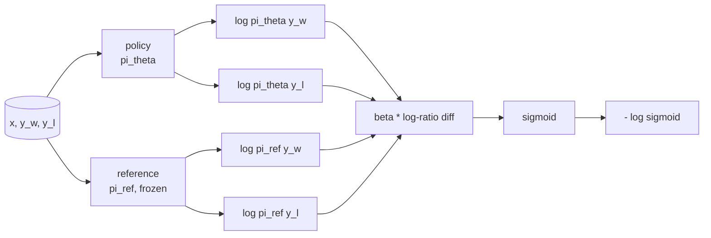
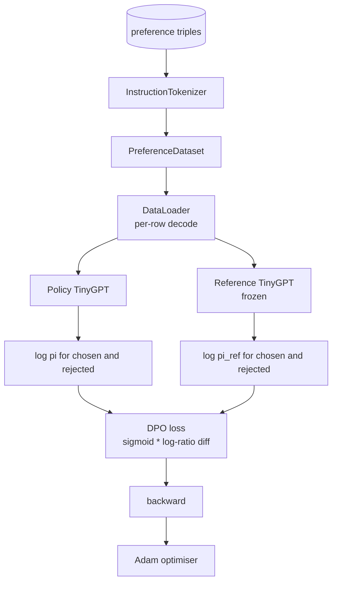

# Capstone Lesson 40: 밑바닥부터 만드는 직접 선호 최적화(Direct Preference Optimization)

> 보상 모델(reward model)과 PPO는 고전적인 RLHF 스택(stack)이다. DPO는 그 스택을, 선호 쌍(preference pair)에 대해 정책(policy)을 직접 맞추는 단일 지도(supervised) 손실(loss)로 압축한다. 이 레슨은 보상-차이 항등식(reward-difference identity)에서 DPO 손실을 유도하고, 동작하는 참조 모델(reference model)과 정책 모델을 출시하며, 토큰별 로그 확률(log-probability)을 계산하고, 선택된(chosen)과 거부된(rejected) 완성물(completion)의 선호 픽스처(fixture)에서 작은 트랜스포머(transformer)를 학습시킨다. 테스트는 손실 수학과 그래디언트(gradient) 방향을 고정(pin)하여 구현이 논문과 일치함을 알려 준다.

**Type:** Build
**Languages:** Python (torch, numpy)
**Prerequisites:** Phase 19 lessons 30-37 (NLP LLM track: tokenizer, embedding table, attention block, transformer body, pre-training loop, checkpointing, generation, perplexity)
**Time:** ~90분

## 학습 목표 (Learning Objectives)

- DPO 손실을 스케일된 로그 비율 차이(log-ratio difference)에 대한 시그모이드(sigmoid)로 유도하고 그것을 암묵적 보상(implicit reward)에 연결한다.
- 동결된(frozen) 참조와 학습 가능한 정책으로 이루어진 참조 모델 + 정책 모델 쌍을 만든다.
- 프롬프트(prompt) 토큰을 마스킹하면서 두 모델 아래에서 시퀀스 수준(sequence-level) 로그 확률을 계산한다.
- `(prompt, chosen, rejected)` 트리플(triple)에서 정책을 학습시키고 선택된 로그 확률이 거부된 것에 비해 오르는 것을 지켜본다.
- 손실 수학, 그래디언트 부호(sign), 참조 불변성(reference invariance)에 대한 테스트로 동작을 고정한다.

## 문제 (The Problem)

SFT 모델이 하나 있다고 하자. 이 모델은 인스트럭션(instruction)을 따르지만 출력이 들쭉날쭉하다. 어떤 완성물은 명료하고, 어떤 것은 장황하거나 틀렸다. 그리고 선호 쌍으로 이루어진 작은 데이터셋(dataset)도 있다. 같은 프롬프트에 대해 사람이 하나의 완성물은 선택됨으로, 다른 하나는 거부됨으로 표시했다.

고전적인 RLHF 답은 2단계 파이프라인(pipeline)이다. 선호에서 보상 모델을 학습시키고, PPO로 보상에 맞춰 정책을 최적화한다. 동작하기는 하지만 비싸다. PPO를 돌리는 동안 메모리에 두 모델을 올려야 하고, 정책을 참조 가까이 붙들어 두는 KL 제어가 필요하며, 보상 모델이 취약하면 보상 해킹(reward hacking)이 일어난다.

DPO는 두 단계를 단일 지도 손실로 교체한다. 보상 모델은 명시적으로 결코 존재하지 않는다. 정책은 SFT 참조를 향한 명시적 KL 페널티(penalty)와 함께, 선호 쌍에서 직접 학습된다. Bradley-Terry 선호 모델 아래에서 같은 최적해(optimal solution), 훨씬 적은 코드.

## 개념 (The Concept)

Bradley-Terry 모델에서 출발한다. 프롬프트 `x`와 두 완성물 `y_w`(선택됨)와 `y_l`(거부됨)이 주어지면, 사람이 `y_w`를 선호할 확률은 다음과 같다.

```text
P(y_w > y_l | x) = sigmoid( r(x, y_w) - r(x, y_l) )
```

여기서 `r`은 어떤 잠재(latent) 보상 함수다. RLHF는 먼저 선호에서 `r`을 맞춘 뒤, KL 앵커(anchor)와 함께 `r`을 최대화하도록 정책 `pi`를 학습시킨다.

```text
max_pi   E_{x, y~pi} [ r(x, y) ] - beta * KL(pi || pi_ref)
```

DPO 유도의 출발점은 이 목적 아래의 최적 정책 `pi*`가 `r`의 항으로 닫힌 형태(closed form)를 가진다는 사실이다.

```text
pi*(y | x) = (1/Z(x)) * pi_ref(y | x) * exp( r(x, y) / beta )
```

`r`에 대해 재배열한다.

```text
r(x, y) = beta * ( log pi*(y | x) - log pi_ref(y | x) ) + beta * log Z(x)
```

`log Z(x)` 항은 `y_w`와 `y_l` 둘 다에 대해 같으므로(`y`가 아니라 `x`에 의존한다), 선호 차이를 계산할 때 상쇄된다.

```text
r(x, y_w) - r(x, y_l) = beta * ( log pi_theta(y_w|x) - log pi_ref(y_w|x)
                                - log pi_theta(y_l|x) + log pi_ref(y_l|x) )
```

Bradley-Terry 시그모이드에 대입하고 선호 쌍에 대한 음의 로그 가능도(negative log likelihood)를 취한다.

```text
L_DPO(theta) = - E_{(x, y_w, y_l)} [
  log sigmoid( beta * ( log pi_theta(y_w|x) - log pi_ref(y_w|x)
                       - log pi_theta(y_l|x) + log pi_ref(y_l|x) ) )
]
```

이것이 손실이다. 예제당 단일 스칼라(scalar)에 대한 시그모이드이며, 네 개의 로그 확률에서 계산된다. 별개의 보상 모델도 없고, PPO도 없고, 손실에 KL 항도 없다. KL 제약은 닫힌 형태 유도 속에 이미 녹아 있다.



## 그래디언트의 부호 (The Sign of the Gradient)

어떤 학습 실행 전에든 유용한 정상성 점검(sanity check). `log pi_theta(y_w | x)`에 대한 그래디언트를 취한다.

```text
d L_DPO / d log pi_theta(y_w | x) = - beta * (1 - sigmoid(z))
```

여기서 `z`는 시그모이드의 인자다. 이 값은 모든 `z`에 대해 음수이며, 곧 선택된 완성물에 대한 정책의 로그 확률을 높이면 손실이 줄어든다는 뜻이다. 대칭적으로 `log pi_theta(y_l | x)`에 대한 그래디언트는 양수다. 거부된 로그 확률을 높이면 손실이 커진다. 학습은 선택된 것을 위로, 거부된 것을 아래로 민다. 참조는 동결되어 있어 움직이지 않는다.

## 데이터 (The Data)

열두 개의 선호 트리플이 레슨과 함께 출시된다. 각각은 `(prompt, chosen, rejected)`다. 선택된 완성물은 짧고 정확하다. 거부된 것은 장황하거나, 주제를 벗어났거나, 틀렸다. 쌍들은 레슨 39와 같은 작업 계열(수도, 산술, 리스트)을 포괄하여, SFT 베이스에서 출발한 정책이 합리적인 출발점을 갖게 한다.

픽스처는 일부러 작게 잡았다. 실제 프로덕션(production)에서 DPO는 수만 개 쌍을 다룬다. 여기서의 요점은 손실 수학과 루프(loop)가 작은 데이터셋에서 종단 간(end-to-end)으로 돌아가고, 선택된 쪽과 거부된 쪽의 로그 확률 간격이 눈에 띄게 벌어지는 것이다.

## 참조 불변성 (Reference Invariance)

DPO 구현은 참조 모델을 신중하게 다뤄야 한다. 참조는 그 자리에 동결된 SFT 모델이다. 다음 세 가지 속성이 유지되어야 한다.

- 참조 파라미터(parameter)는 결코 그래디언트를 받지 않는다.
- 참조 로그 확률은 에폭(epoch) 사이에 결코 변하지 않는다.
- 정책은 참조와 같은 가중치(weight)에서 출발한다. (최적 `theta`는 참조 더하기 학습된 갱신이다. 정책을 참조의 복사본으로 초기화하는 것이 잘 정의된 출발이다.)

구현은 다음으로 이것들을 강제한다.

- 순방향 패스(forward pass) 동안 참조를 `torch.no_grad()`로 감싼다.
- 모든 참조 파라미터에 `requires_grad=False`를 설정한다.
- 참조가 만들어진 뒤 `policy.load_state_dict(reference.state_dict())`로 정책을 구성한다.

## 아키텍처 (Architecture)



모델은 레슨 39에서 쓴 것과 같은 TinyGPT(디코더 전용(decoder-only), 인과(causal), 바이트 토크나이저(byte tokeniser))다. 참조와 정책은 아키텍처를 공유한다. 정책의 가중치는 학습이 진행되면서 참조로부터 표류(drift)하지만 참조는 고정된 채 머문다.

## 무엇을 만들 것인가 (What you will build)

구현은 하나의 `main.py`와 테스트다.

1. `InstructionTokenizer`: `INST`와 `RESP` 특수 토큰을 갖는 바이트 토크나이저. 레슨 39와 같은 형태.
2. `TinyGPT`: 디코더 전용 트랜스포머. 레슨 39와 같은 형태여서 39를 건너뛰었어도 레슨이 독립적(self-contained)이다.
3. `make_preferences`: 열두 개의 `(prompt, chosen, rejected)` 트리플을 반환한다.
4. `sequence_log_prob`: 모델, 프롬프트 접두사(prefix), 완성물이 주어지면, 완성물에 걸친 다음 토큰 로그 확률의 합을 반환한다(프롬프트 위치 기여 없음).
5. `dpo_loss`: 네 개의 로그 확률과 `beta`를 받아, 예제별 손실 텐서와 로깅을 위한 암묵적 보상 델타(delta)를 반환한다.
6. `train_dpo`: 정책과 참조 아래에서 선택된 및 거부된 로그 확률을 계산하고, 손실을 적용하고, Adam을 스텝하는 에폭별 루프.
7. `evaluate_margins`: 임의 시점에서 정책 아래의 평균 선택된-거부된 로그 확률 마진(margin)을 반환한다.
8. `run_demo`: 작은 워밍업(warm-up) 사전 학습에서 참조와 정책을 만들고, 가중치를 복사하고, 30 스텝 동안 학습시키고, 스텝별 손실과 마진을 출력하고, 성공 시 0으로 종료한다.

## DPO가 동작하는 이유 (Why DPO works)

DPO는 보상의 매개변수화(parameterisation)까지, Bradley-Terry 선호 모델 아래에서 RLHF와 수학적으로 동등하다. 암묵적 보상 `r(x, y) = beta * (log pi(y|x) - log pi_ref(y|x))`는 차이에서 상쇄되는 `x`의 함수만큼을 빼면 선호로부터 식별 가능(identifiable)하다. 닫힌 형태 정책 덕분에 명시적 보상 모델을 건너뛸 수 있다. KL 제약은 구조적으로 강제된다. `pi`가 `pi_ref`에서 벗어나면 로그 비율이 커지고, 시그모이드가 포화(saturate)되면서 정책이 너무 멀리 움직일 때 그래디언트를 감쇠시킨다. 참조가 곧 안전망이다.

## 스트레치 목표 (Stretch goals)

- 로그 확률 합에 길이 정규화(length normalisation)를 추가하라. 완성물 길이로 나누면 된다. 길이 편향(length bias)은 모델이 더 짧은 완성물을 편애하는, DPO의 알려진 실패 모드다. 짧은 완성물의 로그 확률이 절댓값에서 더 크기 때문에 생긴다.
- 손실의 IPO 변형을 추가하라: 시그모이드 + log를 `(z - 1)^2`로 교체한다. 픽스처에서 수렴(convergence)을 비교하라.
- 강한(hard) 선택된-거부된 레이블과 균일한 0.5 사이를 보간(interpolate)하는 레이블 스무딩(label-smoothing) 파라미터를 추가하라.
- 참조를 더 작고 저렴한 모델로 교체하라(지식 증류(knowledge distillation) 풍미).

구현은 손실, 참조 불변성, 학습 루프를 제공한다. 수학이 곧 레슨이다. 코드는 그 수학을 구체적으로 보여 준다.
