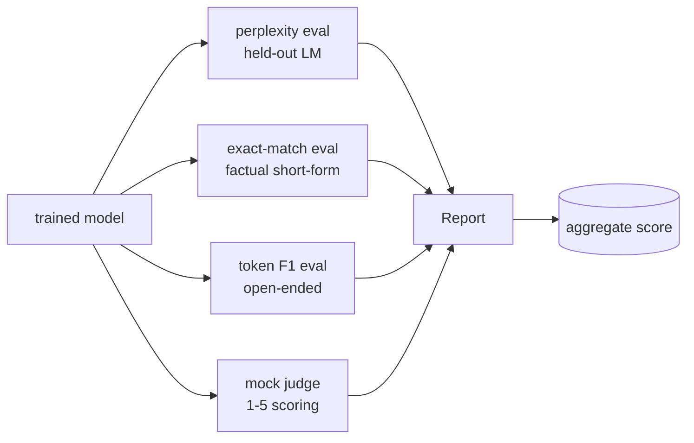
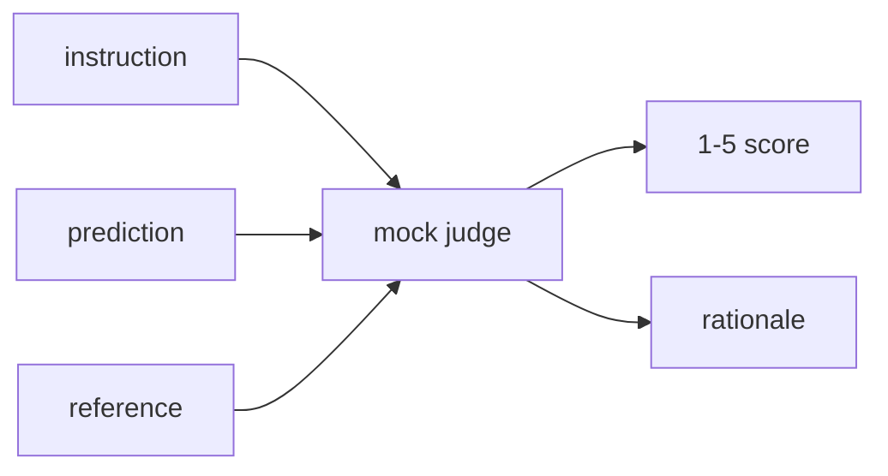
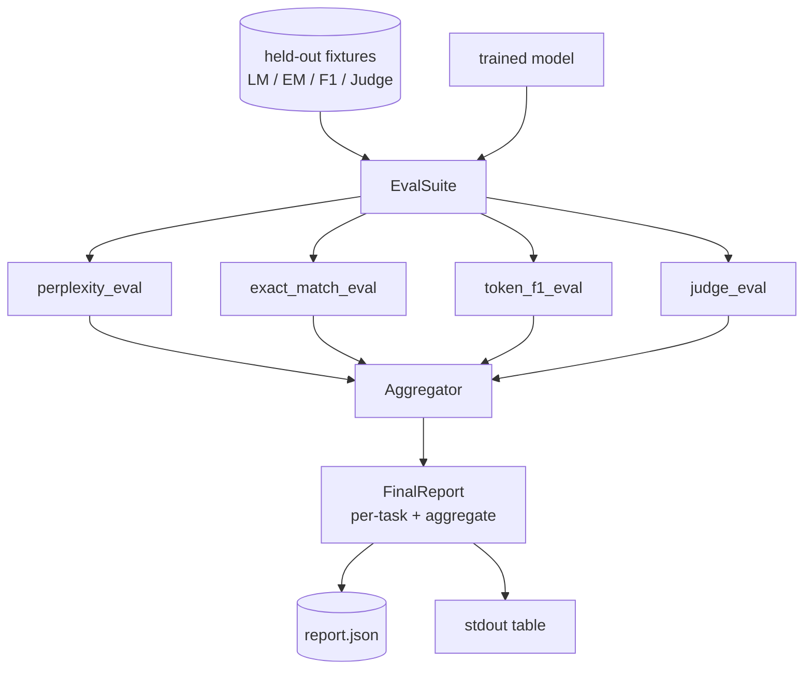

# Capstone Lesson 41: 전체 평가 파이프라인(Full Evaluation Pipeline)

> 학습(training)은 손실 곡선(loss curve)으로 모니터링할 수 있는 부분이다. 평가(evaluation)는 직접 설계해야 하는 부분이다. 이 레슨은 학습된 임의의 언어 모델을 받아 네 가지 이질적인 평가를 수행하고, 그 결과를 태스크별 리포트로 집계하며, 네트워크 없이 루프가 돌아가도록 로컬 모의(mock) LLM-as-judge를 함께 제공하는 통합 평가 파이프라인을 만든다. 네 가지 평가는 출시되는 모든 모델에 필요한 차원을 다룬다. 언어 모델링(perplexity), 단답형 정확성(exact-match), 개방형 유사도(token F1), 정성적 채점(judge)이다.

**Type:** Build
**Languages:** Python (torch, numpy)
**Prerequisites:** Phase 19 lessons 30-37 (NLP LLM track: tokenizer, embedding table, attention block, transformer body, pre-training loop, checkpointing, generation, perplexity)
**Time:** ~90분

## 학습 목표 (Learning Objectives)

- 작은 트랜스포머(transformer)에서 마스킹된 토큰을 고려한 홀드아웃 퍼플렉서티(held-out perplexity)를 계산하기.
- 단답형 사실 프롬프트(prompt)에 대해 정확 일치(exact-match) 평가 수행하기.
- 정규화(normalisation)를 거쳐 예측 문자열과 참조 문자열 사이의 토큰 단위 F1(token-level F1) 계산하기.
- 모델 출력을 1-5점 척도로 채점하는 로컬 모의 LLM-as-judge 만들기.
- 네 가지 평가를 태스크별 분해가 포함된 하나의 가중 리포트로 집계하기.

## 문제 (The Problem)

단일 지표(metric)는 언어 모델을 결코 제대로 설명하지 못한다. 퍼플렉서티는 모델이 언어 분포(language distribution)에 얼마나 잘 들어맞는지를 말해주지만, 질문에 답을 하는지에 대해서는 아무것도 말해주지 않는다. 정확 일치는 모델이 정답 문자열을 생성하는지를 말해주지만 올바른 패러프레이즈(paraphrase)에는 벌점을 준다. 토큰 F1은 패러프레이즈를 용서하지만, 틀린 내용과의 어휘 중복에는 속아 넘어간다. LLM-as-judge는 정성적 차원을 포착하지만 비용이 크고 확률적(stochastic)이다.

실제로 필요한 파이프라인은 이 네 가지를 모두 갖춘다. 각 평가는 다른 평가가 놓치는 차원을 다룬다. 각각은 그 지표에 맞게 구성된 홀드아웃 데이터의 서로 다른 부분집합에서 수행된다. 최종 리포트는 태스크별 수치와 집계값을 나란히 보여주므로, 리뷰어는 모델이 어떤 트레이드오프(trade-off)를 하는지 한눈에 알 수 있다.

이 레슨은 그 파이프라인을 처음부터 끝까지, 하나의 파일로 만든다.

## 개념 (The Concept)

각 평가는 `(model, dataset) -> EvalResult` 형태의 함수다. 결과는 지표 값, 검사용 예제별 세부 정보, 그리고 집계에 쓰일 이름을 담는다. 파이프라인은 어떤 평가를 수행하고 어떻게 가중치를 줄지 지정하는 설정(config)과 함께 이들을 조합한다.

## 제대로 세는 퍼플렉서티 (Perplexity, properly counted)

퍼플렉서티는 `exp(mean negative log-likelihood per token)`이다. 구현에는 두 가지 함정이 있다.

- 평균은 batch * sequence가 아니라 실제 토큰 위치에 대해 계산해야 한다. 패딩(padding) 토큰은 분모에서 제외해야 한다. 그러지 않으면 퍼플렉서티가 실제보다 좋아 보인다.
- 모델은 다음 토큰을 예측하므로, 위치 `i`의 로짓(logits)은 위치 `i+1`의 토큰을 예측한다. 여기서의 off-by-one 실수는 조용하다. 손실은 여전히 학습되지만 지표는 무의미해진다.

평가는 비패딩 위치에 대한 배치별 `-log p(token)` 합과 배치별 토큰 개수를 계산한 뒤, 마지막에 나눈다. 이는 배치별 퍼플렉서티를 평균하는 것(짧은 시퀀스에 과소 가중을 주는 방식)보다 수치적으로 더 안전하며 교과서 정의와도 일치한다.

## 정규화를 거친 정확 일치 (Exact-match, with normalisation)

이 하니스(harness)는 비교 전에 예측과 참조를 모두 정규화한다.

- 소문자화(lowercase).
- 양쪽 공백 제거.
- 내부의 연속 공백을 단일 공백으로 축소.
- 양쪽이 구두점 차이만 있는 경우, 끝의 종결 구두점(`.`, `!`, `?`) 제거.

정규화는 정확 일치를 실전에서 유용하게 만든다. `"Paris"`라고 답하는 모델은 정답이다. `"Paris."`라고 답하는 모델도 정답이고, `"  paris  "`라고 답하는 모델도 정답이다. 그래도 이 지표는 정규화 이후 답이 동일한 문자열일 것을 요구한다.

## 토큰 F1, 올바른 방식 (Token F1, the right way)

토큰 F1은 토큰 봉지(bag-of-tokens)에 대해 계산한 정밀도(precision)와 재현율(recall)의 조화 평균(harmonic mean)이다. 단계는 다음과 같다.

1. 예측과 참조를 정규화한다(정확 일치와 동일한 규칙).
2. 각각을 토큰 리스트로 분할한다(공백 토큰화).
3. 멀티셋 교집합(multiset intersection)을 센다.
4. Precision = `intersection_count / len(pred_tokens)`. Recall = `intersection_count / len(ref_tokens)`. F1 = 조화 평균.

예측과 참조가 둘 다 비어 있으면 F1은 1이다(공허한 일치, vacuous match). 둘 중 하나만 비어 있으면 F1은 0이다. 이 패턴은 SQuAD 평가 레퍼런스와 일치하며 패러프레이즈 전반에 걸쳐 안정적인 수치를 만든다.

## 로컬 모의 LLM-as-Judge (Local Mock LLM-as-Judge)

실제 judge는 API 뒤에 있는 프런티어 모델(frontier model)이다. 이 레슨에서는 judge가 오프라인으로 실행되어야 한다. 모의 judge는 지시문(instruction), 모델의 예측, 참조를 받아 `{1, 2, 3, 4, 5}` 중 하나의 점수와 한 줄짜리 근거(rationale)를 반환하는 결정론적(deterministic) 채점기다. 채점 규칙은 명시적이다.

- 정규화된 예측이 정규화된 참조와 같으면 5.
- 예측과 참조 사이의 토큰 F1이 0.8 이상이면 4.
- 토큰 F1이 `[0.5, 0.8)` 범위면 3.
- 토큰 F1이 `[0.2, 0.5)` 범위면 2.
- 그 외에는 1.

이것은 진짜 judge는 아니지만 올바른 인터페이스를 갖는다. 나중에 함수 하나만 바꿔서 실제 모델로 교체하면 된다. 파이프라인은 신경 쓰지 않는다.

## 집계 (Aggregation)

집계값은 정규화된 평가 점수들의 가중 평균(weighted mean)이다. 각 평가는 자신의 수치를 `[0, 1]` 범위로 보고한다.

- 퍼플렉서티: `1 / (1 + log(perplexity))`로 정규화한다. 퍼플렉서티 1은 1로, 무한대는 0으로 매핑된다.
- 정확 일치: 이미 `[0, 1]` 범위.
- 토큰 F1: 이미 `[0, 1]` 범위.
- Judge: 5로 나눈다.

가중치는 설정 가능하다. 기본 배합은 퍼플렉서티 0.2, 정확 일치 0.3, 토큰 F1 0.3, judge 0.2이다. 가중치 선택은 제품 결정(product decision)이며, 레슨은 실험할 수 있도록 이 손잡이를 노출한다.

## 아키텍처 (Architecture)

`EvalSuite`는 얇은 오케스트레이터(orchestrator)다. 각 개별 평가는 `(model, tokenizer, dataset, config)`를 받아 `EvalResult`를 반환하는 자유 함수(free function)다. `Aggregator`는 결과를 모아 최종 리포트를 만든다. 데모는 테이블을 출력하고, 다운스트림 CI가 받아들일 수 있는 JSON 사본을 작성한다.

## 만들 것 (What you will build)

구현은 하나의 `main.py`와 테스트로 이루어진다.

1. `TinyGPT`: 레슨 38-40에서 사용한 것과 동일한 디코더 전용(decoder-only) 아키텍처로, 레슨이 독립적으로 성립하도록 포함된다.
2. `InstructionTokenizer`: INST / RESP / PAD 특수 토큰을 가진 바이트 토크나이저(byte tokeniser).
3. 네 가지 픽스처(fixture): LM 코퍼스(corpus), EM 셋, F1 셋, judge 셋. 각각 20개 예제이며 결정론적이다.
4. `perplexity_eval`: 퍼플렉서티 값과 토큰별 손실 히스토그램을 담은 `EvalResult`를 반환한다.
5. `exact_match_eval`: 평균 EM과 예제별 레코드를 반환한다.
6. `token_f1_eval`: 평균 토큰 F1과 예제별 레코드를 반환한다.
7. `mock_judge`와 `judge_eval`: 예제별 점수와 근거, 그리고 셋 전체에 대한 평균 점수.
8. `Aggregator.normalise`: 평가별 정규화 규칙.
9. `Aggregator.aggregate`: 가중 평균과 조립된 리포트.
10. `run_demo`: 작은 모델을 잠깐 학습시키고, 네 가지 평가를 모두 수행하고, 리포트 테이블을 출력하며 JSON을 작성하고, 성공 시 0으로 종료한다.

## 리포트 읽기 (Reading the report)

리포트는 세 개의 층(layer)으로 이루어진다. 맨 위는 집계 점수다. 그 아래에는 네 가지 평가별 수치가 있다. 그 아래에는 진단용 예제별 분해가 있다. 실패한 CI 실행은 보통 집계값을 원하지만, 회귀(regression)를 추적하는 리뷰어는 모델이 어떤 입력을 틀렸는지 보기 위해 예제별 분해를 원한다.

JSON 덤프는 안정적인 키를 사용하므로 CI 대시보드가 버전 전반의 추세선을 그릴 수 있다. 예쁘게 출력된 테이블은 학습 실행 후 터미널을 바라보는 사람을 위한 것이다.

## 도전 과제 (Stretch goals)

- 보정(calibration) 평가를 추가하라. 모델의 소프트맥스(softmax) 확률이 정확도와 일치하는가? 예측을 신뢰도(confidence)별로 버킷에 담고, 버킷별 경험적 정확도를 보고하라.
- 견고성(robustness) 평가를 추가하라. 각 예제에 교란(perturbation)을 태깅하고(오타, 패러프레이즈, 방해 요소), 교란별 지표 하락을 보고하라.
- 모의 judge를 HTTP 호출 뒤의 실제 모델로 교체하라. 함수 시그니처는 바뀌지 않는다.
- 태스크별 가중치 학습을 추가하라. 고정 가중치 대신, 모델 전반에 대한 목표 선호 순서에 가중치를 맞춰라.

구현은 네 가지 평가, 집계기, 리포트를 제공한다. 실제 평가 파이프라인은 그 위에 훨씬 더 많은 차원을 쌓지만, 패턴은 동일하다. 평가당 함수 하나, 집계기 하나, 리포트 하나다.
