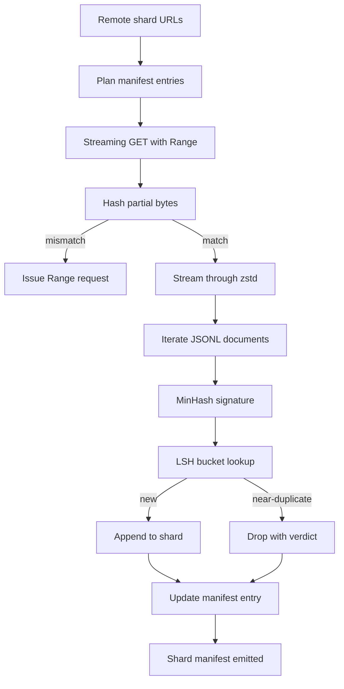

# 대규모 코퍼스 다운로더(Large Corpus Downloader)

> 언어 모델 학습(training)은 첫 순방향 패스(forward pass) 훨씬 전에 시작된다. 코퍼스(corpus)는 디스크에 안착하고, 압축 해제되고, 중복 제거되고, 주소 지정이 가능해야 하며, 네트워크가 4퍼센트 지점에서 끊기기 전에 이어받기(resume) 시나리오가 이미 마련되어 있어야 한다. 이 레슨은 압축된 샤드(shard)를 끌어와 Zstandard로 즉석에서 압축 해제하고, MinHash와 지역 민감 해싱(locality-sensitive hashing)으로 근접 중복(near-duplicate)을 지문화(fingerprint)하며, 파이프라인의 나머지가 신뢰할 수 있는 샤드 매니페스트(manifest)를 작성하는 스트리밍 다운로더를 만든다.

**Type:** Build
**Languages:** Python
**Prerequisites:** Phase 19 lessons 30-37
**Time:** ~90분

## 학습 목표 (Learning Objectives)

- `urllib`로 원격 샤드를 스트리밍하고 `zstandard`로 압축 해제하되, 파일 전체를 메모리에 버퍼링하지 않기.
- 검증된 바이트 오프셋(byte offset)에 대해 HTTP `Range` 요청을 발행하여 부분 다운로드를 이어받기.
- 문서마다 MinHash 시그니처(signature)를 만들고 LSH로 버킷에 담아 근접 중복이 충돌하도록 만들기.
- 콘텐츠 해시(content hash), 바이트 크기, 문서 수, 중복 제거 판정(dedup verdict)을 담은 샤드 매니페스트를 내보내기.

## 문제 (The Problem)

200 GB 코퍼스로 처음 학습할 때, 네트워크는 41퍼센트 지점에서 끊기고 스크립트는 `urllib` 예외와 함께 종료된다. 두 번째에는 78퍼센트에서 끊긴다. 99퍼센트에 이를 때쯤이면 당신은 루프를 세 번 다시 작성했다. 처음 1분부터 설계해야 하는 두 가지 실패는 부분 다운로드 이어받기와 중복 문서 제거다. 둘 다 잘 알려진 해법이 있다. 둘 다 파이프라인이 한 줄짜리 `requests.get` 호출로 시작해 점점 커졌다는 이유로 일상적으로 건너뛰어진다.

이어받기는 HTTP 문제다. 서버는 `Range`를 존중해야 하고, 클라이언트는 디스크에 기록된 값에 대해 검증된 오프셋을 추적해야 하며, 검증된 오프셋은 프로세스 사망을 견뎌야 한다. 오프셋과 파일이 단 1바이트라도 어긋나면 이어받은 다운로드는 쓰레기를 쓰고, 코퍼스는 토큰화(tokenization) 중에야 드러나는 방식으로 손상된다.

중복 제거는 시그니처 문제다. 정확 해시(exact-hash) 중복 제거는 근접 중복을 놓친다. 같은 위키피디아 문서가 세 가지 다른 상용구 푸터(boilerplate footer)와 함께 나타나고, 같은 코드 파일이 다른 라이선스 헤더와 함께 나타나며, 같은 블로그 글이 모든 링크에 추적 파라미터(parameter)가 붙어 나타난다. MinHash와 LSH는 이를 준선형(sub-linear) 비용으로 잡아낸다. 비용은 문서당 시그니처 하나와 시그니처당 버킷 조회 하나다.

## 개념 (The Concept)



### `urllib`로 스트리밍하기

표준 라이브러리의 `urllib.request.urlopen`은 파일류(file-like) 객체를 반환한다. 이를 `zstandard.ZstdDecompressor().stream_reader`로 감싸면, 바이트가 네트워크에서 압축 해제기를 거쳐 문서 반복자(iterator)로 흐르되 압축된 샤드나 압축 해제된 샤드를 메모리에 한 번도 구체화하지 않는다. 유일한 메모리 비용은 라인 버퍼, 현재 문서의 MinHash 시그니처, LSH 인덱스뿐이다.

### `Range`로 이어받기

다운로더는 샤드마다 두 파일을 쓴다. 샤드 자체와 `.partial.json` 체크포인트(checkpoint)다. 체크포인트는 `verified_bytes`, `expected_size`, `sha256_prefix`(처음 `verified_bytes` 바이트에 대해 계산), 그리고 소스 URL을 기록한다. 시작 시 다운로더는 체크포인트를 읽고, 디스크의 바이트에 대해 `sha256_prefix`를 다시 계산하며, 재계산된 해시가 일치할 때만 이어받는다. 해시가 틀리면 부분 파일은 폐기되고 다운로드는 바이트 0에서 다시 시작한다. 검증된 바이트가 가정되지 않고 검사되므로 조용한 손상(silent corruption)은 불가능하다.

### MinHash와 LSH

MinHash는 두 집합의 자카드 유사도(Jaccard similarity)를 고정 공간에서 추정한다. 문서의 경우 그 집합은 텍스트의 싱글(shingle, 겹치는 n-gram)이다. 시그니처는 `k`개의 최소 해시값으로, 독립적인 해시 함수마다 하나씩이다. 자카드 유사도 `s`를 가진 두 문서는 시그니처의 임의의 한 성분에서 일치할 확률이 `s`다.

이어서 LSH는 `k`개 성분을 각각 `r`개 행(row)을 가진 `b`개 밴드(band)로 묶는데, 여기서 `k = b * r`이다. 두 문서는 확률 `1 - (1 - s^r)^b`로 적어도 한 밴드에서 충돌하며, 이는 `(b, r)`을 조정한 `s` 값 근처에서 가파른 임계값(threshold)이 된다. 전형적인 코퍼스 중복 제거의 임계값은 `s = 0.8`이며, LSH 연구 문헌은 이를 `k = 128`, `b = 32`, `r = 4`로 달성한다.

### 계약으로서의 샤드 매니페스트

다운로더의 유일한 영속적(durable) 산출물은 매니페스트다. 매니페스트는 샤드별로 URL, 압축 해제된 바이트 수, 문서 수, 중복 제거 후 고유 문서 수, 최종 샤드 파일의 sha256을 담는다. 다운스트림 토큰화는 디렉터리 목록이 아니라 매니페스트를 읽는다. 샤드가 누락되었거나 sha256이 틀리면, 매니페스트는 다음 단계에게 시작을 거부하라고 말한다. 매니페스트는 "데이터가 다운로드되었다"와 "데이터가 다운로드되었고 검증 가능하다"를 가르는 결정적 경계다.

## 직접 만들기 (Build It)

`code/main.py`는 다음을 구현한다.

- `ShardPlanner` - 샤드 URL 목록을 읽어 계획된 매니페스트 항목을 만든다.
- `StreamingDownloader` - 선택적 `Range`로 `urllib` 스트림을 열고, 임시 파일에 쓰고, 청크(chunk)마다 `.partial.json` 체크포인트를 갱신하며, 이어받기 시 sha256 접두사를 검증한다.
- `ZstdDocIterator` - 파일류 스트림을 `zstandard.ZstdDecompressor`로 감싸고 줄마다 문서 하나를 산출한다.
- `MinHasher` - 고정된 해시 시드(seed) 패밀리를 사용해 문자열에 대한 `k`-성분 시그니처를 만든다.
- `LSHIndex` - 시그니처를 밴드별로 버킷에 담고 충돌을 보고한다.
- `Dedup` - 해셔와 인덱스를 결합해 각 문서를 일치하는 샤드 id와 함께 `keep` 또는 `near_duplicate`로 레이블링한다.
- `ManifestWriter` - 샤드별 통계를 모아 `manifest.json`을 작성한다.

파일 하단의 데모는 디스크에 작은 합성 코퍼스를 만들고, `zstandard`로 압축하고, `file://` URL을 통해 다운로드하고, 중복 제거를 수행하고, 매니페스트를 출력한다.

실행:

```bash
python3 code/main.py
```

스크립트는 0으로 종료하며 매니페스트 요약을 출력한다.

## 프로덕션 패턴 (Production Patterns)

네 가지 패턴이 이 레슨을 실제 코퍼스로 확장한다.

**쓰기 전에 체크포인트.** `.partial.json`은 바이트가 샤드에 추가되기 전에 `fsync`되어야 한다. 그러지 않으면 정전이 순서를 뒤집는다. 샤드 바이트는 디스크에 있는데 체크포인트는 그것을 반영하지 못하고, 다음 이어받기는 실제보다 적은 검증된 바이트를 가졌다고 믿으며, 중복된 접미 바이트가 파일을 손상시킨다. 체크포인트 먼저, 그다음 쓰기. 이것은 미리 쓰기 로그(write-ahead log)와 같은 규율이다.

**샤딩된 LSH 인덱스.** 전체 코퍼스에 대한 단일 LSH 인덱스는 200 GB 규모에서 RAM에 들어가지 않는다. LSH 인덱스를 첫 밴드 해시로 분할하고, 분할본을 디스크에 저장하며, 새 시그니처가 안착할 분할본만 참조하라. 비용은 문서당 디스크 읽기 하나 추가이고, 이점은 LSH 인덱스가 더 이상 단단한 메모리 천장이 아니라는 것이다.

**삭제가 아니라 툼스톤(Tombstone).** 버려진 중복은 매니페스트에 판정 `near_duplicate`와 함께, 충돌한 문서의 샤드 id와 함께 기록된다. 그것들을 삭제하면 중복과 보존 대상(keeper) 사이의 연결이 사라진다. 툼스톤은 감사 추적(audit trail)을 보존하며 다운스트림 패스가 임계값에 대해 마음을 바꿀 수 있게 한다.

**매니페스트의 샤드별 sha256, 그리고 매니페스트 sha256.** 매니페스트 자체도 콘텐츠 해시를 받는다. 다운스트림 단계는 샤드별 항목을 신뢰하기 전에 매니페스트 해시를 검증한다. 이것이 없으면 매니페스트가 조용한 공격 표면이 된다. 단일 파일을 편집할 수 있는 공격자가 파이프라인 전체를 손상시킬 수 있다.

## 라이브러리로 써보기 (Use It)

프로덕션 패턴:

- **모든 CI 실행에서 이어받기.** CI 러너(runner)는 일시적(ephemeral)이다. 다운로더는 매 실행마다 빈 디스크를 가정하고 캐시나 원격에서 복구해야 한다. `--cache-dir`은 일급(first-class) 플래그다.
- **토큰화 전에 중복 제거.** 토큰화는 비싸다. 같은 문서에 두 번 실행하면 같은 손실 곡선에 두 배의 비용이 든다. 중복 제거는 토큰화의 다운스트림이 아니라 업스트림이다.
- **머지 게이트로서의 매니페스트.** 학습 실행은 고정된 커밋에서 매니페스트 sha256을 읽는다. 새 데이터셋 버전은 새 매니페스트 커밋을 요구한다. 코드와 데이터 사이의 연결은 민담(folklore)이 아니라 git이다.

## 산출물 (Ship It)

`outputs/skill-corpus-downloader.md`는 실제 프로젝트에서라면 어떤 URL이 다운로더에 공급되는지, 체크포인트 디렉터리가 어떻게 배치되는지, 중복 제거가 어떤 싱글 너비와 `(k, b, r)` 삼중쌍을 쓰는지, 매니페스트가 버전 관리 어디에 있는지를 기술할 것이다. 이 레슨은 엔진을 제공한다.

## 연습 문제 (Exercises)

1. `--shingle-width` 플래그를 추가하고 너비 3, 5, 9에서 중복 제거 판정이 어떻게 바뀌는지 측정하라. 선택한 기본값을 방어하라.
2. 매직 바이트(magic byte)를 스니핑(sniffing)하여 zstd 옆에 gzip 지원을 추가하라. 다운로더는 호출자가 코덱(codec)을 지정하도록 요구해서는 안 된다.
3. 체크포인트가 발견되지 않으면 새 다운로드 시작을 거부하는 `--resume-only` 모드를 추가하라. CI에서 한 실행이 실수로 200 GB를 다시 끌어오는 것을 막는 데 유용하다.
4. LSH 인덱스를 shelf나 sqlite 파일로 옮기고 인메모리 변형 대비 처리량(throughput)을 측정하라.
5. 시작 시 매니페스트 sha256 검사를 추가하라. 디스크의 매니페스트가 `manifest.lock`의 매니페스트 해시와 불일치하면 다운로더는 닫힌 상태로 실패(fail closed)해야 한다.

## 핵심 용어 (Key Terms)

| 용어 | 사람들이 말하는 것 | 실제 의미 |
|------|-----------------|------------------------|
| 샤드(Shard) | "파일 하나" | 자체 sha256을 가진 코퍼스의 자기완결적 조각으로, 이어받기와 중복 제거의 단위로 사용된다 |
| MinHash 시그니처(MinHash signature) | "지문" | 집합의 `k`-성분 스케치로, 각 성분은 집합에 대한 하나의 독립 해시의 최솟값이다 |
| LSH 밴드(LSH band) | "버킷" | 충돌 탐지를 위해 단일 버킷 키로 사용되는 `r`개 시그니처 성분의 묶음 |
| 검증된 바이트(Verified bytes) | "이어받기 오프셋" | sha256 접두사가 체크포인트와 일치하는 디스크의 바이트로, 이어받기에 안전한 유일한 오프셋이다 |
| 매니페스트(Manifest) | "인덱스" | 콘텐츠 해시를 포함해 다운로더가 만든 것에 대한 유일한 영속적 기록 |

## 더 읽을거리 (Further Reading)

- [RFC 7233](https://datatracker.ietf.org/doc/html/rfc7233) - HTTP Range 요청, 이어받기 프로토콜
- [Zstandard format specification](https://datatracker.ietf.org/doc/html/rfc8478) - 스트리밍 압축 해제를 안전하게 만드는 프레임 형식
- [MinHash](https://en.wikipedia.org/wiki/MinHash) - 이 레슨이 사용하는 시그니처 패밀리
- [Locality-sensitive hashing](https://en.wikipedia.org/wiki/Locality-sensitive_hashing) - 중복 제거 임계값 뒤의 밴딩 기법
- Phase 19 · 43 - 다운로더가 공급하는 HDF5 토큰화 코퍼스
- Phase 19 · 44 - 코퍼스로 학습하는 코사인 스케줄
- Phase 19 · 45 - 스케줄을 소비하는 AMP 루프
