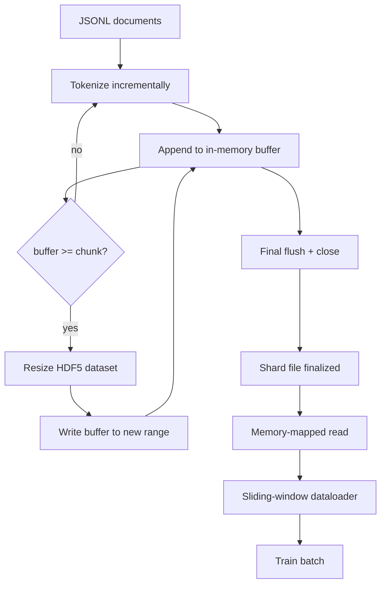

# HDF5 토큰화 코퍼스(HDF5 Tokenized Corpus)

> 다운로드된 코퍼스(corpus)는 트레이너가 회선 속도로 스트리밍할 수 있는 레이아웃에 안착해야 한다. 디스크의 JSONL은 16개의 데이터로더(dataloader) 워커를 견디지 못한다. 크기 조정 가능하고 청크된(chunked) 정수 데이터셋을 가진 HDF5는 견딘다. 이 레슨은 크기 조정 가능한 HDF5 데이터셋으로의 스트리밍 토큰화(tokenization), 여러 파일에 걸친 샤딩된 쓰기, 학습 시점의 메모리 매핑(memory-mapped) 읽기, 그리고 올바른 패킹(packing)으로 고정 길이 시퀀스를 만드는 슬라이딩 윈도우(sliding-window) 데이터로더를 만든다.

**Type:** Build
**Languages:** Python
**Prerequisites:** Phase 19 lessons 30-37
**Time:** ~90분

## 학습 목표 (Learning Objectives)

- 결정론적(deterministic) 청킹으로 문서를 크기 조정 가능한 HDF5 정수 데이터셋에 스트리밍하기.
- 실패가 한정되고 병렬화가 가능하도록 쓰기를 여러 HDF5 파일에 샤딩하기.
- HDF5의 페이지 캐시(page-cache) 기반 청크 레이아웃을 통해 토큰을 다시 읽되, 데이터로더가 배치 시점에만 배치 버퍼로 복사하도록 하기.
- 명시적 패킹 규칙으로 고정 길이 학습 시퀀스를 내보내는 슬라이딩 윈도우 데이터로더 구현하기.

## 문제 (The Problem)

현대 언어 모델 학습(training) 실행은 수십 개의 워커에 걸쳐 초당 수십만 샘플의 속도로 토큰을 읽는다. 디스크의 JSONL은 첫 콜드 캐시(cold-cache) 페이지 폴트(page fault)에서 죽는다. JSON 파서는 느리고 문서 경계는 주소 지정이 불가능하며 "샘플 4,217,884"로 탐색(seek)하려면 파일을 스캔해야 한다. 잘 압축되는 Parquet조차 잘 맞지 않는데, 트레이너는 열(column)을 원하지 않기 때문이다. 트레이너는 O(1) 무작위 접근이 가능한 평평한 토큰 스트림을 원한다.

HDF5가 맞는 이유는 청크되고 크기 조정 가능하며 정수 전용인 데이터셋을 제공하고, 그 청크가 읽기 시점에 페이지 캐시 친화적이기 때문이다. 트레이너가 `tokens[3,200,000 : 3,200,8192]`의 슬라이스를 요청하면 HDF5는 요청된 하이퍼슬랩(hyperslab)을 페이지 캐시에서 새로 할당된 NumPy 배열로 복사한다. 비용은 워커당 열린 파일 핸들 하나와 청크 크기의 페이지 캐시 풋프린트 하나인데, 이는 JSONL을 디코딩하는 비용에 비하면 무시할 만하다.

만들기 문제는 쓰기 쪽을 정직하게 만드는 것이다. 크기 조정 가능한 데이터셋은 오용하기 쉽다. 문서를 한 번에 하나씩 쓰면 HDF5 파일이 사용 불가능할 정도로 단편화된다. 모든 문서를 한 번의 리사이즈로 쓰면 프로세스 사망이 샤드 전체를 잃는다. 올바른 규율은 버퍼-후-확장(buffer-then-extend)이며, 청크 크기와 일치하는 버퍼 크기, 그리고 크래시가 최대 한 샤드만 잃도록 작업을 파일에 분할하는 샤딩된 쓰기다.

## 개념 (The Concept)



### 제대로 한 크기 조정 가능한 HDF5

토큰 데이터셋은 `maxshape=(None,)`과 고정된 `chunks=(chunk_size,)`로 생성된다. 쓰기는 길이 `chunk_size`의 NumPy 배열에 토큰을 버퍼링하며 진행된다. 버퍼가 차면 데이터셋은 정확히 `chunk_size`만큼 리사이즈되고 버퍼가 새 범위에 기록된다. 샤드 끝에서는 잔여 버퍼가 마지막 부분 범위에 기록된다. 마지막 쓰기를 제외한 모든 쓰기는 연속적이고 청크 정렬(chunk-aligned)되며 마지막 쓰기에 대해서는 리더가 샤드의 HDF5 속성에 기록된 `token_count`에서 잘라내도록 안내받는다.

### 샤딩된 쓰기

단일 HDF5 파일은 단일 실패 지점이다. 파이프라인은 샤드를 병렬로 쓴다. Phase 19 lesson 42의 각 입력 샤드가 하나의 HDF5 출력 샤드를 만든다. `shards.json` 인덱스는 샤드별로 파일 경로, 토큰 수, 문서 수, 토큰에 대한 sha256을 기록한다. 트레이너는 전역 오프셋(global offset)을 계산하고 코퍼스를 검증하기 위해 `shards.json`을 읽는다.

### 메모리 매핑 읽기

학습 시점에 각 워커는 자기 몫의 HDF5 파일을 `swmr=True` 모드로 열고 `tokens[start:stop]`을 요청한다. HDF5의 청크 레이아웃은 청크가 핫(hot)해지면 이를 페이지 캐시 기반 읽기로 만든다. 워커는 파일 전체를 구체화하지 않는다. 슬라이스는 데이터로더의 배치 버퍼로 복사되고 데이터로더는 배치 시점에 이를 다시 고정 메모리(pinned-memory) 학습 텐서(tensor)로 복사한다. 핫 패스(hot path)는 청크 전환마다 시스콜(syscall) 하나를 가지며, 나머지는 전부 RAM 접근이다.

### 슬라이딩 윈도우 데이터로더

데이터로더는 학습 시퀀스 길이를 아는 유일한 단계다. 전역 토큰 스트림에서 무작위 시작 인덱스를 고르고 `window_size + 1`개 토큰을 읽어 `(input, target) = (tokens[:-1], tokens[1:])`을 반환한다. 문서 경계는 강제되지 않는다. 윈도우는 두 문서에 걸칠 수 있으며, 그 사이에 명시적 `boundary_token_id`를 두어 모델이 구분자(separator)를 사용하는 법을 배우게 한다. 이것이 표준 패킹 규칙이다. 또한 초보자가 잊는 규칙이기도 한데, 그 결과 코퍼스가 8퍼센트의 학습 경계 토큰과 92퍼센트의 자연 텍스트로 이루어지게 된다.

## 직접 만들기 (Build It)

`code/main.py`는 다음을 구현한다.

- `Tokenizer` - 데모에 충분한 바이트 수준의 결정론적 토크나이저(tokenizer). 인터페이스는 `encode(text) -> list[int]`와 `vocab_size`다.
- `HDF5ShardWriter` - 크기 조정 가능한 정수 데이터셋을 열고 토큰을 청크 크기로 버퍼링하며 고정 크기 스트라이드(stride)로 리사이즈하고 쓴 뒤 닫을 때 `token_count`와 `sha256`을 HDF5 속성으로 기록한다.
- `ShardedTokenizationPipeline` - 입력 문서를 반복하고, 라이터로 라우팅하며, `shards.json` 인덱스를 내보낸다.
- `MmapTokenStore` - 메모리 매핑 읽기를 위해 샤드 파일을 열고, 전역 오프셋을 계산하며, 단일 `get_slice(start, stop)` API를 노출한다.
- `SlidingWindowDataloader` - 전역 스트림에서 무작위 윈도우를 고르고 `(input_ids, target_ids)` NumPy 배열을 산출한다.

파일 하단의 데모는 작은 인메모리 코퍼스를 만들고 두 샤드로 토큰화한 뒤 메모리 맵으로 열고 데이터로더를 10개 배치에 대해 실행하며 배치별 형상(shape)과 체크섬(checksum)을 출력한다.

실행:

```bash
python3 code/main.py
```

스크립트는 0으로 종료하며 배치 체크섬을 출력한다.

## 프로덕션 패턴 (Production Patterns)

네 가지 패턴이 이 레슨을 실제 학습 실행으로 확장한다.

**청크 크기는 전형적인 읽기와 같게.** 트레이너는 샘플당 `window_size + 1`개 토큰을 읽는다. HDF5 청크를 `window_size`의 배수로 설정하면 읽기가 페이지 캐시 정렬된다. 청크가 어긋나면 모든 샘플이 두 청크를 건드리므로 처리량이 반으로 준다.

**토큰 수는 데이터셋이 아니라 속성에.** 데이터셋의 마지막 슬라이스는 청크 크기가 문서 경계를 나누지 못하므로 부분적으로만 찰 수 있다. 실제 `token_count`를 데이터셋의 HDF5 속성으로 저장하고 리더가 그 값에서 잘라내게 하라. 이것이 없으면 리더가 끝을 지나 0으로 패딩된 토큰으로 걸어 들어가고, 모델은 0을 예측하는 법을 배운다.

**병렬 검증이 가능한 샤딩된 sha256.** 각 샤드는 토큰 바이트에 대한 자체 sha256을 가진다. 트레이너는 학습 시작 전에 모든 샤드를 병렬로 검증할 수 있다. 틀린 sha256은 16시간 후 에폭(epoch) 3이 아니라 실행 초기에 실패한다.

**양쪽에 `swmr=True`, 라이터에는 `libver="latest"`.** 단일 라이터-다중 리더(Single-Writer-Multiple-Reader) 모드는 라이터가 `libver="latest"`로 열고 모든 데이터셋을 미리 만든 다음 `file.swmr_mode = True`로 설정할 것을 요구한다. 그 후 라이터는 리사이즈할 때마다 `dataset.flush()`를 호출해 (`swmr=True`로 열린) 리더 워커가 일관된 데이터를 보게 해야 한다. `libver="latest"`를 건너뛰거나 구조 변경 후 SWMR을 활성화하는 것은 흔한 "file is locked" 실패의 원인이다.

## 라이브러리로 써보기 (Use It)

프로덕션 패턴:

- **소스 샤드당 HDF5 하나.** 다운로더(레슨 42)는 URL당 샤드 하나를 내보내고, 토큰화(이 레슨)는 소스 샤드당 HDF5 하나를 내보낸다. 1:1 매핑은 이어받기와 부분 실패 복구를 사소하게 만든다.
- **경계 토큰 id.** 경계 토큰은 토크나이저 어휘(vocab)의 일부이며 데이터로더가 주입하는 유일한 토큰이다. 모델이 이를 무시해야 한다면 학습 손실(loss)은 경계 토큰을 마스킹한다. 그렇지 않으면 모델은 이를 시퀀스 구분자로 사용하는 법을 배운다.
- **진실의 원천으로서의 `shards.json`.** 새 샤드를 추가한다는 것은 HDF5를 쓰고 그 sha256을 계산해 항목을 덧붙이는 것을 의미한다. 트레이너는 시작 시 파일을 한 번 읽고 디렉터리 목록은 결코 건드리지 않는다.

## 산출물 (Ship It)

`outputs/skill-hdf5-tokenized-corpus.md`는 실제 프로젝트에서라면 어떤 토크나이저가 파이프라인에 공급되는지, 어떤 청크 크기가 트레이너의 윈도우와 일치하는지, `shards.json`이 버전 관리 어디에 있는지, 데이터로더 워커가 파일에 걸쳐 어떻게 샤딩되는지를 기술할 것이다. 이 레슨은 엔진을 제공한다.

## 연습 문제 (Exercises)

1. HDF5 라이터에 `--compression gzip` 플래그를 추가하고 데모 코퍼스에서의 처리량 비용을 측정하라. 선택한 기본값을 방어하라.
2. 슬라이딩 윈도우 데이터로더에 결정론적 시드(seed)를 추가하고, 같은 시드의 두 실행이 동일한 배치를 만드는지 검증하라.
3. 모든 샤드를 읽고 토큰에 대한 sha256을 다시 계산해 `shards.json`과 비교하는 `--validate` 모드를 추가하라. CI는 학습 시작 전에 이를 실행해야 한다.
4. 윈도우 크기와 같은, 절반인, 두 배인 청크 크기에서 데이터로더 처리량을 비교하라. 페이지 캐시 효과를 보고하라.
5. 매우 긴 문서를 쓰기 시점에 잘라내는 `--max-document-tokens` 플래그를 추가하라. 읽기 시점에 결정하는 것 대비 트레이드오프를 방어하라.

## 핵심 용어 (Key Terms)

| 용어 | 사람들이 말하는 것 | 실제 의미 |
|------|-----------------|------------------------|
| 크기 조정 가능한 데이터셋(Resizable dataset) | "추가 전용" | `maxshape=(None,)`을 가진 HDF5 데이터셋으로, 청크 크기 스트라이드의 `resize` 호출로 자란다 |
| 청크 레이아웃(Chunked layout) | "HDF5가 저장하는 방식" | 커널이 메모리 매핑할 수 있고 데이터로더가 연속적으로 읽을 수 있는 고정 크기의 디스크 페이지 |
| `swmr` 모드 | "쓰면서 읽기" | 데이터로더 워커가 파일을 안전하게 공유하게 하는 단일 라이터-다중 리더 모드 |
| 샤드 인덱스(Shard index) | "shards.json" | 오프셋과 콘텐츠 해시를 가진 모든 토큰 샤드의 영속적 인덱스 |
| 슬라이딩 윈도우(Sliding window) | "학습 샘플" | 트레이너가 한 칸 이동한(shift-by-one) 타깃과 짝짓는 전역 토큰 스트림의 고정 길이 슬라이스 |

## 더 읽을거리 (Further Reading)

- [HDF5 chunking documentation](https://docs.hdfgroup.org/hdf5/v1_14/) - 이 레슨이 사용하는 청크되고 크기 조정 가능한 데이터셋 레이아웃
- [h5py user guide](https://docs.h5py.org/en/stable/) - HDF5의 Python 바인딩
- [NumPy memory mapping](https://numpy.org/doc/stable/reference/generated/numpy.memmap.html) - HDF5가 h5py를 통해 노출하는 읽기 쪽 프리미티브(primitive)
- Phase 19 · 42 - 이 레슨이 토큰화하는 출력을 내는 다운로더
- Phase 19 · 44 - 이 데이터로더를 소비하는 코사인 스케줄
- Phase 19 · 45 - 학습 스텝을 감싸는 AMP 루프
