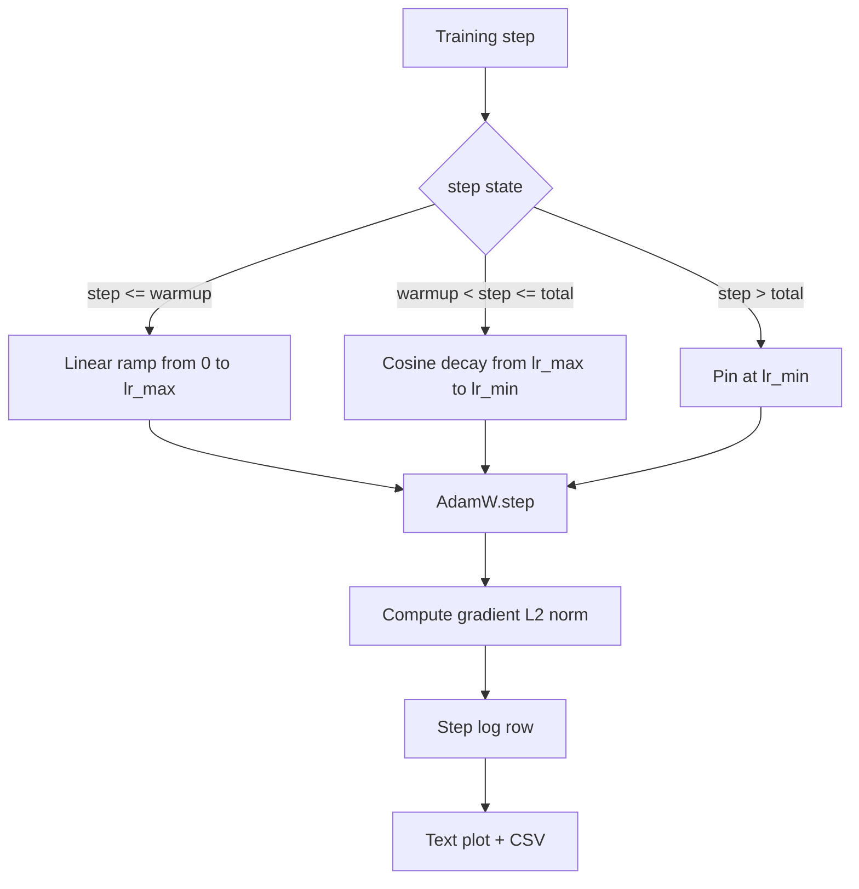

# 선형 워밍업을 곁들인 코사인 학습률(Cosine LR with Linear Warmup)

> 학습률(learning rate) 스케줄은 손실 함수(loss function) 다음으로 가장 중요한 결정이다. 코사인 감쇠(cosine decay)와 선형 워밍업(linear warmup)을 곁들인 AdamW는 언어 모델 학습의 현대적 기본값이다. 부서지기 쉬운 첫 수천 업데이트 동안 모델이 작은 유효 스텝 크기(effective step size)를 보게 하고, 설정된 정점(peak)까지 끌어올린 뒤, 다시 0을 향해 매끄럽게 감쇠하기 때문이다. 이 레슨은 그 스케줄을 만들고, 학습 스텝에 걸쳐 곡선을 그리고, 스케줄 옆에 그래디언트 노름(gradient norm)을 로깅하며, 스케줄이 워밍업·정점·감쇠 경계를 지키는지 증명한다.

**Type:** Build
**Languages:** Python
**Prerequisites:** Phase 19 lessons 30-37
**Time:** ~90분

## 학습 목표 (Learning Objectives)

- 선형 워밍업을 곁들인 코사인 학습률 스케줄에 연결된 AdamW 옵티마이저(optimizer) 구현하기.
- 실행 간 부동소수점 표류(floating-point drift) 없이 임의의 스텝에서 스케줄의 정확한 값 계산하기.
- 학습 건강 상태를 관찰 가능하도록 그래디언트 L2 노름을 학습률과 나란히 로깅하기.
- 스케줄을 눈으로 읽을 수 있는 텍스트 플롯과 어떤 도구든 소비할 수 있는 CSV로 렌더링하기.

## 문제 (The Problem)

첫 수천 학습 업데이트가 가장 시끄럽다. 모델의 가중치(weight)는 여전히 초기화에 가깝다. 옵티마이저의 이동 2차 모멘트(second-moment) 추정값은 아직 안정화되지 않았다. 그래디언트 노름은 크고 잡음이 많다. 만약 이 업데이트 동안 학습률이 정점에 있으면 모델은 곧장 발산(diverge)하거나, 영영 벗어나지 못하는 손실 정체(plateau)에 빠진다. 잘 알려진 두 가지 해법은 그래디언트 클리핑(gradient clipping, Phase 19 lesson 45의 주제)과, 작게 시작해 끌어올리는 학습률 스케줄이다.

워밍업을 곁들인 코사인 스케줄은 세 영역을 가진다. 스텝 0부터 스텝 `warmup_steps`까지 학습률은 0에서 설정된 정점 `lr_max`까지 선형으로 증가한다. 스텝 `warmup_steps`부터 스텝 `total_steps`까지 학습률은 코사인 곡선의 위쪽 절반을 따라 `lr_max`에서 `lr_min`까지 감쇠한다. `total_steps` 이후 학습률은 `lr_min`에 고정되어, 초과 실행하는 잘못 설정된 트레이너가 스케줄을 조용히 벗어나지 않게 한다.

만들기 문제는 스케줄이 off-by-one으로 틀어지기 쉽다는 것이다. 그 off-by-one은 학습 실행 6시간 후, 모델이 과적합(overfitting)을 시작하는 순간에 1퍼센트 너무 높거나 낮은 학습률로 나타나는데, 스케줄을 경계에서 철저히 테스트하지 않으면 보이지 않는다.

## 개념 (The Concept)



### 워밍업 공식

`warmup_steps > 0`일 때 `[0, warmup_steps]` 범위의 `step`에 대해 학습률은 `lr_max * step / warmup_steps`이다. 퇴화한 `warmup_steps = 0` 경우는 "워밍업 없음"으로 취급된다. 스케줄은 스텝 0에서 곧장 `lr_max`로 시작하고 즉시 코사인 감쇠로 진입한다. 일부 테스트 하니스(test harness)는 스케줄이 여전히 쓸 만한 곡선을 만드는지 확인하기 위해 `warmup_steps = 0`을 전달한다.

### 코사인 공식

`(warmup_steps, total_steps]` 범위의 `step`에 대해 학습률은 `lr_min + 0.5 * (lr_max - lr_min) * (1 + cos(pi * progress))`이며, 여기서 `progress = (step - warmup_steps) / max(1, total_steps - warmup_steps)`이다. `step = warmup_steps`에서 코사인은 `cos(0) = 1`로 평가되어 `lr_max`를 주며, 워밍업 종점과 정확히 일치한다. `step = total_steps`에서 코사인은 `cos(pi) = -1`로 평가되어 `lr_min`을 주며, 감쇠 종점과 정확히 일치한다.

양쪽 종점에서 연속이라는 점은 우연이 아니다. 그것이 바로 이 스케줄이 세 개의 다른 함수를 붙인 것이 아니라 `step`에 대한 단일 함수로 구현된 이유다. 붙여 만든 스케줄은 `lr_max`가 처음 바뀌는 순간 한 경계를 잃는다.

### 전체 스텝 이후의 바닥(Floor)

`step > total_steps`에 대해 학습률은 `lr_min`에 머문다. 계약은 명시적이다. 스케줄은 오류를 내지도, 외삽(extrapolate)하지도 않는다. 바닥에 고정하고 트레이너가 경고를 로깅하게 둔다. 학습을 연장해야 하는 트레이너는 루프가 아니라 스케줄의 `total_steps`를 바꾼다.

### 학습률과 나란히 하는 그래디언트 노름 로깅

스케줄은 학습 건강의 절반이다. 그래디언트 노름이 나머지 절반이다. 학습 루프는 스텝마다 둘 다 로깅한다. 발산하는 학습 실행은 손실보다 먼저 그래디언트 노름이 치솟는 것을 보여준다. 잘 조율된 워밍업은 노름이 학습률과 함께 선형으로 상승하게 한다. 너무 공격적인 정점은 워밍업 후에도 높게 머무는 노름으로 나타난다. 디스크의 데이터셋은 `step, lr, grad_l2_norm, loss`이다. CSV가 유일한 영속적 기록이다.

## 직접 만들기 (Build It)

`code/main.py`는 다음을 구현한다.

- `CosineWithWarmup` - 설정된 스케줄에 대한 무상태(stateless) 함수 `lr(step) -> float`.
- `TrainState` - 모델, `AdamW` 옵티마이저, 스케줄을 단일 스텝 함수로 감싼다.
- `TrainState.step` - 순방향 패스 한 번, 역방향 패스 한 번을 수행하고, 그래디언트 L2 노름을 로깅하며, `lr(step)`을 옵티마이저에 적용한다.
- `plot_schedule_ascii` - 스케줄을 눈으로 읽을 수 있는 텍스트 플롯으로 렌더링한다.
- `write_schedule_csv` - 스텝마다 학습률이 담긴 한 행을 내보낸다.

파일 하단의 데모는 작은 `nn.Linear` 모델을 만들고, 고정 입력 배치에 대해 20 스텝 학습하며, 스텝별 학습률, 그래디언트 노름, 손실을 출력한다. 스케줄은 시각적 점검을 위해 텍스트 플롯으로도 렌더링된다.

실행:

```bash
python3 code/main.py
```

스크립트는 0으로 종료하며 스텝별 학습 로그와 스케줄 플롯을 출력한다.

## 프로덕션 패턴 (Production Patterns)

네 가지 패턴이 스케줄을 프로덕션 산출물로 끌어올린다.

**스케줄은 코드가 아니라 설정에 산다.** 트레이너는 git에 커밋된 YAML 또는 JSON 설정에서 `warmup_steps`, `total_steps`, `lr_max`, `lr_min`을 읽는다. 설정이 콘텐츠 주소화(content-addressed)되므로 스케줄은 재현 가능하다. 설정이 PR diff의 일부이므로 스케줄은 감사 가능하다.

**스텝 카운터는 단조(monotonic)이며 에폭(epoch)과 분리된다.** 일부 프레임워크는 데이터셋이 샤딩되거나 데이터로더가 재시작할 때 스텝과 에폭을 혼동한다. 스케줄은 로컬 카운터가 아니라 트레이너의 체크포인트(checkpoint)에서 `global_step`을 읽는다. 스텝 카운터가 영속적 축이므로 이어받은 실행은 올바른 스케줄 위치에서 계속된다.

**실행 디렉터리의 스케줄 플롯.** 모든 학습 실행은 실행 디렉터리에 `outputs/lr_schedule.png`(또는 이 레슨에서는 텍스트 플롯)를 쓴다. 디렉터리를 훑어보는 리뷰어는 아무것도 다시 실행하지 않고 스케줄을 점검할 수 있다. 이는 잘못 설정된 스케줄류의 버그를 PR 시점에 잡아낸다.

**로그 행 스키마는 고정된다.** `step, lr, grad_l2_norm, loss` 순서로. 다운스트림 노트북이나 대시보드가 그 스키마를 읽는다. 버전을 올리지 않고 열 이름을 바꾸면 기존의 모든 대시보드가 무효화된다.

## 라이브러리로 써보기 (Use It)

프로덕션 패턴:

- **다른 무엇보다 먼저 정점을 스윕(sweep)하라.** `lr_max`는 가장 민감한 손잡이다. 작은 모델에서 먼저 스윕하라. 최적 `lr_max`는 모델 크기에 약하게 스케일하므로, 작은 모델 스윕이 강한 사전 정보(prior)가 된다.
- **워밍업은 절대 개수가 아니라 전체 스텝의 분수(fraction)다.** 2,000 워밍업 스텝을 가진 2억 스텝 실행은 거의 즉시 정점에서 시작한다. 같은 개수를 가진 20,000 스텝 실행은 10퍼센트 동안 워밍업한다. 워밍업을 분수(전형적: 1-3퍼센트)로 설정해 스케줄이 학습 기간에 따라 스케일하게 하라.
- **`lr_min`은 의도적으로 0이 아니다.** `lr_max`의 10퍼센트인 바닥은 긴 꼬리(long tail) 동안 옵티마이저가 계속 학습하게 한다. `lr_min = 0` 스케줄은 플롯에서는 멋져 보이는 학습 곡선과 실제로는 학습을 끝내지 못한 모델을 만든다.

## 산출물 (Ship It)

`outputs/skill-cosine-warmup.md`는 실제 프로젝트에서라면 어떤 설정이 스케줄을 담는지, 전역 카운터가 어떤 트레이너 스텝에서 읽히는지, 어떤 `lr_max` 스윕이 배포된 값을 만들었는지를 기술할 것이다. 이 레슨은 엔진을 제공한다.

## 연습 문제 (Exercises)

1. 스케줄의 역제곱근(inverse-square-root) 변형을 추가하고 200 스텝 장난감 학습 실행에서 비교하라. 어느 곡선이 더 낮은 최종 손실을 만드는가?
2. `total_steps / 2`에서 두 번째 워밍업을 추가하는 `--restart` 플래그를 추가하라. 따뜻한 재시작(warm restart)이 장난감 실행에서 개선이 되는지 해가 되는지 방어하라.
3. 스케줄이 연속임을 검사하는 단위 테스트를 추가하라. `[0, total_steps]`의 모든 스텝에 대해 차이 `|lr(step+1) - lr(step)|`은 `lr_max / warmup_steps`로 한정된다.
4. 스케줄을 `torch.optim.lr_scheduler.LambdaLR`에 연결해 프레임워크 코드와 조합되게 하라. 레슨은 평범한 스텝 함수를 쓴다. 래퍼는 무엇을 바꾸는가?
5. `matplotlib`을 통해 실제 플롯을 쓰는 `--plot-png` 플래그를 추가하라. CI 실행에 레슨의 텍스트 플롯과 PNG 중 무엇이 더 나은 기본값인지 방어하라.

## 핵심 용어 (Key Terms)

| 용어 | 사람들이 말하는 것 | 실제 의미 |
|------|-----------------|------------------------|
| 워밍업(Warmup) | "느린 시작" | 첫 `warmup_steps` 업데이트에 걸쳐 0에서 `lr_max`로의 선형 증가 |
| 코사인 감쇠(Cosine decay) | "매끄러운 하강" | 남은 스텝에 걸쳐 `lr_max`에서 `lr_min`으로 가는 위쪽 절반 코사인 곡선 |
| 바닥(Floor) | "학습 이후" | `total_steps`를 지나 스케줄이 고정하는 고정된 `lr_min` 값 |
| 그래디언트 노름(Gradient norm) | "그래디언트의 L2" | 스텝마다 로깅되는, 연결된 그래디언트 벡터의 유클리드 노름 |
| 전역 스텝(Global step) | "스케줄 축" | 재시작을 견디고 스케줄을 구동하는 단조 스텝 카운터 |

## 더 읽을거리 (Further Reading)

- [Loshchilov and Hutter, SGDR: Stochastic Gradient Descent with Warm Restarts (arXiv 1608.03983)](https://arxiv.org/abs/1608.03983) - 코사인 스케줄의 레퍼런스 논문
- [Loshchilov and Hutter, Decoupled Weight Decay Regularization (arXiv 1711.05101)](https://arxiv.org/abs/1711.05101) - AdamW의 레퍼런스 논문
- [PyTorch torch.optim.lr_scheduler](https://docs.pytorch.org/docs/stable/optim.html#how-to-adjust-learning-rate) - 스텝 함수가 프레임워크 스케줄러와 조합되는 방식
- Phase 19 · 42 - 이 스케줄이 코퍼스를 소비하는 다운로더
- Phase 19 · 43 - 스케줄이 함께 진화하는 데이터로더
- Phase 19 · 45 - 루프의 다음 층인 그래디언트 클리핑과 AMP
