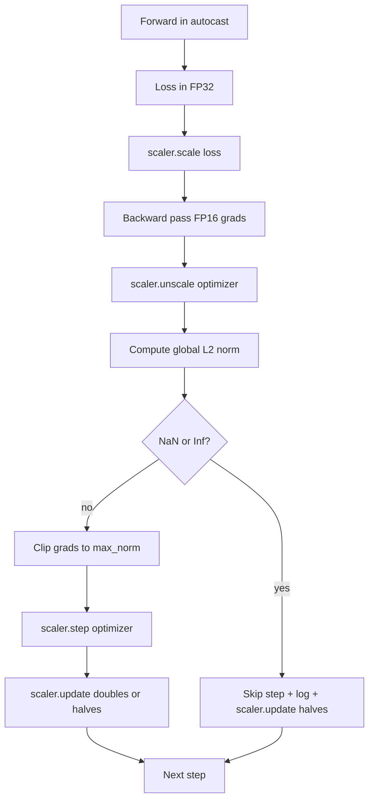

# 그래디언트 클리핑과 혼합 정밀도(Gradient Clipping and Mixed Precision)

> 이전 레슨의 옵티마이저(optimizer)와 스케줄은 그래디언트(gradient)가 멀쩡하다고 가정한다. 보통은 그렇지 않다. 단 하나의 나쁜 배치(batch)만으로 그래디언트 노름(gradient norm)이 세 자릿수만큼 치솟는다. 혼합 정밀도(mixed-precision) 학습은 손실 쪽에서 FP16 오버플로(overflow)를 끌어들여 이를 더 키운다. 이 레슨은 프로덕션 학습에 없어서는 안 될 두 가지 안전벨트를 만든다. 하나는 설정된 전역 L2 노름으로 그래디언트를 자르는 클리핑(gradient clipping)이고, 다른 하나는 NaN과 Inf를 탐지해 스텝을 깔끔하게 건너뛰고 사후 분석용으로 스케일링 인자(scaling factor)를 로깅하는, autocast와 GradScaler를 갖춘 혼합 정밀도 루프다.

**Type:** Build
**Languages:** Python
**Prerequisites:** Phase 19 lessons 30-37
**Time:** ~90분

## 학습 목표 (Learning Objectives)

- 모든 파라미터(parameter) 그래디언트에 대한 전역 L2 노름을 계산하고, 설정된 임계값(threshold)을 초과하면 제자리에서 클리핑하기.
- FP16 순방향·역방향 패스가 오버플로를 견디도록 학습 스텝을 autocast와 GradScaler로 감싸기.
- 손실(loss)이나 그래디언트의 NaN과 Inf를 탐지하고, 옵티마이저 스텝을 건너뛰며, 그 건너뜀(skip)을 로깅하기.
- 긴 건너뜀 연속이 즉시 보이도록 GradScaler의 스케일링 인자를 스텝마다 보고하기.

## 문제 (The Problem)

어제 깔끔하게 돌았던 학습 실행이 스텝 8,217에서 손실 곡선을 수직으로 치솟게 한다. 범인은 그래디언트 노름이 4,200인 단 하나의 배치인데, 이전 정점의 스무 배다. 클리핑이 없으면 옵티마이저는 모델이 이전 한 시간 동안 쌓은 학습을 모두 리셋하는 스텝을 적용한다. 노름 1.0으로 전역 L2 클립을 걸면 같은 배치도 단위 노름 업데이트만큼만 기여한다. 손실은 추세선 위에 머물고, 실행은 살아남는다.

혼합 정밀도 학습은 순방향 패스와 역방향 패스 대부분을 FP16으로 계산해 처리량(throughput)을 2-3배 높인다. 그 대가로 FP16은 지수 범위(exponent range)가 좁다. FP16에서 오버플로하는 전형적인 그래디언트는 Inf로 평가되고, 후속 층(layer)을 거쳐 NaN으로 전파되며, 다음 옵티마이저 스텝에서 모든 가중치(weight)를 NaN으로 만든다. PyTorch의 GradScaler는 역방향 패스 전에 손실에 큰 스케일링 인자를 곱하고 옵티마이저 스텝 전에 그래디언트를 같은 인자로 나누어 이를 해결한다. 언스케일(unscale) 시점에 어떤 그래디언트라도 Inf나 NaN이면 스케일러는 스텝을 건너뛰고 스케일링 인자를 반으로 줄인다. 이전 N개 스텝이 깔끔했다면 스케일러는 인자를 두 배로 늘린다. 학습이 진행되는 동안 인자는 FP16 범위가 허용하는 가장 높은 값을 찾는다.

만들기 문제는 둘을 올바르게 연결하는 것이다. 언스케일 전에 클립하면 임계값이 스케일된 그래디언트에 적용되고, 언스케일 후에 클립하면 GradScaler에 대한 연산 순서가 중요해진다. 올바른 순서는 `scaler.scale(loss).backward()`, 그다음 `scaler.unscale_(optimizer)`, 그다음 `clip_grad_norm_`, 그다음 `scaler.step(optimizer)`, 그다음 `scaler.update()`이다. 다른 어떤 순서를 써도 루프는 티 없이 망가진다.

## 개념 (The Concept)



### 전역 L2 노름

전역 L2 노름은 파라미터별 노름이 아니라 연결된 그래디언트 벡터의 유클리드 노름이다. PyTorch는 이를 `torch.nn.utils.clip_grad_norm_(parameters, max_norm)`으로 구현한다. 이 함수는 클립 이전 노름을 반환하므로 레슨은 자연 값과 클립된 값을 모두 로깅할 수 있는데, 이는 "우리가 매 스텝마다 클리핑하고 있다"는 진단에 필요하다.

### autocast와 GradScaler

`torch.amp.autocast(device_type)`는 적격 연산(대부분의 matmul 부류 연산)을 선택적으로 FP16으로 실행하는 컨텍스트 매니저(context manager)다. `torch.amp.GradScaler(device_type)`는 역방향 전에 손실을 스케일하고 옵티마이저 스텝 전에 그래디언트를 역스케일하는 헬퍼다. 둘은 함께 설계되었다. 하나를 다른 하나 없이 쓰는 것은 테스트가 잡아내야 할 설정 오류다.

레슨이 CPU autocast를 쓰는 이유는 그것이 CI에서 돌아가기 때문이다. 같은 패턴은 `device_type="cpu"`를 `device_type="cuda"`로 바꾸기만 하면 그대로 CUDA로 옮겨진다. CPU에서 GradScaler는 스텁(stub)이다(CPU autocast는 이미 기본적으로 BF16에서 동작하며 손실 스케일링이 필요 없다). 그래도 레슨은 호출 지점(call site)까지 포함해 연결 방식을 GPU 루프와 똑같이 맞춘다.

### NaN과 Inf 탐지

탐지는 두 곳에서 일어난다. 첫째, 역방향 전에 `torch.isfinite`로 손실 자체를 검사한다. Inf나 NaN 손실은 쓸모 있는 그래디언트를 만들지 못하므로 옵티마이저에 진입하지 않고 건너뛴다. 둘째, `scaler.unscale_(optimizer)` 후 레슨은 `has_non_finite_grad(...)`로 언스케일된 그래디언트를 스캔하고 어떤 Inf나 NaN이든 건너뜀으로 처리한다. 두 검사가 함께 순방향 패스와 역방향 패스 둘 다의 실패 모드를 다룬다.

### 스케일링 인자 진단

스케일링 인자는 GradScaler의 내부 상태다. 스텝마다 레슨은 `scaler.get_scale()`을 읽고 학습률(learning rate) 및 그래디언트 노름 옆에 로깅한다. 건강한 실행은 스케일링 인자가 2의 거듭제곱으로 올라가다 `2^17`이나 `2^18` 근처에서 포화(saturate)하는 것을 보여준다. 잘못 동작하는 실행은 인자가 높고 낮은 값 사이에서 진동하는 것을 보여주는데, 이는 모델의 그래디언트가 때로는 범위 안에 있고 때로는 그렇지 않다는 신호다. 이 진단은 로깅 없이는 보이지 않는다.

## 직접 만들기 (Build It)

`code/main.py`는 다음을 구현한다.

- `clip_global_l2_norm` - 클립 이전과 이후 노름을 모두 반환하는 `torch.nn.utils.clip_grad_norm_` 래퍼.
- `has_non_finite_grad` - 그래디언트에서 NaN과 Inf를 스캔하는 헬퍼.
- `AmpTrainState` - 모델, `AdamW` 옵티마이저, GradScaler, autocast 디바이스를 감싼다. 전체 클리핑, 스케일링, NaN-시-건너뜀 파이프라인을 실행하는 `step(inputs, targets)`을 노출한다.
- `StepLog`과 `SkipLog` - 구조화된 스텝별 레코드.
- 작은 `nn.Linear` 모델을 20 스텝 학습하고, 건너뜀 경로를 작동시키기 위해 스텝 5에서 그래디언트에 Inf를 주입하며, 결과 로그를 출력하는 데모.

실행:

```bash
python3 code/main.py
```

스크립트는 0으로 종료하며 각 행이 `STEP` 또는 `SKIP`으로 태깅된 스텝별 로그를 출력한다. 적어도 한 행은 `SKIP`이다.

## 프로덕션 패턴 (Production Patterns)

네 가지 패턴이 루프를 프로덕션 학습 스텝으로 끌어올린다.

**로그 줄이 아니라 경보(alert)로서의 건너뜀 카운터.** 학습 실행당 한 줌의 건너뛴 스텝은 건강하다. 에폭(epoch)당 수백 건의 건너뜀은 강한 경보다. 모델이 FP16이 담을 수 없는 영역에 있고 루프가 조용히 실패하고 있다. 레슨은 1,000 스텝 롤링(rolling) 건너뜀 비율을 추적하며, 프로덕션에서라면 5퍼센트 초과 비율에 호출(page)을 걸 것이다.

**클립 임계값은 설정에 산다.** `max_norm = 1.0`은 언어 모델 학습의 현대적 기본값이다. 작은 모델에서 먼저 스윕(sweep)하라. 더 큰 임계값은 모델이 진짜로 어려운 배치에서 회복하게 하고, 더 작은 임계값은 더 시끄러운 손실 곡선을 대가로 최악의 경우를 한정한다. 임계값은 lesson 44의 스케줄과 같은 YAML 또는 JSON 설정에 속한다.

**노름 로그는 스케줄과 함께 CSV로 간다.** CSV 열은 `step, lr, grad_l2_pre_clip, grad_l2_post_clip, loss, skipped, skip_reason, scaler_scale`이다. 파일을 여는 리뷰어는 한 행에서 스케줄, 그래디언트 이야기, 스케일링 인자, (이유와 함께) 건너뜀 결과를 본다. 열을 여러 파일에 쪼개는 것은 어긋난 분석의 지름길이다.

**`scaler.update()`는 건너뜀에서도 매 스텝 실행된다.** 깔끔한 스텝에서 스케일러는 no-inf 카운터를 읽고, 증가시키며, 어쩌면 인자를 두 배로 늘린다. 건너뛴 스텝에서 스케일러는 인자를 반으로 줄이고 카운터를 리셋한다. 건너뜀 경로에서 `update()`를 빠뜨리면 "스케일링 인자가 끝내 바뀌지 않았다"는 버그가 생긴다.

## 라이브러리로 써보기 (Use It)

프로덕션 패턴:

- **autocast 디바이스는 옵티마이저 디바이스와 일치한다.** GPU 학습에는 `torch.amp.autocast(device_type="cuda")`, CPU 학습에는 `torch.amp.autocast(device_type="cpu")`. 디바이스를 섞으면 조용한 타입 오류가 발생하는데, 멀쩡해 보이는 손실 곡선과 학습하지 않는 모델로 드러난다.
- **역방향 전 손실 검사.** `torch.isfinite(loss).all()`은 텐서(tensor) 리덕션 하나다. 비용은 무시할 만하고 NaN 손실에서의 절약은 학습 스텝 하나 전체다. 항상 실행하라.
- **`zero_grad`에서 `set_to_none=True`.** 그래디언트를 0이 아니라 `None`으로 설정해, 옵티마이저가 영향받지 않은 파라미터 그룹의 계산을 건너뛸 수 있게 한다. 이 설정은 공짜 처리량 향상이자 약간의 버그 표면 감소다.

## 산출물 (Ship It)

`outputs/skill-clip-amp.md`는 실제 프로젝트에서라면 학습 스텝이 어떤 클립 임계값과 autocast 디바이스를 쓰는지, 스텝별 CSV가 버전 관리 어디에 있는지, 프로덕션 건너뜀 비율 경보 임계값이 무엇인지를 기술할 것이다. 이 레슨은 엔진을 제공한다.

## 연습 문제 (Exercises)

1. 합성 Inf 주입을 실제 손실 스파이크(한 배치의 타깃에 1e8을 곱함)로 교체하고 건너뜀 경로가 작동하는지 검증하라.
2. autocast를 FP16 대신 BF16으로 전환하는 `--bf16` 모드를 추가하라. BF16은 FP16보다 넓은 지수 범위를 가지며 손실 스케일링이 거의 필요 없다. 같은 데모에서 건너뜀 비율이 0으로 떨어지는지 검증하라.
3. 클리핑이 일어나지 않을 때 그래디언트 클립 래퍼가 클립 이전과 이후 노름을 올바르게 반환하는지 검사하는 단위 테스트를 추가하라.
4. 롤링 윈도우 건너뜀 비율 계산과, 100 연속 스텝 동안 비율이 설정된 임계값을 초과하면 실행을 실패시키는 CLI 플래그를 추가하라.
5. 루프를 정규(canonical) CSV(`step, lr, grad_l2_pre_clip, grad_l2_post_clip, loss, skipped, skip_reason, scaler_scale`)를 쓰도록 연결하고, 매 행 후 플러시(flush)하여 파일이 Ctrl-C를 견디는지 확인하라.

## 핵심 용어 (Key Terms)

| 용어 | 사람들이 말하는 것 | 실제 의미 |
|------|-----------------|------------------------|
| 전역 L2 노름(Global L2 norm) | "클립 대상" | 모든 학습 가능 파라미터에 걸친, 연결된 그래디언트 벡터의 유클리드 노름 |
| autocast | "혼합 정밀도" | `with` 블록 안에서 적격 연산을 선택적으로 FP16(또는 BF16)으로 실행 |
| GradScaler | "손실 스케일러" | 역방향 전에 손실을 곱하고 옵티마이저 스텝 전에 그래디언트를 역스케일하는 헬퍼 |
| 건너뜀(Skip) | "나쁜 스텝" | 그래디언트나 손실이 비유한(non-finite)하여 거부된 옵티마이저 스텝. 스케일러가 인자를 반으로 줄인다 |
| 스케일링 인자(Scaling factor) | "스케일러 상태" | GradScaler의 현재 곱수. 깔끔한 구간 후에는 두 배로, 매 건너뜀마다 반으로 |

## 더 읽을거리 (Further Reading)

- [Micikevicius et al., Mixed Precision Training (arXiv 1710.03740)](https://arxiv.org/abs/1710.03740) - 원래의 손실 스케일링 제안
- [Pascanu, Mikolov, Bengio, On the difficulty of training recurrent neural networks (arXiv 1211.5063)](https://arxiv.org/abs/1211.5063) - 그래디언트 클리핑 레퍼런스 논문
- [PyTorch torch.amp.GradScaler](https://docs.pytorch.org/docs/stable/amp.html) - 이 레슨이 감싸는 스케일러 API
- [PyTorch torch.nn.utils.clip_grad_norm_](https://docs.pytorch.org/docs/stable/generated/torch.nn.utils.clip_grad_norm_.html) - 이 레슨이 사용하는 클리핑 프리미티브(primitive)
- Phase 19 · 42 - 루프에 코퍼스를 공급하는 다운로더
- Phase 19 · 43 - 루프가 소비하는 데이터로더
- Phase 19 · 44 - 이 루프가 조합되는 스케줄
