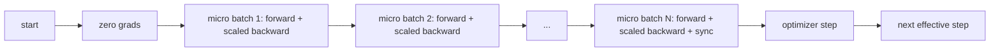
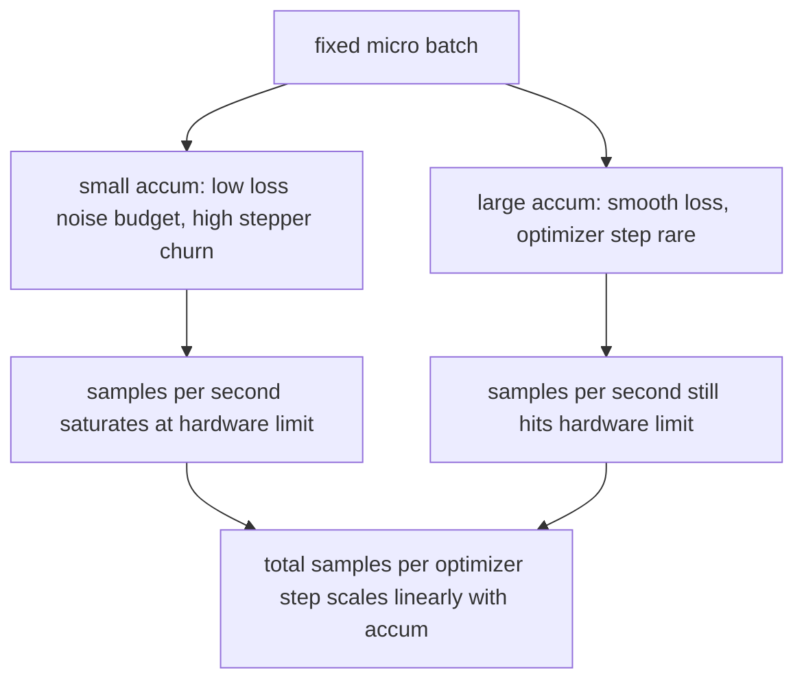

# 그래디언트 누적(Gradient Accumulation)

> 감당할 수 없는 유효 배치(effective batch)로, 한 번에 마이크로 배치(micro-batch) 하나씩 학습하라. 손실(loss)을 스케일하고, 옵티마이저(optimizer) 스텝을 미루며, 그래디언트(gradient)가 쌓이게 하라.

**Type:** Build
**Languages:** Python
**Prerequisites:** Phase 19 lessons 42 to 45
**Time:** ~90분

## 학습 목표 (Learning Objectives)

- 유효 배치 항등식을 유도하기: `effective_batch = micro_batch * accum_steps`.
- 누적된 그래디언트가 단일 전체 배치(full-batch) 역방향과 일치하도록 마이크로 배치별 손실 스케일링 구현하기.
- 마지막 마이크로 배치까지 옵티마이저 동기화(synchronization)를 건너뛰기(마지막 스텝에서 동기화, sync-on-last-step).
- 유효 배치 대비 처리량(throughput) 곡선을 읽고 수확 체감(diminishing return)을 설명하기.

## 문제 (The Problem)

당신은 유효 배치 512로 학습하고 싶다. 손실 곡선이 더 매끄럽고 그 규모에서 옵티마이저 스텝이 더 합당하기 때문이다. 책상 위의 가속기(accelerator)는 메모리가 바닥나기 전에 32개 예제를 담는다. 배치를 두 배로 하는 것은 선택지가 아니다. 모델을 반으로 줄이는 것도 선택지가 아니다. 2017년에 이 분야가 손을 뻗어 결코 멈추지 않은 요령은, 16번의 역방향 패스(backward pass)를 돌리고, 그래디언트가 파라미터(parameter) 버퍼 안에 누적되게 하며, 개수가 목표에 도달할 때만 옵티마이저를 스텝하는 것이다.

위험은 손실이 더 이상 더 큰 배치에서의 값과 같은 숫자가 아니라는 점이다. 16개 미니배치(mini-batch)의 교차 엔트로피(cross entropy)를 순진하게 합하면 하나의 전체 배치 손실의 16배가 된다. 스케일링 없이는 그래디언트 방향은 맞지만 크기가 틀리며, 옵티마이저 스텝이 16배 너무 크다. 해법은 나눗셈 하나다. 또한 잊기 쉬운 해법이다.

## 개념 (The Concept)



계약은 짧다.

- 각 마이크로 배치의 손실은 `backward()` 전에 `accum_steps`로 나뉜다. PyTorch는 기본적으로 그래디언트를 `param.grad`로 합한다. 그 나눗셈이 누적 합을 올바른 스케일로 되돌린다.
- 옵티마이저 스텝은 마지막 마이크로 배치의 역방향 후, 유효 배치당 한 번 발사된다. 누적 중간에 스텝하면 나머지 실행이 의존하는 모든 파라미터가 비뚤어진다.
- 옵티마이저의 상태(모멘텀 버퍼, Adam 모멘트)는 마이크로 배치당 한 번이 아니라 유효 스텝당 한 번 전진한다. 그러지 않으면 지수 이동 평균(exponential moving average)이 틀린 빈도를 보고 스케줄을 다 태워버린다.
- 단일 디바이스에서 이것은 장부 정리(bookkeeping)다. 다중 랭크(multi-rank) 클러스터에서는 같은 패턴이 비최종 마이크로 배치를 그래디언트 all-reduce를 건너뛰는 `no_sync` 컨텍스트로 감싼다. 마지막 마이크로 배치가 누적된 전체 그래디언트를 N번 네트워크 비용을 치르는 대신 한 패스로 리듀스한다.

### 코드로 보는 동등성 증명

```python
loss = criterion(model(x_full), y_full)
loss.backward()
opt.step()
```

는

```python
for x, y in chunks(x_full, y_full, n):
    scaled = criterion(model(x), y) / n
    scaled.backward()
opt.step()
```

와 부동소수점 합산 순서까지를 제외하면 동등하다. 루프 끝의 누적 그래디언트 버퍼는 단일 전체 배치 역방향이 만들었을 것과 같은 텐서(tensor)다. 레슨 코드는 `equivalence_check`에서 1e-4 미만의 max-abs 차이로 이를 단언한다.

### 비용은 어디로 가는가

각 마이크로 배치는 순방향 하나와 역방향 하나를 든다. 누적으로 당신은 메모리를 시간과 맞바꾼다. `outputs/accum-curve.json`의 처리량 곡선은 마이크로 배치를 고정한 채 유효 배치가 커질 때 무슨 일이 일어나는지 보여준다.



공짜 점심은 없다. `accum_steps`를 두 배로 하면 옵티마이저 스텝당 월 타임(wall time)이 두 배가 된다. 바뀌는 것은 그래디언트 추정의 분산(variance)이다. 같은 월 예산에서 당신은 더 적은 옵티마이저 스텝을 만들었지만 각각은 더 많은 샘플에 걸쳐 평균되었다. 문헌은 큰 배치와 작은 배치를 다른 최적화 문제로 다룬다. 여기 레슨은 통계적이 아니라 기계적이다.

## 직접 만들기 (Build It)

`code/main.py`가 실행 가능한 산출물이다. 세 가지를 한다.

### 1단계: 동등성 검사

`equivalence_check()`는 같은 시드(seed)로 같은 네트워크의 복사본 두 개를 만든다. 하나는 한 번의 순방향 패스에서 16-샘플 배치를 본다. 다른 하나는 손실을 4로 나눈 네 개의 4-샘플 청크(chunk)를 본다. 함수는 옵티마이저 스텝 전 그래디언트 버퍼와 후 파라미터를 비교한다. 단언은 `max_abs_diff < 1e-4`다.

### 2단계: 마지막 스텝에서 동기화 패턴

`train_one_optimizer_step`은 마이크로 배치를 순회한다. 마지막을 제외한 모든 마이크로 배치에 대해 `no_sync_context(model)`로 진입한다. 단일 프로세스에서 컨텍스트는 no-op이다. DDP에서는 여기가 그래디언트 all-reduce가 건너뛰어지는 곳이다. 장부 정리는 무엇이든 동일하다. `sync_counter`는 no_sync 스코프를 몇 번 떠났는지 기록한다. N개 마이크로 배치에 대해 그 개수는 N이 아니라 유효 스텝당 하나다.

### 3단계: 처리량 곡선

`sweep_effective_batches`는 고정 마이크로 배치와 누적 스텝 목록으로 같은 모델을 돌린다. 각 설정에 대해 다음을 로깅한다.

- `samples_per_sec`: 본 총 샘플을 월 타임으로 나눈 값
- `median_step_ms`: 유효 스텝당 50번째 백분위수
- `sync_calls`: 작동된 집합(collective) 지점
- `avg_loss`: 스윕의 옵티마이저 스텝 전반 평균

출력은 `outputs/accum-curve.json`에 안착하며 노트북에서 재사용 가능하다.

실행:

```bash
python3 code/main.py
```

스크립트는 동등성 차이, 그다음 스윕 테이블, 그다음 JSON 경로를 출력한다. 종료 코드는 0이다.

## 라이브러리로 써보기 (Use It)

프로덕션 학습에서 그래디언트 누적은 하나의 손잡이 뒤에 산다. PyTorch의 패턴은 `accumulation_steps = effective_batch // (micro_batch * world_size)`다. 여기서 사용이 허용되지 않는 프레임워크들도 같은 루프를 감싸지만, 단계는 동일하다. 손실을 스케일하고, 비최종 마이크로에서 동기화를 건너뛰고, 누적하며, 한 번 스텝한다.

실전의 세 가지 패턴:

- 마이크로 배치 크기는 디바이스 메모리를 포화시키도록 선택된다. 더 작은 것은 가속기 사이클을 낭비한다. 더 큰 것은 크래시한다.
- 유효 배치는 학습률(learning rate) 스케줄에서 선택된다. 큰 유효 배치는 스케일된 학습률과 워밍업(warmup)이 필요하다. 이것이 2017년부터 이야기되어 온 선형 스케일링 규칙(linear scaling rule)이다.
- 누적 개수는 둘 사이의 다리이며, 데이터 로더를 다시 작성하지 않고 런타임에 자유롭게 조율할 수 있는 유일한 손잡이다.

## 산출물 (Ship It)

`outputs/skill-gradient-accumulation.md`는 동료가 새 저장소에 떨어뜨릴 수 있도록 레시피를 담는다. 손실을 `accum_steps`로 스케일하고, 비최종 마이크로에서 옵티마이저 동기화를 건너뛰고, 유효 배치당 옵티마이저를 한 번 스텝하며, 트레이드오프가 보이도록 유효 배치 대비 처리량을 JSON으로 로깅한다.

## 연습 문제 (Exercises)

1. `--num-steps 100`으로 스윕을 다시 실행하고 유효 배치 대비 초당 샘플 수를 플롯하라. 곡선은 어디서 평평해지는가?
2. 잘못된 스케일링 변형(나눗셈 없음)을 추가하고 레퍼런스 대비 스텝 1에서의 파라미터 차이를 보여라.
3. SGD를 AdamW로 바꾸고 옵티마이저 상태가 마이크로 배치당이 아니라 유효 스텝당 한 번 전진하는지 확인하라.
4. 실제 `DistributedDataParallel` 래퍼를 도입하고 `no_sync_context`를 그 메서드로 라우팅하라. sync_calls가 유효 배치당 N-1만큼 떨어지는지 확인하라.
5. 동등성 검사를 두 개의 다른 마이크로 분할(2 by 8 대 4 by 4)을 비교하도록 수정하고, 완화해야 하는 어떤 허용 오차든 설명하라.

## 핵심 용어 (Key Terms)

| 용어 | 사람들이 말하는 것 | 실제 의미 |
|------|-----------------|------------------------|
| 마이크로 배치(Micro batch) | 당신이 순방향하는 배치 | 단일 순방향 패스에서 메모리에 들어가는 슬라이스 |
| 누적 스텝(Accum steps) | 스텝당 역방향 패스 | 옵티마이저 스텝 하나 전에 합해진 역방향의 수 |
| 유효 배치(Effective batch) | 그 배치 | 마이크로 배치 곱하기 누적 스텝 곱하기 데이터 병렬 월드 크기 |
| 손실 스케일링(Loss scaling) | N으로 나누기 | 합한 그래디언트가 전체 배치와 일치하도록 마이크로 배치별 나눗셈 |
| 마지막에서 동기화(Sync on last) | 나머지는 건너뛰기 | 윈도우의 마지막 역방향에서만 그래디언트 집합을 실행 |

## 더 읽을거리 (Further Reading)

- 마지막 스텝에서 동기화 요령의 프로덕션 버전에 대한 `DistributedDataParallel.no_sync`의 PyTorch 문서.
- 대규모 배치 학습의 선형 스케일링에 대한 Goyal et al., 2017, 유효 배치를 신경 써야 할 정전적(canonical) 이유.
- 그래디언트 누적과 혼합 정밀도 언스케일링(mixed precision unscaling)의 상호작용에 대한 PyTorch 이슈 트래커.
- Phase 19 lessons 42 to 45는 이 레슨이 가정하는 모델, 데이터 로더, 옵티마이저, 트레이너 골격을 다룬다.
- Phase 19 lesson 47은 긴 누적 실행이 월클록(wallclock) 상한을 견디도록 체크포인트(checkpoint)와 이어받기(resume)를 다룬다.
