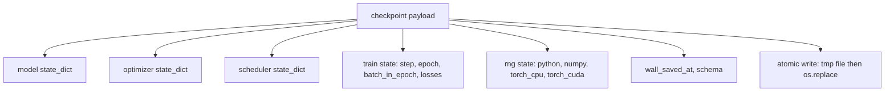
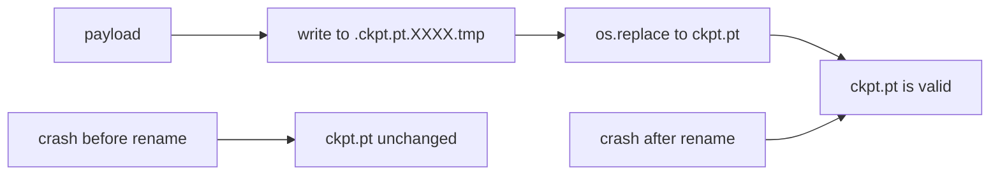
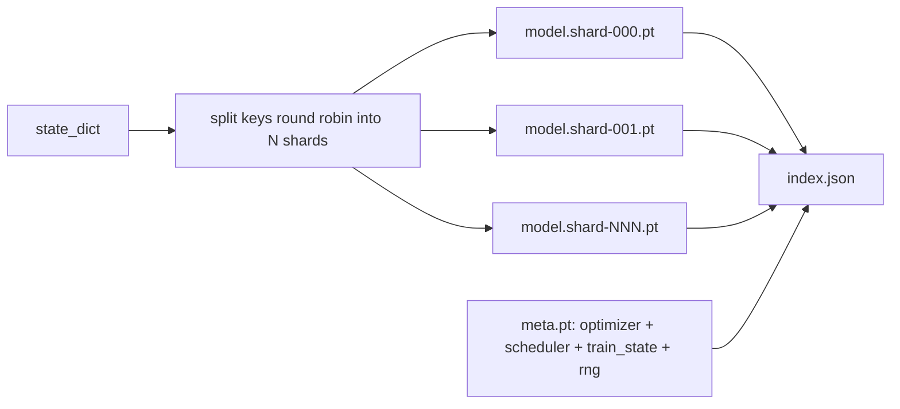

# 체크포인트 저장과 이어받기(Checkpoint Save and Resume)

> 학습 중단은 실행을 죽인다. 체크포인트(checkpoint)는 실행을 이어가게 한다. 모델, 옵티마이저(optimizer), 스케줄러(scheduler), 손실 이력, 스텝 카운터, RNG 상태를 원자적으로(atomically) 저장하여, 어느 순간에 죽더라도 디스크에 유효한 파일이 남게 하라.

**Type:** Build
**Languages:** Python
**Prerequisites:** Phase 19 lessons 42 to 45
**Time:** ~90분

## 학습 목표 (Learning Objectives)

- 새 프로세스로 다시 불러올 수 있는 단일 페이로드(payload)에 전체 학습 상태를 담기.
- 임시 파일에 쓴 뒤 이름 바꾸기(write-to-temp then rename)로 원자적 저장을 구현해, 크래시가 반쯤 쓰인 파일을 결코 남기지 않게 하기.
- 이어받기 후 손실이 중단 없는 베이스라인(baseline)과 일치하도록 Python, NumPy, PyTorch의 RNG 상태 복원하기.
- 단일 파일에 더 이상 들어가지 않는 모델을 위해, 해시 검증된 샤드(shard)와 JSON 인덱스를 가진 샤딩된 체크포인트 레이아웃 만들기.

## 문제 (The Problem)

당신은 18시간짜리 학습 작업을 설정한다. 월클록(wallclock) 상한은 4시간이다. 당신보다 높은 직급의 누군가가 커널 업그레이드를 승인해서 클러스터가 11시간째에 재부팅된다. 체크포인트 없이는 처음부터 다시 시작한다. 이어받기 없이는 첫 11시간이 학습한 옵티마이저 상태도 잃는다. 그래서 모델 가중치(weight)가 살아남았더라도 AdamW 모멘트가 사라지고, 다음 스텝이 학습 궤적이 이미 지나친 방향으로 휘청거린다.

올바른 산출물은 이어가는 데 필요한 모든 것을 담은 단일 파일이다. 모델 파라미터(parameter), 옵티마이저 상태, 스케줄러 상태, 플롯용 손실 이력, 현재 스텝과 에폭(epoch)과 에폭 내 배치(batch-in-epoch) 카운터, 그리고 모든 무작위성 원천에 대한 RNG 상태다. RNG 상태가 없으면 이어받은 손실 곡선은 다른 곡선이다. 같은 모델, 같은 데이터, 다른 셔플(shuffle), 다른 드롭아웃(dropout) 마스크, 대시보드의 다른 숫자다.

원자적 저장은 계약의 나머지 절반이다. 최종 파일명에 직접 쓰는 것은 쓰기 도중 크래시가 손상된 파일을 남긴다는 뜻이다. 이어받기는 쓰레기를 읽는다. 같은 디렉터리의 임시 파일에 쓴 뒤 이름을 바꾸는 것은 쓰기 도중 크래시가 이전의 멀쩡한 파일을 건드리지 않은 채 남긴다는 뜻이다. 이름 바꾸기는 POSIX 파일 시스템에서 원자적이다.

## 개념 (The Concept)



### 다섯 가지 상태 버킷

| 버킷 | 왜 중요한가 |
|--------|----------------|
| 모델 | 가중치와 버퍼. 모델이 무엇인지. |
| 옵티마이저 | 모멘텀과 적응 모멘트. 이것이 없으면 다음 스텝은 다른 최적화 문제다. |
| 스케줄러 | 학습률(learning rate)이 곡선 어디에 있는지. 특히 코사인 스케줄이 신경 쓴다. |
| 학습 카운터 | 스텝, 에폭, 에폭 내 배치, 그리고 대시보드를 그리는 손실 이력. |
| RNG 상태 | 드롭아웃, 데이터 셔플, 모델 내부 임의의 샘플링(sampling)에 대한 결정론(determinism). |

### 원자적 저장



두 가지 규칙. 첫째, 임시 파일은 대상과 같은 디렉터리에 살아 이름 바꾸기가 같은 파일 시스템 안에 머물게 한다. 디바이스 간(cross-device) 이름 바꾸기는 원자적이지 않다. 둘째, 임시 이름은 시도마다 고유해 두 라이터가 서로 짓밟지 않게 한다.

### 샤딩된 체크포인트

모델이 커지면 단일 파일 페이로드는 빠르게 불러오기에 너무 크고, 검사하기에 너무 크며, 네트워크 공유가 읽기 도중 딸꾹질할 때 너무 고통스러워진다. 해법은 파라미터 상태를 샤드로 쪼개고 그것들을 묶는 작은 인덱스를 쓰는 것이다.



인덱스는 샤드 수, 각 샤드의 sha256, 그리고 메타 파일의 sha256을 기록한다. 로더는 어떤 해시라도 불일치하면 큰 소리로 실패한다. 샤드는 다른 물리 디스크에 안착할 수 있다. 메타는 작고 먼저 읽힌다.

### 이어받기는 에폭 중간에서 이어간다

다음 에폭 시작으로 튀는 이어받기는 몇 분에서 하루까지 낭비한다. 해법은 `(epoch, batch_in_epoch)`와 RNG 상태다. 불러오기 후 학습 루프는 현재 에폭에서 이미 소비된 배치를 지나도록 난수 생성기를 빨리 감고(fast-forward) `batch_in_epoch`부터 이어간다. 레슨 코드는 정확히 이것을 한다. 단언은 이어받기 후 손실 궤적이 중단 없는 베이스라인과 1e-4 이내로 일치한다는 것이다.

## 직접 만들기 (Build It)

`code/main.py`는 네 가지 프리미티브(primitive)와 데모 드라이버를 제공한다.

### 1단계: RNG 상태 포착과 복원

`capture_rng_state`는 Python의 `random.getstate`, NumPy의 `np.random.get_state`, 그리고 PyTorch CPU와 CUDA RNG 바이트를 담은 dict를 반환한다. `restore_rng_state`는 이를 되돌린다. CPU 텐서(tensor)는 PyTorch의 RNG가 소비할 줄 아는 uint8 바이트 버퍼다.

### 2단계: 원자적 저장

`atomic_save`는 페이로드를 대상 디렉터리의 임시 파일에 쓴 뒤, `os.replace`로 최종 이름으로 바꿔 넣는다. `atomic_write_json`은 샤딩된 인덱스에 대해 같은 일을 한다.

### 3단계: 전체 체크포인트 왕복

`save_checkpoint`는 모델, 옵티마이저, 스케줄러, 학습 상태, RNG를 하나의 dict로 포장한다. `load_checkpoint`는 이를 되돌려 `TrainState`를 반환한다. 스키마 필드는 업그레이드 훅(hook)이다. 미래의 형식 변경은 버전 문자열을 올리고 로더가 디스패치(dispatch)한다.

### 4단계: 샤딩된 변형

`save_sharded_checkpoint`는 파라미터 키를 N개 샤드에 라운드 로빈(round-robin)으로 분배하고, 각 샤드를 자체 원자적 저장으로 쓰고, 옵티마이저와 스케줄러와 학습 상태를 담은 메타 파일을 쓰며, 샤드 sha256이 담긴 JSON 인덱스를 쓴다. `load_sharded_checkpoint`는 병합 전 모든 샤드를 검증한다.

### 5단계: 이어받기 데모

`run_resume_demo`는 작은 모델을 `total_steps` 동안 학습하고, `interrupt_at`에서 체크포인트를 저장한 뒤, 이어간다. 두 번째 프로세스가 체크포인트를 복원하고 남은 스텝을 실행한다. 함수는 중단 지점 이후 두 손실 궤적 사이의 최대 절대 차이를 반환한다. RNG가 복원되면 그 차이는 0이거나 부동소수점 잡음이다.

실행:

```bash
python3 code/main.py
```

단일 파일과 샤딩된 데모 둘 다 max-diff가 1e-4 미만임을 단언한다. 요약은 `outputs/resume-demo.json`에 안착한다.

## 라이브러리로 써보기 (Use It)

프로덕션 학습 스택은 체크포인팅을 트레이너의 일부로 출시한다. 형태는 동일하다. 모델 + 옵티마이저 + 스케줄러 + 카운터 + RNG를 원자적으로 쓰고, 최신 것을 찾기 쉽도록 스텝으로 이름 짓는다. 샤딩된 레이아웃은 병렬 읽기로 대규모 모델 불러오기를 구동한다. 그것을 작동시키는 것이 index.json이다.

강제할 세 가지 패턴:

- **스키마는 페이로드의 문자열이다.** 마이그레이션은 그것을 기준으로 분기한다. 그것이 없으면 옛 실행을 깨뜨리지 않고 형식을 진화시킬 수 없다.
- **모든 샤드에 sha256.** 조용히 잘린 다운로드는 최악의 버그다. 로더는 빨리 실패하거나 늦게 실패한다.
- **체크포인트 주기를 정직하게 유지하라.** N 스텝마다와 월클록 분(minute)마다 중 더 짧은 쪽으로 저장하라. 그러지 않으면 크래시하는 긴 스텝이 작업의 한 윈도우 전체를 낭비한다.

## 산출물 (Ship It)

`outputs/skill-checkpoint-save-resume.md`는 어떤 새 학습 스크립트를 위한 레시피다. 페이로드 형태, 원자적 쓰기, RNG 포착, 샤딩된 인덱스다. 스킬을 저장소에 떨어뜨리고, 주기적 저장 지점에 `save_checkpoint`를 연결하고, 시작 시점에 `load_checkpoint`를 연결하면 실행이 죽음을 견딘다.

## 연습 문제 (Exercises)

1. 라운드 로빈 샤딩을 파라미터 그룹별 샤딩(`​.weight`로 끝나는 층 대 `.bias`)으로 교체하라. 각 레이아웃은 언제 더 바람직한가?
2. 저장 루프를 확장해 마지막 K개 체크포인트를 유지하고 더 오래된 것을 가지치기(prune)하라. 디스크가 작을 때 올바른 K는 무엇인가?
3. 스텝 수뿐 아니라 월클록 간격으로 저장을 트리거하는 `--ckpt-every-seconds` 플래그를 추가하라.
4. 시작 시점에 실행되어 디렉터리의 모든 체크포인트를 스캔하고 어느 것이 손상되었는지 보고하는 체크섬 검증 경로를 추가하라.
5. 페이로드에 새 필드를 추가하고 스키마 문자열을 올리는 `migrate_v1_to_v2` 함수를 구현하라. 불러오기가 두 버전을 모두 견디게 하라.

## 핵심 용어 (Key Terms)

| 용어 | 사람들이 말하는 것 | 실제 의미 |
|------|-----------------|------------------------|
| 원자적 저장(Atomic save) | "쓰고 기도하기" | 같은 디렉터리의 임시 파일에 쓴 뒤, os.replace로 대상 이름으로 넣기 |
| 상태 dict(State dict) | "그 가중치들" | 파라미터 이름을 키로 하는 모델 파라미터와 버퍼 |
| 샤딩된 체크포인트(Sharded checkpoint) | "큰 모델 파일" | 샤드당 하나씩의 여러 파일, 더하기 메타 파일과 sha256이 담긴 JSON 인덱스 |
| RNG 상태(RNG state) | "랜덤 시드" | python random, numpy, torch CPU, torch CUDA에 대한 포착된 상태. 시드만이 아니다 |
| 에폭 중간 이어받기(Mid-epoch resume) | "재시작" | RNG를 빨리 감고 같은 에폭의 다음 배치부터 이어가기 |

## 더 읽을거리 (Further Reading)

- `os.replace`가 의존하는 원자성 주장을 위한 POSIX `rename` 시맨틱스.
- 디바이스 간 복원을 위한 `map_location`을 포함한 `torch.save`와 `torch.load`의 PyTorch 문서.
- Phase 19 lesson 46은 이 레슨의 체크포인트 페이로드가 견디는 그래디언트 누적(gradient accumulation)을 다룬다.
- Phase 19 lesson 48은 이 방식이 수용하는 상태 dict 형식을 가진 분산(distributed) 래퍼를 다룬다.
- 원자적 이름 바꾸기 뒤의 내구성(durability) 보장을 위한 Linux 커널 `fsync` 문서.
