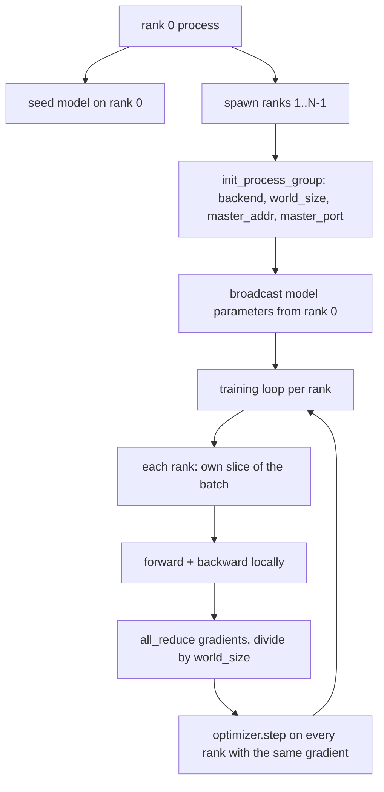
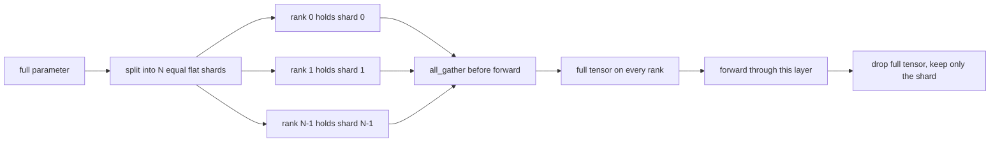

# 밑바닥부터 만드는 분산 데이터 병렬과 FSDP(Distributed Data Parallel and FSDP from Scratch)

> 다중 랭크(multi-rank) 학습은 두 개의 집합 연산(collective)과 하나의 규칙이다. 시작 시 파라미터(parameter)를 브로드캐스트(broadcast)하고, 역방향(backward) 후 그래디언트(gradient)를 평균하며, 랭크들이 자기가 어느 스텝에 있는지에 대해 의견을 달리하게 결코 두지 마라.

**Type:** Build
**Languages:** Python
**Prerequisites:** Phase 19 lessons 42 to 45
**Time:** ~90분

## 학습 목표 (Learning Objectives)

- 특수 하드웨어 없이 `gloo` 백엔드(backend)로 N개 랭크에 걸쳐 프로세스 그룹(process group)을 올리기.
- 생성 시 파라미터를 브로드캐스트하고 역방향 후 그래디언트를 all-reduce하는 최소 DDP 래퍼 구현하기.
- 랭크별 그래디언트의 all-reduce가 연결된 입력에 대한 단일 프로세스 그래디언트와 일치함을 증명하기.
- FSDP 파라미터 샤딩(sharding) 스케치하기: 각 랭크는 한 조각을 보유하고, 전체 텐서(tensor)는 순방향 패스(forward pass)를 위해 모았다가 이후 버려진다.

## 문제 (The Problem)

모델은 한 디바이스에 들어간다. 데이터셋은 그렇지 않다. 최적화 예산은 월클록(wallclock) 초당 N배의 예제를 처리하라고 요구한다. 첫 번째 지렛대는 데이터 병렬(data parallel)이다. 각 랭크는 배치의 다른 조각에 대해 같은 모델을 돌린 뒤, 옵티마이저 스텝 전에 그래디언트를 평균한다. 두 번째 지렛대는 FSDP다. 모델도 한 디바이스에 들어가지 않으므로, 각 랭크가 모든 파라미터의 일부를 보유하고 순방향 패스 동안 층(layer)별로 전체 텐서를 재구성한다.

고통은 장부 정리(bookkeeping)다. 파라미터가 랭크 간에 표류하면 실행은 조용히 손상된다. 그래디언트는 평균하지만 손실은 평균하지 않으면 대시보드가 거짓말한다. 집합 백엔드가 토폴로지(topology)에 합의할 수 없으면 실행은 영원히 멈춘다. 해법은 집합 연산을 한 번 손으로 작성하고 재현할 수 없는 래퍼는 결코 신뢰하지 않는 것이다.

이 레슨은 CPU에서 돌아간다. CUDA를 전제하지 않는다. `gloo` 백엔드는 모든 PyTorch 빌드와 함께 출시되고 `torch.multiprocessing` 워커를 받아들인다. 같은 코드가 다중 GPU 노드에서 구조 변경 없이 `nccl`로 전환된다.

## 개념 (The Concept)



### 중요한 두 가지 집합 연산

| 집합 연산 | 무엇을 하는가 | 언제 |
|------------|--------------|------|
| `broadcast` | 한 랭크에서 모든 다른 랭크로 텐서를 복사 | 파라미터 초기화, 스케줄러 상태, 일대전(one-to-all) 동기화 |
| `all_reduce` | 모든 랭크에 걸쳐 텐서를 합(또는 평균, 또는 최댓값)하고, 모든 랭크가 결과를 얻음 | 역방향 후 그래디언트 평균 |
| `all_gather` | 각 랭크가 텐서를 기여하고, 모든 랭크가 연결을 얻음 | 로짓(logits) 수집, FSDP 파라미터 언샤드(unshard) |

DDP 계약은 생성 시 `broadcast`, 역방향 후 `all_reduce`다. FSDP 스케치는 각 층의 순방향 패스 전에 `all_gather`를 더한다.

### 그래디언트 평균은 단일 프로세스 그래디언트와 일치한다

N개 랭크에 걸쳐 B개 예제 배치로 학습된 모델은 N*B 배치로 학습하는 단일 프로세스와 같은 그래디언트를 만들어야 한다. 요령은 이렇다. 랭크별 그래디언트를 합한 뒤 N으로 나누면 평균 손실 그래디언트가 나오는데, 이는 평균 리덕션(mean reduction)을 쓰는 교차 엔트로피(cross entropy)가 전체 배치에서 만들어 냈을 값과 같다. 레슨 코드는 수동 all-reduce 그래디언트와 레퍼런스 단일 프로세스 그래디언트 사이를 `max-abs-diff < 1e-3`으로 단언한다.

### FSDP 스케치



메모리 이득은 정확하다. 파라미터에 대한 랭크별 메모리가 1/N로 떨어진다. 비용은 매 순방향 패스마다 치르는 모으기(gather)다. 프로덕션 FSDP는 이전 층의 계산과 모으기를 겹치므로, 월클록 비용이 단순 계산으로 예측한 값보다 훨씬 작다. 레슨은 모든 파라미터에 대해 왕복을 수행하고 재구성이 원본과 비트 단위로 같음을 단언한다.

### CPU와 gloo 백엔드

CUDA가 프로덕션 타깃이지만, 같은 코드 경로가 CPU에 존재한다. `gloo`는 CPU 집합 백엔드다. GPU에서 `nccl`보다 여러 자릿수 느리지만, API 표면은 동일하다. 레슨의 프로세스 그룹은 `backend="gloo"`로 초기화되고 랭크는 `torchrun`이 아니라 `torch.multiprocessing`으로 스폰(spawn)된다. 둘 다 같은 `torch.distributed` 호출에 도달한다. 다중 GPU 노드에서 유일한 변경은 `backend="nccl"`, 디바이스 텐서, 그리고 실행을 위한 `torchrun`이다.

## 직접 만들기 (Build It)

`code/main.py`가 실행 가능한 산출물이다.

### 1단계: 프로세스 그룹 올리기

```python
os.environ["MASTER_ADDR"] = "127.0.0.1"
os.environ["MASTER_PORT"] = str(port)
dist.init_process_group(backend="gloo", rank=rank, world_size=world_size)
```

`MASTER_ADDR`와 `MASTER_PORT`는 랑데부(rendezvous)다. 모든 랭크가 같은 호스트의 같은 포트로 다이얼한다. 레슨은 여러 실행이 한 머신을 공유할 때 충돌을 피하기 위해 bind-and-close 요령으로 빈 포트를 고른다.

### 2단계: 생성 시 브로드캐스트

`MinimalDDP.__init__`은 모든 파라미터와 버퍼를 순회하며 `dist.broadcast(tensor, src=0)`을 호출한다. 랭크 0의 값이 정규(canonical) 초기화가 된다. 이것이 없으면 각 랭크가 자기 시드(seed)로 초기화하고 랭크들이 첫 스텝부터 발산한다.

### 3단계: 역방향 후 그래디언트 all-reduce

```python
def all_reduce_grads_(module, world_size):
    for p in module.parameters():
        if p.grad is None:
            p.grad = torch.zeros_like(p.data)
        dist.all_reduce(p.grad.data, op=dist.ReduceOp.SUM)
        p.grad.data.div_(world_size)
```

모든 랭크가 같은 평균 그래디언트를 갖게 된다. 옵티마이저 스텝은 이제 모든 랭크에서 같은 입력의 함수이며, 이것이 파라미터가 실행 내내 동기화 상태를 유지하는 이유다.

### 4단계: 동등성 증명

`manual_all_reduce_matches_single_process`는 랭크 0에 같은 모델을 만들고 all-reduce 후 그래디언트를 단일 프로세스가 연결된 입력에서 계산했을 그래디언트와 비교한다. max-abs-diff는 약 1e-8이다.

### 5단계: FSDP 왕복

`fsdp_round_trip_sketch`는 각 파라미터를 평탄화(flatten)하고, `world_size`의 배수로 패딩하고, 슬라이스하고, all-gather하며, 언패딩한다. 모든 랭크의 재구성이 원본과 같다. 이것이 언샤드 단계다. 역(순방향 후 다시 샤드)은 모은 텐서에서 한 조각을 떼는 것이다.

실행:

```bash
python3 code/main.py
```

기본 월드 크기는 2다. 두 CPU 프로세스가 스폰되어 `gloo`를 통해 서로 대화하고 0으로 종료한다. 출력 `outputs/ddp-demo.json`은 랭크별 파라미터 합, all-reduce 후 그래디언트 노름(gradient norm), FSDP 왕복 결과, 그리고 수동 대 레퍼런스 그래디언트 차이를 담는다.

## 라이브러리로 써보기 (Use It)

프로덕션 학습 스택은 같은 프리미티브를 호출한다. PyTorch의 `DistributedDataParallel`은 다음을 더한다. all-reduce를 역방향과 겹치는 역방향 후 그래디언트 훅, 여러 작은 그래디언트를 하나의 집합 연산으로 결합하는 버킷된(bucketed) all-reduce, 그리고 lesson 46이 사용한 `no_sync` 컨텍스트다.

PyTorch의 FSDP는 다음을 더한다. 각 랭크가 하나의 연속 버퍼를 보유하도록 층별 평탄 파라미터 뷰, 다음 층의 언샤드를 현재 층의 계산과 겹침, 그리고 샤드에 대한 선택적 CPU 오프로드(offload)다.

형태는 동일하다. 시작 시 브로드캐스트, 역방향 후 리듀스, 더 이상 들어가지 않을 때 파라미터 샤드.

## 산출물 (Ship It)

`outputs/skill-distributed-fsdp-ddp.md`는 새 학습 스크립트를 위한 레시피를 담는다. CPU에는 `gloo`로, GPU에는 `nccl`로 프로세스 그룹을 돌리고, 모델을 생성 시 브로드캐스트하고 역방향 후 리듀스하는 DDP 껍데기로 감싸며, 선택적으로 FSDP 스케치의 all_gather 패턴으로 파라미터를 샤드한다.

## 연습 문제 (Exercises)

1. `--world-size 4`로 실행하고 파라미터 분산(spread)이 실행 내내 1e-3 미만으로 유지되는지 확인하라.
2. 수동 평균을 `dist.all_reduce(op=dist.ReduceOp.AVG)`로 교체하고 차이를 측정하라.
3. DDP 래퍼에 역방향 후 훅을 추가해 all-reduce가 나머지 역방향과 겹치게 하라. 월클록 개선을 측정하라.
4. FSDP 다시 샤드 단계를 구현하라. 순방향 패스 후 전체 텐서를 다시 로컬 샤드로 교체하라. 랭크별 메모리가 떨어지는지 확인하라.
5. CUDA 박스에서 백엔드를 `nccl`로 전환하라. 어떤 환경 변수가 바뀌고 어떤 것이 그대로인지 적어라.

## 핵심 용어 (Key Terms)

| 용어 | 사람들이 말하는 것 | 실제 의미 |
|------|-----------------|------------------------|
| 백엔드(Backend) | "gloo 또는 nccl" | 집합 연산을 구현하는 라이브러리. gloo는 CPU, nccl은 GPU |
| 월드 크기(World size) | "총 랭크" | 그룹의 프로세스 수. 그룹은 집합 연산이 동작하는 단위다 |
| 랭크(Rank) | "워커 id" | 그룹 내 프로세스 식별자, 0부터 인덱싱 |
| All-reduce | "그래디언트 합하기" | 모든 랭크에 걸쳐 텐서를 합하고, 모든 랭크가 같은 결과로 끝남 |
| 언샤드(Unshard) | "파라미터 모으기" | all_gather를 통해 랭크별 조각에서 전체 텐서를 재구성 |

## 더 읽을거리 (Further Reading)

- 이 레슨이 의존하는 집합 시맨틱스를 위한 PyTorch `torch.distributed` 문서.
- CUDA 기반 `nccl` 프리미티브와 형태가 동일한 `gloo` 라이브러리의 집합 연산 목록.
- DDP all-reduce를 `no_sync`로 감싸는 그래디언트 누적 패턴을 위한 Phase 19 lesson 46.
- DDP와 FSDP 실행을 견디는 체크포인트 레이아웃을 위한 Phase 19 lesson 47.
- 여기 스케치된 파라미터 샤딩의 프로덕션 구현을 위한 PyTorch FSDP 문서.
