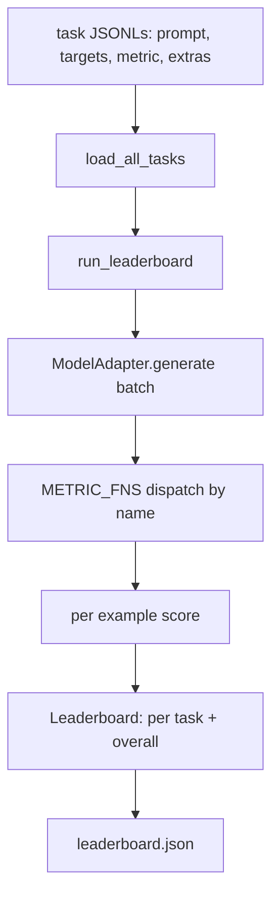
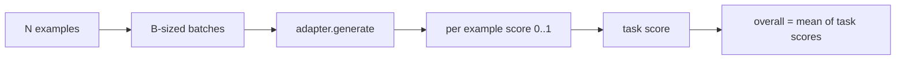

# 언어 모델 평가 하니스(Language Model Evaluation Harness)

> 정의할 수 없는 태스크에서 잘하는 모델은 우연히 잘하는 모델이다. 하니스(harness)는 태스크 정의, 지표(metric), 러너(runner), 리더보드(leaderboard)를 하나의 짧고 교체 가능한 형태로 담은 것이다.

**Type:** Build
**Languages:** Python
**Prerequisites:** Phase 19 lessons 42 to 45
**Time:** ~90분

## 학습 목표 (Learning Objectives)

- 태스크를 예제마다 `prompt`, `targets`, `metric`, 선택적 `extras`를 가진 JSONL 파일로 정의하기.
- 다섯 가지 지표 구현하기: 정확 일치(exact match), rouge-l F1, 실행 가능 검사(executable check), 객관식(multiple choice), 부분 문자열 포함(substring contains).
- 태스크마다 예제를 배치(batch)하고 교체 가능한 모델 어댑터(adapter)로 디스패치(dispatch)하는 러너 만들기.
- 태스크별 점수, 지연 시간(latency), 그리고 재현 가능한 전체 평균을 담은 리더보드 JSON 내보내기.

## 문제 (The Problem)

매주 새 언어 모델이 안착한다. 마케팅 주장은 그것이 잘한다는 것이다. 정직한 질문은 무엇을 잘하느냐다. 정직한 답은 당신이 직접 작성한 리더보드인데, 벤더(vendor)의 리더보드는 그들이 맞춰 조율한 것이기 때문이다.

저장소에 하니스가 없으면 당신은 두 모델을 분위기(vibe)로 비교한다. 하니스가 있으면 고정된 태스크 셋에서 고정된 지표로, diff할 수 있는 JSON 출력으로 점수를 매겨 비교한다. 하니스는 어제의 실행과 오늘의 실행 사이의 계약이다. 그것이 없으면 회귀(regression)가 출시된다.

함정은 하니스를 단일 모델에 과적합(over-fit)시키는 것이다. 해법은 같은 함정을 거꾸로 하는 것이다. 하니스는 15분 안에 읽을 만큼 작고, 태스크는 저장소에 출시할 만큼 작고, 지표는 동료가 감사할 수 있도록 밑바닥부터 작성되며, 어댑터는 모델 특화 코드가 사는 유일한 곳이다. 어댑터를 바꾸면 리더보드가 움직인다. 태스크를 바꾸면 리더보드가 움직인다. 다른 어떤 것도 움직여서는 안 된다.

## 개념 (The Concept)



### 태스크 명세

모든 예제는 하나의 JSONL 줄이다.

```json
{"id": "arith-00", "prompt": "compute: 2 + 2", "targets": ["4"], "metric": "exact_match"}
```

채점 헬퍼가 필요한 지표의 경우 `extras`가 부수 페이로드(payload)를 담는다.

```json
{
  "id": "code-00",
  "prompt": "python: write a function f that doubles its input",
  "targets": ["ok"],
  "metric": "code_exec",
  "extras": {"io_pairs": [[1, 2], [3, 6]]}
}
```

태스크는 `outputs/tasks/` 아래의 `.jsonl` 파일이다. 파일 이름이 태스크 이름이다. 한 파일의 모든 예제는 지표를 공유한다.

### 다섯 가지 픽스처 태스크

| 태스크 | 지표 | 무엇을 테스트하는가 |
|------|--------|---------------|
| arithmetic | exact_match | 결정론적 답에 대한 토큰 수준 정확성 |
| summary | rouge_l | 한 줄 레퍼런스 요약에 대한 최장 공통 부분수열(longest common subsequence) F1 |
| code-exec | code_exec | 실행 가능 테스트: 예측된 함수가 입력-출력 쌍 목록을 만족해야 함 |
| multiple-choice | multiple_choice | 예측의 첫 글자가 허용된 글자와 일치해야 함 |
| generation | substring_contains | 자유 형식 텍스트가 적어도 하나의 타깃 부분 문자열을 포함해야 함 |

### 지표 계약

모든 지표는 `(prediction, targets, extras) -> [0.0, 1.0] 범위의 float`인 함수다. 하니스는 예제별 점수를 평균해 태스크 점수를 얻고, 태스크 점수를 평균해 전체를 얻는다. 지표 함수는 아주 작다.

- `exact_match`: 소문자화, 공백 축소, 동등성.
- `substring_contains`: 같은 정규화, 부분 문자열 테스트.
- `multiple_choice`: 첫 글자 대문자화.
- `rouge_l`: LCS 길이를 예측과 레퍼런스의 길이로 나눔, 정밀도(precision)와 재현율(recall)의 F1.
- `code_exec`: 제한된 네임스페이스(namespace)에서 예측을 실행하고, 모든 입력-출력 쌍에 대해 `f(x)`를 호출하며, 일치를 센다.

code_exec 지표는 빌트인(builtins)이 제거된 네임스페이스에서 예측을 실행한다. 레슨의 테스트는 `os`가 네임스페이스에 없기 때문에 `import os`가 터진다고 단언한다. 코드 예측에서 파일 시스템에 도달할 수 없다.

### 모델 어댑터

```python
class ModelAdapter(Protocol):
    def generate(self, prompts: Sequence[str]) -> List[str]: ...
    @property
    def name(self) -> str: ...
```

어댑터는 이음매(seam)다. 레슨은 다섯 가지 픽스처 태스크의 모든 프롬프트(prompt)에 대해 올바른 답을 반환하는 결정론적 패턴 매처(matcher)인 `ToyAdapter`를 출시한다. 실제 어댑터는 모델을 호출하고 그 출력을 반환한다. 하니스는 어느 쪽인지 신경 쓰지 않는다.

### 러너

`run_task`는 한 번에 `batch_size`개 프롬프트를 배치하고 지표 함수로 디스패치한다. `run_leaderboard`는 모든 태스크를 순회하며 평균한다. `write_leaderboard`는 미래의 형식 변경이 조용히 대시보드를 깨뜨리지 않도록 스키마 문자열과 함께 JSON을 내보낸다.



## 직접 만들기 (Build It)

`code/main.py`가 실행 가능한 산출물이다.

### 1단계: 픽스처 태스크 시드

`seed_fixture_tasks(target_dir)`는 다섯 개의 `.jsonl` 파일을 쓴다. `main.py`의 첫 실행은 디렉터리가 비어 있을 때 그것들을 시드(seed)한다.

### 2단계: 태스크 불러오기

`load_all_tasks(task_dir)`는 모든 `.jsonl`을 읽어 태스크 이름에서 `Example` 레코드 목록으로 가는 dict를 반환한다. 기여자가 파일에 주석을 달 수 있도록 `#`로 시작하는 주석 줄과 빈 줄은 건너뛴다.

### 3단계: 지표 구현

각 지표는 단위 테스트를 가진 작은 함수다. 레슨의 테스트 스위트(suite)는 정규화, 부분 중복, 코드 실행, 안전하지 않은 코드 거부를 다루는 13개 케이스를 포함한다.

### 4단계: 러너 작성

`run_task`는 배치를 반복하며 점수, 정답 수, 전체 수, 지연 시간을 담은 `TaskResult`를 만든다. `run_leaderboard`는 모든 태스크를 순회하며 전체 평균을 담은 `Leaderboard`를 만든다.

### 5단계: JSON 내보내기

`write_leaderboard`는 보드를 직렬화한다. `--include-per-example` 플래그는 예제별 레코드를 덤프하여 점수가 움직일 때 예측을 이전 실행과 diff할 수 있게 한다.

실행:

```bash
python3 code/main.py
```

스크립트는 첫 실행에서 픽스처를 시드하고, (모든 픽스처를 맞히는) 토이 어댑터로 채점하며, `outputs/leaderboard.json`을 쓴다. 토이 어댑터로 전체 점수는 1.0이다. `test_main.py`의 스텁 어댑터 테스트는 어댑터가 답할 수 없을 때 같은 하니스가 0.0을 만든다는 것을 보여준다.

## 라이브러리로 써보기 (Use It)

실제 모델을 꽂으려면 어댑터를 작성하라. 형태는 다음과 같다.

```python
class HttpAdapter:
    name = "vendor.v1"

    def __init__(self, endpoint, api_key):
        self.endpoint = endpoint
        self.api_key = api_key

    def generate(self, prompts):
        out = []
        for prompt in prompts:
            response = http_post(self.endpoint, prompt, self.api_key)
            out.append(response["text"])
        return out
```

`main()` 상단에서 `ToyAdapter`를 `HttpAdapter`로 바꿔라. 하니스, 태스크, 지표, 리더보드는 그대로다.

실제 프로젝트에서 하니스를 출시할 때 강제할 세 가지 패턴:

- **태스크 파일을 고정하라.** leaderboard.json은 해시로 고정된 태스크 내용을 담거나 JSONL을 나란히 담는다. 그러지 않으면 태스크 파일이 움직일 때 점수가 움직이는데 어느 것 때문인지 알 수 없다.
- **점수뿐 아니라 예측을 diff하라.** `--include-per-example` 플래그는 점수가 떨어진 날 모델이 무슨 말을 했는지 볼 수 있게 한다.
- **배치 크기를 한정하라.** 실제 어댑터는 속도 제한(rate limit)을 가진다. 작은 배치 크기는 하니스를 벤더 간에 호환되게 유지한다.

## 산출물 (Ship It)

`outputs/skill-lm-eval-harness.md`는 레시피를 담는다. JSONL 태스크 명세, 다섯 가지 지표, 교체 가능한 어댑터, 배치 러너, 스키마 문자열을 가진 리더보드 JSON이다. `outputs/tasks/`의 태스크 파일이 픽스처다. 실제 프로젝트에 시작점으로 복사하라.

## 연습 문제 (Exercises)

1. 밑바닥부터 작성한 커스텀 지표(BLEU 유사 중복, BLEURT 유사 레퍼런스 채점, 명확한 계약을 가진 무엇이든)를 가진 여섯 번째 태스크를 추가하라.
2. `code_exec`를 확장해 stdout을 포착하고 기대 stdout 목록을 타깃으로 받아들이게 하라.
3. 리더보드 diff 명령을 추가하라. 두 개의 `leaderboard.json` 파일이 주어지면, 어떤 태스크가 얼마나 움직였는지 출력하라.
4. 예제별 지연 시간을 한정하라. 어댑터 호출을 타임아웃으로 감싸고, 리더보드에 별도의 `timeouts` 열을 노출하라.
5. 미래의 독자가 같은 태스크를 채점했음을 검증할 수 있도록 리더보드에 sha256으로 태스크 내용을 고정하라.

## 핵심 용어 (Key Terms)

| 용어 | 사람들이 말하는 것 | 실제 의미 |
|------|-----------------|------------------------|
| 태스크 명세(Task spec) | "평가 형식" | 예제마다 prompt, targets, metric, 선택적 extras를 가진 JSONL 파일 |
| 지표(Metric) | "채점 방식" | (prediction, targets, extras)에서 [0, 1] 범위 float로 가는 함수 |
| 어댑터(Adapter) | "모델 클라이언트" | generate(prompts) -> list[str] 메서드를 가진 객체. 유일한 모델 특화 코드 |
| 리더보드(Leaderboard) | "스코어보드" | 태스크별 점수, 전체 수, 지연 시간, 전체 평균을 가진 JSON |
| 코드 실행 지표(Code exec metric) | "실행하고 검사하기" | 제한된 네임스페이스에서 예측을 실행하고, 입력-출력 쌍과 비교 |

## 더 읽을거리 (Further Reading)

- 프로덕션 레퍼런스를 위한 원래의 lm-evaluation-harness. 훨씬 크지만 같은 형태다.
- 같은 계약의 대안 구현을 위한 HuggingFace의 lighteval.
- Phase 19 lesson 46은 하니스가 채점하는 학습 스택에서 사용되는 그래디언트 누적(gradient accumulation) 패턴을 다룬다.
- Phase 19 lesson 47은 당신이 채점하는 체크포인트 형식을 다룬다. 리더보드에 체크포인트 해시를 고정하라.
- Phase 19 lesson 48은 테스트 대상 모델을 만든 분산 학습 스택을 다룬다.
