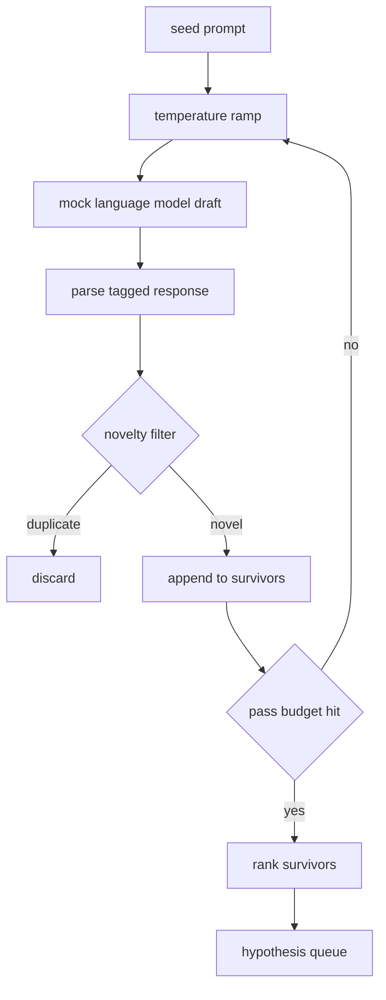

# 가설 생성기(Hypothesis Generator)

> 같은 질문을 두 번 하는 연구 에이전트(agent)는 토큰(token)을 낭비하고 있다. 요령은 각 초안이 새로운 어딘가에 도달하도록 강제하는 것이다.

**Type:** Build
**Languages:** Python
**Prerequisites:** Phase 19 Track A lessons 20-29
**Time:** ~90분

## 학습 목표 (Learning Objectives)
- 시드 프롬프트(seed prompt)에서 샘플러(sampler)를 구동하고 그 출력을 타입이 지정된 가설 레코드로 바꾸기.
- 다음 초안이 이전 것에서 더 멀어지도록 각 패스마다 샘플러 온도(temperature)를 끌어올리기.
- 작은 임베딩(embedding) 모델과 코사인 거리(cosine distance) 임계값(threshold)으로 근접 중복(near duplicate)을 걸러내기.
- 참신성(novelty), 구체성(specificity), 검증 가능성(testability)을 섞은 점수 함수로 생존자를 순위 매기기.
- 같은 시드(seed)가 항상 같은 큐(queue)를 만들도록 모든 단계를 결정론적(deterministic)으로 유지하기.

## 왜 생성한 뒤 거르는가 (Why generate, then filter)

한 모델에게 한 번 묻는 플래너(planner)는 가설 하나를 얻는다. 그것은 예시로는 괜찮다. 연구 루프에는 잘못된 형태다. 루프는 깊이를 가진 순위 매겨진 큐를 원한다. 그래서 첫 가설이 실패하면 러너(runner)가 또 한 번의 전체 샘플링 패스 비용을 치르지 않고 다음 것을 준비해 두게 한다.

그 큐를 만드는 데 두 가지 아이디어가 결합한다. 첫째는 온도 램핑(temperature ramping)이다. 샘플러를 통과하는 각 패스가 온도를 한 칸 올려, 후속 초안이 떠돌도록 장려된다. 둘째는 참신성 필터링(novelty filtering)이다. 각 초안 후 생성기는 모든 이전 생존자로부터의 임베딩 거리를 측정하고 클러스터 안에 있는 것은 무엇이든 거부한다.

레슨은 고정 프롬프트에 대해 스크립트화된 토큰 시퀀스를 반환하는 모의(mock) 언어 모델을 출시한다. 모의는 전체 경로를 작동시키기에 충분하다. 시드 프롬프트 입력, 온도 램프 적용, 후보 파싱(parse), 참신성 필터 실행, 순위 매겨진 큐 출력이다.

## Hypothesis 형태 (The Hypothesis shape)

```text
Hypothesis
  id             : int           (monotonic within a run)
  text           : str           (the claim)
  variables      : list[str]     (what changes between conditions)
  metric         : str           (what the runner will measure)
  baseline_ref   : str | None    (which paper or run the comparison cites)
  draft_pass     : int           (which sampler pass produced this)
  temperature    : float         (the sampler setting at draft time)
  novelty_score  : float         (distance from prior survivors, 0..1)
  rank_score     : float         (weighted sum used for ordering)
```

`variables`와 `metric`은 자유 텍스트가 아니다. 파서는 태깅된 응답에서 그것들을 뽑아낸다. lesson 52의 러너는 실험 설정(config)을 만들 때 이 필드들을 직접 읽는다.

`baseline_ref`는 선택적이지만 권장된다. lesson 53의 평가기(evaluator)는 비교할 베이스라인(baseline)이 필요하다. 가설이 하나를 생략하면 평가기는 같은 지표(metric)에 대한 이전 실행으로 폴백(fall back)한다.

## 아키텍처 (Architecture)



루프는 단순하다. 흥미로운 부분은 각 상자가 단단한 계약을 가진다는 것이다.

## 온도 램프 (Temperature ramp)

`t_min`에서 시작해 `t_max`에서 끝나며, 스텝은 `(t_max - t_min) / (n_passes - 1)`이다. 각 패스는 현재 온도에서 샘플러를 호출하여, `GeneratorConfig.schedule()`에서 균등 간격의 `n_passes`개 값을 만든다. 모의 모델은 `(prompt, temp_bucket)`을 키로 하는 작은 스크립트화된 응답 집합 사이를 전환하여 온도를 존중한다. 버킷은 열린 구간이어서 온도의 작은 변화가 다른 버킷을 골라 다른 초안을 만든다. 프로덕션에서는 샘플러가 `temperature=t`가 전달되는 실제 모델일 것이다.

기본 스케줄은 `0.2`에서 `1.2`까지 여섯 패스다. 여섯은 어차피 참신성 필터가 거부할 샘플의 비용을 치르지 않고 큐를 채우기에 충분하다. `0.2` 아래에서 모델은 시드를 그대로 따라 한다. `1.2` 위에서 응답은 주제를 벗어나 떠돌고 파서를 실패시키는 경향이 있다.

## 참신성 필터 (Novelty filter)

각 초안이 파싱된 후 생성기는 텍스트를 임베딩하고 모든 수용된 가설과 비교한다. 임베딩은 단위 길이로 정규화된, 단어 토큰의 작은 해시된 봉지(hashed bag)다. 두 단위 벡터 사이의 코사인 거리는 `1 - dot(a, b)`다. 초안은 임의의 이전 생존자에 대한 최소 거리가 `novelty_threshold`를 넘으면 통과한다. 기본값은 `0.25`다.

해시된 임베딩은 화려하지 않다. 결정론적이고, 의존성이 0이며, 명백한 경우를 잡기에 충분하다. 명사 대부분을 공유하는 두 초안이다. 프로덕션 배포는 작은 문장 모델로 교체할 것이다. 인터페이스는 그대로다.

## 순위 점수 (Rank score)

```text
rank_score = w_novelty * novelty_score
           + w_specificity * specificity_score
           + w_testability * testability_score
```

세 가지 하위 점수. `novelty_score`는 이전 생존자로부터의 최소 임베딩 거리다. `specificity_score`는 가설 속 구체적 변수의 개수를 목표 개수로 나눈 것이다. `testability_score`는 가설이 지표와 베이스라인 둘 다 명시하면 1, 지표만 있으면 0.5, 그 외에는 0이다.

기본 가중치는 `0.4`, `0.3`, `0.3`이다. 가중치는 생성기 설정에 살아 다운스트림 레슨이 코드를 포크(fork)하지 않고 이동시킬 수 있다.

## 모의 언어 모델 (Mock language model)

```python
class MockLLM:
    def sample(self, prompt: str, temperature: float, seed: int) -> str:
        ...
```

샘플러는 `(prompt, temperature, seed)` 삼중쌍이 주어지면 결정론적이다. 모의는 `(prompt_signature, temperature_bucket)`을 키로 하는 스크립트화된 응답 테이블을 유지한다. 테이블에 어떤 키에 대한 항목이 없으면 샘플러는 파서를 실패시키는 폴백을 반환한다. 폴백 경로는 테스트 중 하나에서 작동된다.

시드는 응답에 섞여 들어가, 다른 시드를 가진 같은 `(prompt, temperature)` 쌍이 다른 초안을 만든다. 테스트에서는 결과를 재현 가능하게 유지하기 위해 시드를 고정한다. 실제 배포에서 시드는 시스템 시계나 카운터에서 올 것이다.

## 출력 큐 (Output queue)

출력은 `rank_score` 내림차순으로 정렬된 `Hypothesis` 레코드 목록이다. lesson 52의 러너는 머리(head)를 꺼내 실험을 실행하고, lesson 53의 평가기가 판정(verdict)을 되돌려 쓴다. 판정이 가설이 틀렸다고 말하면 러너는 다음 것을 꺼낸다.

큐는 유한하다. 비면 오케스트레이터(orchestrator)는 시드 프롬프트를 넓혀 생성기를 다시 실행하거나, 멈추고 예산 소진을 보고할 수 있다.

## 코드 읽는 법 (How to read the code)

`code/main.py`는 `Hypothesis`, `MockLLM`, `HypothesisGenerator`, 그리고 결정론적 데모를 정의한다. 생성기는 정렬된 큐를 반환하는 단일 `run(seed_prompt)` 메서드를 노출한다. 패스 수는 인자로 전달되는 대신 `GeneratorConfig.n_passes`에서 읽힌다. 임베딩은 토큰의 해시된 봉지다. 참신성 필터는 단일 함수다. 순위 점수는 단일 함수다. 아무것도 `numpy`에 의존하지 않는다. 임베딩 수학은 순수 표준 라이브러리(stdlib)여서 레슨이 이식 가능하게(portable) 유지된다.

`code/tests/test_generator.py`는 선형 경로, 중복 거부 경로, 파서 실패 경로, 온도 램프 경계, 순위 정렬을 다룬다.

## 어디에 맞물리는가 (Where this slots in)

lesson 50은 큐를 만든다. lesson 51은 큐의 머리를 가져와 그것을 확인하거나 반박하기 위해 문헌 검색을 실행한다. lesson 52는 같은 머리를 가져와 실제 실험을 실행한다. lesson 53은 두 출력을 읽고 판정을 쓴다. 네 레슨은 사람이 없는 연구 루프로 조합된다. 사람은 어떤 경계에서든 개입할 수 있다.
