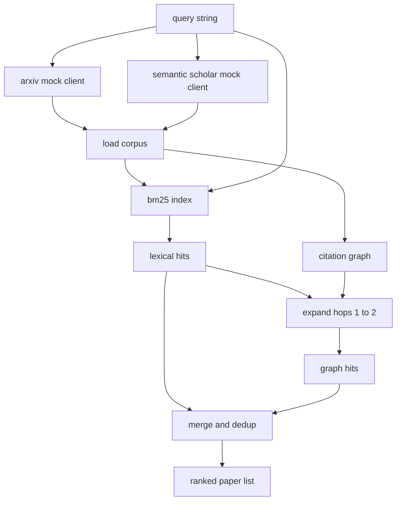

# 문헌 검색(Literature Retrieval)

> 가설(hypothesis)은 값싸다. 누군가 이미 증명했는지 아는 것이 비싼 부분이다. 러너(runner)가 샌드박스(sandbox)를 돌리기 전에 그 질문에 답하는 검색 계층(retrieval layer)을 만들어라.

**Type:** Build
**Languages:** Python
**Prerequisites:** Phase 19 Track A lessons 20-29
**Time:** ~90분

## 학습 목표 (Learning Objectives)
- 루프가 다운스트림에서 읽을 필드를 가진 작은 논문 레코드를 모델링하기.
- 표준 라이브러리(stdlib) 자료 구조만으로 초록(abstract)에 대한 BM25 인덱스 만들기.
- 어휘 검색(lexical search)이 놓친 논문을 드러내기 위해 인용 그래프(citation graph) 순회하기.
- 어휘 패스와 그래프 패스에 걸친 적중(hit)을 안정적인 논문 id로 중복 제거하기.
- 실제 엔드포인트가 안착할 때 업스트림 호출 지점이 그대로 유지되도록 두 모의(mock) 외부 API를 단일 클라이언트 뒤에 감싸기.

## 왜 두 번의 검색 패스인가 (Why two retrieval passes)

초록에 대한 키워드 검색은 쿼리(query)와 어휘를 공유하는 논문을 반환한다. 그것이 표면 대부분을 다룬다. 두 경우를 놓친다. 첫째는 기초 논문이 다른 어휘를 쓸 때다. 예를 들어 "sparse attention"에 대한 쿼리는 "block selection in transformer routing"이라는 제목의 논문을 놓친다. 둘째는 관련 논문이 알려진 닻(anchor)을 인용하는 후속편일 때다. 초록 풀(pool)을 무차별 대입(brute force)하는 것보다 닻을 찾아 앞으로 걷는 것이 더 효율적이다.

레슨은 두 패스를 모두 만든다. 초록에 대한 BM25가 어휘 적중을 잡는다. 인용 그래프 순회가 시드 집합을 한두 홉(hop) 앞뒤로 확장한다. 합집합은 논문 id로 중복 제거되고 작은 결합 점수로 순위 매겨진다.

## Paper 형태 (The Paper shape)

```text
Paper
  id          : str           (stable identifier, "p001" for the mock corpus)
  title       : str
  abstract    : str
  year        : int
  authors     : list[str]
  references  : list[str]     (paper ids this paper cites)
  citations   : list[str]     (paper ids that cite this paper)
  source      : str           (which mock api supplied it, "arxiv" or "s2")
```

references와 citations 필드가 방향성 인용 그래프(directed citation graph)를 이룬다. 두 모의 API는 겹치지만 동일하지 않은 필드를 반환하므로, 코퍼스(corpus) 로더는 `id`로 그것들을 합집합한다.

## 아키텍처 (Architecture)



검색 클라이언트가 두 패스와 병합을 소유한다. 호출자는 쿼리를 건네고, 각 항목이 순위를 설명하는 논문별 점수 필드(`bm25_score`, `graph_distance`, `recency_score`, `final_score`)를 담은 순위 매겨진 목록을 돌려받는다.

## 밑바닥부터 만드는 BM25 (BM25 from scratch)

구현은 기본 파라미터 `k1=1.5`, `b=0.75`를 가진 표준 Okapi BM25다. 인덱스는 두 개의 딕셔너리다. `term -> doc_frequency`와 `term -> list of (doc_id, term_count)`. 문서 길이는 초록의 토큰(token) 수다. 평균 문서 길이는 인덱스 구축 시점에 한 번 계산된다. 쿼리를 채점하는 것은 쿼리 항(term)에 대한 `idf * tf_norm`의 합이며, 여기서 `tf_norm`은 표준 BM25 길이 정규화된 항 빈도(term frequency)다.

토크나이저(tokeniser)는 `lower` 후 비영숫자(non alphanumeric)로 분할한다. 어간 추출(stem)은 하지 않는다. 프로덕션 시스템은 작은 스테머(stemmer)로 교체할 것이다. 인터페이스는 그대로다.

```text
idf(t)      = log((N - df + 0.5) / (df + 0.5) + 1.0)
tf_norm(t)  = (f * (k1 + 1)) / (f + k1 * (1 - b + b * dl / avgdl))
score(d, q) = sum over t in q of idf(t) * tf_norm(t)
```

## 인용 그래프 순회 (Citation graph traversal)

그래프는 코퍼스에서 한 번 구축된다. 순방향 간선(forward edge)은 논문에서 그 참고문헌으로 간다. 역방향 간선(backward edge)은 논문에서 그것을 인용한 것으로 간다. 순회는 상위 BM25 적중으로 시드된 너비 우선 탐색(breadth first search)이며, 두 홉으로 제한된다.

두 홉은 의도적인 천장이다. 한 홉은 너무 얕다. 에이전트는 종종 직계 조상이나 자손을 원한다. 세 홉은 연결된 그래프에서 결과 크기를 폭발시키고 주제를 벗어나 떠도는 경향이 있다. 레슨은 다운스트림 루프가 조일 수 있도록 홉 제한을 설정 손잡이(config knob)로 노출한다.

## 중복 제거와 순위 매기기 (Dedup and ranking)

두 패스는 겹치는 집합을 반환한다. 병합은 논문 id로 키를 만든다. 각 논문에 대해 최종 점수는 가중 혼합이다.

```text
final_score = w_bm25 * bm25_score_norm
            + w_graph * graph_score
            + w_recency * recency_score
```

`bm25_score_norm`은 BM25 점수를 병합된 집합의 최대 BM25 점수로 나눈 것이다(그래서 필드가 0에서 1 사이에 산다). `graph_score`는 직접 어휘 적중에 1, 한 홉에 `0.6`, 두 홉에 `0.3`, 그 외에는 0이다. `recency_score`는 코퍼스 최소 연도에서 0, 최대에서 1인 선형 증가다.

기본 가중치는 `0.5`, `0.3`, `0.2`다. 가중치는 설정이다. 정체된 주제는 최신성(recency)을 낮게 조율할 수 있고 빠르게 움직이는 주제는 그것을 높인다.

## 모의 코퍼스 (Mock corpus)

코퍼스는 `build_corpus()`로 생성된 백 개의 논문이다. 각 논문은 다섯 주제 중 하나에 대해 손으로 쓴 제목과 초록을 가진다. 어텐션 희소성(attention sparsity), 검색 증강(retrieval augmentation), 저차원 어댑터(low rank adapter), 데이터셋 증류(dataset distillation), 평가 하니스(evaluation harness)다. 참고문헌과 인용은 각 주제가 몇 개의 주제 간 간선을 가진 연결된 하위 그래프를 이루도록 연결된다.

두 모의 API 클라이언트(`ArxivMockClient`, `SemanticScholarMockClient`)는 같은 코퍼스에서 읽지만 다른 필드를 노출한다. Arxiv는 제목, 초록, 연도, 저자를 반환한다. Semantic Scholar는 참고문헌과 인용을 더한다. 검색 클라이언트는 id로 합집합한다. 클라이언트 간 필드 불일치 처리는 후속 레슨으로 미뤄진다.

## lessons 52와 53이 읽는 것 (What lessons 52 and 53 read)

lesson 52의 러너는 실험을 위한 컨텍스트로 `paper.id`, `paper.title`, 그리고 초록의 상위 세 문장을 읽는다. lesson 53의 평가기(evaluator)는 베이스라인(baseline)을 특정 논문에 귀속시키기 위해 `paper.year`와 `paper.references`를 읽는다.

검색 클라이언트는 순위 매겨진 목록과 쿼리별 지표(metric) 둘 다를 담은 `RetrievalResult`를 반환한다. 적중 수, 평균 점수, 최고 점수, 총 월 타임(wall time)이다. 러너는 다운스트림 관찰 가능성(observability) 패스가 시간에 따른 품질을 플롯할 수 있도록 이것들을 로깅한다.

## 코드 읽는 법 (How to read the code)

`code/main.py`는 `Paper`, `ArxivMockClient`, `SemanticScholarMockClient`, `BM25Index`, `CitationGraph`, `RetrievalClient`, 그리고 결정론적(deterministic) 데모를 정의한다. 모의 클라이언트와 코퍼스는 레슨이 이식 가능하게(portable) 유지되도록 같은 파일에 있다. BM25 구현은 60줄짜리 한 클래스다. 그래프 순회는 한 메서드다.

`code/tests/test_retrieval.py`는 어휘 경로, 그래프 경로, 병합, 중복 제거, 빈 쿼리를 다룬다.

## 어디에 맞물리는가 (Where this slots in)

lesson 50은 가설을 만든다. lesson 51은 그 가설이 이미 정리되었는지 보기 위해 문헌을 검색한다. lesson 52는 그렇지 않다면 실험을 실행한다. lesson 53은 판정을 쓰기 위해 검색 결과와 실험 지표 둘 다를 읽는다. 검색 클라이언트는 네 단계 중 가장 값싸며 오케스트레이터(orchestrator)에서 가장 먼저 실행된다.
