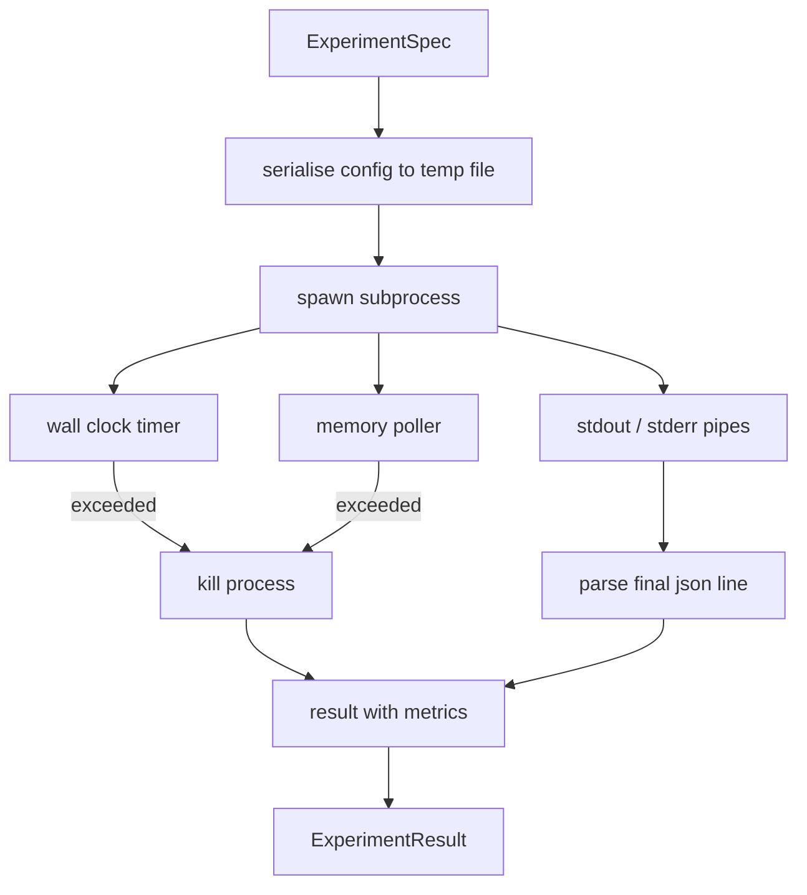

# 실험 러너(Experiment Runner)

> 루프는 그 측정만큼만 정직하다. 명세(spec)를 받아 샌드박스된(sandboxed) 서브프로세스(subprocess)에서 실행하고, 평가기(evaluator)가 신뢰할 수 있는 json 지표(metric) 덩어리를 내보내는 러너(runner)를 만들어라.

**Type:** Build
**Languages:** Python
**Prerequisites:** Phase 19 Track A lessons 20-29
**Time:** ~90분

## 학습 목표 (Learning Objectives)
- 러너가 서브프로세스로 직렬화(serialise)할 수 있는 타입이 지정된 명세로 실험을 인코딩하기.
- 단단한 월클록(wall clock) 타임아웃과 부드러운 메모리 상한(cap)으로 서브프로세스를 실행하고, 둘 다 종료 조건(terminal condition)으로 노출하기.
- stdout, stderr, 그리고 구조화된 지표 덩어리를 단일 결과 레코드로 포착하기.
- 고정된 기본 명세에 대해 한 번에 하나의 설정 손잡이(configuration knob)를 스윕(sweep)하는 절제 표(ablation table) 만들기.
- 평가기가 실행 간 같은 숫자를 보도록 시드(seed)가 주어지면 모든 결과를 결정론적(deterministic)으로 유지하기.

## 왜 서브프로세스인가 (Why a subprocess)

연구 루프는 신뢰할 수 없는 코드를 실행한다. 가설(hypothesis)은 샘플러(sampler)에서 왔고, 실험 스크립트는 같은 경로에서 왔다. 둘 중 하나를 프로세스 내(in-process)에서 안전하다고 취급하면 오케스트레이터(orchestrator)를 무너뜨리는 크래시를 자초한다. 서브프로세스는 언어가 출시하는 가장 단순한 격리(isolation)다. 별도 프로세스, 독립적인 주소 공간, 부모 쪽의 시그널 핸들(signal handle)이다.

여기 러너는 완전한 샌드박싱을 구현하지 않는다. cgroup도, seccomp 필터도, 네임스페이스 재매핑도 없다. 가진 것은 월클록 타임아웃, 메모리 증가를 폴링(polling)하는 루프, 어느 한계에서든 프로세스를 종료하는 kill 경로다. 그것이 더 정교한 모든 샌드박스가 확장하는 런타임 계약이다. 레슨은 계약을 한자리에서 읽을 만큼 작게 유지한다.

## ExperimentSpec 형태 (The ExperimentSpec shape)

```text
ExperimentSpec
  spec_id        : str            (stable id, "exp_001")
  hypothesis_id  : int            (link back to the queue from lesson 50)
  script_path    : str            (path to the python script to run)
  config         : dict           (passed to the script as one json arg)
  seed           : int            (deterministic seed for the experiment)
  wall_timeout_s : float          (hard timeout, killed on exceed)
  memory_cap_mb  : int            (soft cap, polled; killed on exceed)
  metric_keys    : list[str]      (which fields the evaluator will read)
```

스크립트는 디스크에 산다. 러너는 스크립트가 읽는 임시 파일 경로에 설정(config)을 쓴다. 스크립트는 키가 `metric_keys`의 상위 집합(superset)인 단일 json 줄을 stdout에 출력할 것으로 기대된다. stdout의 다른 모든 것은 포착되지만 지표 파서가 무시한다.

## 아키텍처 (Architecture)



러너는 하나의 메인 메서드를 가진 한 클래스다. 폴러(poller)는 폴 간격마다 한 번 깨어나, 가능할 때 proc 파일 시스템에서 서브프로세스의 `psutil` 등가물을 읽고, 플랫폼이 그것을 노출하지 않으면 no-op으로 폴백(fall back)하는 작은 스레드다.

## 왜 부드러운 메모리 상한인가 (Why a soft memory cap)

단단한 메모리 상한은 `resource.setrlimit`이 필요하고 POSIX에서만 작동한다. 레슨은 이식 가능한 접근을 출시한다. 플랫폼에서 상주 집합 크기(resident set size)를 폴링하고 서브프로세스가 상한을 초과하면 종료하는 것이다. 폴러가 0이 아닌 간격을 가지므로 상한은 부드럽다. 프로세스는 폴 사이에 상한 위로 치솟았다가 다시 내려갈 수 있다. 러너는 평가기가 실행이 한계에 얼마나 가까웠는지 볼 수 있도록 관측된 최대 RSS를 기록한다.

프로세스 검사를 지원하지 않는 시스템에서 폴러는 일회성 경고를 로깅하고 스스로를 비활성화한다. 월클록 타임아웃은 여전히 적용된다. 레슨 테스트는 두 경로를 모두 다룬다.

## stdout과 stderr 포착 (Capturing stdout and stderr)

러너는 완료 시 비워진 두 파이프를 모두 읽는다. stdout은 줄 단위로 스캔된다. 필요한 모든 `metric_keys`를 가진 json으로 파싱되는 마지막 줄을 지표 덩어리로 취한다. 이전의 json 줄들은 `intermediate_metrics`로 결과에 보관된다. 평가기는 이것들을 학습 곡선(learning curve)에 사용할 수 있다.

stderr는 결과에 그대로 포착된다. 러너는 0이 아닌 종료 코드(exit code)에서 결코 예외를 일으키지 않는다. 대신 결과에 코드를 기록한다. 스크립트가 지표를 출력했더라도 0이 아닌 모든 종료는 `"crash"`로 레이블링되어, 평가기가 부분 실행을 기본적으로 실패로 취급하게 한다.

## 절제 표 (Ablation table)

```python
def ablate(base: ExperimentSpec, knob: str, values: list[Any]) -> list[ExperimentSpec]:
    ...
```

기본 명세와 손잡이 이름이 주어지면, 헬퍼는 `config[knob]`이 덮어쓰여진 값마다 명세 하나를 반환한다. 각 명세는 파생된 `spec_id`(`f"{base.spec_id}_{knob}_{value}"`)를 받는다. 러너는 그것들을 순서대로 실행하고 손잡이 값을 키로 하는 `AblationTable`을 반환하는 `AblationRunner`를 출시한다.

왜 한 번에 한 손잡이인가. 완전 요인(full factorial) 스윕은 지수적으로 폭발하고 평가기가 해석할 수 없는 결과를 만든다. 한 번에 한 손잡이는 평가기가 플롯할 수 있는 깔끔한 축을 만든다. 레슨은 다중 손잡이 스윕을 호출자가 조합하는 반복된 단일 손잡이 절제로만 지원한다.

## 결정론 (Determinism)

모든 명세는 시드를 담는다. 러너는 설정 dict를 통해 스크립트에 시드를 전달한다(`config["__seed"] = spec.seed`). `code/experiments/`의 모의 실험 스크립트는 시드를 존중하고 실행 간 동일한 지표를 만든다. lesson 53의 평가기가 이것에 의존한다. 결정론 없이는 "회귀(regression)"가 다른 무작위 초기화일 수 있다.

## 모의 실험 스크립트 (The mock experiment script)

레슨은 실험 스크립트 하나를 출시한다. `code/experiments/sparsity_experiment.py`다. 이것은 설정 파일을 읽고, numpy 무작위 패스로 작은 학습 실행을 시뮬레이션하며, json 지표 덩어리를 출력하는 실제 스크립트다. 스크립트는 타임아웃 테스트를 위한 `sleep_s` 손잡이와 메모리 폴러 테스트를 위한 `allocate_mb` 손잡이를 존중한다.

시뮬레이션은 실제로 무언가를 학습하지 않는다. 학습 루프의 형태를 흉내 내는 수치 계산이다. 손실 곡선, 최종 퍼플렉서티(perplexity), 월 타임이다. 레슨의 요점은 시뮬레이션이 아니라 러너다. 실제 실험 스크립트는 모델을 임포트할 것이다.

## 결과 형태 (Result shape)

```text
ExperimentResult
  spec_id              : str
  hypothesis_id        : int
  exit_code            : int
  terminal             : "ok" | "timeout" | "oom" | "crash"
  wall_time_s          : float
  peak_rss_mb          : float | None
  metrics              : dict
  intermediate_metrics : list[dict]
  stdout_tail          : str
  stderr_tail          : str
```

평가기는 `metrics`와 `terminal`을 먼저 읽는다. terminal이 `"ok"` 외의 무엇이든이면 실험은 실패한 실행으로 계산되고 평가기의 판정은 자동이다. 그 외에는 지표가 유의성 검정(significance test)을 통과한다.

## 코드 읽는 법 (How to read the code)

`code/main.py`는 `ExperimentSpec`, `ExperimentResult`, `ExperimentRunner`, `AblationRunner`, 그리고 결정론적 데모를 정의한다. 서브프로세스 관리는 한 클래스다. 메모리 폴러는 작은 스레드다. 절제 헬퍼는 단일 함수다.

`code/experiments/sparsity_experiment.py`는 테스트에 사용되는 모의 실험이다. argv에서 설정 파일 경로를 읽고 완료 시 단일 json 지표 줄을 쓴다.

`code/tests/test_runner.py`는 성공 경로, 타임아웃 경로, 크래시 경로, 절제 표, 그리고 두 실행에 걸친 결정론 검사를 다룬다.

## 어디에 맞물리는가 (Where this slots in)

lesson 50은 가설을 생성한다. lesson 51은 문헌이 이미 정리한 것을 걸러낸다. lesson 52는 남은 것에 대해 실험을 실행한다. lesson 53은 결과를 읽고, 유의성 검정을 실행하며, 오케스트레이터가 가설 id에 대해 저장하는 판정을 쓴다.
