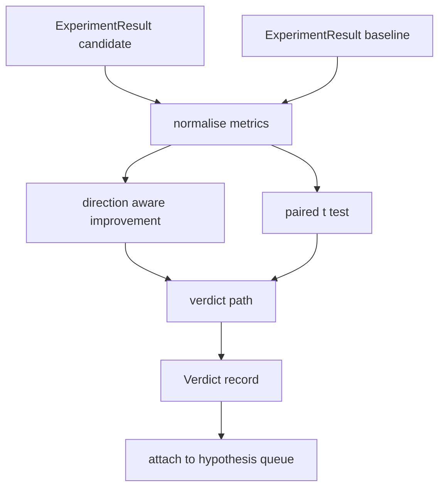

# 결과 평가기(Result Evaluator)

> 러너(runner)는 숫자를 만들었다. 평가기(evaluator)는 그 숫자가 개선(improvement)인지, 회귀(regression)인지, 잡음(noise)인지 결정한다. 지표(metric)를 한 줄 결론으로 바꾸는 판정 경로(verdict path)를 만들어라.

**Type:** Build
**Languages:** Python
**Prerequisites:** Phase 19 Track A lessons 20-29
**Time:** ~90분

## 학습 목표 (Learning Objectives)
- 방향 인식(direction aware) 개선과 고정 임계값(threshold)을 사용해 후보 실행을 베이스라인(baseline)과 비교하기.
- 시드별 지표에 대해 짝지은 t 검정(paired t test)을 밑바닥부터 실행하고 결과 p 값을 읽기.
- 다운스트림 리포트가 선형 지표와 섞을 수 있도록 로그 스케일(log scaled) 지표를 정규화(normalise)하기.
- lesson 50의 큐(queue)에 오케스트레이터(orchestrator)가 붙일 수 있는 가설별 판정을 내보내기.
- 같은 입력이 항상 같은 판정을 만들도록 모든 단계를 순수(pure)하게 유지하기.

## 왜 짝지은 검정인가 (Why a paired test)

러너에서 나온 단일 숫자는 변화가 진짜인지 말해주지 않는다. 다른 시드(seed)를 가진 같은 설정은 다른 퍼플렉서티(perplexity)를 준다. 변화는 잡음일 수 있다. 올바른 비교는 짝지은(paired) 비교다. 같은 데이터를 가진 같은 시드를 후보로 한 번, 베이스라인으로 한 번 실행한다. 각 시드가 차이 하나를 기여한다. 그 차이들의 평균이 효과(effect)다. 그 차이들의 표준 오차(standard error)가 잡음 바닥(noise floor)이다.

레슨은 검정을 밑바닥부터 구현한다. `scipy.stats`는 없다. 수학은 한 화면에서 읽을 만큼 작다.

```text
diffs    = [a_i - b_i for i in seeds]
mean     = sum(diffs) / n
variance = sum((d - mean) ** 2 for d in diffs) / (n - 1)
t_stat   = mean / sqrt(variance / n)
df       = n - 1
p_value  = two_sided_p(t_stat, df)
```

양측 p 값(two sided p value)은 정규화된 불완전 베타 함수(regularised incomplete beta function)를 사용한다. 레슨은 Lentz 연분수(continued fraction)를 사용하는 작은 구현을 출시한다. 전체가 60줄의 표준 라이브러리(stdlib) 수학이다.

## 방향 인식 개선 (Direction aware improvement)

어떤 지표는 올라갈 때 개선된다(정확도, 처리량). 다른 것은 내려갈 때 개선된다(손실, 퍼플렉서티, 월 타임). 평가기는 각 지표에 `direction` 필드를 담는다.

```text
if direction == "higher_is_better":
    improvement = (candidate - baseline) / abs(baseline)
elif direction == "lower_is_better":
    improvement = (baseline - candidate) / abs(baseline)
```

개선은 부호가 있다. 높을수록 좋은 지표에서 음의 개선은 후보가 더 나쁘다는 뜻이다. 판정 경로는 부호와 크기를 함께 읽는다.

평평한 임계값(`improvement_threshold=0.02`, 2퍼센트)은 변화가 부를 만큼 충분히 큰지 결정한다. 그 아래에서는 p 값과 무관하게 판정이 "noise"다. 루프는 사용자가 측정할 수 없는 변화에는 관심이 없다.

## 아키텍처 (Architecture)



평가기는 세 개의 독립적인 계산을 실행하고 판정 경로에서 그것들을 합친다. 각 계산은 공유 상태가 없는 순수 함수다.

## 로그 정규화 (Log normalisation)

퍼플렉서티는 손실에 대해 지수적이다. 손실의 0.1 하락은 퍼플렉서티에서 훨씬 큰 하락이다. 두 설정에 걸쳐 퍼플렉서티를 직접 비교하는 것은 괜찮지만, 단일 리포트에서 선형 지표와 섞으려면 정규화가 필요하다.

레슨은 `scale` 필드가 `"log"`인 지표를, 개선을 계산하기 전에 자연 로그(natural log)를 취해 정규화한다. 임계값은 그러면 로그 공간에서 적용된다. 32에서 28로의 퍼플렉서티 하락은 낮을수록 좋은 지표에서 `log(28) - log(32) = -0.133`인데, 이는 2퍼센트 임계값을 훨씬 넘는다.

```text
if scale == "log":
    a = log(candidate)
    b = log(baseline)
else:
    a = candidate
    b = baseline
```

`scale="linear"`(기본값)인 지표는 변환을 건너뛴다. 같은 코드 경로가 둘 다 처리한다.

## 시드별 짝지은 검정 (Per seed paired test)

lesson 52의 러너는 실행마다 하나의 최종 지표 덩어리를 내보낸다. 짝지은 검정을 위해 평가기는 후보에 대해 시드당 덩어리 하나와 베이스라인에 대해 시드당 하나가 필요하다. 오케스트레이터는 시드 목록에 걸쳐 두 설정 모두에서 같은 실험을 실행하고 평가기에 두 개의 `ExperimentResult` 레코드 목록을 건넨다.

평가기는 시드로 그것들을 짝짓고(시드는 `result.metrics["seed"]`에 산다) 요청된 지표를 순회한다. 두 목록에 걸쳐 시드가 일치하지 않으면 평가기는 `PairingError`를 일으킨다. 오케스트레이터는 다시 실행해야 한다.

## Verdict 형태 (The Verdict shape)

```text
Verdict
  hypothesis_id          : int
  metric                 : str
  direction              : "higher_is_better" | "lower_is_better"
  scale                  : "linear" | "log"
  candidate_mean         : float
  baseline_mean          : float
  improvement            : float       (signed, fraction; see direction rules)
  p_value                : float | None  (None if n < 2)
  significance_threshold : float
  improvement_threshold  : float
  verdict                : "improved" | "regressed" | "noise" | "failed"
  rationale              : str
```

판정 경로는 작은 결정 표(decision table)다.

```text
1. If any candidate result has terminal != "ok": verdict = "failed"
2. else if |improvement| < improvement_threshold:  verdict = "noise"
3. else if p_value is None or p_value > significance: verdict = "noise"
4. else if improvement > 0:                          verdict = "improved"
5. else:                                             verdict = "regressed"
```

Rationale는 오케스트레이터가 가설 id에 대해 로깅할 수 있는 한 줄의 사람이 읽을 수 있는 문장이다.

## 코드 읽는 법 (How to read the code)

`code/main.py`는 `MetricSpec`, `Verdict`, `Evaluator`, t 통계량과 불완전 베타 헬퍼, 그리고 결정론적(deterministic) 데모를 정의한다. t 검정은 순수 표준 라이브러리 수학으로 구현된다. numpy는 지표 목록을 읽고 평균과 분산을 계산하는 데만 쓰인다.

`code/tests/test_evaluator.py`는 개선 경로, 회귀 경로, 잡음 경로(작은 개선), 잡음 경로(낮은 n), 실패 종료 경로, 로그 정규화 경로, 알려진 레퍼런스 값에 대한 t 검정, 그리고 짝짓기 오류를 다룬다.

## 어디에 맞물리는가 (Where this slots in)

lesson 50은 가설 큐를 만들었다. lesson 51은 문헌이 정리한 것을 걸러냈다. lesson 52는 시드에 걸쳐 후보와 베이스라인 설정으로 실험을 실행했다. lesson 53은 그 실행을 읽고 판정을 쓴다. 오케스트레이터는 넷을 함께 꿰맨다.

```text
for hypothesis in queue:
    literature = retrieval.search(hypothesis.text)
    if literature_settles(hypothesis, literature):
        attach(hypothesis, verdict="settled")
        continue
    candidates = runner.run_all(specs_for(hypothesis))
    baselines  = runner.run_all(baseline_specs_for(hypothesis))
    metric_spec = MetricSpec("perplexity", direction=LOWER, scale=LOG)
    verdict = evaluator.evaluate(hypothesis.id, metric_spec, candidates, baselines)
    attach(hypothesis, verdict)
```

그 오케스트레이터는 이 레슨에 없다. 네 레슨은 각각이 정의하는 데이터클래스(dataclass) 외의 어떤 접착제(glue)도 없이 그것으로 조합된다.
