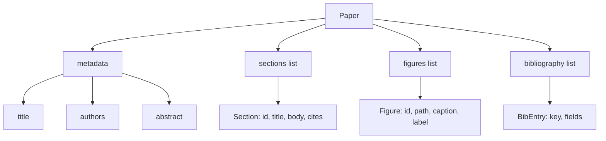
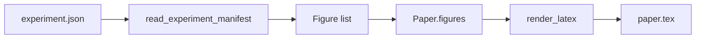
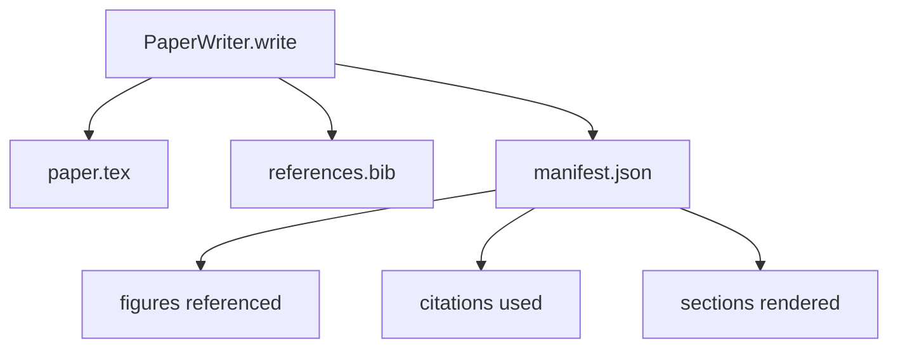

# 논문 작성기(Paper Writer)

> LaTeX 골격(skeleton)은 연구자와 조판기(typesetter) 사이의 계약이다. 계약이 깨지면 문서는 컴파일되지 않고, 그 실패는 큰 소리를 낸다. 골격을 먼저 만들고, 그다음 채워라.

**Type:** Build
**Languages:** Python
**Prerequisites:** Phase 19 lessons 50-53
**Time:** ~90분

## 학습 목표 (Learning Objectives)

- 연구 논문을 자유 형식 문서가 아니라 알려진 섹션 그래프(section graph)를 가진 구조화된 산출물로 취급하기.
- 어떤 산문(prose)이 쓰이기 전에 초록(abstract), 섹션, 그림 슬롯(figure slot), 참고문헌 키(bibliography key)를 선언하는 LaTeX 골격 생성하기.
- 결정론적(deterministic) 슬롯 메커니즘을 통해 실험 출력(경로와 캡션)의 그림을 골격에 주입하기.
- 모델 없이 하니스(harness)가 테스트 가능하도록, 구조화된 개요(outline)에서 각 섹션을 채우는 모의(mocked) 산문 생성기를 연결하기.
- 참조된 모든 그림과 사용된 모든 인용을 나열하는 단일 `paper.tex` 더하기 `references.bib` 더하기 매니페스트(manifest)를 내보내기.

## 왜 골격을 먼저 (Why a skeleton first)

산문으로 시작하는 초안은 구조적 부채(structural debt)를 쌓는다. 서론(introduction)에 관련 연구(related work)에 있어야 할 세 문단이 자란다. 그림이 정의되기 전에 참조된다. 참고문헌은 같은 논문에 대해 세 개의 키로 끝난다. 저자가 알아챌 때쯤이면 다시 쓰는 비용이 쓰는 비용보다 높다.

골격은 그것을 뒤집는다. 구조는 데이터로 미리 선언된다. 섹션은 이름과 순서를 가진 슬롯이다. 그림은 id와 캡션을 가진 슬롯이다. 참고문헌 키는 그것이 가리키는 항목과 함께 상단에 선언된다. 산문은 한 번에 하나씩 그 슬롯에 생성된다. 하니스는 어떤 산문이 쓰이기 전에, 모든 그림이 슬롯을 가지고, 모든 인용이 항목을 가지며, 모든 섹션이 목차(table of contents)에 나타나는지 검증할 수 있다.

이것은 앞선 레슨이 계획, 도구 호출(tool call), 트레이스(trace)에 적용한 것과 같은 규율이다. 구조가 계약이다.

## Paper 형태 (The Paper shape)

모든 필드는 평범한 Python 데이터다. 렌더러(renderer)는 `Paper`에서 LaTeX 문자열로 가는 순수 함수다. 하니스는 렌더링 전에 논문을 내성(introspect)할 수 있다. 섹션을 세고, 누락된 그림 파일을 나열하고, 모든 `\cite{key}`가 일치하는 `BibEntry`를 가지는지 검사한다.

## 렌더 계약 (The render contract)

렌더러는 세 가지 속성을 보장한다. 첫째, 골격의 모든 그림 슬롯은 `fig:<id>` 형태의 안정적 라벨을 가진 `\begin{figure}` 블록을 내보낸다. 둘째, 모든 섹션은 상호 참조(cross-reference)가 작동하도록 `sec:<id>` 형태의 안정적 라벨을 가진 `\section{}`을 내보낸다. 셋째, 참고문헌은 `references.bib`가 논문에 선언된 항목을 정확히, 더도 덜도 아니게 담는 `\bibliography` 블록을 내보낸다.

이 중 어느 것이라도 위반하는 것은 경고가 아니라 렌더 오류다. 골격이 계약이다. 그림을 조용히 떨어뜨리는 렌더는 계약 위반이다.

## 실험으로부터의 그림 주입 (Figure injection from experiments)

이 트랙의 앞선 레슨들은 실험 출력을 JSON 매니페스트로 만들었다. 각 매니페스트는 경로와 짧은 캡션을 가진 산출물 목록을 담는다. 논문 작성기는 그 매니페스트를 읽고 `Figure` 레코드를 만든다.

주입은 결정론적이다. 그림 id는 실험 이름 더하기 단조 카운터(monotonic counter)에서 파생된다. 캡션은 매니페스트에서 온다. 경로는 논문의 출력 디렉터리에 상대적으로 정규화되어, 실험 출력이 디스크의 다른 곳에 있더라도 LaTeX가 컴파일된다.

## 모의 산문 생성기 (The mocked prose generator)

레슨은 모델을 호출하지 않는다. `MockProseGenerator`는 개요 형태를 읽고 산문을 결정론적으로 내보낸다. 개요 형태는 섹션당 짧은 문자열 하나다. 생성기는 그 문자열을 섹션 제목이 엮인 두 개의 짧은 문단으로 확장한다. 생성된 산문은 개요가 그것들을 선언할 때 정확히 그림과 인용을 거명한다.

이것은 작성기의 모든 동작을 테스트하기에 충분하다. 실제 구현은 생성기를 모델 호출로 교체할 것이다. 그 주변의 하니스는 바뀌지 않는다. 그것이 산문 생성기를 호출 가능(callable)으로 선언하는 가치다. 테스트는 결정론적인 것을 대입하고, 프로덕션은 모델인 것을 대입하며, 파이프라인의 나머지는 동일하다.

## 매니페스트 출력 (The manifest output)

작성기는 출력 디렉터리에 세 파일을 내보낸다.

매니페스트는 다운스트림 평가기나 비평 루프(critic loop)가 읽는 것이다. 그것은 LaTeX를 파싱하지 않는다. 매니페스트를 읽는다. 다음 레슨인 비평 루프는 이 매니페스트를 입력으로 받아 피드백 목록을 만든다. 그것이 매니페스트가 계약의 일부이고 LaTeX는 아닌 이유다.

## 검증 게이트 (Validation gates)

작성기는 어떤 파일을 쓰기 전에 네 개의 게이트(gate)를 실행한다.

1. 모든 그림 id는 논문 안에서 고유하다.
2. 모든 섹션의 `cites` 필드는 논문에 선언된 참고문헌 키를 참조한다.
3. 초록은 비어 있지 않다.
4. 제목은 비어 있지 않다.

실패한 게이트는 정확한 이유와 함께 `PaperValidationError`를 일으킨다. 하니스는 그 이유를 실패 모드로 노출한다. 부분 쓰기는 없다. 세 파일 모두 내보내지거나, 아무것도 내보내지지 않는다.

## 코드 읽는 법 (How to read the code)

`code/main.py`는 `Paper`, `Section`, `Figure`, `BibEntry`, `PaperValidationError`, `MockProseGenerator`, `PaperWriter`, 그리고 `render_latex` 함수를 정의한다. `write` 메서드는 출력 디렉터리를 받아 `paper.tex`, `references.bib`, `manifest.json`을 내보낸다. `read_experiment_manifest` 헬퍼는 실험 매니페스트 목록을 `Figure` 레코드로 변환한다.

`code/tests/test_paper_writer.py`는 다음을 다룬다. 섹션 없는 골격 렌더, 두 섹션과 두 그림이 있는 전체 렌더, 누락 인용 게이트, 중복 그림 id 게이트, 매니페스트 내용, 그리고 LaTeX 문자열 계약(모든 섹션이 `\section{}`을 내보내고, 모든 그림이 `\begin{figure}`를 내보냄)이다.

## 더 나아가기 (Going further)

실제 구현이 원할 두 가지 확장. 첫째, 다중 형식 렌더(multi-format render): 같은 `Paper` 형태가 블로그 글을 위한 Markdown과 미리보기를 위한 HTML로 컴파일된다. 렌더러는 `Paper`에 대한 전략(strategy)이 된다. 둘째, 인용 보강(citation enrichment): 작성기가 DOI의 로컬 캐시가 주어지면 인용 키에서 BibTeX 항목을 가져온다. 둘 다 가치를 더하고, 둘 다 골격 계약을 건드리지 않고 추가될 수 있다.

골격이 베팅(bet)이다. 데이터로 선언된 섹션, 그림, 인용, 슬롯에 생성된 산문, LaTeX와 나란히 내보내진 매니페스트다. 다른 모든 개선은 그 위에 조합된다.
