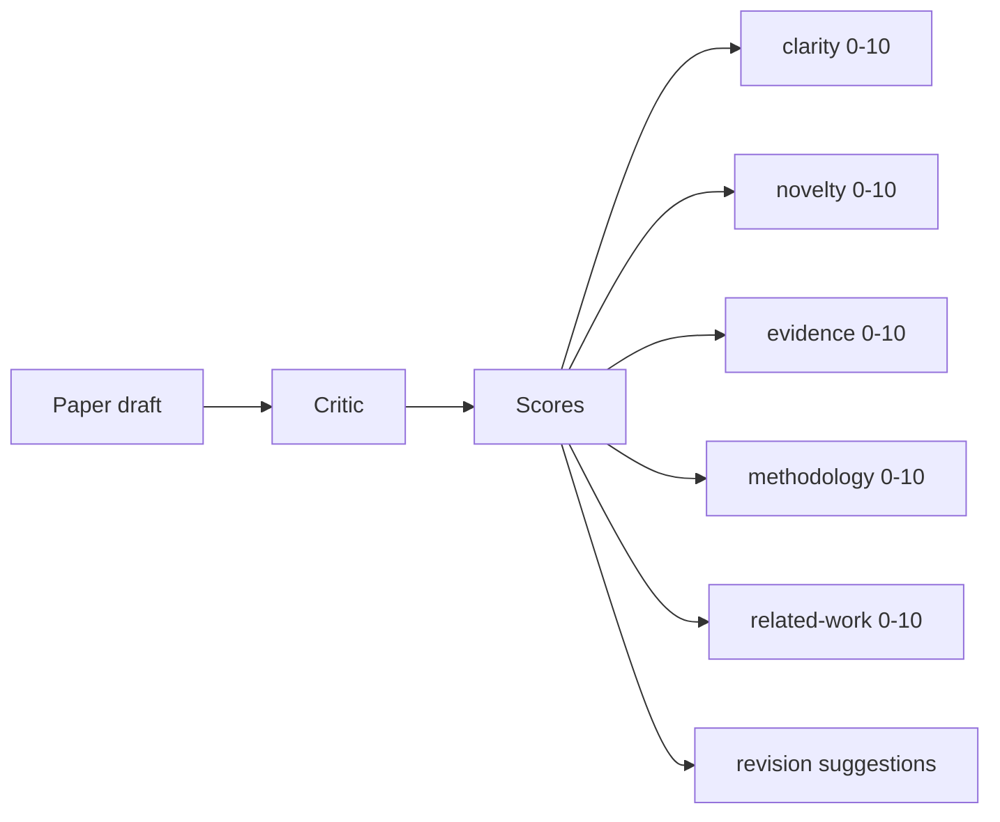
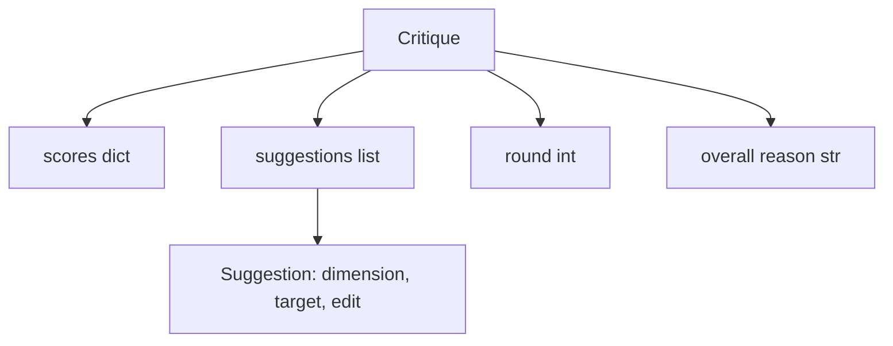
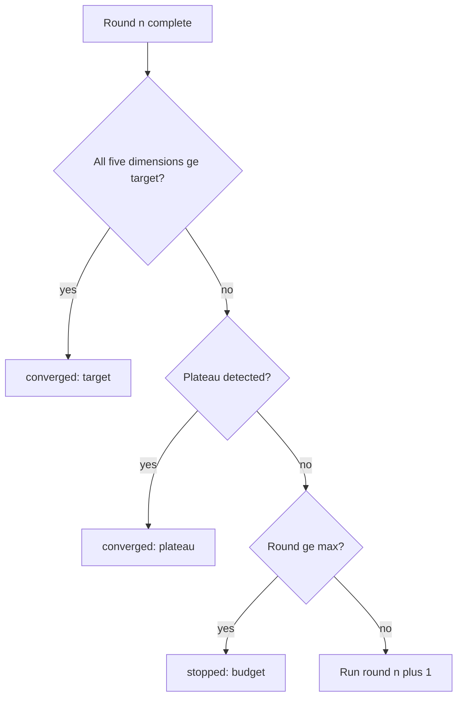
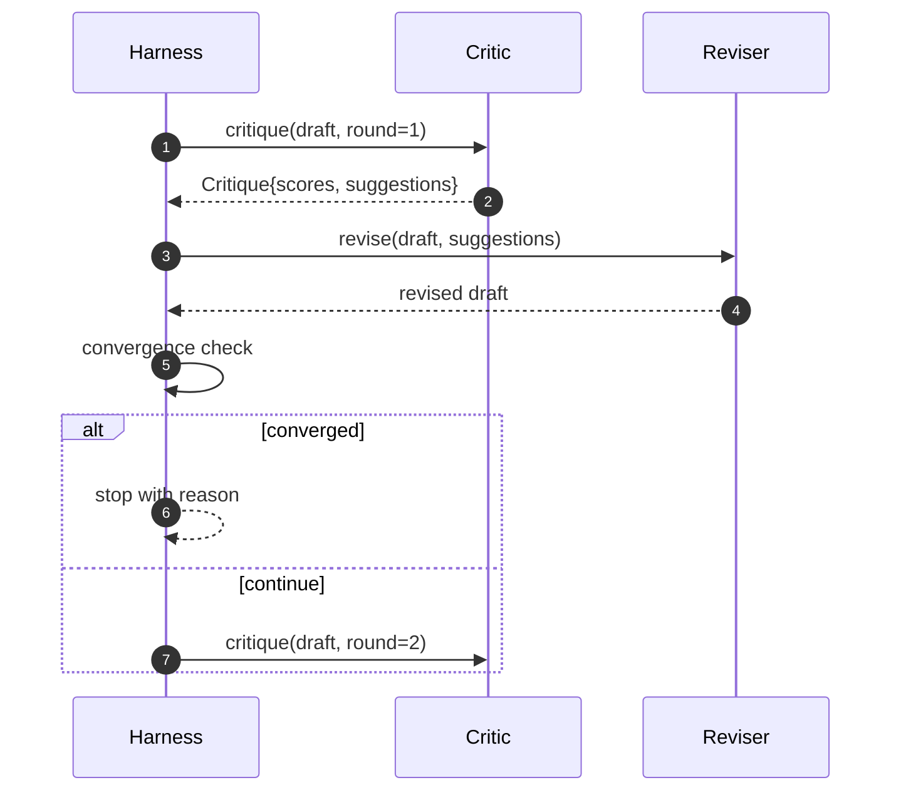

# 비평 루프(Critic Loop)

> 처음부터 "괜찮아 보임"을 반환하는 비평가(critic)는 망가졌다. 항상 "손볼 게 있음"을 반환하는 비평가도 망가졌다. 흥미로운 비평가는 수렴(converge)하는 것이며, 당신은 수렴을 설계(engineer)해야 한다.

**Type:** Build
**Languages:** Python
**Prerequisites:** Phase 19 lessons 50-53
**Time:** ~90분

## 학습 목표 (Learning Objectives)

- 논문 초안을 다섯 가지 고정 차원에 걸쳐 채점하기: 명료성(clarity), 참신성(novelty), 증거(evidence), 방법론(methodology), 관련 연구(related-work).
- 각 라운드의 비평을 자유 형식 재작성이 아니라 구조화된 수정 차이(revision diff)로 적용하기.
- 라운드 간 점수를 비교해 수렴을 탐지하기. 정체(plateau), 목표 달성, 또는 예산 소진 시 멈추기.
- 수렴하지 않는 비평가가 영원히 실행되지 않도록 최대 반복(max-iteration) 예산으로 라운드를 한정하기.
- 대시보드나 다음 단계가 점수 궤적(score trajectory)을 렌더링할 수 있도록 라운드별 트레이스(trace)를 내보내기.

## 왜 다섯 가지 고정 차원인가 (Why five fixed dimensions)

자유 형식 비평가는 제안 한 문단을 반환하는 모델이다. 다음 라운드의 수정은 그 문단을 주변 컨텍스트(ambient context)로 취급한다. 재작성이 비평을 다루는지는 검증 불가능한데, 비평이 결코 구조를 가진 적이 없기 때문이다.

다섯 차원은 하니스(harness)에 계약을 준다.



점수는 벡터(vector)다. 하니스는 라운드에 걸쳐 각 차원을 지켜본다. 명료성을 올리지만 증거를 떨어뜨리는 수정은 증거에서의 회귀(regression)이며, 수렴 검사가 그것을 본다. 모델만의 비평가는 그 보장을 제공할 수 없다.

## Critique 형태 (The Critique shape)



모든 제안은 그것이 개선하는 차원, 그것이 겨냥하는 섹션, 그리고 수정자(reviser)가 적용할 수 있는 `edit` 지시를 담는다. 수정자도 호출 가능(callable)이다. 레슨은 edit 지시를 섹션에-덧붙이기(append-to-section) 연산으로 해석하는 결정론적(deterministic) 수정자를 출시한다. 모델 구동 수정자는 같은 필드를 프롬프트(prompt)로 해석할 것이다. 계약은 바뀌지 않는다.

## 순서대로의 수렴 규칙 (Convergence rules, in order)

비평 루프는 세 조건 중 어느 하나라도 발동하면 종료된다.



목표(target)는 가장 엄격한 경우다. 다섯 차원(clarity, novelty, evidence, methodology, related_work) 각각이 루프가 성공을 반환하기 전에 `>= target_score`(기본값 `8.0`)에 도달해야 한다. 한 약한 차원을 가진 높은 평균으로는 충분하지 않다. 정체 탐지는 현재 라운드의 평균을 이전 라운드의 평균과 비교한다. 개선이 두 연속 라운드 동안 `plateau_epsilon`(기본값 `0.1`) 아래면 루프는 `plateau`로 종료한다. 예산(budget)은 라운드에 대한 단단한 상한(기본값 `5`)이며 `budget`으로 종료한다.

순서가 중요하다. 목표가 정체를 이기고 정체가 예산을 이긴다. 라운드 3이 정체도 트리거할 같은 반복에서 목표에 도달하면 결과는 `plateau`가 아니라 `target`이다.

## 왜 정체 탐지가 두 라운드에 걸쳐 실행되는가 (Why plateau detection runs over two rounds)

한 라운드 정체는 잡음이다. 실제 비평가는 고정된 초안에서도 반복마다 약간 다른 점수를 반환하는데, 결정론적 채점이 여전히 어떤 제안이 어떤 순서로 적용되었는지에 의존하기 때문이다. 두 연속 정체 라운드를 요구하는 것은 그 잡음을 걸러낸다. 하니스가 정체를 보고하면 초안은 진짜로 개선을 멈춘 것이다.

## 이 레슨의 결정론적 비평가 (The deterministic critic in this lesson)

레슨은 모델을 호출하지 않는다. 출시된 비평가는 세 신호에 기반해 초안을 채점하는 호출 가능한 것이다. 평균 섹션 본문 길이(명료성), 그림 수와 인용 수(증거), 그리고 논문 메타데이터의 `originality_tag` 필드(참신성)다. 수정자는 각 점수를 위로 미는 법을 안다.

```text
clarity      grows when the average section body length increases
novelty      grows when originality_tag is set to "high"
evidence     grows when a section's figure_refs is non-empty
methodology  grows when a section titled "Method" exists with body
related-work grows when a section titled "Related Work" exists with body
```

수정자는 각 제안을 겨냥된 덧붙이기로 해석한다. 라운드 1 이후 하니스는 점수가 올라가는 것을 관찰할 수 있다. 테스트는 이 속성을 사용해 루프가 격차(gap)를 줄인다고 단언한다.

## 전체 루프 계약 (The full loop contract)



하니스는 라운드 카운터, 트레이스, 수렴 검사를 소유한다. 비평가는 점수를 소유한다. 수정자는 차이를 소유한다. 셋 중 누구도 다른 것의 상태를 건드리지 않는다.

## Trace 출력 (The Trace output)

모든 라운드는 라운드 번호, 점수 벡터, 제안 수, 수렴 판정을 가진 하나의 트레이스 이벤트를 내보낸다. 전체 트레이스는 최종 초안과 함께 반환된다. 다운스트림 대시보드는 라운드별 점수 차트를 렌더링할 수 있다. 다음 레슨인 반복 스케줄러(iteration scheduler)는 트레이스를 읽어 그 가지(branch)가 유지할 가치가 있는지 결정한다.

## 나쁜 비평가로부터 보호하는 예산 (Budgets that protect against bad critics)

점수를 결코 개선하지 않는 제안을 만드는 비평가는 루프를 최대 반복 천장에 가둔다. 트레이스는 그것을 보이게 한다. 다섯 라운드, 점수 평평, 판정 `budget`. 사용자는 그것을 초안 버그가 아니라 비평가 버그로 읽는다. 대안인 최종 초안만 노출하는 것은 진단을 숨긴다. 트레이스 우선 설계(trace-first design)가 그것을 노출한다.

## 코드 읽는 법 (How to read the code)

`code/main.py`는 `Critique`, `Suggestion`, `Critic` 프로토콜, `Reviser` 프로토콜, `CriticLoop`, 그리고 결정론적 비평가와 일치하는 수정자를 반환하는 `make_deterministic_critic_pair` 팩토리(factory)를 정의한다. 레슨이 독립적으로 성립하도록 최소 `Paper` 형태가 포함된다.

`code/tests/test_critic_loop.py`는 다음을 다룬다. 라운드 1 이후 단조 개선(monotone improvement), 조율된 초안에서의 목표 수렴, 두 평평한 라운드 후 정체 탐지, 어떤 제안도 개선하지 않을 때 예산 소진, 수정자에 의한 제안 적용, 그리고 트레이스 형태다.

## 더 나아가기 (Going further)

실제 구현이 원할 두 가지 확장. 첫째, 차원 가중치(dimension weights): 워크숍용 논문은 방법론보다 참신성을 더 높게 가중하고, 저널은 반대를 가중한다. 수렴 검사는 가중 평균(weighted mean)이 된다. 둘째, 짝지은 비평가(paired critics): 한 비평가가 채점하고, 두 번째 비평가가 수정자가 보기 전에 제안을 판결한다. 둘 다 가치를 더하고, 둘 다 같은 `Critique` 형태에 조합된다.

베팅은 점수 벡터다. 일단 비평이 구조화되면 다른 모든 개선, 수렴 규칙, 대시보드, 짝지은 비평가는 루프를 바꾸지 않고 끼워진다.
