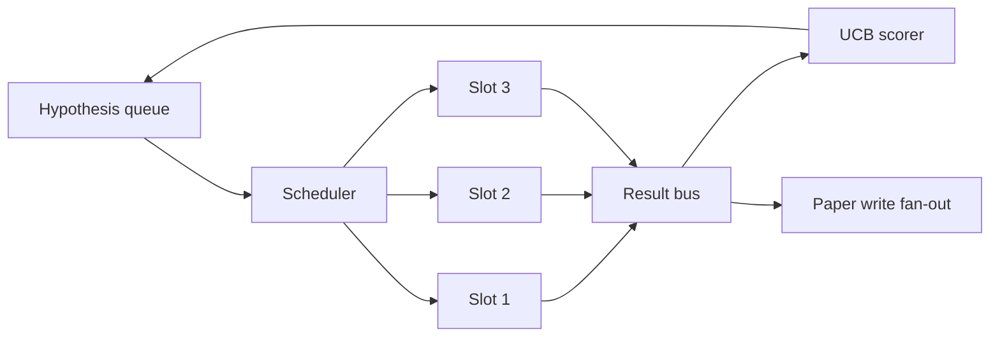
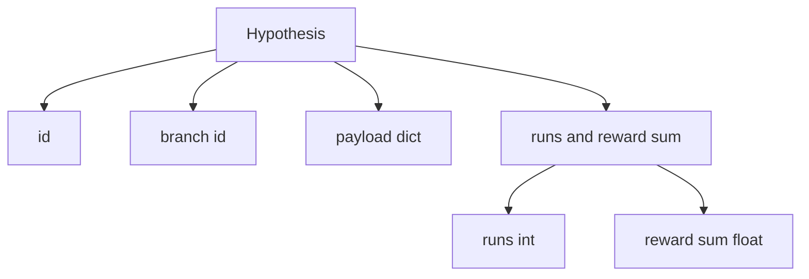
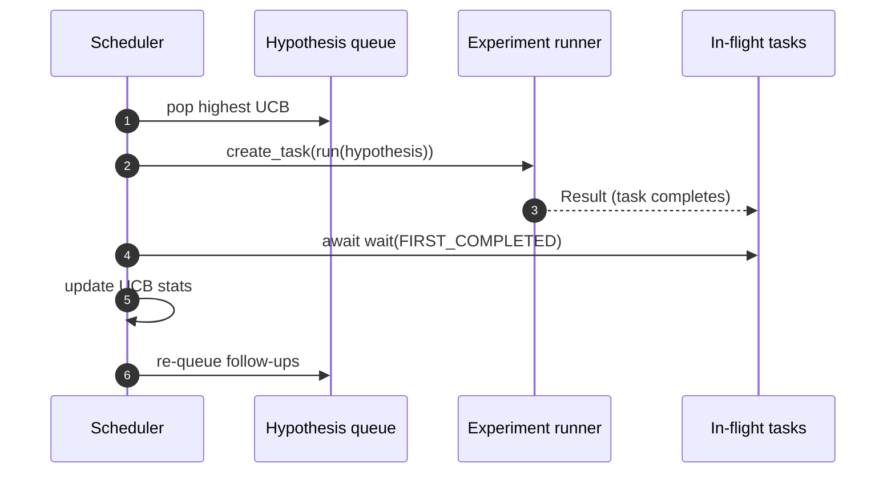

# 반복 스케줄러(Iteration Scheduler)

> 스케줄러(scheduler) 없는 연구 루프는 망상을 가진 큐(queue)다. 스케줄러는 루프가 무엇을 탐색하기를 멈출지 결정하는 곳이며, 그 결정이 전부다.

**Type:** Build
**Languages:** Python
**Prerequisites:** Phase 19 lessons 50-53
**Time:** ~90분

## 학습 목표 (Learning Objectives)

- 연구 워크플로(workflow)를, 결과가 다시 모여드는 병렬 실험 슬롯(slot)에 공급하는 가설 큐(hypothesis queue)로 모델링하기.
- 스케줄러가 모든 슬롯을 바쁘게 유지할 수 있도록 asyncio로 여러 실험을 동시에 실행하기.
- 스케줄러가 탐색(exploration)을 포기하지 않고 저수율(low-yield) 가지를 가지치기할 수 있도록 UCB로 각 가설 가지(branch)를 채점하기.
- 고수율(high-yield) 가지가 후속 가설을 낳도록, 완료된 결과를 논문 작성 단계와 재큐(re-queue) 단계로 팬아웃(fan out)하기.
- 가지 점수, 슬롯 점유(slot occupancy), 가지치기(pruning) 결정을 가진 반복별 트레이스(trace)를 노출하기.

## 왜 작업 목록이 아니라 스케줄러인가 (Why a scheduler, not a worklist)

평평한 작업 목록(worklist)은 제출 순서로 작업을 실행한다. 각 작업이 독립적일 때는 괜찮다. 연구는 독립적이지 않다. 실험 3의 발견이 실험 4와 5의 우선순위를 바꾼다. 결과 팬인(fan-in)을 읽고 큐를 재정렬하는 스케줄러는 계산 단위당 더 쓸모 있는 작업을 해낸다.

흥미로운 설계 선택은 채점 규칙이다. 탐욕적(greedy) 채점기는 항상 현재 선두를 고르고 결코 탐색하지 않는다. 균등(uniform) 채점기는 결코 활용(exploit)하지 않는다. UCB(upper confidence bound, 상한 신뢰 구간)는 중간 길이다. 선두를 활용하면서 덜 시도된 가지를 위해 용량을 예약한다.

## 시스템 형태 (The system shape)



큐는 가설을 보유한다. 스케줄러는 슬롯이 비면 가장 높은 UCB의 가설을 고른다. 각 슬롯은 실험을 비동기적으로 실행한다. 완료된 실험은 결과를 버스(bus)로 팬한다. 버스는 출발 가지의 UCB 통계를 갱신하고 가지의 수율이 임계값(threshold)을 넘으면 논문 작성 단계로 팬아웃한다.

## Hypothesis 형태 (The Hypothesis shape)



`branch`는 UCB 통계의 키다. 여러 가설이 가지를 공유할 수 있다(가지는 연구 방향이고, 가설은 그 안의 한 시도다). `runs`는 그 가지에 대한 완료된 실험의 수이고, `reward_sum`은 누적 보상(cumulative reward)이다. UCB는 둘 다 읽는다.

## UCB 채점 (UCB scoring)

이 레슨에서 사용되는 UCB 공식은 고전적인 UCB1이다.

```text
ucb(branch) = mean_reward(branch) + c * sqrt( ln(total_runs) / runs(branch) )
```

`total_runs`는 모든 가지에 걸쳐 완료된 모든 실험의 수다. `c`는 탐색 가중치(exploration weight)다. 레슨은 `sqrt(2)`를 기본값으로 한다. 0회 실행 가지는 `+inf`를 받아 시도되지 않은 가지가 항상 먼저 스케줄링된다. 높은 평균 보상을 가진 가지는 다른 가지가 따라잡을 때까지 높은 점수를 유지한다. 많이 실행되지만 보상이 별로 없는 가지는 덜 실행된 대안에 의해 가려진다.

가지치기 게이트(pruning gate)는 선택기(picker)와 별개다. 가지치기는 적어도 `prune_after_runs`(기본값 `3`)회 시도 후 평균 보상이 절대 바닥(absolute floor, 기본값 `0.2`) 아래로 떨어지면 미래 스케줄링에서 가지를 제거한다. 이것이 큐를 유한하게 유지한다.

## asyncio를 사용한 병렬 슬롯 (Parallel slots with asyncio)

스케줄러는 `asyncio.create_task`로 실험을 구동한다. 각 태스크는 `Result`를 반환하는 실험 러너(`async def` 호출 가능)를 실행한다. 메인 루프는 `asyncio.wait(..., return_when=asyncio.FIRST_COMPLETED)`로 진행 중인 태스크 집합을 기다리고 각 완료 시 채점 갱신을 발사한다.



세 슬롯이 동시에 실행된다. 메인 루프는 단일 실험에서 결코 막히지 않는다. 스케줄러는 슬롯이 비는 즉시 새 태스크를 계속 시작하며, 큐가 비고 진행 중인 태스크가 없을 때까지 한다.

## 팬아웃: 논문 트리거 (Fan-out: paper triggers)

가지의 평균 보상이 `paper_threshold`(기본값 `0.7`)를 넘고 그 가지가 아직 논문을 만들지 않았으면, 스케줄러는 `paper.trigger` 이벤트를 출력 목록으로 팬한다. 다운스트림에서 lesson 54의 논문 작성기가 이것을 집어들 것이다. 이 레슨에서 트리거는 테스트가 단언할 수 있도록 목록으로 포착된다.

## 팬아웃: 후속 가설 (Fan-out: follow-up hypotheses)

고수율 결과가 안착하면 스케줄러는 사용자가 제공한 `expander`를 호출해 같은 가지에 하나 이상의 후속 가설을 만들 수 있다. expander는 `Result`에서 `list[Hypothesis]`로 가는 순수 함수다. 레슨은 보상이 논문 임계값을 초과하는 어떤 결과에 대해서든 두 개의 후속을 만드는 결정론적 expander를 출시한다.

## 예산 (Budgets)

두 예산이 스케줄러를 폭주 루프로부터 보호한다.

```text
max_experiments    : total count of experiments run across all branches
max_seconds        : wall-clock cap (asyncio time)
```

어느 하나라도 발동하면 스케줄러는 새 태스크 스케줄링을 멈추고, 진행 중인 것을 기다리며, 최종 트레이스를 반환한다. 트레이스는 `stop_reason`을 포함한다.

## Trace와 최종 리포트 (The Trace and final report)

각 스케줄링 결정(pick, dispatch, result, prune, fan-out)은 하나의 이벤트를 내보낸다. 최종 리포트는 가지별 통계, 총 실행 수, 총 월클록(wall-clock), 그리고 발사된 논문 트리거를 요약한다. 다음 레슨인 엔드 투 엔드 데모(end-to-end demo)는 논문 작성기를 구동하기 위해 이 리포트를 읽는다.

## 코드 읽는 법 (How to read the code)

`code/main.py`는 `Hypothesis`, `Result`, `BranchStats`, `IterationScheduler`, 그리고 예측 가능한 보상을 가진 asyncio 실험 러너를 반환하는 `make_deterministic_runner` 팩토리를 정의한다. 러너는 동시성(concurrency)이 관찰 가능하도록 고정된 `delay_ms`(기본값 `5ms`) 동안 잠든다.

`code/tests/test_scheduler.py`는 다음을 다룬다. UCB가 시도되지 않은 가지를 먼저 고름, 병렬 슬롯 점유, 임계값을 넘을 때 논문 트리거, 저수율 시도 후 가지 가지치기, 팬아웃 후속 가설, 그리고 예산 종료(실험 수와 월클록 둘 다)다.

## 더 나아가기 (Going further)

실제 구현이 원할 세 가지 확장. 첫째, 세션 간 영속적 UCB 통계: 현재 통계는 메모리에 산다. 실제 스케줄러는 재시작이 이미 쓴 탐색 예산을 보존하도록 그것들을 체크포인트할 것이다. 둘째, 다중 목표 채점(multi-objective scoring): 스칼라 보상 대신 각 결과가 벡터를 내보내고 UCB가 파레토 스타일(Pareto-style) 선택기가 된다. 셋째, 맥락 밴딧(contextual bandits): 선택기가 가설 특성(길이, 복잡도)에 조건을 걸어 유사한 가설이 탐색을 공유한다.

스케줄러는 연구가 작업 목록 이상이 되는 곳이다. 일단 UCB가 연결되고 슬롯이 병렬로 실행되면, 다른 모든 개선은 그 위에 조합된다.
