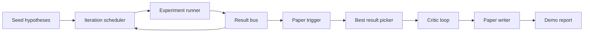
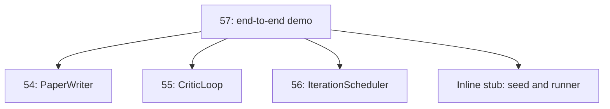
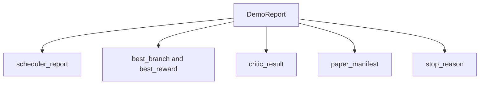

# 엔드 투 엔드 연구 데모(End-to-End Research Demo)

> 데모는 당신이 앞서 작성한 모든 계약이 조합되어야 하는 곳이다. 그중 하나라도 새면, 데모가 그것을 잡아내는 레슨이다.

**Type:** Build
**Languages:** Python
**Prerequisites:** Phase 19 lessons 50-53
**Time:** ~90분

## 학습 목표 (Learning Objectives)

- 자동 연구 루프를 처음부터 끝까지 연결하기: 가설 시드(hypothesis seed), 실험 러너(experiment runner), 스케줄러(scheduler), 비평 루프(critic loop), 논문 작성기(paper writer).
- 앞선 네 개의 Track D 레슨의 프리미티브(primitive)를 프레임워크가 아니라 평범한 Python 임포트(import)를 통해 조합하기.
- 루프를 자기 종료(self-terminating) 끝까지 실행하고 모든 단계의 출력을 나열하는 단일 데모 리포트를 내보내기.
- 테스트 스위트(test suite)가 최종 형태를 단언할 수 있도록 데모를 결정론적(deterministic)으로 유지하기.
- 어떤 단계의 계약이 깨질 때 명확한 실패 모드를 노출하여, 다음 단계가 깨진 입력으로 실행되지 않게 하기.

## 여기서 조합되는 것 (What composes here)



다섯 단계. 시드는 세 가설의 목록이다. 스케줄러는 세 병렬 슬롯으로 그것들에 걸쳐 여섯 실험을 실행한다. 버스(bus)는 하나 이상의 논문 트리거를 보고한다. 선택기(picker)는 단일 최선의 결과를 선택한다. 비평 루프는 그 결과로부터 만들어진 초안을 반복한다. 논문 작성기는 최종 LaTeX, BibTeX, 매니페스트(manifest)를 내보낸다.

## 왜 복사가 아니라 임포트인가 (Why import, not copy)

각 앞선 레슨은 공개 데이터클래스(dataclass)와 함수를 가진 `main.py`를 출시한다. 데모는 각 레슨의 부모 디렉터리로 `sys.path`를 조정하여 그것들을 임포트한다. 이것은 프레임워크 배선이 아니다. 앞선 레슨의 테스트 파일이 이미 사용하는 것과 같은 임포트다.



인라인 스텁(inline stub)은 lessons 50부터 53을 대신한다. 시드 가설의 작은 생성기와 동기적(synchronous) 보상 함수다. 사용자는 두 임포트를 조정하여 인라인 스텁을 그 레슨들의 실제 프리미티브로 교체할 수 있다.

## 결정론 보장 (Determinism guarantees)

데모는 구성상 결정론적이다. 실험 러너는 시드된 numpy다. 비평 루프의 수정자(reviser)는 고정된 순서로 고정된 차원을 순회한다. 논문 작성기의 산문(prose) 생성기는 lesson 54의 모의(mocked)된 것이다. 스케줄러의 UCB 선택기는 무작위 선택이 아니라 반복 순서로 동점을 깬다.

같은 시드가 주어지면 데모는 같은 리포트를 내보낸다. 테스트는 데모를 두 번 실행하고 매니페스트를 비교하여 이 속성을 단언한다.

## 데모 리포트 형태 (The demo report shape)



각 필드는 업스트림 단계에서 그대로 온다. 데모는 어떤 출력도 변환하지 않는다. 그것들을 조합한다. 그것이 데모가 하는 테스트다.

## 실패 모드 처리 (Failure mode handling)

각 단계는 성공하거나 타입이 지정된 오류를 일으킨다.

```text
Scheduler ........ returns SchedulerReport with stop_reason
                   in {queue_empty, max_experiments, deadline}
Best-result pick . raises NoTriggerError if no paper trigger fired
Critic loop ...... returns LoopResult with status converged or stopped
Paper writer ..... raises PaperValidationError on contract break
```

어떤 단계에서의 실패는 타입이 지정된 예외로 데모를 단락(short-circuit)시킨다. 테스트는 이 계약을 고정한다. `test_no_triggers_raises_typed_error`와 `test_best_picker_raises_when_no_triggers`는 어떤 가지도 트리거를 발사하지 않을 때 선택기가 `NoTriggerError` / `BestResultError`를 일으키고, 작성기가 결코 호출되지 않음을 단언한다.

## 최선 결과 선택기 (The best-result picker)

스케줄러는 가지별 논문 트리거를 내보낸다. 선택기는 모든 트리거에 걸쳐 가장 높은 평균 보상을 가진 가지를 선택한다. 동점은 데모가 결정론적이도록 가지 id로 알파벳순으로 깨진다. 선택기는 작은 순수 함수다. 테스트는 고정된 스케줄러 리포트에 그것을 고정한다.

## 비평 루프 배선 (Wiring the critic loop)

lesson 55의 비평 루프는 `MiniPaper`에 대해 동작한다. 데모는 선택된 가지로부터 `MiniPaper`를 만드는데, 초록(abstract)을 가지 id로 채우고, 두 섹션(Introduction과 Results)을 시드하며, `originality_tag`를 가지의 평균 보상으로 설정한다(`>= 0.8`이면 high, `>= 0.6`이면 medium, 그 외에는 low).

그다음 수정자는 초안을 수렴(convergence)까지 반복한다. 출력은 논문 작성기로 들어간다.

## 논문 작성기 배선 (Wiring the paper writer)

lesson 54의 논문 작성기는 그림과 참고문헌을 가진 전체 `Paper` 형태에 대해 동작한다. 데모는 `mini_to_full_paper`를 통해 수렴된 `MiniPaper`를 업그레이드하는데, 선택된 가지에 대한 그림 하나와 비평가가 제안한 인용 키의 합집합에서 만들어진 작은 합성 참고문헌을 붙인다. 데모가 추가하는 모든 인용은 참고문헌 목록에도 추가되므로 검증이 통과한다.

## 코드 읽는 법 (How to read the code)

`code/main.py`는 `BestResultError`, `NoTriggerError`, `DemoReport`, `pick_best_branch`, `build_mini_paper`, `mini_to_full_paper`, 그리고 `run_demo`를 정의한다. 상단의 임포트는 `sys.path`를 한 번 조정하고 그 레슨들에서 `PaperWriter`, `CriticLoop`, `IterationScheduler`를 끌어온다.

`code/tests/test_e2e.py`는 다음을 다룬다. 데모가 처음부터 끝까지 실행되고 다섯 필드가 모두 채워진 리포트를 내보냄, 두 실행에 걸친 결정론, 어떤 가지도 임계값을 넘지 않을 때 NoTriggerError, 작성기의 계약이 깨질 때 PaperValidationError, 논문 매니페스트가 선택된 가지의 그림을 담음, 그리고 스케줄러 정지 이유가 기대 값 중 하나임이다.

## 더 나아가기 (Going further)

데모가 초록불이 되면 한 번 배선할 가치가 있는 세 가지 확장. 첫째, 영속적 상태(persistent state): 각 단계의 결과가 작은 JSON 저장소에 쓰여, 재시작이 값싼 단계를 다시 실행하지 않고 이어갈 수 있다. 둘째, 대시보드: 스케줄러와 비평 루프의 트레이스(trace) 이벤트가 단일 타임라인으로 렌더링된다. 셋째, 실제 모델 호출: 모의된 산문 생성기와 결정론적 비평가를 모델 구동인 것으로 교체한다. 배선은 바뀌지 않는다.

데모의 일은 조합(composition)이 곧 아키텍처임을 증명하는 것이다. 다섯 레슨, 네 임포트, 하나의 리포트다. 다음번에 단계를 추가하면 배선은 정확히 한 줄씩 자란다.
