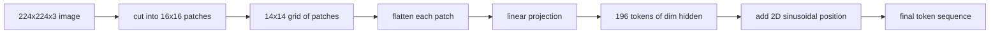

# 비전 인코더의 패치 (Vision Encoder Patches)

> 픽셀을 읽는 비전 모델에는 픽셀을 위한 토크나이저가 필요하다. 패치 임베딩이 바로 그 토크나이저다. 이미지를 정사각형 격자로 자르고, 각 정사각형을 펼치고, 선형 레이어 하나를 통과시킨 다음, 2차원 위치 신호를 더해서 트랜스포머가 각 정사각형이 원본 이미지의 어디에 있었는지 알게 한다.

**Type:** Build
**Languages:** Python
**Prerequisites:** Phase 19 lessons 30-37 (Track B foundations)
**Time:** ~90 minutes

## 학습 목표 (Learning Objectives)

- 이미지를 길이가 정해진 패치 임베딩 시퀀스로 토큰화한다.
- 펼친 뒤 선형 변환하는 계산과 수학적으로 같은, `Conv2d` 기반 패치 사영을 구현한다.
- 토큰 순서가 공간상의 위치를 담도록 결정적인 2차원 사인·코사인 위치 임베딩을 만든다.
- 합성 고정 데이터로 패치 개수와 임베딩 모양, 그리고 `Conv2d`와 펼치기 방식의 동치를 확인한다.

## 문제 (The Problem)

트랜스포머는 벡터의 나열을 먹는다. 그런데 이미지는 3채널 격자다. 모든 픽셀을 토큰 하나로 읽으면 시퀀스 길이가 폭발한다. 224×224 RGB 이미지는 토큰이 150,528개가 되고, 12층 트랜스포머는 그 어텐션 비용을 감당할 수 없다. 반대로 이미지 전체를 하나의 긴 벡터로 펼치면 국소성이 사라지고, 어텐션 레이어는 그것을 되살릴 수 없다. 인코더 앞단이 할 일은 픽셀 격자를, 각각이 정사각형 영역 하나를 요약하는 수백 개의 토큰으로 압축하는 것이다.

패치 임베딩은 이 문제를 선형 사영 하나로 푼다. 224×224 이미지를 16×16 패치로 자르면 14×14 격자, 즉 패치 196개가 나온다. 각 패치는 `(3, 16, 16) = 768`개의 픽셀 값으로 펼쳐지고, 선형 레이어가 그것을 모델의 은닉 차원으로 옮긴다. 트랜스포머가 보는 것은 차원이 `hidden`(보통 768)인 토큰 196개와 CLS 토큰 하나다. 이 정도 길이라면 나머지 신경망이 처리할 수 있다.

## 개념 (The Concept)



### 픽셀이 아니라 패치를 쓰는 이유

어텐션의 비용은 시퀀스 길이의 제곱에 비례한다. 토큰이 196개면 레이어와 헤드마다 어텐션 점수가 `196 * 196 = 38,416`개다. 토큰이 150,528개면 `150,528 * 150,528 = 226억`개다. 패치를 쓰면 어텐션 연산량이 59만 배 줄어든다. 그리고 16×16 영역 하나에는 높은 수준의 비전 과제를 풀기에 충분한 정보가 담긴다. 대신 패치 안쪽의 세밀한 공간 정보를 잃는다. 그래서 정밀한 위치 판별이 필요한 멀티모달 스택은 고해상도 분기를 하나 더 돌리는 경우가 많다.

### 선형 사영만으로 충분한 이유

각 패치는 독립적인 벡터로 다룬다. 사영은 가장자리 검출기와 색 필터, 단순한 질감 같은 기저를 학습한다. 선형 레이어 하나는 작고(ViT-Base 기준 `768 * 768 = 589,824`개 파라미터) 빠르게 학습된다. 합성곱을 여러 겹 쌓은 앞단도 있지만(하이브리드 ViT), 평평한 선형 사영이 표준이고, 요즘 공개된 인코더 대부분이 바로 이 형태로 나온다.

### `Conv2d` 기법

패딩 없이 `Conv2d(in_channels=3, out_channels=hidden, kernel_size=patch_size, stride=patch_size)`를 쓰면, 펼친 뒤 선형 변환하는 것과 수치적으로 같은 결과가 나온다. 출력 위치마다 패치의 픽셀들과 필터 하나를 내적하기 때문이다. 그러므로 이 합성곱이 곧 패치 사영이다. 실무 코드베이스 대부분이 이렇게 구현한다. GPU에서 더 빠르고 reshape을 한 번 덜 해도 되기 때문이다.

### 위치 임베딩

사영을 통과한 토큰에는 순서 정보가 없다. 2차원 사인·코사인 임베딩은 각 토큰에 그 `(행, 열)` 위치를 담은 고정된 신호를 준다. 임베딩 차원의 절반은 여러 주파수의 사인과 코사인으로 행 위치를 담고, 나머지 절반은 열 위치를 담는다. 이 인코딩은 결정적이므로 다시 학습하지 않고도 해상도를 바꿀 수 있고, 학습할 때 본 적 없는 격자 크기에도 매끄럽게 보간된다.

| 구성 요소 | 모양 | 파라미터 수 |
|-----------|-------|------------|
| 패치 사영 (`Conv2d`) | `(hidden, 3, patch, patch)` | `3 * P * P * hidden + hidden` |
| 위치 임베딩 (고정) | `(num_patches, hidden)` | 0 (학습하지 않고 계산한다) |
| CLS 토큰 (학습) | `(1, hidden)` | `hidden` |

해상도 224에서의 ViT-Base/16을 보면 사영에 파라미터가 590,592개, CLS 토큰에 768개이고, 사인·코사인 위치에는 0개다. 다음 레슨인 59번에서 이 앞단 위에 12층 트랜스포머를 쌓는다.

### 동치 확인을 건전성 검사로 쓰기

패치 단계는 두 가지로 적을 수 있다. `Conv2d` 사영과, 명시적으로 펼친 뒤 선형 변환하는 방식이다. 같은 가중치라면 둘은 같은 출력을 내야 한다. 그렇지 않다면 펼치기 쪽 계산이 틀린 것이고, 인코더의 나머지가 모래 위에 올라가게 된다. 이 레슨의 테스트가 그 동치를 확인한다.

```figure
ch-patch-tokenizer
```

## 직접 만들기 (Build It)

`code/main.py`에 다음을 구현한다.

- `PatchEmbed`. 패치 사영을 위해 `Conv2d`를 감싼 `nn.Module`이다.
- `sinusoidal_2d(grid_h, grid_w, dim)`. 2차원 위치 표를 만들어 내는, 상태 없는 함수다.
- `VisionFrontEnd`. 패치 임베딩과 CLS 토큰 붙이기, 위치 더하기를 한 번의 순전파로 묶는다.
- `synthesize_image(seed)`. `numpy.random`으로 결정적인 224×224×3 고정 데이터를 만드는 보조 함수다.
- 고정 이미지 하나를 앞단에 통과시켜 출력 모양과 CLS 토큰의 노름, 위치 임베딩의 한 행을 출력하는 데모.

다음으로 실행한다.

```bash
python3 code/main.py
```

출력은 이렇다. 224×224 고정 이미지가 모양이 `(1, 197, 768)`인 시퀀스로 토큰화된다. 첫 번째 토큰은 CLS이고, 이어지는 196개가 패치 토큰이다. 위치 임베딩의 노름은 같은 행 안에서 일정하게 나오는데, 이것이 사인·코사인 방식의 특징이다.

## 실제로 써 보기 (Use It)

같은 패치 앞단이 요즘 비전-언어 모델 전부에 들어 있다. CLIP ViT-L/14와 SigLIP, DINOv2, Qwen-VL 계열, InternVL 스택이 모두 `Conv2d` 패치 사영과 위치 신호에서 출발한다. 계열마다 다른 부분은 그 뒤에 있다. CLS를 쓰는지 아니면 다른 방식으로 모으는지, 레지스터 토큰을 두는지, 패치 크기가 14인지 16인지, 위치를 보간해서 해상도를 유연하게 바꾸는지 같은 것이다. 이 레슨의 앞단은 그 모든 모델이 딛고 선 바탕이다.

## 테스트 (Tests)

`code/test_main.py`는 다음을 확인한다.

- 패치 개수가 `(image_size / patch_size) ** 2`와 맞는지
- 출력 모양이 `(batch, num_patches + 1, hidden)`과 맞는지
- 작은 고정 데이터에서 `Conv2d` 사영이 손으로 펼친 뒤 선형 변환한 결과와 같은지
- 사인·코사인 위치 표가 호출할 때마다 같은 값을 내는지
- CLS 토큰이 배치 차원으로 퍼질 때 배치끼리 값이 섞이지 않는지

다음으로 실행한다.

```bash
python3 -m unittest code/test_main.py
```

## 연습 문제 (Exercises)

1. 사인·코사인 위치를 학습되는 `nn.Parameter`로 바꾸고, 작은 합성 분류 과제에서 첫 에포크의 손실을 비교하라. 해상도가 고정되어 있으면 학습된 위치가 유리하고, 학습 후에 해상도를 바꾼다면 사인·코사인 쪽이 유리하다.

2. `Conv2d`를 명시적인 `nn.Unfold`와 `nn.Linear`로 바꾸고, 출력이 부동소수점 오차 범위 안에서 일치하는지 단언하라. 같은 계산을 두 가지로 적었을 뿐이다.

3. 정사각형이 아닌 패치 크기를 지원하게 하라(가로로 긴 입력을 위한 32×16 등). 그리고 위치 표가 정사각형이 아닌 격자를 제대로 다루는지 확인하라.

4. 배치 크기 1과 8, 64에서 패치 단계의 성능을 측정하라. 패치 사영이 병목인 경우는 드물다. 그 뒤의 어텐션 레이어가 시간을 대부분 차지한다.

5. 이 앞단을 얼린 특징 추출기로 두고, 도형 4종(원, 사각형, 삼각형, 별)으로 이루어진 합성 데이터셋에서 학습시켜라. CLS 토큰 출력이 선형으로 분리되어야 한다.

## 핵심 용어 (Key Terms)

| 용어 | 뜻 |
|------|---------------|
| Patch | 이미지의 정사각형 부분 영역이며 보통 14×14나 16×16이다 |
| Patch embedding | 펼친 패치 하나를 은닉 차원으로 옮기는 선형 사영 |
| Sequence length | 패치 토큰화 이후의 토큰 개수이며 보통 CLS를 더한 값이다 |
| Sinusoidal position | 2차원 격자 좌표를 담는 고정된 사인·코사인 신호 |
| CLS token | 시퀀스 앞에 붙이는 학습된 벡터이며 모아 내는 헤드 노릇을 한다 |

## 더 읽을거리 (Further Reading)

- An Image is Worth 16x16 Words (ViT, 2021). 패치 임베딩이라는 발상을 처음 제시한 논문이다.
- Attention Is All You Need (2017). 여기에서 2차원으로 옮겨 쓴 사인·코사인 위치 수식이 실려 있다.
- DINOv2 논문. 레지스터 토큰을 다루며, 연습 문제 6번으로 덧붙여 볼 만하다.
