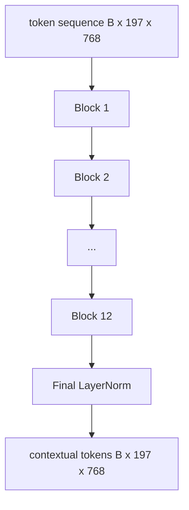
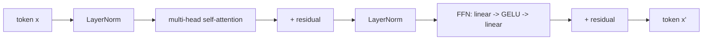

# 비전 트랜스포머 인코더 (Vision Transformer Encoder)

> 패치만으로는 보지 못한다. 어텐션 헤드 12개를 가진 12층 pre-LN 트랜스포머가 패치 토큰의 나열을 맥락이 반영된 토큰의 나열로 바꾸고, CLS 토큰은 마지막 은닉 상태에 이미지 전체의 특징을 모은다. 이 레슨은 요즘 비전-언어 모델 전부의 엔진실에 해당한다.

**Type:** Build
**Languages:** Python
**Prerequisites:** Phase 19 lessons 30-37 (Track B foundations)
**Time:** ~90 minutes

## 학습 목표 (Learning Objectives)

- 멀티헤드 셀프 어텐션과 피드포워드 하위 레이어를 가진 pre-LN 트랜스포머 블록을 구현한다.
- 헤드 12개짜리 블록을 12층 쌓아 ViT-Base 인코더를 만든다.
- 58번 레슨의 패치 앞단을 인코더에 연결하고 순전파를 돌린다.
- CLS 토큰이 모든 패치의 정보를 실제로 모으는지 확인한다.

## 문제 (The Problem)

패치 임베딩은 토큰 197개를 만들어 내지만, 각 토큰은 다른 패치의 존재를 전혀 모르는 벡터다. 고양이 사진이라면 어느 패치에 수염이 있고 어느 패치가 배경이고 어느 패치에 눈이 있는지를 모든 패치가 알아야 한다. 트랜스포머는 어텐션 레이어를 한 층씩 거치며 그 인식을 만들어 내는 장치다. 트랜스포머가 없으면 패치 앞단은 이해가 없는 영리한 토크나이저에 그친다.

표준 구성은 깊이 12층, 헤드 12개이며, LayerNorm을 앞에 두고, GELU를 쓰고, 피드포워드를 4배로 넓힌다. 이 구성이 CLIP ViT-L와 SigLIP, DINOv2, Qwen-VL 계열, InternVL을 비롯해 2025년과 2026년의 공개 비전 인코더 전부를 떠받치는 뼈대다. 워낙 안정된 구성이라, 어떤 논문을 읽든 그 논문이 다르다고 명시하지 않는 한 이 블록 구조를 가정해도 된다.

## 개념 (The Concept)





### pre-LN과 post-LN의 차이

원래 트랜스포머는 LayerNorm을 잔차 연결 뒤에 두었다. 요즘 비전-언어 모델은 모두 pre-LN, 즉 하위 레이어마다 그 앞에 LayerNorm을 두는 방식을 쓴다. 학습률을 천천히 올리는 기법 없이도 안정적으로 학습되기 때문이다. 순전파 코드에서는 한 줄 차이지만, 깊이가 12층을 넘어가면 그래디언트가 흐르는 양상이 완전히 달라진다.

### 멀티헤드 셀프 어텐션

각 헤드는 토큰 벡터를 자기 몫의 쿼리·키·값 세 벌로 사영하며, 그 차원은 `head_dim = hidden / num_heads`다. `hidden`이 768이고 헤드가 12개면 헤드마다 차원이 64다. 헤드 12개가 나란히 어텐션을 수행한 다음, 그 출력을 이어 붙여 차원 768로 되돌리고 출력 사영을 통과시킨다. 헤드를 여럿 두는 이유는, 한 헤드가 "고양이 눈에 주목하라"를 학습하는 동안 다른 헤드가 "배경의 명암 변화에 주목하라"를 서로 방해하지 않고 학습할 수 있게 하려는 것이다.

### 피드포워드를 4배로 넓히는 이유

FFN은 `hidden -> 4 * hidden -> hidden`으로 가며 가운데에 GELU를 둔다. 4라는 배수는 실험으로 정해진 값이고, 2017년 이후 언어 트랜스포머와 비전 트랜스포머 양쪽에서 계속 유지되고 있다. 2배로 줄이면 표현력이 모자라고, 8배로 키우면 같은 데이터 예산에서 과적합한다. 모델이 학습한 지식 대부분은 이 MLP에 저장되며, 넓어진 가운데 층이 바로 그 자리다.

| 구성 요소 | ViT-Base 규모의 파라미터 수 |
|-----------|------------------------------|
| 블록당 qkv 사영 | `3 * 768 * 768 = 177만` |
| 블록당 출력 사영 | `768 * 768 = 59만` |
| 블록당 FFN (4배 확장) | `2 * 768 * 4 * 768 = 472만` |
| 블록당 LayerNorm | `4 * 768 = 3천` |
| 블록당 합계 | 약 710만 |
| 12개 블록 | 약 8,500만 |
| 앞단까지 더하면 | 모두 약 8,600만 |

ViT-Base는 파라미터가 8,600만 개인 인코더다. 2026년 기준으로는 작은 편이지만(SigLIP-So400M은 4억, Qwen-VL의 ViT는 6억 7,500만이다), 구조는 너비와 깊이만 다를 뿐 똑같다.

### 인과 마스크를 쓰는가

비전 트랜스포머는 인코더만 있고 양방향이다. 토큰 `i`는 어떤 토큰 `j`든 참조할 수 있다. 마스크가 없다. 61번 레슨의 디코더 쪽 크로스 어텐션은 인과 마스크를 쓰지만, 비전 인코더 안에서는 어텐션이 완전히 연결되어 있다.

### CLS 토큰이 배우는 것

CLS 토큰은 학습되는 파라미터로 시작하며, 자기 몫의 패치 내용이 없고, 블록을 거치며 어텐션으로 정보를 모은다. 마지막 레이어에 이르면 CLS 행이 이미지 전체를 요약한 벡터가 된다. 그 뒤의 헤드들은 이 벡터 하나를 클래스 로짓이나 대조 학습용 임베딩, 또는 텍스트 디코더가 참조할 크로스 어텐션 키로 사영한다.

```figure
ch-cls-funnel
```

## 직접 만들기 (Build It)

`code/main.py`에 다음을 구현한다.

- `MultiHeadSelfAttention`. `qkv` 사영과 출력 사영, 크기를 조정한 내적 어텐션 계산, 그리고 텐서 모양 단언이 들어간다.
- `FeedForward`. 4배로 넓히는 GELU MLP다.
- `Block`. 어텐션과 피드포워드 하위 레이어를 잔차 연결과 함께 묶은 pre-LN 블록이다.
- `ViT`. 블록 12개를 쌓고 마지막에 LayerNorm을 둔다.
- `VisionEncoder`. 58번 레슨의 `VisionFrontEnd`를 `ViT` 스택에 연결하고, 맥락이 반영된 시퀀스와 모아 낸 CLS 벡터를 돌려주는 `forward()`를 제공한다.
- 합성한 224×224 고정 이미지를 인코더 전체에 통과시켜 입력 모양과 출력 모양, 파라미터 개수, 그리고 한 층 걸러 한 층의 CLS 노름을 출력하는 데모.

다음으로 실행한다.

```bash
python3 code/main.py
```

출력은 이렇다. 고정 이미지가 `(1, 197, 768)` 텐서로 인코딩된다. CLS 노름은 레이어를 거치며 서서히 커지다가 마지막 LayerNorm에서 안정된다. 전체 파라미터 수는 약 8,600만으로 보고된다.

## 실제로 써 보기 (Use It)

여기에서 정의한 인코더는, 너비와 깊이만 빼면 2025년과 2026년의 공개 비전-언어 모델 안에 들어 있는 블록 스택과 같다. 차이는 다음에 있다.

- **너비와 깊이.** ViT-Large는 `hidden=1024, depth=24, heads=16`이고, SigLIP So400M은 `hidden=1152, depth=27, heads=16`이다. 블록 자체는 같다.
- **모아 내는 헤드.** 이 레슨처럼 CLS로 모으거나, SigLIP처럼 평균을 내거나, 이후의 비전-언어 모델처럼 어텐션으로 모은다.
- **위치 처리.** 58번 레슨의 고정 사인·코사인 방식, 학습되는 1차원 방식, ALiBi, 2차원 RoPE 가운데 하나를 쓴다. 블록의 계산은 그대로다.
- **레지스터 토큰.** DINOv2는 학습되는 토큰 4개를 앞에 더 붙인다. 코드로는 한 줄이다.

이 블록 스택이 바탕이다. 60번부터 63번까지의 레슨이 그 위에 올라선다.

## 테스트 (Tests)

`code/test_main.py`는 다음을 확인한다.

- 블록 하나가 텐서 모양을 그대로 유지하고, 배치 크기가 달라져도 동작이 같은지
- 어텐션 점수가 키 축을 따라 1로 합해지는지(소프트맥스 건전성 검사)
- 잔차 경로가 제대로 연결되어 있는지(입력이 0이어도 CLS 토큰을 통해 출력이 0이 아니어야 한다)
- 4층으로 쌓은 순전파가 올바른 모양을 내놓는지
- CLS 출력에서 패치 사영까지 그래디언트가 흘러가는지

다음으로 실행한다.

```bash
python3 -m unittest code/test_main.py
```

## 연습 문제 (Exercises)

1. 레지스터 토큰을 추가하고(CLS 뒤에 학습되는 벡터 4개를 붙인다) 다시 돌려라. 마지막 레이어 소프트맥스 분포의 엔트로피로 어텐션 맵이 얼마나 고르게 퍼지는지 비교하라.

2. pre-LN을 post-LN으로 바꾸고 합성 도형 분류기를 한 에포크 학습시켜라. 학습률을 천천히 올리는 기법 없이 어느 쪽이 안정적으로 학습되는지 관찰하라.

3. `attn_mask` 인자를 받아 인과 마스킹을 구현해서, 같은 블록을 디코더 블록으로도 쓸 수 있게 하라. 마스크의 모양은 `(seq, seq)`이고 아래쪽 삼각형이다.

4. `torch.profiler`로 배치 크기 1과 8, 64에서 순전파를 측정하라. 실제 시간을 가장 많이 차지하는 것은 어텐션이 아니라 MLP 레이어다.

5. 어텐션 헤드 하나의 q·k·v 사영을 낮은 랭크의 LoRA 어댑터로 바꾸고 나머지는 얼린 다음, 그래디언트가 의도한 곳에만 흐르는지 확인하라.

## 핵심 용어 (Key Terms)

| 용어 | 뜻 |
|------|---------------|
| Pre-LN | LayerNorm을 하위 레이어 뒤가 아니라 앞에 두는 방식 |
| Self-attention | 각 토큰이 같은 시퀀스의 다른 모든 토큰을 참조하는 어텐션 |
| Multi-head | 은닉 차원을 서로 독립적인 `H`개의 어텐션 헤드로 나누는 것 |
| FFN expansion | 피드포워드 레이어가 `4 * hidden`으로 넓어졌다가 다시 좁아지는 것 |
| CLS pooling | 첫 번째 토큰의 마지막 은닉 상태를 이미지 요약으로 쓰는 것 |

## 더 읽을거리 (Further Reading)

- An Image is Worth 16x16 Words (ViT, 2021). 인코더 구성의 출처다.
- DINOv2 (2023). 레지스터 토큰과 자기지도 사전학습 목표를 다룬다.
- SigLIP (2023). 평균을 내서 모으는 변형과, 62번 레슨에서 쓰는 시그모이드 대조 손실을 다룬다.
