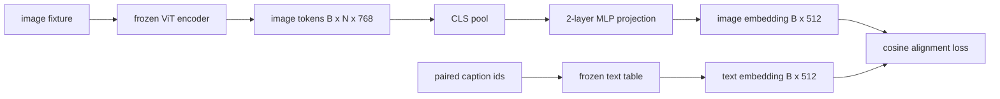

# 양식 정렬을 위한 사영 레이어 (Projection Layer for Modality Alignment)

> 비전 인코더는 이미지 토큰을 내놓는다. 텍스트 디코더는 텍스트 토큰을 받아먹는다. 둘은 서로 다른 벡터 공간에 산다. 두 층짜리 작은 MLP가 이미지 토큰을 텍스트 임베딩 공간으로 사영하고, 짝지어진 캡션을 기준으로 한 코사인 정렬 손실이 두 공간을 서로 맞춰 준다. 그 사영은 비전-언어 모델에서 가장 작은 부품이면서, 전이 성능에는 가장 크게 영향을 준다.

**Type:** Build
**Languages:** Python
**Prerequisites:** Phase 19 lessons 30-37 (Track B foundations)
**Time:** ~90 minutes

## 학습 목표 (Learning Objectives)

- 이미지 특징을 텍스트 임베딩 공간으로 옮기는 두 층짜리 MLP 사영을 만든다.
- 사전학습된 토크나이저나 실제 말뭉치 없이 모의 텍스트 임베딩 표를 구성한다.
- 사영된 이미지 토큰과 짝지어진 캡션 임베딩 사이의 코사인 정렬 손실을 계산한다.
- 비전 인코더와 텍스트 표를 얼린 채로 사영만 학습시킨다.

## 문제 (The Problem)

58번과 59번 레슨에서 만든 비전 인코더는 차원이 `vision_hidden = 768`인 토큰을 내놓는다. 그리고 그 위에 붙이려는 텍스트 디코더의 임베딩 차원은 `text_hidden = 512`다(다른 값이어도 마찬가지다). 디코더는 텍스트 모양의 토큰을 기대한다. 그런데 이미지 토큰은 텍스트 모양이 아니다. 비전만으로 사전학습하는 동안 인코더가 배운 기저 위에 놓여 있고, 디코더의 단어 벡터와는 아무 관계가 없다.

두 층짜리 MLP 사영(선형, GELU, 선형)이 그 틈을 잇는다. 파라미터가 약 `768 * 1024 + 1024 * 512 = 130만` 개로 작아서 GPU 한 대로 몇 분이면 학습되고, 정렬 단계에서 학습해야 하는 유일한 부품이다. 비전 인코더는 얼려 둔다. 텍스트 임베딩 표도 얼려 둔다. 오직 사영만 움직인다. 이것이 LLaVA가 2023년에 내놓은 방식이고, BLIP-2가 Q-Former로 다시 풀어낸 방식이며, 그 이후 공개된 비전-언어 모델이 저마다의 형태로 받아들인 방식이다.

## 개념 (The Concept)



### 사영하기 전에 모아 내기

비전 인코더는 토큰 197개를 내놓는다. 반면 텍스트 쪽에는 캡션 하나를 나타내는 임베딩 하나가 있다. 둘을 맞추려면 표본마다 이미지 수준의 벡터 하나가 필요하다. CLS로 모으는 방법이 가장 단순하다. 인코더의 첫 번째 토큰을 가져다 사영하면 된다. 토큰 197개를 모두 평균 내는 방법도 있고, SigLIP이 그렇게 한다. 어느 쪽이든 벡터 197개를 하나로 줄인다.

### 한 층이 아니라 두 층인 이유

선형 사영 하나로는 회전하고 크기를 조절할 수 있을 뿐, 두 공간의 굽은 정도가 다를 때 기저를 고치지는 못한다. 선형 레이어 두 개 사이에 GELU를 두면 사영이 비선형으로 한 번 꺾이고, 경험상 그 정도면 CLIP 계열 특징을 언어 모델 임베딩에 맞추기에 충분하다. 더 깊은 사영도 있다. LLaVA-NeXT는 GLU를 썼고 Qwen-VL은 어텐션 레이어를 여러 겹 쌓았다. 두 층짜리 MLP는 정석에 해당하는 기준선이며, BLIP-2의 Q-Former 사영 헤드도 속으로는 이 형태를 쓴다.

| 레이어 | 모양 | 파라미터 수 |
|-------|-------|------------|
| fc1 | `(vision_hidden, projection_hidden)` | `768 * 1024 + 1024` |
| 활성화 | GELU | 0 |
| fc2 | `(projection_hidden, text_hidden)` | `1024 * 512 + 512` |

`768 -> 1024 -> 512` 헤드라면 파라미터가 약 130만 개다.

### 코사인 정렬 손실

정렬한다는 말은 `image_emb == text_emb`가 되게 하라는 뜻이 아니다. 두 벡터가 공통 공간에서 같은 방향을 가리키게 하라는 뜻이다. 코사인 손실은 `1 - cos_sim(image, text)`이며, 완전히 정렬되면 0이고 정반대면 2가 된다. 학습은 쌍마다 이 값을 0에 가깝게 민다. 62번 레슨은 이것을 배치 단위 대조 학습(InfoNCE)으로 확장해서, 각 이미지가 배치 안의 다른 어떤 캡션보다 자기 캡션에 더 가까워지게 한다. 이 레슨에서는 동작이 눈에 보이도록 쌍 단위 판본을 쓴다.

### 인코더를 얼리는 것이 핵심이다

비전 인코더에는 파라미터가 8,600만 개 있다. 텍스트 표에도 수백만 개가 더 있다. 모의 말뭉치로 그것을 전부 학습시키는 것은 애초에 말이 되지 않는다. 둘 다 얼려 두면 사영의 파라미터 130만 개만 바뀌고, 합성 쌍으로 수백 스텝만 돌려도 손실이 충분히 내려간다. 어댑터를 쓰는 비전-언어 모델이 실제로 이렇게 돌아간다. 무거운 부분은 얼려 두고 가벼운 다리만 학습시킨다.

```figure
ch-projection-bridge
```

## 직접 만들기 (Build It)

`code/main.py`에 다음을 구현한다.

- `MLPProjector(in_dim, hidden_dim, out_dim)`. GELU 활성화를 가운데 둔 두 층짜리 선형 MLP다.
- `MockTextEmbedding(vocab_size, dim)`. 시드로 결정적으로 초기화한, 얼려 둔 임베딩 표다.
- `make_pair(seed, vocab_size)`. 이미지와 캡션이 짝지어진 표본 하나를 합성한다. 캡션은 짧은 식별자 나열이고, 캡션 임베딩은 토큰 임베딩을 평균 내서 만든다.
- `cosine_alignment_loss(image_emb, text_emb)`. 쌍 단위 `1 - cos_sim` 목표 함수다.
- 합성 쌍 32개를 돌려 가며 사영을 200스텝 학습시키는 루프. 비전 인코더와 텍스트 표는 얼린 채로 두고, 25스텝마다 손실을 출력한다.

다음으로 실행한다.

```bash
python3 code/main.py
```

출력은 이렇다. 처음에 약 1.07이던 손실이 200스텝 안에 약 0.80까지 내려간다. 사영 하나만으로도 이미지 토큰을 텍스트 공간 쪽으로 끌어올 수 있다는 뜻이다. 쌍별 최종 코사인 유사도도 함께 출력된다.

## 실제로 써 보기 (Use It)

같은 패턴이 공개된 비전-언어 모델 전부에 나타난다.

- **LLaVA 1.5.** CLIP-ViT-L의 은닉 차원에서 LLaMA 임베딩 차원으로 가는 두 층짜리 GELU MLP 사영을 쓴다. 비전 인코더와 언어 모델을 얼린 채 사영만 학습시키고, 두 번째 단계에서 언어 모델을 푼다.
- **BLIP-2.** Q-Former가 학습되는 질의 토큰 32개를 크로스 어텐션으로 이미지 토큰에 통과시킨 다음, 언어 모델 임베딩 차원으로 사영한다. Q-Former 맨 끝의 사영 헤드가 이 레슨의 MLP에 해당한다.
- **MiniGPT-4.** BLIP-2 Q-Former 출력에서 Vicuna 임베딩 차원으로 가는 선형 사영 하나를 쓴다.
- **Qwen-VL.** 여러 층으로 이루어진 크로스 어텐션 어댑터를 쓰지만, 마지막 부품은 역시 언어 모델 임베딩 차원으로 가는 사영이다.

형태는 달라도 역할은 똑같다. 이미지 토큰을 모아 내고, 텍스트 임베딩 차원으로 사영하고, 그것만 학습시킨다.

## 테스트 (Tests)

`code/test_main.py`는 다음을 확인한다.

- 사영기의 출력 모양이 설정한 `out_dim`과 맞는지
- 얼려 둔 텍스트 임베딩 표에 `requires_grad`가 켜진 파라미터가 하나도 없는지
- 코사인 손실이 같은 벡터에서는 0이고 정반대 벡터에서는 2가 되는지
- 역전파를 한 번 돌린 뒤 사영기로 그래디언트가 흐르는지
- 학습 루프가 0스텝과 200스텝 사이에 손실을 줄이는지

다음으로 실행한다.

```bash
python3 -m unittest code/test_main.py
```

## 연습 문제 (Exercises)

1. CLS로 모으는 대신 패치 토큰 196개를 평균 내서 모으고, 200스텝 뒤의 최종 손실을 비교하라. 합성 데이터에서는 대개 평균을 내는 쪽이 빠르게 학습되고, 자연 이미지에서는 CLS 쪽이 표본을 더 효율적으로 쓴다.

2. 코사인 손실에 학습되는 스칼라 온도를 더하고(`cos / tau`), `tau`가 너무 작을 때(그래디언트가 시끄러워진다)와 너무 클 때(손실이 높은 자리에서 멈춘다) 무슨 일이 일어나는지 관찰하라.

3. 두 층짜리 MLP를 선형 레이어 하나로 바꾸고 손실 차이를 수치로 확인하라. 비선형성은 자연 이미지 특징에서 더 크게 작용하고 합성 데이터에서는 덜 작용한다.

4. 사영기 가중치에 작은 L2 벌점을 더하고, 그것이 코사인 정렬과 어떻게 맞물리는지 보라. 코사인은 크기에 영향을 받지 않으므로, 벌점은 주로 쓰이지 않는 방향을 줄인다.

5. 사영기 가중치를 저장한 다음 다시 읽어 들이고, 비전 인코더의 역전파 없이 추론만 돌려 보라. 배포 시점에는 사영기만 있으면 된다는 것을 확인할 수 있다.

## 핵심 용어 (Key Terms)

| 용어 | 뜻 |
|------|---------------|
| Modality alignment | 이미지 임베딩과 텍스트 임베딩을 하나의 공통 공간에서 비교할 수 있게 만드는 일 |
| Projection head | 한 공간을 다른 공간으로 옮기는 작은 모듈이며 보통 두 층짜리 MLP다 |
| Cosine similarity | 내적을 두 벡터의 L2 노름의 곱으로 나눈 값 |
| Frozen encoder | 비전 모델이나 텍스트 모델의 모든 파라미터가 `requires_grad=False`인 상태 |
| Mock corpus | 데이터셋을 내려받지 않고도 학습할 수 있게 만든 합성 쌍 |

## 더 읽을거리 (Further Reading)

- LLaVA 논문. 사영을 먼저 학습시키고 그다음에 언어 모델을 푸는 두 단계 학습을 다룬다.
- BLIP-2 논문. 학습되는 사영의 대안으로 Q-Former를 다룬다.
- Qwen-VL 기술 보고서. 더 깊은 사영 헤드로서의 크로스 어텐션 어댑터를 다룬다.
