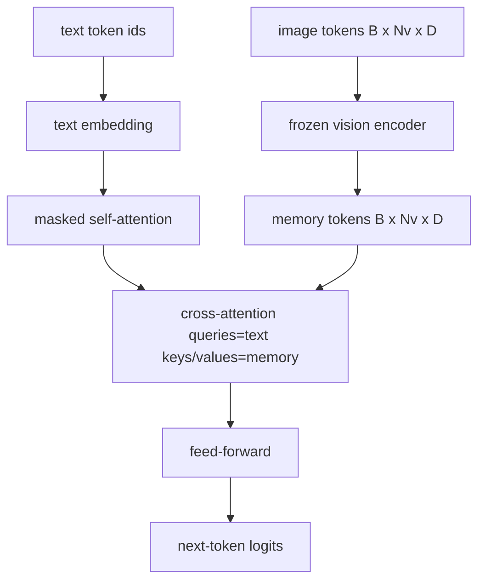
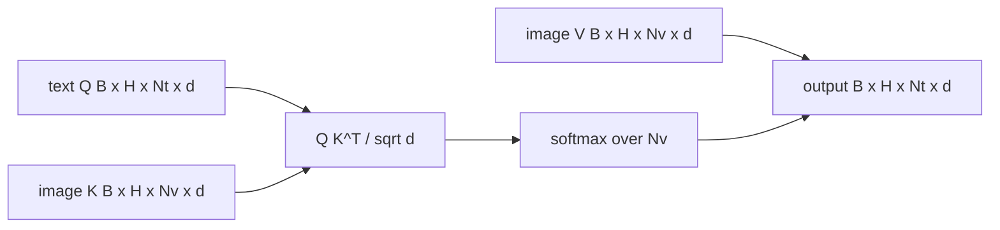

# 크로스 어텐션 융합 (Cross-Attention Fusion)

> 사영 레이어는 이미지 벡터 하나와 캡션 벡터 하나를 맞춰 준다. 그러나 실제 비전-언어 디코더는 모든 텍스트 토큰이 모든 패치 토큰을 참조할 수 있어야 한다. 그래야 단어 하나하나를 이미지의 영역에 붙들어 맬 수 있다. 크로스 어텐션이 바로 그 일을 한다. 텍스트가 묻고, 비전 쪽의 키와 값이 답한다. 이 레슨에서는 크로스 어텐션 블록과 인과 마스크를 쓴 텍스트 셀프 어텐션, 그리고 둘을 올바르게 유지하는 마스크 모양을 만든다.

**Type:** Build
**Languages:** Python
**Prerequisites:** Phase 19 lessons 30-37 (Track B foundations)
**Time:** ~90 minutes

## 학습 목표 (Learning Objectives)

- 쿼리는 텍스트에서, 키와 값은 비전에서 오는 멀티헤드 크로스 어텐션을 구현한다.
- 인과 셀프 어텐션과 크로스 어텐션, 피드포워드로 이루어진 디코더 블록을 구성한다.
- 마스크 모양을 정확히 맞춘다. 셀프 어텐션에는 인과 마스크를 쓰고, 크로스 어텐션에는 마스크를 쓰지 않는다.
- 배치로 묶은 텍스트 토큰과 고정된 이미지 토큰 묶음으로 순전파를 돌린다.

## 문제 (The Problem)

이미지 토큰과 텍스트 토큰을 하나의 시퀀스로 이어 붙이는 것도 융합 방법의 하나다(이른 융합이며, Chameleon과 Emu3가 택한 길이다). 크로스 어텐션은 다른 방법이다(늦은 융합이며, Flamingo가 처음 제시했고 그 뒤의 Flamingo 계열 디코더가 그대로 따라온 길이다). 늦은 융합에서는 텍스트 디코더가 텍스트 토큰만 가지고 돌아가면서, 블록마다 크로스 어텐션으로 이미지 쪽에 손을 뻗는다.

늦은 융합에는 두 가지 이점이 있다. 첫째, 텍스트 흐름이 깨끗하게 유지되어 모델이 텍스트만 다루는 능력을 잃지 않는다. 둘째, 이미지 흐름은 이미지 하나당 한 번만 계산해서 모든 디코딩 단계에서 재사용하므로, 캡션이 길어져도 생성 비용이 싸다. 대신 블록마다 어텐션 하위 레이어가 하나씩 더 붙는다.

## 개념 (The Concept)





### 마스크 모양

디코더 블록 안의 두 어텐션은 서로 다른 마스크를 쓴다.

| 어텐션 | 쿼리 길이 | 키 길이 | 마스크 | 이유 |
|-----------|--------------|------------|------|-----|
| 셀프 어텐션 | `Nt` (텍스트) | `Nt` (텍스트) | 인과 마스크. 아래쪽 삼각형 `(Nt, Nt)` | 자기회귀 생성 중에 텍스트 토큰이 앞을 미리 봐서는 안 된다 |
| 크로스 어텐션 | `Nt` (텍스트) | `Nv` (비전) | 마스크 없음 | 모든 텍스트 위치에서 이미지 전체가 보인다 |

이 레슨에는 모양을 검증하는 함수가 하나 들어 있다. 둘을 뒤바꿔 쓰는 실수가 조용히 망가진 손실 곡선으로 나타나지 않고 `ValueError`로 드러나게 하기 위해서다.

### 크로스 어텐션에 마스크를 쓰지 않는 이유

이미지는 텍스트를 하나라도 생성하기 전에 전부 관찰된 상태다. 캡션의 `t`번째 토큰은 이미지의 어느 패치든 참조해도 된다. 이미지 패치에는 시간 순서가 없기 때문이다. Flamingo의 일부 변형은 이미지와 텍스트 구간을 여러 개 섞어 넣을 때 표본별 마스크 패턴을 더하지만, 이미지 하나와 캡션 하나라면 크로스 어텐션은 전부를 본다.

### 키와 값 캐싱

이미지의 키와 값은 디코딩을 시작할 때 한 번만 계산해서 캐시에 담아 둔다. 새 텍스트 토큰마다 그 캐시를 다시 계산 없이 쓴다. 추론 시점에 캡션 생성이 빠른 이유가 이것이다. 무거운 ViT는 한 번만 돌고, 크로스 어텐션은 그 키와 값을 단계마다 재사용한다. 이 레슨에서는 그 캐시를 밖으로 드러내고 캐시가 적중하는 경로를 테스트한다.

### 블록 구성

디코더 블록은 이렇게 돈다. pre-LN, 셀프 어텐션, 잔차 연결, pre-LN, 크로스 어텐션, 잔차 연결, pre-LN, 피드포워드, 잔차 연결. 하위 레이어가 셋이고 각각 자기 LayerNorm을 갖는다. Flamingo 논문은 크로스 어텐션에 학습되는 게이트를 달아, 모델이 이미지 경로를 쓰지 않기로 고를 수 있게 했다. 대신 학습 안정성에서 비용을 치른다. 여기에서 쓰는 정석 기준선에는 게이트가 없다.

```python
class DecoderBlock:
  def forward(self, text_tokens, image_tokens, text_mask, cross_mask):
      text_tokens = text_tokens + self.self_attn(self.ln1(text_tokens),
                                                 mask=text_mask)
      text_tokens = text_tokens + self.cross_attn(self.ln2(text_tokens),
                                                  image_tokens,
                                                  mask=cross_mask)
      text_tokens = text_tokens + self.ffn(self.ln3(text_tokens))
      return text_tokens
```

```figure
ch-crossattn-fan
```

## 직접 만들기 (Build It)

`code/main.py`에 다음을 구현한다.

- `CrossAttention(hidden, heads)`. `q` 사영과 `kv` 사영을 따로 둔 멀티헤드 크로스 어텐션이다.
- `CausalSelfAttention(hidden, heads)`. 일반적인 디코더에서 쓰는, 마스크가 걸린 셀프 어텐션이다.
- `DecoderBlock`. 하위 레이어 셋을 pre-LN 잔차 연결로 묶는다.
- `VisionLanguageDecoder`. 모의 비전 인코더 출력과 작은 텍스트 임베딩 표를 입력으로 받는 4층 디코더다.
- `causal_mask(length)`. `(length, length)` 모양의 아래쪽 삼각형 불리언 텐서를 돌려준다.
- 길이 10짜리 텍스트 시퀀스 두 개와 길이 197의 이미지 메모리를 넣고, 출력 모양과 셀프 어텐션 마스크 모양, 위치별 크로스 어텐션 출력 노름을 출력하는 데모.

다음으로 실행한다.

```bash
python3 code/main.py
```

출력은 이렇다. 디코더가 `(2, 10, text_vocab)` 모양의 로짓 텐서를 내놓는다. 마스크 모양은 `(10, 10)`이다. 캐시를 쓴 경로와 쓰지 않은 경로의 로짓이 같다는 것도 확인해 준다.

## 실제로 써 보기 (Use It)

크로스 어텐션은 실무에서 두 계열에 나타난다.

- **Flamingo와 IDEFICS.** 언어 모델 블록 K개마다 크로스 어텐션 하위 레이어를 하나씩 끼워 넣고, 언어 모델 자체는 얼려 둔다. 비전-언어 어댑터가 곧 크로스 어텐션 블록과 그 게이트다.
- **BLIP-2.** Q-Former가 고정된 질의 토큰 32개에서 이미지 특징으로 크로스 어텐션을 걸고, 그 질의 토큰을 언어 모델 임베딩 공간으로 사영한다.

이 레슨의 블록 모양이 두 계열에 그대로 대응한다. 마스크를 다루는 규율도 같다. 셀프 어텐션에는 인과 마스크를 쓰고 크로스 어텐션에는 쓰지 않는다.

## 테스트 (Tests)

`code/test_main.py`는 다음을 확인한다.

- 인과 마스크가 아래쪽 삼각형이고 기대하는 불리언 모양과 맞는지
- 키 길이와 무관하게 크로스 어텐션 출력 모양이 `(B, Nt, hidden)`인지
- 캐시를 쓴 경로가 쓰지 않은 경로와 부동소수점 오차 범위 안에서 일치하는지
- 텍스트 흐름과 이미지 흐름의 모양이 맞지 않을 때 분명한 `ValueError`가 나는지
- 디코더 전체 순전파가 올바른 배치와 시퀀스 모양을 내놓는지

다음으로 실행한다.

```bash
python3 -m unittest code/test_main.py
```

## 연습 문제 (Exercises)

1. 크로스 어텐션 잔차에 학습되는 tanh 게이트를 더하고(Flamingo가 쓴 기법이다), 게이트를 거의 0에서 시작해도 학습이 수렴하는지 확인하라. 게이트가 0에서 시작하면 모델은 먼저 텍스트만 다루는 동작을 회복한 다음 이미지 흐름을 섞어 들인다.

2. 같은 디코더가 이미지 여러 장과 텍스트 구간 여러 개를 함께 받아들이는 교차 어텐션을 구현하라. 두 번째 텍스트 구간이 첫 번째 이미지를 참조하지 못하게 막는, 표본별 크로스 어텐션 마스크를 만들어라.

3. `Nt=64, Nv=576`(더 높은 해상도의 24×24 격자)에서 크로스 어텐션과 셀프 어텐션의 성능을 측정하라. 크로스 어텐션의 비용은 `Nt * Nv`이며, 이미지 해상도가 높아지면 이쪽이 전체를 좌우한다.

4. 크로스 어텐션 맵의 쿼리 쪽에 드롭아웃을 걸고 데모에서 캡션의 다양성을 측정하라. 크로스 맵에 드롭아웃을 걸면 캡션 표본의 분산이 커진다.

5. 크로스 어텐션 레이어를 Q-Former 방식의 어텐션 블록으로 바꿔라. 고정된 질의 토큰 32개가 레이어마다 한 번씩 이미지 특징을 참조하는 구조다.

## 핵심 용어 (Key Terms)

| 용어 | 뜻 |
|------|---------------|
| Late fusion | 텍스트와 비전을 별도의 흐름으로 두고 블록마다 크로스 어텐션으로 잇는 방식 |
| Cross-attention | 쿼리는 한쪽 흐름에서, 키와 값은 다른 쪽 흐름에서 오는 어텐션 |
| Causal mask | 자기회귀 생성 중에 앞을 미리 보지 못하게 막는 아래쪽 삼각형 불리언 마스크 |
| KV cache | 한 번만 계산해 두고 모든 디코딩 단계에서 재사용하는 이미지의 키와 값 |
| Memory tokens | 디코더가 손을 뻗어 참조하는, 얼려 둔 이미지 토큰 |

## 더 읽을거리 (Further Reading)

- Flamingo (2022). 게이트가 달린 크로스 어텐션으로 늦은 융합을 구현한 정석 설계를 다룬다.
- BLIP-2 (2023). 학습되는 질의 토큰 묶음의 모습을 한 크로스 어텐션 블록인 Q-Former를 다룬다.
- IDEFICS (2023). Flamingo 방식을 공개 가중치로 재현한 사례다.
