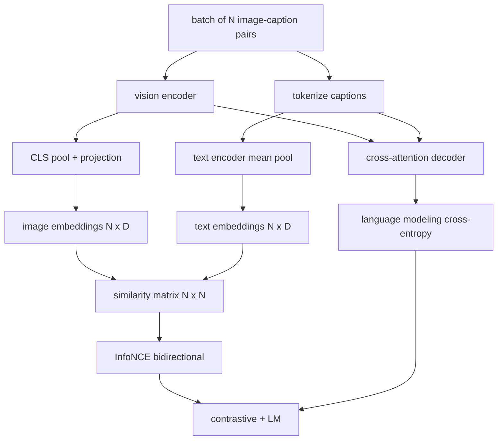

# 비전-언어 사전학습 (Vision-Language Pretraining)

> 인코더와 사영, 디코더를 모두 이어 붙였다. 이제 함께 학습시킬 차례다. 학습을 이끄는 목표는 둘이다. 하나는 짝이 맞는 쌍을 공통 임베딩 공간에서 서로 끌어당기는 대조 손실(InfoNCE)이고, 다른 하나는 디코더에게 각 이미지의 캡션을 쓰게 하는 언어 모델링 손실이다. 둘을 합치면, 신경망은 캡션에 맞는 이미지를 찾는 일과 이미지에 맞는 캡션을 쓰는 일을 함께 배운다.

**Type:** Build
**Languages:** Python
**Prerequisites:** Phase 19 lessons 30-37 (Track B foundations)
**Time:** ~90 minutes

## 학습 목표 (Learning Objectives)

- 이미지와 캡션 쌍의 배치에 대해 InfoNCE 대조 손실을 구현한다.
- 대조 손실과 자기회귀 언어 모델링 손실을 함께 쓴다.
- 실제 데이터셋을 내려받지 않고 이미지와 캡션 쌍 200개로 이루어진 모의 말뭉치를 합성한다.
- 50스텝짜리 데모 학습 루프를 돌리고 두 손실이 모두 내려가는 것을 확인한다.

## 문제 (The Problem)

비전-언어 모델에는 두 가지 능력이 필요하다. 순위를 매길 수 있어야 한다. 캡션이 주어지면 여러 이미지 가운데 맞는 것을 찾아야 한다. 그리고 생성할 수 있어야 한다. 이미지가 주어지면 캡션을 써야 한다. 한 가지 능력만으로 사전학습하면 시스템의 절반만 얻는다. CLIP은 순위 매기기를 훌륭하게 해내지만 캡션을 쓰지 못한다. GPT-4V는 캡션을 쓰지만 순위 매기기에는 별도의 검색 헤드를 쓴다. 여러 목표로 함께 사전학습하면 한 번에 둘 다 얻는다.

InfoNCE가 순위 매기기를 맡는다. 쌍 N개짜리 배치에서 모델은 짝이 맞는 N개를 양성으로, 짝이 맞지 않는 `N^2 - N`개를 음성으로 보고, 그 결과로 나온 `(N, N)` 유사도 행렬에 교차 엔트로피 손실을 건다. 언어 모델 손실이 생성을 맡는다. 이미지를 조건으로 하는 평범한 다음 토큰 예측이다. 두 손실 모두 미분 가능하고, 인코더와 사영기, 디코더의 가중치를 함께 쓸 수 있다.

## 개념 (The Concept)



### InfoNCE를 한 문단으로

이미지 임베딩 N개를 행으로 쌓고, 텍스트 임베딩 N개도 행으로 쌓는다. 양쪽을 L2 정규화한다. 그다음 `N x N` 행렬 `S = I T^T / tau`를 계산한다. 여기에서 `tau`는 학습되는 온도다. 대각선에 있는 항목이 짝이 맞는 쌍이고, 대각선 밖은 음성이다. 정답이 대각선을 따라 놓이도록 교차 엔트로피를 건다. 즉 `i`번째 행에서는 `i`번째 열이 가장 큰 값이어야 한다. 열 방향으로도 똑같이 한다. 전체 손실은 그 둘의 평균이다. CLIP의 손실이 바로 이것이며 코드로는 여덟 줄이다.

### 온도가 중요하다

온도 `tau`는 소프트맥스가 얼마나 뾰족해지는지를 정한다. 너무 작으면(예를 들어 `tau = 0.01`) 가장 어려운 음성 하나에서만 그래디언트가 오고 학습이 시끄러워진다. 너무 크면 소프트맥스가 평평해지고 그래디언트가 사라진다. CLIP은 `tau`를 파라미터로 학습하며, 여기 데모도 똑같이 한다.

### 언어 모델링 손실

디코더는 크로스 어텐션으로 이미지 메모리 토큰을 받아, 각 위치에서 다음 텍스트 토큰을 예측한다. 손실은 다음 위치를 정답으로 삼는 평범한 교차 엔트로피다. 채움 위치는 손실 계산에서 제외한다.

### 두 손실을 합치기

`total = contrastive + lm_weight * lm`이며 `lm_weight`는 스칼라다(보통 1.0을 쓴다). 두 손실은 인코더와 사영기로 가는 그래디언트를 공유하고, 디코더는 언어 모델 손실에서만 그래디언트를 받는다. CoCa와 BLIP, SigLIP 계열 모델이 모두 이 다중 과제 방식을 쓰며 가중치만 다르게 잡는다.

| 구성 요소 | 손실이 다루는 것 | 영향을 주는 범위 |
|-----------|--------------|---------|
| InfoNCE | 공통 공간에서의 쌍 순위 매기기 | 인코더 + 사영 + 텍스트 헤드 |
| LM | 이미지를 조건으로 한 토큰 예측 | 인코더 + 사영 + 디코더 |
| 합계 | 다중 과제 | 스택 전체 |

### 데모에 50스텝이면 충분한 이유

모의 말뭉치는 무작위 이미지와 무작위 캡션 식별자로 만든 200쌍짜리 합성 데이터다. 배치 크기 16으로 SGD를 50스텝 돌리면, 절댓값은 실제 데이터로 학습한 모델에 못 미치더라도 두 손실이 눈에 띄게 내려간다. 이 데모의 목적은 그래디언트 배관이 처음부터 끝까지 제대로 이어졌는지, 그리고 언어 모델 손실을 더해도 대조 목표가 불안정해지지 않는지 확인하는 것이다.

```figure
ch-infonce-diagonal
```

## 직접 만들기 (Build It)

`code/main.py`에 다음을 구현한다.

- `MultimodalModel`. 작은 ViT 인코더와 MLP 사영기, 아주 작은 텍스트 쪽 인코더(식별자를 임베딩해 평균 낸다), 그리고 61번 레슨의 크로스 어텐션 디코더를 묶는다.
- `info_nce_loss(image_emb, text_emb, temperature)`. CLIP 방식의 양방향 대조 손실이다.
- `lm_loss(logits, target_ids, padding_id)`. 채움 위치를 제외한 다음 토큰 교차 엔트로피다.
- `make_mock_corpus(seed, n_pairs)`. 결정적인 (이미지, 캡션 식별자) 쌍 200개를 돌려준다.
- 배치 크기 16으로 50스텝을 도는 학습 루프. Adam 옵티마이저와 학습되는 로그 온도 파라미터를 쓰고, 5스텝마다 두 손실을 출력한다.

다음으로 실행한다.

```bash
python3 code/main.py
```

출력은 이렇다. 대조 손실이 약 `ln(16) = 2.77`에서 2.4 쪽으로 내려간다. 언어 모델 손실은 무작위 균등 분포 기준선인 `ln(512) ≈ 6.24`에서 약 4.7 쪽으로 내려간다. 둘 다 내려간다는 것은 그래디언트가 제대로 이어졌다는 뜻이다. 실제 모델은 수백만 스텝을 돌지만 동작하는 원리는 같다.

## 실제로 써 보기 (Use It)

같은 손실 구성이 다음 모델들에 그대로 쓰였다.

- **CLIP (2021).** 이미지-텍스트 대조 손실만 쓰고, 캡션은 얼린 인코더 위에 별도의 탐침을 붙여 확인한다.
- **CoCa (2022).** 이미지-텍스트 대조 손실과 이미지 캡션 언어 모델 손실을 한 모델에서 함께 쓴다. 이 레슨이 만드는 것과 정확히 같은 구성이다.
- **BLIP (2022)과 BLIP-2.** 대조 손실과 언어 모델 손실에 이미지-텍스트 일치 판정 헤드를 더해 손실 세 개를 함께 쓴다.
- **SigLIP (2023).** InfoNCE를 시그모이드 쌍 손실로 바꿨다. 대조라는 역할은 같고 함수 형태만 다르다.
- **LLaVA 계열.** 두 단계로 학습한다. 첫 단계는 얼린 언어 모델에 코사인으로 맞추는 정렬이고, 두 번째 단계는 언어 모델을 풀고 언어 모델 손실을 더한다. 60번 레슨이 첫 단계에, 이 레슨이 두 번째 단계에 해당한다.

## 테스트 (Tests)

`code/test_main.py`는 다음을 확인한다.

- InfoNCE 손실이 이미지 방향과 텍스트 방향에 대해 대칭인지
- 유사도 행렬이 큰 양수로 이루어진 완벽한 대각선일 때 InfoNCE 손실이 0이 되는지
- 언어 모델 손실이 채움 위치를 제대로 제외하는지
- 모델 순전파가 오류 없이 두 손실을 모두 내놓는지
- 5스텝짜리 학습 루프가 합계 손실을 줄이는지

다음으로 실행한다.

```bash
python3 -m unittest code/test_main.py
```

## 연습 문제 (Exercises)

1. InfoNCE를 SigLIP 방식의 시그모이드 쌍 손실로 바꾸고, 모의 말뭉치에서 수렴 속도를 비교하라.

2. 어려운 음성을 골라내는 단계를 추가하라. 한 배치 걸러 한 배치마다, 직전 배치에서 대각선 밖 쌍 가운데 가장 어려운 것을 골라 덧붙여라. 학습시킨 뒤 대조 손실이 더 빨리 내려가는지 살펴보라.

3. 공통 임베딩 위에 이미지-텍스트 일치 여부를 판정하는 이진 헤드를 얹어 세 번째 손실로 삼아라. BLIP이 헤드 셋을 쓰는 구성을 재현하는 것이다.

4. 모의 말뭉치를, 이미지 해시를 조건으로 삼는 전이 행렬에서 뽑은 마르코프 연쇄 캡션 식별자로 바꿔라. 실제로 배울 수 있는 신호가 생기므로 캡션 손실이 더 내려가야 한다.

5. 같은 모델을 `lm_weight = 0`으로 한 번, `lm_weight = 1`로 한 번 학습시켜라. 대조 손실을 비교해 보라. 언어 모델 손실이 순위 매기기 목표를 나빠지게 해서는 안 된다.

## 핵심 용어 (Key Terms)

| 용어 | 뜻 |
|------|---------------|
| InfoNCE | 잡음 대조 추정. 유사도 행렬에 거는 교차 엔트로피 |
| Temperature | 대조 소프트맥스가 얼마나 뾰족해지는지를 정하는 스칼라 |
| Hard negative | 모델이 헷갈려하는 대각선 밖 쌍이며, 표본으로 뽑아 쓰면 도움이 된다 |
| LM loss | 캡션 쪽에 거는 평범한 다음 토큰 교차 엔트로피 |
| Joint embedding space | 사영을 거친 이미지 벡터와 텍스트 벡터가 함께 놓이는 공통 공간 |

## 더 읽을거리 (Further Reading)

- CLIP 논문. 대조 학습 구성을 처음 제시한 논문이다.
- CoCa 논문. 대조 학습과 캡션 생성을 한 모델에서 함께 다룬다.
- SigLIP 논문. 시그모이드 쌍 손실 변형과, 그것이 규모를 키울 때 더 유리한 이유를 다룬다.
