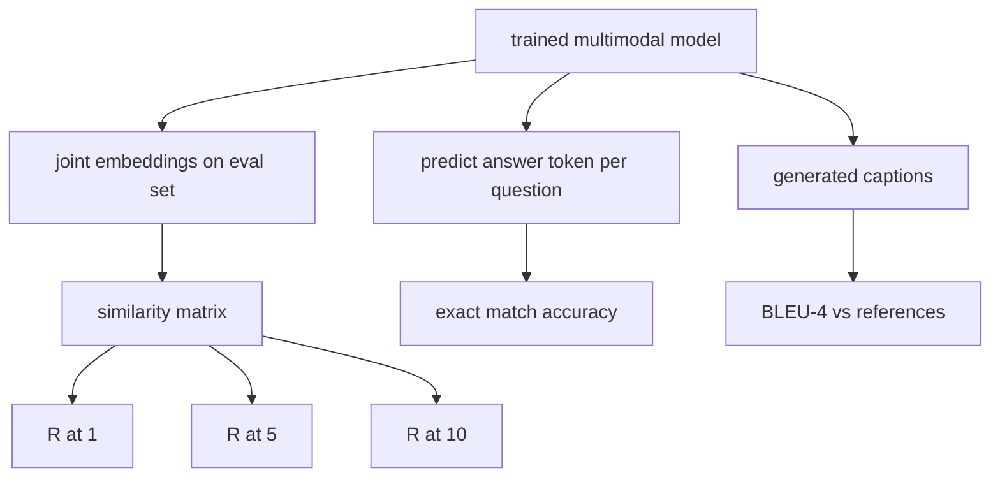

# 멀티모달 평가 (Multimodal Evaluation)

> 학습은 루프의 절반이다. 나머지 절반은 측정이다. 이 레슨에서는 세 가지 평가 지표를 밑바닥부터 만든다. 이미지와 캡션 검색은 R@1, R@5, R@10으로 보고하고, 시각 질의응답은 정확 일치 정확도로 보고하며, 이미지 캡션 생성은 BLEU-4로 보고한다. 각 지표는 모델 출력에 대한 함수이고, 합성 평가 묶음은 몇 초 만에 돌아간다.

**Type:** Build
**Languages:** Python
**Prerequisites:** Phase 19 lessons 58-62 (Track E foundations: encoder, transformer, projection, cross-attention fusion, pretraining)
**Time:** ~90 minutes

## 학습 목표 (Learning Objectives)

- 이미지 임베딩과 캡션 임베딩 사이의 유사도 행렬에서 Recall@K를 계산한다.
- (이미지, 질문) 쌍을 정해진 답변 어휘로 옮기는 모델에서 정확 일치 방식의 시각 질의응답 정확도를 계산한다.
- 외부 라이브러리 없이 생성 토큰 나열과 참조 토큰 나열로 BLEU-4를 계산한다.
- 62번 레슨에서 학습시킨 모델 위에서 합성 평가 묶음으로 세 지표를 모두 돌린다.

## 문제 (The Problem)

학습 손실이 더 이상 내려가지 않으면 멀티모달 모델이 완성되었다고 선언하고 싶어진다. 그러나 학습 손실은 학습 분포에 얼마나 잘 맞았는지를 잴 뿐이다. 따로 떼어 둔 배치에서 쌍의 순위를 제대로 매기는지, 질문에 답할 수 있는지, 사람이 받아들일 만한 캡션을 쓸 수 있는지는 재 주지 않는다. 표준으로 쓰는 평가 지표는 셋이다.

- **검색 (R@1, R@5, R@10).** 질의 캡션의 공통 임베딩을 만들고, 평가 집합의 모든 이미지를 코사인으로 순위 매긴 다음, 짝이 맞는 이미지가 상위 1개나 5개, 10개 안에 들어오는지 보고한다. 이미지에서 텍스트를 찾는 반대 방향도 같은 방식으로 돌린다.
- **시각 질의응답 (정확 일치).** (이미지, 질문)이 주어지면 모델이 답변 토큰을 내놓는다. 정확 일치는 표본마다 0 또는 1이다. 예측한 답이 참조 답과 같은지만 본다. 그것을 평가 집합 전체에 대해 평균 낸다.
- **캡션 생성 (BLEU-4).** 캡션을 생성한다. 참조 캡션에 대해 1-gram부터 4-gram까지의 정밀도를 기하 평균 내고 짧은 문장에 대한 벌점을 곱한다. 이미지 하나에 참조 캡션이 여러 개 붙는 다중 참조 방식이 표준이다.

각 지표는 얇은 함수 하나다. 이 레슨에서는 그것들을 모두 코드로 만든다. 그래야 계산이 구체적으로 보이고, 평가 지표를 직접 통제할 수 있다. 실제 벤치마크 묶음(MS-COCO, VQA v2, GQA, OK-VQA)도 같은 함수 형태에 그대로 끼워 넣을 수 있다.

## 개념 (The Concept)



### 유사도 행렬에서 Recall@K 구하기

이미지 임베딩과 캡션 임베딩 사이의 `(N, N)` 코사인 유사도 행렬을 만든다. 행마다 유사도가 큰 순서로 열을 정렬한다. Recall@K는 대각선 열의 인덱스가 상위 K위 안에 들어온 행의 비율이다. 반대 방향의 Recall@K는 그 행렬을 전치해서 계산한다. 두 값을 모두 보고한다. N이 100인 평가에서 R@1이 0.6이라면, 캡션 100개 가운데 60개가 자기 이미지를 1위로 찾아냈다는 뜻이다.

### 시각 질의응답의 정확 일치

(이미지, 질문, 답변) 하나마다 이미지를 인코딩하고, 질문을 임베딩하고, 디코더로 융합한 다음, 다음 토큰을 읽어 낸다. 예측한 토큰 식별자를 참조 식별자와 비교해서 같으면 정답으로 센다. 그것을 평가 집합에 대해 평균 낸다. 실제 시각 질의응답 데이터셋은 질문마다 사람이 붙인 답변이 여러 개 있고, 부드러운 정확도 수식을 쓴다(주석자 열 명 가운데 세 명 이상이 같은 답을 하면 1.0을 주고 그 아래는 비례해서 깎는다). 이 레슨에서는 설명을 분명히 하려고 답변 하나에 대한 정확 일치만 쓴다.

### BLEU-4

```text
BLEU-4 = BP * exp(mean(log p1, log p2, log p3, log p4))
```

여기에서 `p_n`은 수정된 n-gram 정밀도다. 생성된 n-gram 가운데 참조 문장 어딘가에 나타나는 것의 개수를 참조에 나온 만큼으로 잘라 세고, 그것을 생성된 n-gram 전체 개수로 나눈 값이다. `BP`는 짧은 문장에 대한 벌점이다.

```text
BP = 1                if generated length > reference length
   = exp(1 - r/g)     otherwise, where r is reference length and g is generated
```

표본이 적어서 `p_n` 가운데 0이 나오는 경우에는 보정이 필요하다. 구현에서는 Chen과 Cherry의 "method 1"을 쓴다. 개수가 0인 항의 분자와 분모에 1을 더하는 방식이며, 개수가 적은 상황에서 가장 안전한 기본값이다.

### 합성 평가 묶음

62번 레슨에서 쓴 모의 말뭉치와 같은 방식으로, 다른 시드를 써서 표본 50개짜리 평가 묶음을 메모리에 만든다. 묶음은 목록 세 개로 이루어진다.

- `pairs`: 검색용 (이미지, 캡션 식별자) 쌍 50개.
- `vqa`: (이미지, 질문 식별자, 답변 식별자) 삼중쌍 50개.
- `caps`: (이미지, [참조 캡션 식별자, ...]) 항목 50개이며, 이미지마다 참조가 최대 세 개다.

이 묶음은 시드로부터 결정적으로 만들어지고 학습 말뭉치와 겹치지 않는다. 그래서 모델이 본 적 없는 데이터에서 지표를 계산하게 된다. 이 묶음을 JSON으로 저장하는 일은 아래 연습 문제로 남겨 둔다.

| 지표 | 범위 | 무작위 기준선 (N=50) |
|--------|-------|------------------------|
| R@1 | 0에서 1 | 0.02 (1 / N) |
| R@5 | 0에서 1 | 0.10 |
| R@10 | 0에서 1 | 0.20 |
| VQA EM | 0에서 1 | 1 / 어휘 크기 |
| BLEU-4 | 0에서 1 | 작지만 0은 아니다 |

합성 데이터로 50스텝만 학습한 모델이라면 지표가 높게 나오리라고 기대해서는 안 된다. 다만 무작위 기준선보다는 높아야 하고, 데모가 확인하는 것이 바로 그것이다.

```figure
ch-recall-window
```

## 직접 만들기 (Build It)

`code/main.py`에 다음을 구현한다.

- `recall_at_k(sim_matrix, k)`. 양방향 모두에 대해 `[0, 1]` 범위의 실수를 돌려준다.
- `vqa_exact_match(predictions, references)`. 정수끼리 같은지를 평균 내서 돌려준다.
- `bleu4(generated, references, smoothing=True)`. 참조가 여럿인 경우를 지원한다.
- `build_eval_suite(seed, n_samples, vocab_size, max_len)`. 결정적인 평가 목록 세 개를 돌려준다.
- `evaluate(model, suite)`. 세 지표를 모두 돌려서 숫자를 담은 `dict`를 돌려준다.
- 62번 레슨의 멀티모달 모델을 갓 초기화한 상태로 불러와 평가하고, 50스텝 학습시킨 뒤 다시 평가해서 앞뒤 지표를 출력하는 데모.

다음으로 실행한다.

```bash
python3 code/main.py
```

출력은 이렇다. 앞뒤 지표 표를 보면 검색 성능이 거의 무작위 수준에서 모델이 배운 신호 쪽으로 올라가고, 시각 질의응답이 무작위 기준선 위로 올라가고, BLEU-4도 올라간다. 합성 데이터의 구조만으로도 4-gram 정밀도를 끌어올리기에 충분하다.

## 실제로 써 보기 (Use It)

각 지표는 실무 벤치마크에 그대로 대응한다.

- **검색.** MS-COCO 5K 검증 집합과 Flickr30K, ImageNet 제로샷이 모두 같은 유사도 행렬 위의 R@K 문제다. 합성 평가를 실제 파일로 바꿔도 함수 서명은 그대로다.
- **시각 질의응답.** VQA v2와 GQA, OK-VQA가 같은 정확 일치 형태를 쓴다. 다만 VQA v2는 답변 하나에 대한 정확 일치 대신 부드러운 정확도를 쓴다.
- **BLEU-4.** MS-COCO 캡션과 NoCaps, Flickr30K 캡션이 모두 BLEU-4와 함께 CIDEr, METEOR를 쓴다. CIDEr를 더하는 것은 함수 하나를 더 만드는 일이다.

실제 벤치마크를 쓸 때는 `build_eval_suite`만 실제 로더로 바꾸고 함수 본문은 그대로 두면 된다. 계산 자체는 어느 벤치마크에나 통한다.

## 테스트 (Tests)

`code/test_main.py`는 다음을 확인한다.

- 유사도 행렬이 완벽한 단위 행렬일 때 recall@k가 1.0이 되고, 뒤집힌 행렬에서 k가 N보다 작을 때 0.0이 되는지
- recall@k가 `k <= N`이라는 상한을 지키는지
- 생성 결과가 참조 가운데 하나와 정확히 같을 때 bleu4가 1.0을 돌려주는지
- 어휘가 전혀 겹치지 않을 때 bleu4가 0.0을 돌려주는지
- 시각 질의응답의 정확 일치가 같은 쌍의 비율과 맞는지
- build_eval_suite가 기대한 개수의 쌍과 질의응답 항목, 캡션 항목을 돌려주는지

다음으로 실행한다.

```bash
python3 -m unittest code/test_main.py
```

## 연습 문제 (Exercises)

1. 캡션 지표에 CIDEr를 추가하라. CIDEr는 n-gram에 TF-IDF 가중치를 주므로, 정보를 많이 담은 토큰에 더 큰 점수를 준다.

2. 부드러운 정확도 방식의 시각 질의응답을 구현하라. 질문마다 사람 답변이 여럿 있고, 맞는 것이 하나라도 있으면 정확도는 `min(사람 답변 개수 / 3, 1)`이다. VQA v2를 재현하는 것이다.

3. 생성 결과가 빈 나열일 때도 죽지 않도록, NaN에 안전한 `bleu4` 변형을 만들어라.

4. R@K와 함께 평균 역순위(MRR)를 계산하라. MRR은 정답이 상위 K 밖의 어디에 놓였는지까지 반영하고, R@K는 상위 K 안에 들어왔는지만 본다.

5. 학습 중 체크포인트 다섯 곳(0, 10, 20, 30, 40, 50스텝)에서 평가를 돌리고 학습 곡선을 그려라. 지표의 흐름이 손실의 흐름을 따라가는지 확인하라.

## 핵심 용어 (Key Terms)

| 용어 | 뜻 |
|------|---------------|
| R@K | 정답이 상위 K개 결과 안에 들어온 질의의 비율 |
| Exact match | 가장 단순한 시각 질의응답 채점 방식이며, 예측한 답이 참조와 같은지만 본다 |
| BLEU-4 | 1-gram부터 4-gram까지의 정밀도를 기하 평균 내고 짧은 문장에 벌점을 준 값 |
| Multi-reference | 이미지 하나에 참조 캡션을 여러 개 받는 캡션 평가 방식 |
| Held-out | 학습 말뭉치와 겹치지 않는 시드에서 뽑은 평가 집합 |

## 더 읽을거리 (Further Reading)

- VQA v2 논문. 부드러운 정확도 수식과 데이터셋 통계를 다룬다.
- CIDEr 논문. TF-IDF 가중치를 준 n-gram 캡션 평가를 다룬다.
- BLEU 원 논문(Papineni 외, 2002). 여러 가지 보정 방식을 다룬다.
- MS-COCO 캡션 평가 스크립트. 정석에 해당하는 참조 구현이다.
