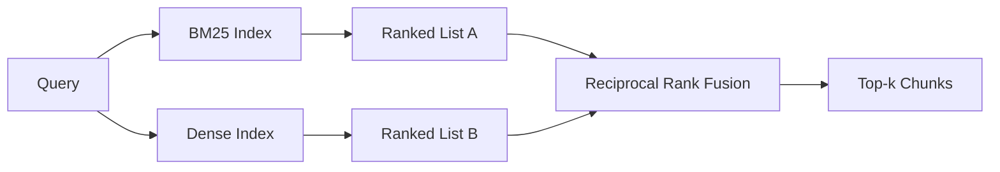

# BM25와 밀집 임베딩을 함께 쓰는 하이브리드 검색 (Hybrid Retrieval with BM25 and Dense Embeddings)

> 어휘 기반 검색과 의미 기반 검색은 서로 정반대의 질의 분포에서 실패한다. 상호 순위 융합을 쓰는 하이브리드 검색은 두 점수를 섞는 것이 아니라 투표를 시키며, 그 투표는 모든 질의 유형에서 이긴다.

**Type:** Build
**Languages:** Python
**Prerequisites:** Phase 11 lessons 04 (embeddings), 06 (RAG); Phase 19 Track B foundations (lessons 20-29); Phase 19 lesson 64 (chunking strategies)
**Time:** ~90 minutes

## 학습 목표 (Learning Objectives)
- Robertson과 Sparck Jones의 정식화를 따라 BM25를 맨바닥에서 구현한다. 필드 가중치와 문서 길이 정규화, 조정 가능한 k1과 b를 포함한다.
- 결정적인 모의 임베딩 위에 밀집 검색기를 만들어, 네트워크 없이 루프가 돌아가게 한다.
- Cormack과 Clarke, Buettcher가 2009년에 발표한 그대로 상호 순위 융합을 구현하고, 왜 그것이 점수를 가중 평균하는 방식을 압도하는지 설명한다.
- 상호 순위 융합의 k 상수와 검색 방식별 가중치를 조정하고, 작은 고정 말뭉치에서 그 맞바꿈을 읽어 낸다.

## 문제 (The Problem)

어휘 기반 검색은 질의에 말뭉치가 글자 그대로 담고 있는 식별자가 들어 있을 때 이긴다. `AbortMultipartOnFail`을 찾는 질의는 BM25로 마이크로초 안에 맞는 Go 함수를 돌려준다. 같은 질의를 임베딩하면 유사도 군집 세 개의 경계에 놓이고, 밀집 검색기는 엉뚱한 파일을 1위에 올린다.

밀집 검색은 질의가 말뭉치의 표현에서 멀어진 다른 말로 쓰였을 때 이긴다. "취소된 업로드를 어떻게 처리하느냐"라고 묻는 사용자는 abort나 multipart라는 단어를 쓴 적이 없다. BM25는 uploads라는 단어가 들어 있다는 이유로 "큰 파일 올리기" 문서 청크를 돌려준다. 밀집 검색은 요약에 취소를 언급한 abort 함수를 찾아낸다.

둘 중 무엇을 쓸지는 한 번 정하고 끝날 문제가 아니다. 변하는 것은 질의 분포다. 실제 RAG 시스템은 같은 엔드포인트로 두 유형을 모두 받으므로, 검색도 둘을 한꺼번에 감당해야 한다. 그것이 하이브리드 검색이다. 그리고 제대로 만들어야 하는 부분은 두 결과를 합치는 단계다.

## 개념 (The Concept)



### BM25를 한 문단으로

BM25는 질의어마다 역문서빈도 항과, 길이 정규화 보정이 들어간 포화형 단어빈도 항을 곱해서 더한 값으로 질의와 문서의 쌍을 채점한다. 조절값은 둘이다. `k1`은 단어빈도가 얼마나 빨리 포화하는지를 정하며, 기본값 1.5는 논문이 권한 값이니 벤치마크 없이 건드리지 마라. `b`는 문서 길이가 얼마나 영향을 주는지를 정하며, 기본값 0.75는 긴 문서에 벌점을 주되 길이에 비례해서 주지는 않는다는 뜻이다.

역문서빈도 수식은 Robertson과 Sparck Jones의 보정된 정의인 `log((N - df + 0.5) / (df + 0.5) + 1)`을 쓴다. 로그 안의 1을 더하는 부분이, 어떤 단어가 말뭉치의 절반 넘게 나타날 때에도 역문서빈도를 양수로 유지해 준다. 불용어가 기술적으로 드물게 나오는 작은 말뭉치에서 이것이 중요해진다.

필드 가중치를 쓰면 BM25에게 심볼 이름에서의 일치가 본문에서의 일치보다 무겁다고 알려 줄 수 있다. 구현은 채점할 때가 아니라 색인할 때 단어 개수에 배수를 곱하는 방식이다. 그래야 계산이 그대로 유지되고, 필드마다 따로 점수를 매기지 않아도 된다.

### 밀집 검색을 한 문단으로

임베딩 모델로 각 청크를 정해진 차원의 벡터로 옮긴다. 질의가 들어오면 질의도 임베딩해서 모든 청크를 코사인 유사도로 순위 매기고 상위 k개를 돌려준다. 품질을 좌우하는 변수는 모델이다. 검색 알고리즘 자체는 두 줄이다. 내적을 구하고 정렬한다.

이 레슨에서는 네트워크 호출 없이 융합 계산을 읽을 수 있도록 결정적인 해시 기반 임베딩을 쓴다. 해시는 토큰마다 정해진 위치의 값을 96차원 벡터에 더한 다음 정규화한다. 그래서 실행할 때마다 코사인 순위가 같게 나오고, 테스트 묶음이 요구하는 것이 바로 그것이다.

### 상호 순위 융합, 발표된 수식 그대로

순위가 매겨진 목록이 둘 있다. 어느 한쪽에라도 등장하는 후보마다 순위의 역수 기여도를 더한다. 2009년 논문은 `1 / (k + rank)`를 썼고 k의 기본값은 60이었다. 그렇게 합산한 점수로 정렬한다. 알고리즘은 이게 전부다.

발표된 상수 k = 60은 아무렇게나 고른 값이 아니다. k가 60이면 1위의 기여도는 1 / 61이고 10위의 기여도는 1 / 70이다. 기여도가 천천히 줄어들기 때문에 뒤쪽 후보도 여전히 투표에 참여한다. k가 작으면 상위 결과가 지배하고, k가 크면 기여도 곡선이 평평해진다.

여기 구현에서 조절할 수 있는 값은 둘이다. 하나는 `k` 상수이고, 다른 하나는 검색 방식별 가중치다. 자기 말뭉치에서 어느 쪽이 낫다는 근거가 이미 있다면 BM25나 밀집 검색을 더 밀어 줄 수 있다. 순위 기여도에 가중치를 곱하는 것이 가장 단순하면서도 원리에 맞는 구현이다. 순위가 줄어드는 모양을 그대로 유지하고 점수의 크기에 좌우되지 않기 때문이다.

### 융합이 점수 가중 평균을 이기는 이유

BM25 점수에는 상한이 없고 말뭉치에 따라 달라진다. 코사인 유사도는 -1에서 1 사이에 갇혀 있다. `alpha * bm25 + (1 - alpha) * cosine` 같은 선형 결합은 말뭉치마다 alpha를 다시 맞춰야 하고, 색인을 다시 만들 때마다 무너진다. 순위 기반 융합은 그렇지 않다. 순위는 검색 방식이 달라도 서로 비교할 수 있다. 2010년 이후 공개된 TREC 트랙 전부에서, 발표된 상호 순위 융합 기준선이 점수 보간 방식을 이겼다.

Vespa와 Weaviate 문서에서 RankFusion과 RRF를 두고 하는 이야기도 같은 논지다. 두 문서 모두 같은 결론에 이르렀다. 점수를 섞어야 할 아주 강한 근거가 있지 않은 한 순위 기반을 유지하라는 것이다.

```figure
rrf-fusion
```

## 직접 만들기 (Build It)

`code/main.py`에 다음을 구현한다.

- `tokenize(text)`. 정규식 기반의 빠른 토크나이저다.
- `BM25Index`. 필드 가중치를 지원하며 `add`와 `search`, 조정 가능한 k1과 b를 갖는다.
- `mock_embed`와 `DenseIndex`. 64번 레슨과 같은 결정적 임베딩이며, 그래야 청크끼리 비교할 수 있다.
- `rrf(rankings, k, weights)`. 검색 방식별 가중치를 지원하는, 발표된 그대로의 융합이다.
- `HybridRetriever`. BM25와 밀집 검색을 묶는다.
- 작은 고정 말뭉치를 읽어 들이고, 각 검색기의 강점과 약점을 노리는 질의 세 개를 돌려서, 방식별 순위와 융합된 목록을 함께 출력하는 `main()` 데모.

다음으로 실행한다.

```bash
python3 code/main.py
```

데모 출력을 나란히 놓고 읽어 보라. 식별자를 그대로 쓴 질의는 BM25에서 1위, 밀집 검색에서 4위, 융합 결과에서 1위다. 다른 말로 바꿔 쓴 질의는 BM25에서 6위, 밀집 검색에서 1위, 융합 결과에서 1위다. 애매한 질의는 BM25에서 3위, 밀집 검색에서 3위, 융합 결과에서 1위다. 융합은 동점을 가르는 장치가 아니라, 모든 질의 유형에서 이기는 방식이다.

## 조절값 다루기 (Tuning the knobs)

| 조절값 | 기본값 | 올릴 때 | 내릴 때 |
|------|---------|----------------|------------------|
| BM25 k1 | 1.5 | 문서 안에서 단어가 되풀이되고, 그 빈도를 더 반영하고 싶을 때 | 문서가 짧아서 단어 반복이 잡음일 때 |
| BM25 b | 0.75 | 긴 문서일수록 단어당 정보가 실제로 적을 때 | 문서 길이가 주제와 상관없을 때 |
| RRF k | 60 | 뒤쪽 후보도 계속 투표하게 하고 싶을 때 | 1위가 지배하게 하고 싶을 때 |
| BM25 가중치 | 1.0 | 말뭉치에 식별자가 그대로 들어 있고 질의가 그것과 맞을 때 | 질의가 사용자가 바꿔 쓴 말일 때 |
| 밀집 검색 가중치 | 1.0 | 질의가 바꿔 쓴 말일 때 | 질의가 글자 그대로일 때 |

감이 아니라, 따로 떼어 둔 질의 집합에 68번 레슨의 평가 하네스를 다시 돌려서 조정하라.

## 데모가 가려 주는 실패 양상 (Failure modes the demo will hide)

**말뭉치에 없는 토큰.** BM25의 역문서빈도는 말뭉치에서 계산하므로, 질의에만 있는 단어는 기여도가 0이다. 반면 밀집 임베딩은 같은 단어에 대해서도 그럴듯한 벡터를 지어낸다. 말뭉치 밖의 식별자에서는 밀집 검색이 그럴듯해 보이지만 틀린 이웃을 돌려준다. 융합은 이것을 어느 정도 흡수한다. BM25가 아무것도 돌려주지 않으면 그 순위 기여도가 사라지기 때문이다. 다만 청크 단위가 아니라 문서 단위로 중복을 제거해야 그 효과가 난다.

**불용어가 지배하는 경우.** "the" 같은 단어로 BM25를 돌리면 말뭉치 전체에 대해 고르게 순위가 매겨진다. 색인 단계에서 불용어를 걸러 내거나, 역문서빈도가 높은 단어가 자연스럽게 지배한다는 사실을 받아들여라.

**두 방식의 결과가 같은 경우.** 말뭉치가 작아서 BM25의 1위와 밀집 검색의 1위가 같다면, 융합 결과의 1위도 같고 뒤따르는 이웃도 같다. 이것은 잘못이 아니라 올바른 동작이다. 다만 융합이 아무 일도 하지 않는 것처럼 보이게 만든다. 평가에 서로 반대 방향의 질의 쌍을 넣어서 융합이 실제로 동작하는지 확인하라.

## 실제로 써 보기 (Use It)

실무에서 지킬 것들이다.

- BM25는 프로세스 안에서 색인하라. 병목은 벡터가 아니라 단어빈도 사전이다.
- 밀집 벡터는 별도의 저장소에 색인하라. 이 레슨에서는 평평한 목록을 쓰지만, 실무에서는 HNSW를 쓴다.
- 두 질의를 나란히 돌려라. 융합은 합집합에 대한 상수 시간 병합이다.
- 검색된 항목마다 어느 방식에서 나왔는지 남겨 두라. 그러면 뒤따르는 리랭커가 어느 방식이 그것을 뽑았는지 볼 수 있다.

## 결과물로 남기기 (Ship It)

66번 레슨은 이 레슨에서 융합한 상위 k개를 받아 크로스 인코더로 다시 순위를 매긴다. 68번 레슨은 정밀도와 재현율, MRR, nDCG로 파이프라인 전체를 평가한다. 이 레슨의 하이브리드 검색기는 69번 레슨에서 만드는 전 구간 시스템의 첫 단계다.

## 연습 문제 (Exercises)

1. `mock_embed`를 쓰는 공급자의 실제 모델로 바꿔라. 데모를 다시 돌리고, 바꿔 쓴 질의에서 밀집 검색만 썼을 때의 순위가 어떻게 달라지는지 보고하라.
2. 세 번째 방식을 추가하라. 청크 요약을 따로 색인해서 세 번째 순위 목록으로 융합하는 것이다. 그 이득을 측정하라.
3. RRF의 k를 10, 30, 60, 100, 200으로 훑어라. 68번 레슨의 recall@k 곡선을 그려라. 자기 말뭉치에서 곡선이 가장 높은 k 값을 보고하라.
4. BM25F를 제대로 구현하라(배수를 곱하는 편법이 아니라 필드별 길이 정규화를 쓴다). 그리고 심볼 일치가 가장 중요한 말뭉치에서 비교하라.

## 핵심 용어 (Key Terms)

| 용어 | 흔히 쓰는 뜻 | 정확한 뜻 |
|------|-----------------|------------------------|
| BM25 | "어휘 기반 검색" | 역문서빈도와 포화형 단어빈도, 길이 정규화를 곱해 순위를 매기는 확률 기반 방법 |
| RRF | "순위 융합" | 순위 목록들에 걸쳐 1 / (k + 순위)를 더하는 방법이며 k의 기본값은 60이다 |
| k1 | "단어빈도 포화" | 같은 단어가 되풀이될 때 점수가 더 이상 오르지 않기 시작하는 속도를 정한다 |
| b | "길이 벌점" | 0이면 문서 길이를 무시하고, 1이면 길이로 완전히 정규화한다 |
| Field weighting | "심볼 가중" | 색인할 때 토큰을 여러 번 세어 그 필드에서의 일치를 강조하는 것 |
| 순위 기반 융합과 점수 기반 융합 | "RRF가 선형 결합을 이기는 이유" | 순위는 검색 방식이 달라도 비교할 수 있지만 점수는 그렇지 않다 |

## 더 읽을거리 (Further Reading)

- Cormack, Clarke, Buettcher, "Reciprocal Rank Fusion outperforms Condorcet and individual rank learning methods", SIGIR 2009
- Robertson, Walker, Beaulieu, Gatford, Payne, "Okapi at TREC-3" (BM25를 처음 제시한 논문)
- [Vespa: Hybrid Retrieval with BM25 and Embeddings](https://docs.vespa.ai/en/tutorials/hybrid-search.html)
- [Weaviate: Hybrid Search](https://weaviate.io/developers/weaviate/search/hybrid)
- Phase 11 레슨 06. RAG 기초를 다룬다.
- Phase 19 레슨 64. 여기에서 색인하는 청크를 만들어 내는 청커를 다룬다.
- Phase 19 레슨 66. 융합된 상위 k개를 받아 쓰는 크로스 인코더 리랭커를 다룬다.
