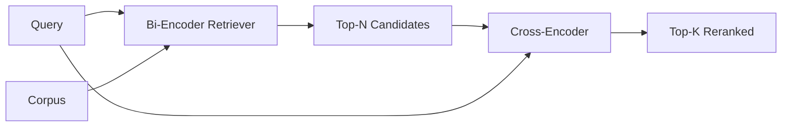

# 크로스 인코더 리랭커 (Cross-Encoder Reranker)

> 바이 인코더는 질의와 문서를 따로따로 임베딩한다. 크로스 인코더는 둘을 이어 붙여 한꺼번에 읽는다. 크로스 인코더는 가장 똑똑한 독자이면서 가장 느린 독자다. 바이 인코더가 뽑은 상위 k개에 두 번째 단계로 붙이면 그 비용값을 한다.

**Type:** Build
**Languages:** Python
**Prerequisites:** Phase 11 lesson 06 (RAG), Phase 11 lesson 07 (advanced RAG); Phase 19 Track B foundations (lessons 20-29); Phase 19 lesson 65 (hybrid retrieval feeding this stage)
**Time:** ~90 minutes

## 학습 목표 (Learning Objectives)
- 바이 인코더 검색기와 크로스 인코더 리랭커를, 입력 형태와 파라미터 개수, 질의당 비용으로 구분한다.
- (질의, 문서)를 하나로 묶은 시퀀스를 받아 관련성 점수 하나를 내놓는 트랜스포머 블록으로 작은 크로스 인코더를 맨바닥에서 구현한다.
- 검색한 다음 다시 순위를 매기는 2단계 파이프라인을 잇는다. 값싼 검색기로 상위 N개를 뽑고, 크로스 인코더로 N개를 상위 K개로 줄여 돌려준다.
- 작은 고정 말뭉치에서 지연 시간과 품질의 맞바꿈을 측정하고, 주어진 지연 시간 예산에 맞는 N을 고른다.

## 문제 (The Problem)

바이 인코더는 질의와 문서를 같은 벡터 공간으로 옮기고 코사인으로 순위를 매긴다. 두 인코딩은 서로를 전혀 보지 못한다. 모델은 질의를 모르는 채로, 문서에서 쓸모 있을 만한 모든 것을 벡터 하나에 압축해 넣어야 한다. 이 방식은 빠르다. 색인할 때 문서마다 한 번, 질의할 때 한 번만 임베딩하면 된다. 말뭉치 전체 규모에서 순위를 매길 수 있는 유일한 방법이기도 하다.

대신 정밀도를 잃는다. 전체 주제가 같은 두 문서는, 한쪽만 질의에 답하고 다른 쪽은 답하지 않아도 임베딩이 거의 같을 수 있다. 바이 인코더는 그 둘을 갈라내지 못한다.

크로스 인코더는 질의와 문서를 함께 읽어서 이 문제를 푼다. 모델은 `[질의] [SEP] [문서]`를 하나의 시퀀스로 받아, 그 이음매를 가로질러 전체 어텐션을 돌리고, 관련성 점수 하나를 내놓는다. 문서의 모든 토큰이 질의의 모든 토큰을 참조할 수 있다. 모델이 맥락을 온전히 보고 점수를 정한다.

대신 처리량을 잃는다. 바이 인코더는 한 번 임베딩해 두고 계속 질의하면 되지만, 크로스 인코더는 (질의, 문서) 쌍마다 한 번씩 돌아야 한다. 문서가 1,000만 개인 말뭉치라면 질의 하나에 순전파를 1,000만 번 돌려야 한다. 요청 시간 예산 안에서는 불가능하다.

해법은 단계를 나누는 것이다. 바이 인코더로 상위 N개를 뽑는다. 크로스 인코더로 그 N개를 상위 K개로 줄인다. N은 작고(50에서 200 사이), 크로스 인코더의 품질 향상은 그것이 실제로 필요한 자리에 집중된다. 전체 지연 시간은 요청 예산 안에 머문다. 전체 품질은 크로스 인코더의 품질이 되며, 그 상한은 바이 인코더가 N개 안에 정답을 넣어 주는 재현율이다.

## 개념 (The Concept)



### 크로스 인코더의 입력 형태

표준 구성은 `[CLS] 질의 토큰 [SEP] 문서 토큰 [SEP]`이다. CLS 위치의 출력을 선형 헤드 하나에 넣어 관련성 점수를 얻는다. CLS 대신 평균을 내는 구현도 있지만 차이는 작다. 중요한 것은 모델이 쌍마다 숫자 하나를 내놓는다는 점이다.

파라미터가 2,200만 개인 크로스 인코더(공개된 `ms-marco-MiniLM-L-6-v2` 급)가 실무에서 흔히 쓰는 지점이다. 그보다 작은 모델은 아끼는 지연 시간보다 잃는 품질이 크다. 그보다 큰 모델(예를 들어 파라미터 5억 6,800만 개의 `bge-reranker-v2-m3`)은 오프라인 재순위나, K가 작은 첫 페이지 재순위에만 쓴다.

### 이 레슨에서 아주 작은 모델을 학습시키는 이유

실제 크로스 인코더는 파인튜닝한 인코더 트랜스포머다. 실무에서는 체크포인트를 읽어 들여 실행하기만 하면 된다. 이 레슨의 목적은 최고 성능의 랭커를 학습시키는 것이 아니라, 모델의 형태와 지연 시간 대 품질 곡선의 형태를 보여 주는 것이다. 그래서 트랜스포머 블록 하나와 멀티헤드 어텐션(기본값 4개 헤드), 회귀 헤드 하나로 이루어진 작은 `nn.Module`을 만든다. 시드로 결정적으로 초기화하므로 디스크에 가중치를 두지 않고도 데모를 재현할 수 있다.

이 장난감 모델은 고정 말뭉치에서 필요한 형태를 배운다. 관련 있는 질의와 문서 쌍은 관련 없는 쌍보다 높은 점수를 받는다. 전 구간 파이프라인은 바이 인코더의 출력을 다시 순위 매기고, 그 상위 k개가 정답 레이블과 상관을 보인다.

### 지연 시간과 품질

2단계 파이프라인에서 조절할 수 있는 것은 N 하나다. 따로 떼어 둔 질의 집합에서 N을 5부터 100까지 훑으면 곡선이 나온다.

| N | 2단계의 recall@1 | 질의당 크로스 인코더 순전파 횟수 | 지연 시간 |
|---|--------------------|---------------------------------------|---------|
| 5 | 0.62 | 5 | 낮음 |
| 20 | 0.81 | 20 | 중간 |
| 50 | 0.86 | 50 | 높음 |
| 100 | 0.86 | 100 | 매우 높음 |

위 숫자는 곡선의 모양을 보여 주는 예시이며, 이 고정 데이터에서 잰 값이 아니다. 다만 모양 자체는 실제와 같다. 후보 20개에서 50개 사이 어딘가에 재순위의 이득이 더 이상 늘지 않는 꺾이는 지점이 언제나 있다. 그 지점을 넘어가면 아무것도 얻지 못하면서 비용만 낸다.

평가 곡선과 지연 시간 예산을 함께 보고 N을 정하라. 크로스 인코더는 바이 인코더가 N개 안에 정답을 넣어 준 비율보다 재현율을 높일 수 없다. 그래서 N이 작으면 지연 시간뿐 아니라 품질의 상한까지 낮아진다.

```figure
rerank-funnel
```

## 직접 만들기 (Build It)

`code/main.py`에 다음을 구현한다.

- `CrossEncoder`. 작은 `torch.nn.Module`이다. 토큰 임베딩과, 멀티헤드 어텐션 및 피드포워드로 이루어진 트랜스포머 블록 하나, 그리고 평균을 내서 점수 하나를 내놓는 헤드로 구성된다.
- `tokenize_pair(query, document)`. 문자열 두 개를 경계를 표시하는 타입 식별자와 함께 하나의 식별자 나열로 묶는다. 결정적으로 동작하고 표준 라이브러리만 쓴다.
- `train_tiny(pairs)`. 손으로 레이블한 (질의, 문서, 관련성) 삼중쌍 목록으로 한 차례 지도 학습을 돌려서, 모델이 고정 데이터에서 그럴듯한 점수를 내게 한다.
- `rerank(query, candidates, top_k)`. 실무에서 쓰는 인터페이스다.
- `pipeline(query, retriever, top_n, top_k)`. 2단계 흐름이다.
- 65번 레슨과 같은 방식으로 말뭉치를 읽어 들이고, 상위 N개를 검색하고, 상위 K개로 다시 순위를 매기고, 두 목록을 나란히 출력하고, 단계별 지연 시간을 보고하는 `main()` 데모.

다음으로 실행한다.

```bash
python3 code/main.py
```

출력에는 바이 인코더의 상위 N개와 크로스 인코더의 상위 K개, 그리고 시간 요약이 나온다. 크로스 인코더는 호출 한 번에 더 오래 걸리지만 말뭉치 전체에는 돌지 않는다. 2단계 전체는 요청 예산 안에 머물면서, 바이 인코더가 2위나 3위로 밀어 두었던 답을 골라낸다.

## 데모가 가려 주는 실패 양상 (Failure modes the demo will hide)

**크로스 인코더는 대칭이 아니다.** `rerank(q, d)`와 `rerank(d, q)`는 다른 점수를 낸다. 언제나 질의를 먼저 넣어라. 실수로 뒤바꾸면 재현율이 무너진다.

**N이 너무 작아서 문제가 드러나지 않는다.** N을 K와 같게 두면 크로스 인코더는 순서를 바꿀 수 없고 점수만 다시 매긴다. 그러면 이득이 0으로 보인다. N을 적어도 K의 세 배로 잡아라.

**학습 데이터가 평가로 새어 든다.** 손으로 레이블한 학습 쌍에 평가 질의가 들어 있으면 재순위가 마법처럼 보인다. 고정 데이터에서도 학습과 평가를 엄격히 분리하라.

**실무 가중치는 무겁다.** 파라미터 2,200만 개짜리 크로스 인코더는 float32로 88MB다. p95 지연 시간을 100밀리초 밑으로 약속하기 전에 모델 서버의 메모리부터 계획하라.

**배치가 중요하다.** 실제 크로스 인코더는 후보 N개를 한 배치로 돌린다. 이 레슨에서는 `_batch_encode`가 그 일을 하며, `torch.tensor(...)`로 식별자 텐서와 타입 식별자 텐서를 배치로 만들어 순전파를 한 번만 돌린다. 배치를 쓰지 않으면 지연 시간이 N배가 된다.

## 실제로 써 보기 (Use It)

실무에서 지킬 것들이다.

- 바이 인코더와 크로스 인코더, N을 한 묶음으로 고정하라. 셋 가운데 하나만 바꿔도 평가 결과가 무효가 된다.
- 리랭커의 출력을 (질의, 문서 식별자) 해시로 캐시하라. 말뭉치가 그대로라면 같은 질의는 같은 순서로 재순위되므로, 캐시가 맞을 때마다 지연 시간을 공짜로 줄일 수 있다.
- 1위의 크로스 인코더 점수를 기록하라. 1위 점수가 말뭉치마다 정한 기준 아래인 질의는 다루는 범위 밖의 질의이며, LLM에게 "확신하지 못한다"로 전달해야 한다.

## 결과물로 남기기 (Ship It)

68번 레슨이 이 2단계 파이프라인을 전 구간으로 평가한다. 69번 레슨은 이 리랭커를 65번 레슨의 하이브리드 검색기 뒤, 답변 생성기 앞에 끼워 넣는다. 리랭커는 전 구간 시스템의 두 번째 단계다.

## 연습 문제 (Exercises)

1. N을 5부터 50까지 훑으면서 재순위 결과의 recall@1을 그려라. 이 고정 데이터에서 곡선이 꺾이는 지점을 찾아라.
2. 크로스 인코더를 한 에포크가 아니라 열 에포크 학습시켜라. 에포크마다 양성 쌍과 음성 쌍 사이의 점수 차이를 측정하라.
3. 평균을 내는 헤드를 CLS 토큰 헤드로 바꿔라. 이 고정 데이터에서 수렴 속도를 비교하라.
4. "이 문서에 답이 들어 있는가"를 예측하는 이진 레이블 헤드를 두 번째로 추가하라. 추론할 때 두 헤드를 모두 써서, 하나로는 순위를 매기고 다른 하나로는 기준값을 걸어라.
5. 결정적인 모의 바이 인코더를 65번 레슨의 것으로 바꾸고 두 단계를 이어라. 바이 인코더만 썼을 때와 견주어 상위 K개가 어떻게 달라지는지 측정하라.

## 핵심 용어 (Key Terms)

| 용어 | 흔히 쓰는 뜻 | 정확한 뜻 |
|------|-----------------|------------------------|
| Bi-encoder | "벡터 검색기" | 질의와 문서를 따로 인코딩하고 코사인으로 순위를 매기는 방식 |
| Cross-encoder | "리랭커" | (질의, 문서)를 함께 인코딩해 관련성 점수 하나를 내놓는 방식 |
| Two-stage pipeline | "검색하고 다시 순위 매기기" | 값싼 검색기가 N개를 돌려주고, 비싼 리랭커가 K개를 남기는 구성 |
| N (후보 예산) | "재순위 풀" | 질의마다 크로스 인코더가 채점하는 후보의 개수 |
| Mean-pooling head | "마지막 은닉층의 평균" | 인코더 마지막 층의 출력을 평균 내어 벡터 하나로 만드는 것 |

## 더 읽을거리 (Further Reading)

- Nogueira, Cho, "Passage Re-ranking with BERT", 2019. 크로스 인코더 랭커를 다룬 정석 논문이다.
- Reimers, Gurevych, "Sentence-BERT: Sentence Embeddings using Siamese BERT-Networks", 2019. 바이 인코더와 크로스 인코더를 견주어 다룬다.
- [SentenceTransformers Cross-Encoders documentation](https://www.sbert.net/examples/applications/cross-encoder/README.html)
- [BGE Reranker v2 model card](https://huggingface.co/BAAI/bge-reranker-v2-m3)
- Phase 19 레슨 65. 이 재순위 단계에 입력을 넘겨 주는 하이브리드 검색기를 다룬다.
- Phase 19 레슨 68. 이 재순위가 만들어 내는 이득을 측정하는 평가를 다룬다.
