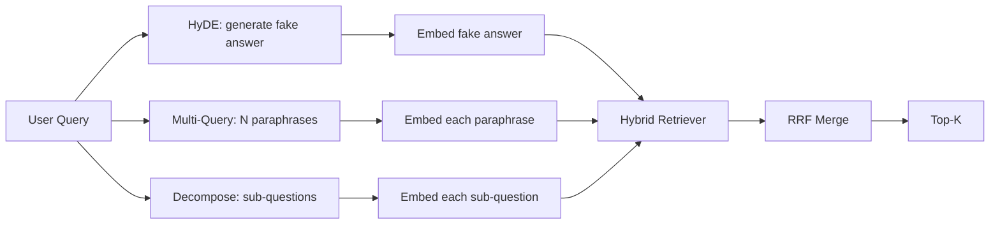

# 질의 다시 쓰기: HyDE, 다중 질의, 분해 (Query Rewriting: HyDE, Multi-Query, and Decomposition)

> 사용자가 입력한 질의는 검색기가 바라는 질의가 아니다. 다시 쓰기는 검색이 일어나기 전에 그 틈을 메워서, 색인이 정답에 더 가까운 문장을 보게 만든다.

**Type:** Build
**Languages:** Python
**Prerequisites:** Phase 11 lessons 04 (embeddings), 06 (RAG); Phase 19 Track B foundations (lessons 20-29); Phase 19 lessons 64 and 65
**Time:** ~90 minutes

## 학습 목표 (Learning Objectives)
- 가상 문서 임베딩(HyDE)을 구현한다. 가짜 답변을 생성하고, 그것을 임베딩하고, 질의 벡터 대신 그 벡터로 검색한다.
- 다중 질의 확장을 구현한다. 질의 하나를 N개의 다른 표현으로 바꾸고, 각각으로 검색한 뒤, 그 합집합을 상호 순위 융합으로 합친다.
- 질의 분해를 구현한다. 복잡한 질문을 하위 질문으로 쪼개고, 하위 질문마다 검색한 뒤 합친다.
- 세 가지 다시 쓰기 방식을 같은 고정 데이터에서 맞붙여 보고, 각각 언제 이기는지 설명한다.
- 고정 데이터에 맞춰 결정적으로 동작하는 모의 LLM을 연결해서, 다시 쓰기 루프가 네트워크 없이 돌아가게 한다.

## 문제 (The Problem)

사용자가 "업로드가 실패하고 예산이 다 떨어지면 우리 팀은 어떻게 하느냐"라고 입력한다. 말뭉치에는 "AbortMultipartOnFail은 진행 중인 S3 멀티파트 업로드를 중단하고, 업로드가 실패하면 버킷별 재시도 예산을 하나 깎는다"라고 적힌 문서가 있다. 질의와 문서 사이에 겹치는 명사구가 하나도 없다. BM25는 놓친다. 바이 인코더는 그 문서를 3위나 4위에 놓는다. 질의 벡터가 임베딩 공간에서 중단된 업로드보다 취소된 작업을 다루는 문서 쪽을 선호하는 영역에 떨어지기 때문이다. 66번 레슨의 2단계 재순위는 그 문서가 상위 N개 안에 들어 있으면 답을 건져 낼 수 있지만, 애초에 상위 N개에도 못 들면 리랭커는 그것을 보지도 못한다.

해법은 질의가 검색기에 닿기 전에 다시 쓰는 것이다. 2023년 논문 「Precise Zero-Shot Dense Retrieval without Relevance Labels」(Gao 외)가 HyDE를 제시했다. LLM에게 그 질의에 답할 법한 문서를 쓰게 하고, 그 가상 문서를 임베딩해서 검색 벡터로 쓰는 방식이다. 그 가상 문서는 말뭉치의 어투로 쓰였기 때문에 임베딩 공간의 알맞은 영역에 놓인다. 원래 질의 벡터는 그러지 못했다.

HyDE와 짝을 이루는 기법이 둘 더 있다. 다중 질의 확장(마이크로소프트의 GraphRAG가 쓴 용어다)은 질의를 N가지로 바꿔 쓴 다음 각각으로 검색해서 합친다. 분해(2024년 스탠퍼드 DSPy 연구에서 "하위 질의 분해"로 알려졌다)는 "업로드가 실패하고 예산이 다 떨어지면 우리 팀은 어떻게 하느냐"를 두 질문으로 쪼갠다. "업로드가 실패하면 어떻게 되느냐"와 "재시도 예산이 다 떨어지면 어떻게 되느냐"다. 검색을 두 번 하고 결과를 하나로 합치면, 답의 두 조각 모두에 닿을 수 있다.

이 레슨에서는 셋을 모두 구현하고 같은 고정 말뭉치에 돌려 본다.

## 개념 (The Concept)



### HyDE 자세히 보기

HyDE는 사용자의 질의 벡터를 LLM이 쓴 가상 문서의 벡터로 바꾼다. 프롬프트는 짧다.

```
You are a domain expert. Write a one-paragraph passage that answers the question
below. Use the same vocabulary and phrasing the documentation in this domain would
use. Do not refuse. Do not say you do not know.

Question: {user_query}

Passage:
```

LLM이 내놓은 답은 사실로서는 틀렸다. LLM이 우리 말뭉치를 모르기 때문이다. 그래도 괜찮다. 검색기는 사실 여부가 아니라 토큰 분포만 본다. 그 가상 문단에는 "abort"와 "multipart", "bucket", "budget" 같은 단어가 들어 있다. 이 주제를 다루는 문서라면 그렇게 쓰였을 것이기 때문이다. 그 문단을 임베딩하면 벡터가 실제 문단 근처에 떨어진다.

실무에서는 가상 문서를 두세 문장으로 제한한다. 길어지면 잡음이 늘고, 너무 짧으면 HyDE에 필요한 어휘 신호가 사라진다.

### 다중 질의 확장 자세히 보기

사용자의 질의를 N가지로 바꿔 쓴다. 가장 단순한 프롬프트는 이렇다.

```
Rewrite the following question in {N} different ways. Each rewrite must preserve
the original intent. Number them 1 to {N}. Do not add explanations.
```

바꿔 쓴 질의마다 상위 k개를 검색한다. 그리고 N개의 순위 목록을 상호 순위 융합으로 합친다(65번 레슨과 같은 알고리즘이다). 값싸고, 나란히 돌릴 수 있고, 결과가 일정하다.

다중 질의는 사용자의 표현이 똑같이 타당한 여러 표현 가운데 하나일 때, 그리고 바꿔 쓴 것 중 하나가 더 잘 물었을 때 이긴다. 원래 질의가 나빴고 바꿔 쓴 것들도 같은 방식으로 나쁘다면 진다.

### 분해 자세히 보기

검색 한 번으로는 여러 갈래가 섞인 질문을 채울 수 없다. 분해는 LLM에게 질문을 하위 질문으로 쪼개게 하고, 시스템이 하위 질문마다 검색한다. 프롬프트는 이렇다.

```
The following question may require information from multiple distinct topics.
Decompose it into a list of sub-questions. Each sub-question must be answerable
independently. If the question is already atomic, return it unchanged.

Question: {user_query}
```

하위 질문마다 검색하고 합친다. 분해는 접속사가 들어 있거나, 여러 절을 견주거나, 서로 관련 없는 두 주제를 담은 질문에 알맞은 도구다. 더 쪼갤 수 없는 질문에는 맞지 않는다. 그런 경우 분해기가 할 일은 질문 하나를 그대로 돌려주는 것이지, 없는 하위 질문을 지어내는 것이 아니다.

### 셋이 모두 존재하는 이유

셋은 서로를 보완한다. HyDE는 질의와 말뭉치 사이의 어휘 격차를 메운다. 다중 질의는 표현이 제각각인 문제를 덮는다. 분해는 주제가 여럿인 질의를 덮는다. 실무 시스템은 셋을 모두 돌리고 질의마다 전략을 고른다. 69번 레슨의 전 구간 시스템에 그 선택기가 나온다.

## 모의 LLM (The Mock LLM)

이 레슨은 네트워크 없이 돌아간다. 모의 LLM은 사용자의 질의를 키로 삼는 작은 조회 표에, 본 적 없는 질의를 위한 대체 규칙을 더한 것이다. 조회 표에는 다음이 들어 있다.

- 고정 질의마다 미리 써 둔 가상 문단 하나와 바꿔 쓴 표현 세 개, 그리고 분해 결과.
- 모르는 질의에는 결정적인 변환을 적용한다. 질의에서 내용어를 뽑고, 동의어 표로 넓힌 다음 그 결과를 돌려준다.

여기에서 중요한 것은 그 데이터가 아니라 모의 객체의 형태다. 실무에서는 이 모의 객체를 실제 모델 호출로 바꾸면 된다. 검색기는 그대로 둔다.

```figure
cd-hyde-vector
```

## 직접 만들기 (Build It)

`code/main.py`에 다음을 구현한다.

- `MockLLM`. 위에서 설명한 결정적인 대역이다.
- `HyDERewriter`. LLM을 불러 가상 문서를 쓰게 하고, 그 가상 문서와 검색기가 써야 할 질의를 담은 `RewriteResult`를 돌려준다.
- `MultiQueryRewriter`. LLM을 불러 바꿔 쓴 표현 N개를 받고, 질의 목록을 돌려준다.
- `DecomposeRewriter`. LLM을 불러 질문을 쪼개고, 하위 질문들을 돌려준다.
- `retrieve_with_rewriter`. 다시 쓰기 방식과 검색기를 받아, 다시 쓰기를 돌리고 결과를 융합한다.
- 세 가지 다시 쓰기를 고정 데이터에 돌려서, 어떤 전략이 정답 문서를 가장 먼저 돌려주는지 출력하는 데모.

검색기의 형태는 65번 레슨(BM25와 밀집 검색을 함께 쓰는 하이브리드)에서 그대로 가져온다. 융합도 같은 상호 순위 융합이다. 새로 생기는 것은 다시 쓰기 인터페이스뿐이고 그것도 작다.

다음으로 실행한다.

```bash
python3 code/main.py
```

출력은 전략별 순위와 마지막 요약이다. 표현이 어긋난 질의에서는 HyDE가 이긴다. 표현이 제각각인 질의에서는 다중 질의가 이긴다. 주제가 여럿인 질의에서는 분해가 이긴다. 다시 쓰기를 하지 않은 경우는 셋 가운데 적어도 하나에서 진다.

## 데모가 가려 주는 실패 양상 (Failure modes the demo will hide)

**HyDE가 말뭉치에만 있는 식별자를 틀리게 지어낸다.** 모델이 없는 함수 이름을 만들어 낸다. 그러면 그 지어낸 이름이 가중치 높은 토큰이 되는데 색인에는 없으므로, 맞는 문서에 대한 가상 문서의 BM25 점수가 무너진다. 가상 문서의 길이를 제한하고 융합에서 BM25 가중치를 낮춰라.

**바꿔 쓴 질의들이 모두 비슷해진다.** 성능이 약한 모델은 거의 같은 표현 세 개를 내놓는다. 그러면 N번 검색해도 같은 상위 k개가 나오고, 융합이 한 번 검색한 것보다 나을 것이 없다. 다시 쓰기 프롬프트에 서로 다르게 쓰라는 지시를 명시하고, 자카드 유사도로 중복을 잡아내라.

**분해가 지나치게 쪼갠다.** 분해기가 더 쪼갤 수 없는 질문을 목록으로 만든다. 그러면 검색 결과가 모두 같은 문서를 돌려주면서 순위만 낮아진다. 합친 결과가 원래보다 나빠진다. 갈래를 치기 전에 "이 하위 질문들이 서로 충분히 다른가"를 확인하는 단계를 두어 이것을 잡아내라.

**지연 시간이 배로 늘어난다.** HyDE는 LLM 호출 한 번이 든다. 다중 질의는 바꿔 쓰기를 만드는 LLM 호출 한 번에 검색 N번이 든다. 분해는 쪼개는 LLM 호출 한 번에 검색 M번이 든다. 검색은 나란히 돌릴 수 있으므로, 바닥을 결정하는 것은 LLM 호출이다.

## 실제로 써 보기 (Use It)

실무에서 지킬 것들이다.

- 질의 길이로 전략을 고른다. 짧고 단일 주제인 질의에는 다중 질의를, 절이 여럿인 복잡한 질의에는 분해를, 전문 용어가 많은 질의에는 HyDE를 쓴다.
- 다시 쓰기 결과를 질의 해시로 캐시하라. 같은 질의가 자주 되풀이된다.
- 셋을 나란히 돌리고 세 결과 집합을 상호 순위 융합으로 하나로 합쳐라. 비용은 LLM 호출 세 번과 융합 한 번이고, 품질은 세 전략이 덮는 범위의 합집합이 된다.

## 결과물로 남기기 (Ship It)

69번 레슨은 이 다시 쓰기 단계를 65번 레슨의 검색기와 66번 레슨의 리랭커 앞에 붙인다. 68번 레슨은 다시 쓰기가 검색 재현율을 얼마나 끌어올리는지 평가한다.

## 연습 문제 (Exercises)

1. RAG-Fusion을 구현하라. 2024년에 나온 다중 질의 변형이며, 바꿔 쓴 표현을 일부러 서로 다르게 만든 다음 66번 레슨의 재순위 단계가 최종 목록을 고른다.
2. 네 번째 전략을 추가하라. 한 걸음 물러서는 프롬프트다(LLM에게 더 일반적인 질문을 받아 그것으로 검색한 다음 범위를 좁힌다). 고정 데이터에서 비교하라.
3. 분해기에 "이 질문이 더 쪼갤 수 없는가"를 판정하는 헤드를 붙여, 쪼갤 수 없는 질의를 알아보게 학습시켜라. 그 전후로 지나치게 쪼개는 비율을 측정하라.
4. 모의 LLM을 실제 모델 호출로 바꿔라. 자기 환경에서 전략별 지연 시간을 측정하라.
5. 다시 쓰기마다 확신도 점수를 붙여라. 기준 아래인 것은 버려라. 그것이 재현율에 미치는 영향을 측정하라.

## 핵심 용어 (Key Terms)

| 용어 | 흔히 쓰는 뜻 | 정확한 뜻 |
|------|-----------------|------------------------|
| HyDE | "가짜 문서로 검색하기" | LLM이 답을 쓰고, 질의 대신 그것을 임베딩해서 검색하는 방식 |
| Multi-query | "표현 넓히기" | 질의를 N가지로 바꿔 쓰고 N번 검색한 뒤 상호 순위 융합으로 합치는 방식 |
| Decomposition | "하위 질의로 쪼개기" | 주제가 여럿인 질의를 하위 질문으로 나눠 각각 검색하는 방식 |
| Atomic query | "단일 주제" | 없는 하위 질문을 지어내지 않고는 더 쪼갤 수 없는 질의 |
| Step-back | "질의를 추상화하기" | 더 일반적인 질문을 받아 검색한 다음 범위를 좁히는 방식 |

## 더 읽을거리 (Further Reading)

- Gao, Ma, Lin, Callan, "Precise Zero-Shot Dense Retrieval without Relevance Labels" (HyDE), 2023
- Microsoft Research, "Multi-Query Expansion for Retrieval"
- Stanford DSPy, "Subquery Decomposition for Multi-Hop QA"
- [LlamaIndex query transformations documentation](https://docs.llamaindex.ai/en/stable/optimizing/advanced_retrieval/query_transformations/)
- Phase 11 레슨 07. 심화 RAG 패턴을 다룬다.
- Phase 19 레슨 65. 이 다시 쓰기가 입력을 넘겨 주는 검색기를 다룬다.
- Phase 19 레슨 68. 다시 쓰기가 만들어 내는 이득을 측정하는 평가를 다룬다.
