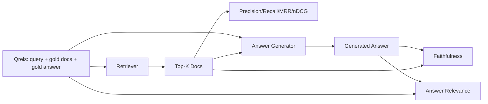

# RAG 평가: 정밀도, 재현율, MRR, nDCG, 근거 충실성, 답변 적합성 (RAG Evaluation: Precision, Recall, MRR, nDCG, Faithfulness, Answer Relevance)

> 검색과 답변을 동시에 채점하지 못하면 그 시스템을 내보낼 수 없다. 둘은 같은 지표가 아니고, 같은 프롬프트가 서로 다른 축에서 실패한다.

**Type:** Build
**Languages:** Python
**Prerequisites:** Phase 11 lessons 06 (RAG), 10 (evaluation); Phase 19 Track B foundations (lessons 20-29); Phase 19 lessons 64, 65, 66, 67
**Time:** ~90 minutes

## 학습 목표 (Learning Objectives)
- 정답 레이블에서 검색 지표 네 가지를 계산한다. precision@k, recall@k, MRR(평균 역순위), nDCG@k다.
- 답변 채점 지표 두 가지를 계산한다. 근거 충실성(답변의 모든 주장이 검색된 맥락에 근거하는가)과 답변 적합성(답변이 질문에 답하고 있는가)이다.
- 평가가 처음부터 끝까지 읽어 들일 고정 정답 파일(질의, 정답 문서 식별자, 정답 문장)을 만든다.
- 지표 값을 읽고 파이프라인이 어디에서 실패하는지 진단한다. 검색인지, 순위 매기기인지, 생성인지, 근거 연결인지 가른다.

## 문제 (The Problem)

RAG 시스템에는 움직이는 부품이 적어도 넷 있다. 청커, 검색기, 리랭커, 생성기다. 답이 틀렸을 때 그 원인은 어느 것이든 될 수 있다. 단계별 지표가 없으면 눈을 가린 채 나는 것과 같다.

사용자가 답이 틀렸다고 알려 온다. 청커가 정답 구간을 잘라 버렸기 때문인가? 검색기가 그 청크를 상위 k개에 넣지 못했기 때문인가? 리랭커가 맞는 청크를 1위 밖으로 밀어냈기 때문인가? 생성기가 그 청크를 무시하고 지어냈기 때문인가? 답만 봐서는 알 수 없다. 필요한 것은 이렇다.

- 검색기가 무엇을 내놓았는지 채점하는 검색 지표.
- 맞는 청크가 순서상 어디에 놓였는지 채점하는 순위 지표.
- 생성기가 검색된 맥락 안에 머물렀는지 채점하는 근거 충실성.
- 답변이 애초에 질문에 답하고 있는지 채점하는 답변 적합성.

이 레슨에서는 고정 정답 파일 위에 이 여섯 가지를 모두 만든다. 평가는 네트워크 없이 결정적으로 돌아간다. 실무에서는 모의 심판 LLM을 실제 모델로 바꾸면 된다.

## 개념 (The Concept)



### Precision@k

검색기가 돌려준 상위 k개 문서 가운데 정답 집합에 속한 것의 비율이다. 정답이 문서 세 개인데 상위 3개에 그중 둘과 엉뚱한 것 하나가 들어 있다면 precision@3은 2 / 3이다. 관련 없는 청크를 가져오는 비용이 클 때 정밀도를 본다. 생성기가 거기에 토큰을 낭비하거나, 그 청크가 답을 오염시키는 경우다.

### Recall@k

정답 문서 가운데 상위 k개에 들어온 것의 비율이다. 정답이 문서 세 개인데 상위 5개에 셋이 모두 들어 있다면 recall@5는 1.0이다. 답을 놓치는 비용이 클 때 재현율을 본다. 정답 청크를 아예 놓치느니 엉뚱한 청크 하나를 더 보는 편이 나은 경우다.

실무 RAG에서 사람들이 주로 인용하는 지표는 recall@k다. 생성 단계는 관련 없는 청크를 어렵지 않게 버릴 수 있지만, 한 번도 본 적 없는 청크에서 답을 지어낼 수는 없기 때문이다.

### MRR (평균 역순위)

질의마다 순위 목록에서 처음으로 관련 있는 문서가 놓인 위치를 찾는다. 역순위는 1 / 위치다. 그것을 질의 집합에 대해 평균 낸다. MRR은 검색기가 가장 좋은 답을 얼마나 위쪽에 올려놓는지를 숫자 하나로 요약한다.

MRR은 1위에 큰 비중을 준다. 정답 문서가 1위인 질의는 1.0을 기여한다. 2위면 0.5, 10위면 0.1이다. 이 지표는 목록의 맨 위가 좌우한다.

### nDCG@k

정규화 할인 누적 이득이다. 전체 수식은 검색된 문서마다 이득을 부여하고(관련 있으면 1, 없으면 0으로 두는 경우가 많다), 위치의 로그로 할인하고, 더한 다음, 이상적인 DCG로 나눈다. 이상적인 DCG는 완벽하게 순위를 매겼을 때의 값이다. 범위는 0에서 1이다.

nDCG는 단계가 있는 관련성을 받아들인다. 정답이 "문서 A는 3, 문서 B는 2, 문서 C는 1"이라고 말할 수 있다. MRR과 recall@k는 그것을 모두 0과 1로 납작하게 만든다. 질의마다 부분적으로 관련 있는 문서가 여럿인 말뭉치에는 nDCG를 쓴다.

### 근거 충실성 (Faithfulness)

생성된 답변의 주장마다, 그것이 검색된 맥락으로 뒷받침되는지 확인한다. 표준적인 구현은 (주장, 맥락)을 받아 예 또는 아니오를 돌려주는 심판 LLM 프롬프트를 쓴다. 지표는 통과한 주장의 비율이다.

근거 충실성은 모델이 내용을 지어내는 생성 단계의 실패를 잡아낸다. 검색기가 맞는 청크를 돌려주었더라도 생성기가 환각을 일으킨다면 그 시스템은 망가진 것이다. 근거 충실성은 근거성이나 뒷받침, 출처 귀속이라고도 부른다.

이 레슨에서는 결정적으로 동작하는 모의 심판으로 근거 충실성을 구현한다. 각 주장의 토큰이 검색된 맥락과 기준 이상 겹치는지를 본다. 실무에서는 실제 모델 호출로 바꾸면 된다. 지표의 형태는 같다.

### 답변 적합성 (Answer relevance)

답변이 실제로 질문에 답하고 있는가? 근거 충실성은 "답변이 맥락에 근거하는가"를 묻고, 답변 적합성은 "답변이 질문에 붙어 있는가"를 묻는다. 근거는 충실하지만 주제에서 벗어난 답변은 근거 충실성이 높고 적합성이 낮다. 짧고 주제에 맞지만 맥락을 무시한 답변은 적합성이 높고 근거 충실성이 낮다.

표준적인 구현도 심판 LLM을 쓴다. (질문, 답변)을 받아 그 답변이 질문에 답하는지 묻는다. 이 레슨에서는 토큰 겹침과 심판을 함께 쓰는 대역을 구현한다.

## 고정 정답 파일 (The fixture qrels)

```python
{
  "qid": "q1",
  "query": "what is the abort threshold for multipart uploads",
  "gold_doc_ids": ["d1", "d3"],
  "gold_answer_substring": "three failed parts",
  "graded_relevance": {"d1": 3, "d3": 2},
}
```

질의마다 다음을 담는다.
- 질의 문자열.
- 정답 문서 식별자 집합(정밀도, 재현율, MRR에 쓴다).
- 단계가 매겨진 관련성 딕셔너리(nDCG에 쓴다).
- 정답에 들어가야 할 문구. 각 항목의 참조 메타데이터로 둔다. 이 레슨의 근거 충실성은 이 문구가 아니라, 뽑아낸 주장을 검색된 맥락에 비추어 판정해서 계산한다.

실무에서는 이것을 직접 레이블한다. 이 레슨은 손으로 만든 고정 데이터를 제공하므로 평가가 바로 돌아간다.

```figure
ci-rag-metric-ladder
```

## 직접 만들기 (Build It)

`code/main.py`에 다음을 구현한다.

- `precision_at_k(retrieved, gold, k)`. 정의 그대로다.
- `recall_at_k(retrieved, gold, k)`. 정의 그대로다.
- `mean_reciprocal_rank(retrieved_list_of_lists, gold_list)`. 질의에 대한 평균이다.
- `ndcg_at_k(retrieved, graded_relevance, k)`. 이득을 0과 1로 두거나 단계로 두고 DCG를 IDCG로 나눈다.
- `extract_claims(answer)`. 답변을 문장 단위 주장으로 쪼갠다.
- `faithfulness(claims, context_texts, judge)`. 뒷받침된다고 판정된 주장의 비율이다.
- `answer_relevance(question, answer, judge)`. 답변이 질문에 답하는지를 심판이 판정한다.
- `MockJudge`. 토큰 겹침으로 판정하는 결정적 심판이며, 평가가 네트워크 없이 돌아가게 해 준다.
- `evaluate_pipeline(pipeline_fn, qrels, ks)`. 모든 지표를 돌리는 조율기다.
- 파이프라인 변형 세 가지(청커 기준선, 하이브리드 검색, 하이브리드에 재순위를 더한 것)를 정답 파일에 돌려 지표 표를 출력하는 데모.

다음으로 실행한다.

```bash
python3 code/main.py
```

출력은 변형마다 precision@k와 recall@k, MRR, nDCG@k, 근거 충실성, 답변 적합성을 담은 지표 표 하나다. 하이브리드 검색 행은 재현율에서 청커 기준선을 이기고, 재순위 행은 MRR에서 하이브리드를 이긴다.

## 지표를 읽어 실패를 진단하기 (Reading the metrics to diagnose failures)

| 증상 | 짐작되는 원인 | 고칠 곳 |
|---------|-------------|-------------|
| recall@k도 낮고 precision@k도 낮음 | 청커가 답을 잘랐거나 검색기가 찾지 못함 | 청커 경계(레슨 64)나 검색 방식(레슨 65) |
| recall@k는 괜찮은데 MRR이 낮음 | 맞는 청크가 상위 k에는 있지만 1위가 아님 | 리랭커(레슨 66) |
| MRR은 높은데 근거 충실성이 낮음 | 맥락이 맞는데도 생성기가 내용을 지어냄 | 생성 프롬프트. 인용하거나 아니면 거절하게 만들어라 |
| 근거 충실성은 높은데 적합성이 낮음 | 근거는 맞지만 주제에서 벗어남 | 질의 다시 쓰기(레슨 67)나 생성 프롬프트 |
| 네 지표가 다 높은데 사용자가 여전히 불만 | 평가 집합이 실제를 대표하지 못함 | 실제 사용자 질의로 정답 집합을 넓혀라 |

## 데모가 가려 주는 실패 양상 (Failure modes the demo will hide)

**심판 LLM의 편향.** 모델은 자기 출력을 실제보다 더 충실하다고 판정한다. 심판에는 생성기와 다른 계열의 모델을 쓰거나, 표본을 뽑아 사람이 직접 채점하라.

**정답 파일이 낡는다.** 말뭉치가 바뀌면 정답도 흘러간다. 2024년 1월에 q1의 정답이던 문서가, 팀이 함수 이름을 바꾼 뒤인 2024년 10월에는 더 이상 맞는 답이 아니다. 분기마다 정답 파일을 검토하는 일정을 잡아라.

**문장 단위 검사가 큰 틀의 주장을 놓친다.** 문장마다 근거 충실성을 통과하면서도 답변 전체의 구성이 오해를 부를 수 있다. 자동 지표 위에 표본을 뽑아 사람이 살펴보는 검토를 얹어라.

**recall@k가 질의별 실패를 가린다.** 평균 재현율이 90퍼센트여도 어떤 질의 유형은 늘 실패하고 있을 수 있다. 정답 집합을 질의 유형별로(그대로 쓴 질의, 바꿔 쓴 질의, 주제가 여럿인 질의) 나누어 각각 보고하라.

## 실제로 써 보기 (Use It)

실무에서 지킬 것들이다.

- 검색기나 생성기를 바꿀 때마다 평가를 돌려라. recall@k가 떨어지면 테스트 실패처럼 다뤄라.
- 질의마다 지표 기록을 남겨 두라. 사용자가 불만을 제기하면 그에 맞는 정답 항목을 찾아, 미리 잡을 수 있었는지 확인하라.
- 정답 집합을 계층으로 나눠라. CI에서 도는 질의 20개짜리 빠른 검사, 밤마다 도는 200개짜리 회귀 검사, 주마다 도는 2,000개짜리 깊은 검사로 두는 식이다.

## 결과물로 남기기 (Ship It)

69번 레슨은 파이프라인 전체(청커, 검색기, 리랭커, 생성기)를 잇고, 그 전 구간 시스템에 이 평가를 돌린다.

## 연습 문제 (Exercises)

1. 다섯 번째 검색 지표를 추가하라. hit-rate@k다. recall@k와 비교하고, 언제 두 값이 달라지는지 설명하라.
2. 단계가 있는 근거 충실성을 구현하라. 0은 뒷받침되지 않음, 1은 일부만 뒷받침됨, 2는 온전히 뒷받침됨이다. 지표 계산도 그에 맞게 고쳐라.
3. 모의 심판을 실제 모델 호출로 바꿔라. 고정 데이터에서 모의 심판과 실제 심판의 판정이 얼마나 엇갈리는지 재라.
4. 질의 유형별 분류("그대로 쓴 질의", "바꿔 쓴 질의", "주제가 여럿인 질의")를 추가하라. 유형별 지표를 보고하라.
5. "답변 길이" 지표를 추가하고 근거 충실성과의 상관을 보라. 그 곡선을 그려라.

## 핵심 용어 (Key Terms)

| 용어 | 흔히 쓰는 뜻 | 정확한 뜻 |
|------|-----------------|------------------------|
| Precision@k | "가져온 것 중 맞은 비율" | 상위 k개 가운데 정답인 것의 비율 |
| Recall@k | "정답 중 가져온 비율" | 정답 가운데 상위 k개에 들어온 것의 비율 |
| MRR | "첫 정답의 위치" | 처음으로 관련 있는 문서가 놓인 순위의 역수를 평균 낸 값 |
| nDCG@k | "단계가 있는 순위 품질" | 상위 k개에 대한 DCG를 이상적인 DCG로 나눈 값 |
| Faithfulness | "근거성" | 검색된 맥락이 뒷받침하는 답변 주장의 비율 |
| Answer relevance | "질문에 답했는가" | 답변이 질문의 의도와 맞는지 여부 |
| Qrels | "정답 레이블" | 질의와 그 정답 문서, 정답 답변을 레이블해 둔 집합 |

## 더 읽을거리 (Further Reading)

- Buckley, Voorhees, "Evaluating Evaluation Measure Stability", SIGIR 2000. 순위 지표를 다룬 정석 논문이다.
- Jarvelin, Kekalainen, "Cumulated Gain-based Evaluation of IR Techniques". nDCG를 제시한 논문이다.
- [Ragas: Automated Evaluation of RAG Pipelines](https://docs.ragas.io)
- [Anthropic, Evaluating RAG](https://www.anthropic.com/news/evaluating-rag)
- Phase 11 레슨 10. 평가 체계의 기초를 다룬다.
- Phase 19 레슨 64부터 67까지. 여기에서 평가하는 구성 요소들을 다룬다.
- Phase 19 레슨 69. 이 평가가 채점하는 전 구간 파이프라인을 다룬다.
