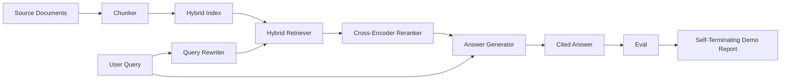

# 전 구간 RAG 시스템 (End-to-End RAG System)

> 여섯 레슨 분량의 부품, 파이프라인 하나, 평가 루프 하나, 스스로 끝을 맺는 데모 하나. 이것이 실제로 내보내는 시스템이다.

**Type:** Build
**Languages:** Python
**Prerequisites:** Phase 11 lessons 06 (RAG), 10 (evaluation); Phase 19 Track B foundations (lessons 20-29); Phase 19 lessons 64, 65, 66, 67, 68
**Time:** ~90 minutes

## 학습 목표 (Learning Objectives)
- 청커와 하이브리드 검색기, 질의 다시 쓰기, 크로스 인코더 리랭커, 답변 생성기를 하나의 전 구간 파이프라인으로 잇는다.
- 각 주장에 청크 위치를 인용으로 붙이고, 확신이 낮으면 답을 거절하는 답변 생성기를 구현한다.
- 68번 레슨의 평가를 조립된 파이프라인에 돌려서, 단계를 쌓아 만든 시스템이 부품을 따로 쓸 때보다 모든 지표에서 낫다는 것을 증명한다.
- 고정 말뭉치를 받아들이고, 정해진 질의 집합을 돌리고, 요약 보고서와 함께 종료 코드 0으로 끝나는 명령줄 데모를 만든다.

## 문제 (The Problem)

부품 여섯 개를 따로 두는 것으로는 아무것도 증명하지 못한다. 청커가 말뭉치 기준 recall@5에서는 이기면서, 시스템 전체의 recall@5에서는 질 수 있다. 검색기가 그 청커의 출력을 제대로 순위 매기지 못하기 때문이다. 리랭커가 합성 후보 묶음에서는 MRR을 끌어올리면서, 실제 바이 인코더 후보에서는 실패할 수 있다. 재순위 예산 안에서 바이 인코더의 재현율이 너무 낮기 때문이다. 질의 다시 쓰기가 질의 하나에서는 정답 문서를 올려 주고 다음 질의에서는 무너질 수 있다. 모의 LLM이 쓸모없는 가상 문서를 내놓기 때문이다.

통합 시험은 같은 고정 정답 집합에 같은 지표로 파이프라인 전체를 돌리는 것이고, 모든 것을 잇는 조율 파일 하나가 있어야 한다. 이 레슨이 만드는 것이 바로 그것이다. 통합된 파이프라인의 지표가 각 단계를 따로 돌린 데모의 지표를 이긴다면, 그 시스템이 동작한다는 것을 증명한 셈이다.

## 개념 (The Concept)



### 연결 방식 정하기

파이프라인은 작은 그래프다. 각 단계는 서명이 분명한 함수 하나다.

| 단계 | 입력 | 출력 |
|-------|-------|--------|
| 청커 | 문서 본문 | Chunk 레코드 목록 |
| 검색기 | 질의 문자열 | 상위 N개 Chunk 레코드 |
| 다시 쓰기(선택) | 질의 문자열 | 바꿔 쓴 질의 목록과 가상 문서 |
| 리랭커 | 질의와 후보 | 크로스 점수가 붙은 상위 K개 Chunk 레코드 |
| 생성기 | 질의와 상위 K개 Chunk 레코드 | 인용이 붙은 답변 문자열 |

서명이 안정되어 있으면 조립은 어렵지 않다. 이 레슨의 `Pipeline` 클래스는 다섯 단계를 들고 있고, 그것을 순서대로 돌리는 `query` 메서드를 제공한다. 모든 단계는 바꿔 끼울 수 있다. 다른 청커나 검색기, 다시 쓰기, 리랭커, 생성기를 넣어도 파이프라인은 그대로 돌아간다.

### 인용이 붙는 답변 생성기

생성기는 마지막 단계이면서 가장 망가지기 쉬운 곳이다. 이 레슨에서 제공하는 결정적인 모의 생성기는 다음을 한다.

1. 재순위된 상위 K개 청크를 받는다.
2. 질의와 내용어가 가장 많이 겹치는 청크를 최대 두 개까지 고른다.
3. 고른 청크마다 문장 하나씩을 이어 붙여 답변을 만들고, 각 문장 뒤에 `[doc_id:chunk_index]` 형태의 위치 표시를 붙인다.
4. 거절 기준을 넘는 청크가 하나도 없으면 인용 없이 "모르겠다"를 내놓는다.

실무에서는 이 모의 객체를 다음 프롬프트 틀을 쓰는 실제 LLM 호출로 바꾼다.

```
You are answering a question using only the snippets below.
Cite every claim with the anchor in parentheses.
If the snippets do not answer the question, say "I do not know".

Question: {query}

Snippets:
{enumerated chunks with anchors}

Answer:
```

확신이 낮을 때 거절하는 경로가, 크로스 인코더 1위 점수를 기록해 두는 이유의 전부다. 그 점수가 말뭉치마다 정한 기준 아래라면 생성기는 답을 거절한다. 지어낸 답변에 대한 안전 밸브다.

### 스스로 끝을 맺는 데모

데모는 전 구간을 돌린다. 질의 하나에 대해 단계별 분해를 출력하고, 고정 정답 네 건에 대해 평가를 돌리고, 지표 표를 출력하고, 68번 레슨의 지표가 데모에서 정한 기준을 모두 충족하면 종료 코드 0으로 끝난다. 어느 하나라도 기준 아래면 종료 코드를 0이 아닌 값으로 내고, 어떤 지표가 실패했는지 이름을 대는 메시지를 출력한다.

CI에서 도는 빠른 검사가 바로 이런 모양이다. 파이프라인은 네트워크 없이 빠르게, 결과가 일정하게 돌아간다. 고정 데이터에 대한 기준값은 일부러 빡빡하게 잡았다. 그래야 여섯 레슨 가운데 어디에서든 성능이 나빠지면 데모가 실패한다.

```figure
rag-pipeline-flow
```

## 직접 만들기 (Build It)

`code/main.py`에 다음을 구현한다.

- `Chunk`. 모든 단계를 거쳐 다니는 레코드다(64번 레슨의 형태에 chunk_index와 원본 doc_id를 더한다).
- `Chunker`. 64번 레슨의 전략 가운데 하나를 고른다(기본값은 재귀 분할이다).
- `HybridIndex`. 65번 레슨의 BM25와 밀집 검색, 상호 순위 융합을 묶는다.
- `Rewriter`(선택). 67번 레슨의 HyDE와 다중 질의, 분해 가운데 하나를 질의 길이와 접속사 유무로 고른다.
- `Reranker`. 66번 레슨에서 학습시킨 크로스 인코더이며, 몇 초 만에 수렴하도록 학습 고정 데이터를 더 작게 쓴다.
- `Generator`. 인용을 붙이고 확신이 낮으면 거절하는, 결정적인 모의 생성기다.
- `Pipeline`. 다섯 단계를 조립하고, `Result(answer, top_k, latency_ms_per_stage)`를 돌려주는 `query(question)` 메서드를 제공한다.
- `run_demo()`. 말뭉치를 받아들이고, 고정 질의 세 개를 돌리고, 평가를 돌리고, 결과를 출력하고, 기준값에 따라 종료 코드를 정한다.

다음으로 실행한다.

```bash
python3 code/main.py
```

출력은 질의 하나의 처리 과정과 전체 평가 표, 그리고 마지막 통과·실패 상태다. 고정 데이터에서는 종료 코드 0을 돌려준다.

## 데모가 가려 주는 실패 양상 (Failure modes the demo will hide)

**청커 경계가 어긋난다.** 정답 집합에 레이블을 붙일 때와 데모를 돌릴 때 사이에 청커 전략을 바꾸면, 정답 문서 식별자가 더 이상 맞지 않는다. 정답 파일에 청커 전략을 고정해 두라. 데모에는 어떤 청커를 썼는지 밝히는 머리말이 들어 있다.

**리랭커 학습 데이터가 평가로 새어 든다.** 66번 레슨의 학습 삼중쌍 14개에는 평가 질의와 닮은 질의가 들어 있다. 실무에서는 평가 질의를 엄격히 떼어 두어라. 이 데모의 평가 질의는 재순위 학습 집합과 일부러 겹치지 않게 만들었다.

**모의 생성기가 환각 위험을 가린다.** 모의 생성기는 검색된 청크의 문장만 내보내므로 환각을 일으킬 수 없다. 레슨에서 이 점을 밝히고, 실무에서 실제 모델로 바꾸는 경로를 알려 준다.

**스트리밍이 없다.** 이 파이프라인은 단계마다 끝에서 답변 전체를 돌려준다. 실무 시스템이라면 생성기의 출력을 스트리밍할 것이다. 스트리밍은 이 레슨의 범위 밖이다. 답변 채점 지표는 어느 쪽이든 최종 문자열에 대해 계산한다.

**지연 시간이 네트워크 없이 측정된다.** 모의 LLM 호출은 시간이 일정하다. 실제 LLM 호출은 전체 시간을 좌우한다. 요청 범위에서 지연 시간 예산을 따로 계획하라. 이 레슨의 단계별 측정은 CPU 작업만 잰다.

## 실제로 써 보기 (Use It)

실무에서 지킬 것들이다.

- 파이프라인 파일을 조율기 하나 아래에 두고 단계 인터페이스를 명시하라. 연결 코드를 저장소 여기저기에 흩뿌리지 마라.
- 어느 단계든 건드리는 병합 전에 평가를 돌려라. 평가가 떨어지면 그 병합은 들어가지 않는다.
- CI 실행마다 지표 기록을 남겨 두라. 그래야 성능이 나빠졌을 때 어느 단계를 바꿔서인지 짚을 수 있다.
- 회귀 집합의 부분집합으로 질의 20개짜리 빠른 검사를 만들어 30초 안에 돌게 하라. 전체 회귀 집합은 밤마다 돌린다.

## 결과물로 남기기 (Ship It)

이 레슨의 파이프라인 파일이, Phase 19 Track F의 나머지 레슨이 전제하는 형태다. 이후 레슨이라면 그 위에 자동 수집과 증분 재색인, 텔레메트리, 서빙 계층을 얹게 된다. 검색과 재순위, 다시 쓰기, 평가에 해당하는 절반은 여기에서 마무리된다.

## 연습 문제 (Exercises)

1. 다시 쓰기 안에 질의별 전략 선택기를 넣어라. 67번 레슨의 어림짐작(길이, 접속사, 전문 용어 비율)으로 HyDE와 다중 질의, 분해 가운데 하나를 고르게 하라.
2. 환경 변수 플래그 뒤에 실제 LLM 호출을 생성기로 붙여라. 기본값은 모의 생성기로 둔다. 지연 시간 차이를 측정하라.
3. 데모에 `--corpus path` 플래그를 추가해서 실제 말뭉치를 읽어 들이게 하라. 평가와 기준값 검사를 다시 돌려라.
4. 청커에 `--strategy` 플래그를 추가하라. 전략마다 전 구간 재현율에 얼마나 기여하는지 측정하라.
5. 스트리밍 생성기 인터페이스를 추가하고 그것을 평가에 넣어라. 근거 충실성이 스트리밍 도중의 앞부분이 아니라 최종 문자열에 대해 계산되는지 확인하라.

## 핵심 용어 (Key Terms)

| 용어 | 흔히 쓰는 뜻 | 정확한 뜻 |
|------|-----------------|------------------------|
| Pipeline | "RAG 파이프라인" | 수집에서 인용 붙은 답변까지 이어진 단계들의 조합 |
| Citation anchor | "출처 링크" | 각 주장에 붙는 (doc_id, chunk_index) 참조 |
| Refuse-on-low-confidence | "모르겠습니다" | 리랭커의 1위 점수가 기준 아래일 때 생성기가 답을 내놓지 않는 것 |
| Smoke set | "CI 평가" | 모든 풀 리퀘스트 검사에서 도는 최소한의 정답 부분집합 |
| Stage interface | "함수 서명" | 파이프라인 각 단계의 안정된 입력 타입과 출력 타입 |

## 더 읽을거리 (Further Reading)

- [Anthropic, Building search and retrieval](https://www.anthropic.com/news/contextual-retrieval)
- [Pinterest, MCP internal search](https://medium.com/pinterest-engineering). 실무 구조를 참고할 사례다.
- [Ragas: Automated Evaluation of RAG Pipelines](https://docs.ragas.io)
- Phase 11 레슨 06. RAG 기초를 다룬다.
- Phase 19 레슨 64부터 68까지. 여기에서 조립하는 구성 요소들을 다룬다.
