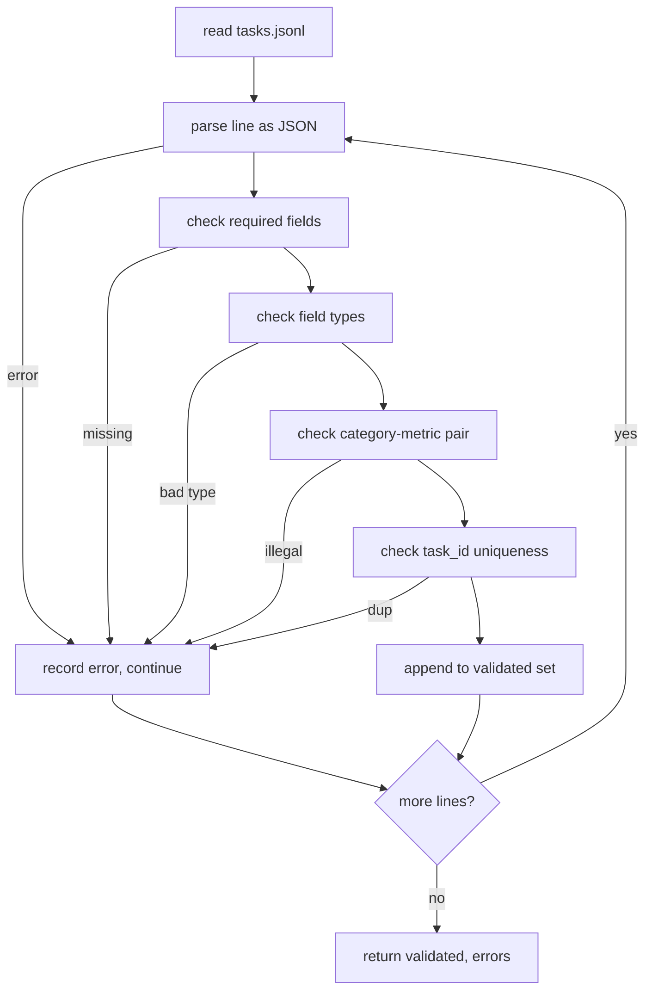

# 과제 명세 형식 (Task Spec Format)

> 평가 하네스의 품질은 그 과제들이 지키는 계약만큼만 좋아진다. 채점 함수를 한 줄이라도 쓰기 전에 JSONL 형식과 지표 이름 목록부터 고정하라.

**Type:** Build
**Languages:** Python
**Prerequisites:** Phase 19 Track B foundations
**Time:** ~90 min

## 학습 목표 (Learning objectives)

- 산술과 객관식, 코드 실행, 분류, 자유 형식 요약을 하나의 형태로 담는 JSONL 과제 레코드 스키마를 정의한다.
- 지표 이름을 닫힌 목록으로 못 박아, 이후 레슨(71번부터 73번까지)이 필드 하나로 분기할 수 있게 한다.
- 퓨샷 예시와 후처리 규칙을 실행기가 아니라 과제 쪽에 명시해서, 같은 프롬프트가 모델이 달라져도 같은 대상을 만들어 내게 한다.
- 형식이 잘못된 레코드가 실행기에 닿기 전에 물리치는 엄격한 검증기를 구현한다.
- 명세의 모든 갈래를 건드리는 과제 10개짜리 고정 데이터를 제공해서, 검증기가 실제로 씹어 볼 것을 준다.

```figure
ci-task-spec-gate
```

## 명세를 고정하는 이유 (Why a frozen spec)

연구용 코드베이스에는 테스트보다 평가 스크립트가 더 빨리 쌓인다. 여섯 달이 지나면 노트북마다 자기만의 JSON 형태가 있고, 지표마다 구현이 두 벌씩 있고, 실행 결과끼리 비교할 수 없게 된다. 해법은 지루하다. 스키마를 하나 고르고, 검증기를 쓰고, 나머지는 전부 물리치는 것이다. 이 레슨이 하는 일이 그것이다.

여기의 형태는 BIG-bench와 HELM, lm-eval 계열 하네스에서 발상을 빌렸지만 필드 이름은 우리 것이다. 모든 필드에는 주인이 하나씩 있다. 실행기는 과제를 읽는다. 지표는 정답을 읽는다. 후처리 단계는 생성 결과를 정규화한다. 파이프라인 중간에 바뀌는 필드는 하나도 없다.

## 레코드의 형태 (The record shape)

과제 하나는 한 줄짜리 JSON 객체다. 하네스는 `tasks.jsonl`을 읽어 각 줄을 따로 검증한다. 잘못된 줄은 그 레코드만 중단시키고 실행 전체를 멈추지는 않는다.

```json
{
  "task_id": "arith_001",
  "category": "arithmetic",
  "prompt": "Compute the result. Question: 17 + 24\nAnswer:",
  "targets": ["41"],
  "metric_name": "exact_match",
  "few_shot_examples": [
    {"prompt": "Question: 2 + 2\nAnswer:", "completion": "4"}
  ],
  "post_process": "strip_whitespace",
  "metadata": {"difficulty": "easy"}
}
```

필수 필드는 `task_id`와 `category`, `prompt`, `targets`, `metric_name`, `post_process`다. `few_shot_examples`와 `metadata`는 선택이다. 정의되지 않은 최상위 필드가 있으면 검증이 실패한다.

## 필드 규칙 (Field rules)

`task_id`는 공백이 없는 문자열이다. 검증기가 파일 전체에서 중복이 없는지 확인한다.

`category`는 `arithmetic`, `mcq`, `code_exec`, `classification`, `summary` 가운데 하나다. 범주가 어떤 지표와 후처리 조합을 쓸 수 있는지 제약한다. `code_exec` 과제는 반드시 `metric_name = code_exec`을 써야 하고, `mcq` 과제는 반드시 글자 하나짜리 정답에 대해 `metric_name = exact_match`를 써야 한다.

`prompt`는 비어 있지 않은 문자열이다. 검증기는 끝에 공백이 붙는 것을 금지하고, 프롬프트 본문에 이미 퓨샷 블록이 들어 있는 레코드를 물리친다. 퓨샷을 붙이는 일은 작성자가 아니라 실행기가 한다.

`targets`는 비어 있지 않은 문자열 목록이다. `exact_match`에서는 원소 가운데 하나만 맞아도 정답으로 센다. `f1`과 `rouge_l`에서는 가장 높은 점수를 낸 정답을 쓴다. `mcq`에서는 목록에 원소가 정확히 하나만 있어야 한다.

`metric_name`은 `exact_match`, `f1`, `bleu_4`, `rouge_l`, `accuracy`, `code_exec` 가운데 하나다. 이 목록은 닫혀 있다. 새 지표를 쓰려면 새 레슨과 여기에 새 항목을 더해야 한다.

`few_shot_examples`는 `{prompt, completion}` 쌍의 목록이다. 검증기는 프롬프트가 지나치게 길어지지 않게 목록을 여덟 개로 제한한다.

`post_process`는 `none`, `strip_whitespace`, `lower`, `extract_letter`, `extract_code_block`, `extract_first_line` 가운데 하나다. 규칙마다 정해진 동작이 하나씩 있다. 검증기는 규칙을 여러 개 조합하는 것을 금지한다.

## 검증기의 동작 (Validator behaviour)



검증기는 목록 두 개를 돌려준다. 하나는 통과한 레코드이고, 다른 하나는 문제가 된 줄과 어긴 규칙, 문제가 된 필드를 담은 오류 레코드다. 오류 목록이 비어 있지 않으면 실행기는 시작을 거부한다. 다만 `--allow-bad-tasks` 플래그를 명시하면 진행한다.

## 퓨샷 렌더링 (Few-shot rendering)

실행기는 퓨샷 예시들을 프롬프트 앞에 빈 줄로 구분해 이어 붙인다. 모든 모델에 같은 코드 경로가 돌기 때문에, 결과가 달라지는 원인은 오직 모델 자체뿐이다. 작성자는 예시를 한 번만 쓰면 되고, 공급자마다 다시 쓸 필요가 없다.

```python
def render(task):
    parts = []
    for ex in task.get("few_shot_examples", []):
        parts.append(ex["prompt"] + " " + ex["completion"])
    parts.append(task["prompt"])
    return "\n\n".join(parts)
```

## 후처리 규칙 (Post-process rules)

후처리 단계는 생성이 끝난 뒤 지표를 계산하기 전에 돈다. 결정적으로 동작하고 상태를 갖지 않는다.

- `none`은 문자열을 그대로 돌려준다.
- `strip_whitespace`는 앞뒤 공백을 걷어낸다.
- `lower`는 문자열을 소문자로 바꾼다.
- `extract_letter`는 `[A-E]`에 맞는 첫 글자를 돌려주며 객관식에 쓴다.
- `extract_code_block`은 백틱 세 개로 둘러싸인 첫 블록의 본문을 돌려주며 코드 실행에 쓴다.
- `extract_first_line`은 비어 있지 않은 첫 줄을 돌려주며 요약 분류에 쓴다.

이 목록 밖의 규칙이 필요한 과제는 새 레슨의 몫이다.

## 이 레슨이 하지 않는 일 (What this lesson does not do)

이 레슨은 채점하지 않는다. 모델을 부르지 않는다. 코드를 실행하지 않는다. 그것들은 71번과 72번, 75번 레슨에서 다룬다. 이 레슨은 그 모두가 지킬 계약을 고정할 뿐이다.

과제 10개짜리 고정 데이터에는 산술 두 개, 객관식 두 개, 코드 실행 두 개, 분류 두 개, 요약 두 개가 들어 있다. 검증기는 열 개를 모두 통과시킨다. 별도의 고정 데이터인 `tasks_bad.jsonl`은 모든 규칙을 하나씩 어기며, 검증기는 정확히 그 개수만큼 오류를 돌려준다.

## 코드를 읽는 방법 (How to read the code)

`main.py`에는 `TaskSpec`과 `validate_task`, `validate_file`, 그리고 명령줄 진입점이 정의되어 있다. 고정 데이터 로더는 `load_fixtures`다. 렌더링과 후처리 보조 함수는 검증 코드 옆에 둔다. 그래야 75번 레슨의 실행기가 모듈 하나만 가져다 쓰면 된다.

`main.py`를 위에서 아래로 읽어라. 그다음 `code/tests/test_spec.py`를 읽어라. 테스트가 모든 검증 규칙과 모든 후처리 동작을 못 박아 둔다. `main.py` 끝에 있는 데모는 함께 제공되는 고정 데이터를 검증하고 요약을 출력한다.

## 더 나아가기 (Going further)

실제 평가 묶음은 스키마에 열이 늘어나듯 범주가 늘어난다. 냉정한 대응은, 지표와 후처리 규칙, 그리고 고정 과제를 적어도 하나 함께 추가하지 않는 한 새 범주를 받아들이지 않는 것이다. 명세를 데이터베이스 마이그레이션처럼 다뤄라. 모든 변경을 검토하고, 판본을 매기고, 테스트를 붙여라. 이 레슨의 검증기가 그 관문이다.
