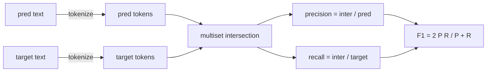
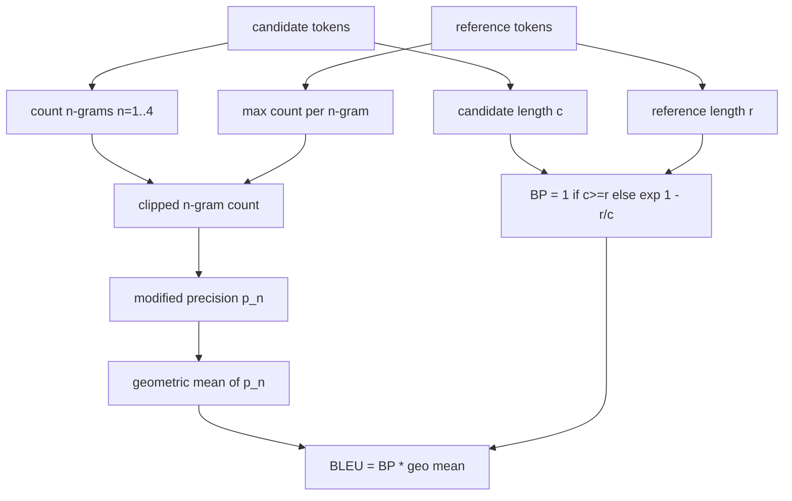

# 고전적인 지표들 (Classical Metrics)

> BLEU, ROUGE-L, F1, 정확 일치, 정확도. 발표되는 LLM 평가 수치 대부분이 아직도 이 다섯 지표로 나온다. 각각을 기본 원리에서부터 구현해서, 그 숫자가 무슨 뜻인지 알고 쓰자.

**Type:** Build
**Languages:** Python
**Prerequisites:** Phase 19 Track B foundations, lesson 70
**Time:** ~90 min

## 학습 목표 (Learning objectives)

- 토큰화 규칙을 명시한 채로 토큰 수준 정확 일치와 F1, 정확도를 구현한다.
- BLEU-4를 밑바닥에서 구현한다. 수정된 n-gram 정밀도와, n이 1부터 4까지인 값의 기하 평균, 그리고 짧은 문장에 대한 벌점을 모두 포함한다.
- 최장 공통 부분 수열을 써서 ROUGE-L을 구현하고, 정밀도와 재현율을 F-베타로 결합한다.
- 70번 레슨의 metric_name 필드로 분기해서, 실행기가 어떤 지표인지 몰라도 되게 만든다.
- 외부 라이브러리가 아니라 손으로 푼 예제에서 얻은 기준값으로 동작을 못 박는다.

```figure
cd-bleu-overlap
```

## 직접 다시 구현하는 이유 (Why reimplement)

어떤 논문은 BLEU가 28.3이라고 쓰고 다른 논문은 0.283이라고 쓴다. 한쪽은 소문자로 바꾸고 다른 쪽은 그러지 않는다는 이유로, 두 라이브러리에서 ROUGE-L 점수가 10점이나 벌어지는 경우도 만나게 된다. 이 혼란에서 벗어나는 가장 빠른 길은 지표를 직접 써 보고, 토크나이저를 정하는 줄과 보정을 적용하는 줄을 짚어 보는 것이다. 그러고 나면 논문끼리 숫자를 비교하는 일이 라이브러리를 두고 다투는 일이 아니라 지표 설정을 읽는 일이 된다.

표준 라이브러리와 numpy면 충분하다. BLEU는 세는 것과 상한을 거는 것이다. ROUGE-L은 동적 계획법이다. F1은 토큰 집합의 교집합이다. 가장 어려운 부분은 토크나이저를 고르고 그것을 끝까지 지키는 일이다.

## 토큰화 (Tokenisation)

토크나이저는 `re.findall(r"\w+", text.lower())`이다. 소문자로 바꾸고, 영숫자가 이어진 덩어리를 뽑고, 문장 부호를 버린다. 이 레슨의 모든 지표가 정확히 이 토크나이저를 쓴다. 실행기가 토크나이저를 고를 수는 없다. 토크나이저를 바꾸면 그것은 다른 벤치마크를 돌리는 것이다.

```python
TOKEN_RE = re.compile(r"\w+", re.UNICODE)
def tokenize(text):
    return TOKEN_RE.findall(text.lower())
```

이것은 의도적으로 단순하게 만든 것이다. 실무에서는 한중일 문자와 축약형, 코드 식별자를 신경 써야 한다. 이 레슨에서 말하려는 것은, 토크나이저가 조절값이 아니라 계약이라는 점이다.

## 정확 일치 (Exact match)

```python
def exact_match(pred, targets):
    return float(any(pred.strip() == t.strip() for t in targets))
```

과제마다 1.0 또는 0.0을 돌려준다. 데이터셋 전체에 대한 값은 그 평균이다. 산술과 객관식, 짧은 분류 과제에서 주로 쓰는 방법이다.

## 토큰 수준 F1 (Token-level F1)

예측과 정답의 토큰 다중집합을 만든다. 정밀도는 다중집합 교집합을 예측의 다중집합으로 나눈 값이다. 재현율은 같은 교집합을 정답의 다중집합으로 나눈 값이다. F1은 그 둘의 조화 평균이다. 구현에서는 예측이 비었거나 정답이 빈 경계 사례도 처리한다.



정답이 여럿인 과제에서는 정답 목록에 대해 가장 높은 F1을 쓴다. 문헌에서 널리 보고되는 SQuAD 방식과 같다.

## BLEU-4

BLEU는 기계 번역의 대표 지표이고 요약 연구에도 여전히 나온다. 여기에서 쓰는 정식화는 말뭉치 수준 BLEU-4이며, 표준적인 짧은 문장 벌점과, 수정된 n-gram 개수에 1을 더하는 보정을 함께 쓴다. 그래야 4-gram 하나가 안 맞는다고 점수가 0으로 떨어지지 않는다.

후보와 참조 쌍마다 n이 1, 2, 3, 4일 때의 수정된 n-gram 정밀도를 센다. 수정된 정밀도는 후보의 n-gram 개수를, 그 n-gram이 어느 참조에서든 나타난 최대 개수로 잘라 센다. 그래서 후보가 같은 구절을 되풀이해 점수를 부풀릴 수 없다. 그렇게 얻은 네 정밀도의 기하 평균에 짧은 문장 벌점을 곱한다.



여기에서 쓰는 보정은 Lin과 Och가 method 1이라고 부른 방식이다. 로그를 취하기 전에 모든 n-gram 정밀도의 분자와 분모에 1을 더한다. 참조에 맞는 4-gram이 없을 때 `log 0`이 되는 것을 막아 주고, 후보가 길면 보정하지 않은 값과 크게 다르지 않다.

## ROUGE-L

ROUGE-L은 후보와 참조의 토큰 나열에서 최장 공통 부분 수열을 비교한다. 이 부분 수열은 단어가 붙어 있기를 요구하지 않으면서도 순서를 반영한다. 그래서 요약 평가의 기본 지표로 쓰인다. 표준적인 동적 계획법 표로 부분 수열 길이를 구한 다음, 재현율은 `부분 수열 길이 / 참조 길이`로, 정밀도는 `부분 수열 길이 / 후보 길이`로 구하고, 베타를 1로 둔 대칭 F1 형태로 결합한다.

```python
def lcs_length(a, b):
    n, m = len(a), len(b)
    dp = numpy.zeros((n + 1, m + 1), dtype=int)
    for i in range(n):
        for j in range(m):
            if a[i] == b[j]:
                dp[i+1, j+1] = dp[i, j] + 1
            else:
                dp[i+1, j+1] = max(dp[i+1, j], dp[i, j+1])
    return int(dp[n, m])
```

numpy 표를 쓰면 구현이 읽기 쉬워진다. 순수 Python 리스트로도 된다. ROUGE-L을 쓰는 과제는 과제마다 O(n m) 비용을 치른다. 보통 길이의 요약이라면 1밀리초 아래로 끝난다.

## 정확도 (Accuracy)

정답이 여럿인 분류 과제에서 정확도는, 정규화한 정답 하나에 대한 정확 일치로 환원된다. 이것을 별도 함수로 내놓아, 분기기가 실행기 안에서 문자열을 비교하지 않고 `metric_name`만으로 분기할 수 있게 한다.

## 분기 계약 (Dispatch contract)

진입점은 `score(metric_name, prediction, targets)` 하나다. `[0, 1]` 범위의 실수를 돌려준다. 실행기는 지표 이름으로 분기하지 않는다. 호출을 넘기고 결과를 기록할 뿐이다. 75번 레슨이 70번 레슨의 과제 명세에 붙일 접점이 바로 이것이다.

```python
def score(metric_name, pred, targets):
    if metric_name == "exact_match":
        return exact_match(pred, targets)
    if metric_name == "f1":
        return max(f1_score(pred, t) for t in targets)
    if metric_name == "bleu_4":
        return max(bleu4(pred, t) for t in targets)
    if metric_name == "rouge_l":
        return max(rouge_l(pred, t) for t in targets)
    if metric_name == "accuracy":
        return accuracy(pred, targets)
    raise ValueError(f"unknown metric_name: {metric_name}")
```

`code_exec`은 72번 레슨에서 다루고 거기에서 이 분기기에 끼워 넣는다.

## 이 레슨이 하지 않는 일 (What this lesson does not do)

이 레슨은 모델을 부르지 않는다. 70번 레슨의 후처리 규칙이 이미 한 것 말고는 생성 결과를 더 정규화하지 않는다. 신뢰 구간을 계산하지 않는다. BLEURT나 BERTScore도 다루지 않는다(그것들은 모델이 필요하고 다른 레슨의 몫이다). 여기에서 다지는 것은 바닥이다. 지표 다섯 개와 토크나이저 하나, 분기 표 하나다.

## 코드를 읽는 방법 (How to read the code)

`main.py`에는 지표마다 독립 함수가 하나씩 있고 분기기가 함께 있다. 기준값은 파일 맨 아래의 `_reference_examples` 블록에 있다. 데모는 분기기를 예제 여덟 개에 돌려 지표별 점수를 출력한다. `code/tests/test_metrics.py`의 테스트는 기준값을 못 박고 모든 경계 사례를 시험한다. 예측이 빈 경우, 참조가 빈 경우, 공유 토큰이 없는 경우, 정확히 일치하는 경우, 같은 구절을 되풀이해 개수를 잘라야 하는 경우가 들어 있다.

`main.py`를 위에서 아래로 읽어라. 함수는 복잡한 순서대로 놓여 있다. exact_match와 accuracy는 각각 한 줄이다. F1은 여섯 줄이다. BLEU와 ROUGE-L이 무거운 부분이며, 보정 규칙과 부분 수열 점화식에 대한 자세한 주석이 붙어 있다.

## 더 나아가기 (Going further)

고전적인 지표는 반드시 필요하지만 그것만으로는 부족하다. 표면적인 겹침에 점수를 주고 의미는 놓친다. 해법은 이 고전적인 바닥을 믿을 수 있게 만든 다음, 그 위에 모델 기반 지표(BLEURT, BERTScore, GEval)를 얹는 것이다. 그것은 나중 레슨의 몫이다. 지금은 이 다섯 지표를 동작하게 만들고 테스트로 못 박아라. 그러면 검증할 수 있고 빠르고 재현 가능한 지표 묶음을 갖게 된다.
