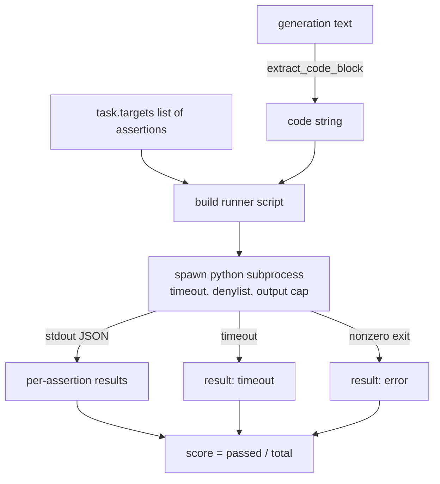
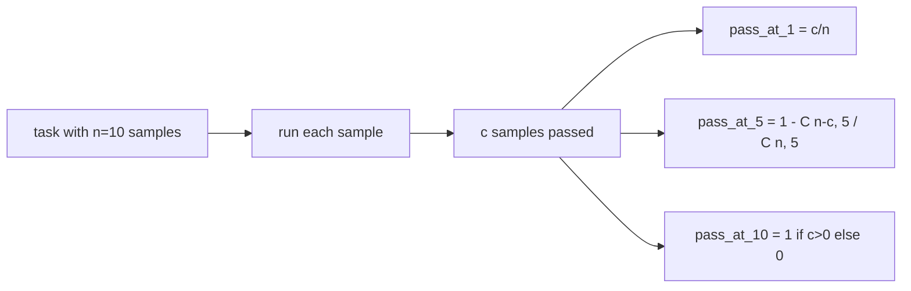

# 코드 실행 지표 (Code Exec Metric)

> 생성된 코드는 테스트를 통과할 때 맞은 것이다. 평가 하네스는 코드를 뽑아내고, 실행하는 컴퓨터를 망가뜨리지 않으면서 돌리고, 통과율을 정직하게 집계해야 한다. 이 레슨에서 그것을 만든다.

**Type:** Build
**Languages:** Python
**Prerequisites:** Phase 19 Track B foundations, lessons 70 and 71
**Time:** ~90 min

## 학습 목표 (Learning objectives)

- 70번 레슨의 후처리 규칙과 맞아떨어지는 방식으로, 자유 형식 생성 결과에서 코드 블록을 뽑아낸다.
- 후보 코드를 격리된 하위 프로세스에서, 실제 시간 기준 제한과 출력 상한, 임포트 금지 목록과 함께 실행한다.
- 주어진 단언문 가운데 후보 코드에서 통과한 비율로 과제를 채점한다.
- 모델 하나에서 생성을 여러 번 뽑는 과제에 대해 pass-at-k를 계산한다.
- 샌드박스 충돌과 문법 오류, 시간 초과를 각자 다른 종료 코드를 갖는 일급 실패 양상으로 다뤄서, 실행기가 그것을 기록할 수 있게 한다.

```figure
sandbox-runner
```

## 격리된 하위 프로세스를 쓰는 이유 (Why an isolated subprocess)

같은 프로세스 안에서 `exec`을 쓰는 것은 보안에도 안정성에도 위험하다. 생성된 `while True: pass` 하나가 평가를 영원히 멈춰 세운다. 생성된 `import shutil; shutil.rmtree('/')`는 들리는 그대로 파국이다. 해법은 후보마다 새 Python 인터프리터를 띄우고, 코드를 표준 입력으로 넘기고, 단언문 결과를 표준 출력으로 받고, 시간이 넘으면 그 프로세스를 죽이는 것이다. 그러면 평가를 돌리는 쪽은 계속 살아 있다.

HumanEval과 MBPP, BigCodeBench, LiveCodeBench 같은 실제 평가가 모두 하위 프로세스 샌드박스를 쓴다. 그 위에 Docker를 얹는 경우도 있다. 여기에서 하위 프로세스에 멈추는 데에는 이유가 있다. 어디에서나 돌아가고, 표준 라이브러리만 쓰고, 교육용 평가에서 중요한 실패 양상을 잡아내기 때문이다. 실무 배포에서는 seccomp와 네트워크 격리, 읽기 전용 파일 시스템을 더한다. 그것을 다루는 레슨은 이 트랙 밖에 있다.

## 코드 실행 과제의 형태 (The shape of a code-exec task)

`code_exec` 과제는 `targets`에 단언문 문자열을 담는다. 실행기는 생성 결과에서 백틱으로 둘러싸인 코드 블록을 뽑아내고, 그 둘레에 시험 하네스를 만들어 실행한다.



점수는 `[0, 1]` 범위의 분수다. 단언문이 셋인데 둘이 통과하면 0.667이다. 무엇이 실패하든 실행기는 같은 형태를 돌려준다. 하위 프로세스의 충돌은 정규화된 오류 코드로 옮겨지며, Python 역추적이 하네스까지 타고 올라오지 않는다.

## 금지 목록 (The denylist)

금지 목록은 임포트를 기준으로 한다. 후보 코드를 실행하기 전에, 실행기 스크립트가 위험한 모듈의 임포트를 `ImportError("denied")`를 일으키는 대역으로 바꾼다. 목록은 일부러 보수적으로 잡았다. `os.system`과 `subprocess`, `socket`, `requests`, `urllib`, `urllib.request`, `urllib.error`, `urllib.parse`, `ctypes`, `shutil`, `http.client`, `asyncio.subprocess`가 들어 있다.

이것이 완벽하다고 주장하지는 않는다. 작정하고 만든 적대적 코드는 Python의 어떤 같은 프로세스 샌드박스도 빠져나갈 수 있다. 금지 목록은 마지막 방어선일 뿐이다. 실제로 무게를 받치는 것은 실제 시간 제한과 출력 상한이다.

```python
DENIED = {
    "os.system": True,
    "subprocess": True,
    "socket": True,
    "shutil": True,
    "requests": True,
    "urllib": True,
    "ctypes": True,
}
```

후보 코드 앞에 `import sys`와, `os.system`을 예외를 일으키도록 바꿔 두는 보호 코드를 붙인다. 전체 틀은 `main.py`에 있다.

## 실제 시간 제한 (Wall-clock timeout)

하위 프로세스마다 기본값으로 실제 시간 3초의 예산을 준다. 실행기는 `subprocess.run(..., timeout=t)`을 쓴다. 시간이 넘으면 `TimeoutExpired`를 잡아 프로세스를 죽이고, 그 과제의 종료 사유를 `timeout`으로 기록한다. 그 과제의 점수는 0이다. 실행기는 다음으로 넘어간다.

제한 시간은 `task.metadata.timeout_s`로 과제마다 조절할 수 있다. 오래 걸리는 단위 테스트라면 더 달라고 할 수 있다. 다만 70번 레슨의 검증기가 그 값을 30초로 제한해서 평가 묶음 전체의 시간을 묶어 둔다.

## 출력 상한 (Output cap)

하위 프로세스가 표준 출력을 쏟아부어 호스트의 메모리를 고갈시킬 수 있다. 실행기는 표준 출력을 버퍼로 흘려 담다가, 누적 크기가 256KB를 넘으면 곧바로 자식 프로세스를 죽인다. 결과는 `exit_code = error`로 기록하고 세부 문자열은 `"output overflow"`로 남긴다. 생성 결과가 실수로 출력하는 무한 루프를 만들었을 때 실제로 이 경우가 나온다.

## Pass-at-k

pass-at-k는 HumanEval을 비롯한 평가들이 쓰는 편향 없는 추정량이다. 과제마다 독립적인 표본이 `n`개 있고 그중 `c`개가 통과했을 때, 그 `n`개에서 `k`개를 뽑았을 때 통과하는 해답이 적어도 하나 들어 있을 확률은 다음과 같다.

```
pass_at_k(n, c, k) = 1 - C(n - c, k) / C(n, k)
```

`n - c < k`이면 분자가 정의되지 않으며 값은 `1`이다. 구현에서 이 경계 사례를 직접 처리한다. `pass_at_k(n, c, k)`를 밖으로 내놓아 74번 레슨의 순위표 계층이 쓸 수 있게 한다.



## 종료 코드 (Exit codes)

실행기는 과제마다 다음 다섯 가지 가운데 하나를 돌려준다.

- `pass`. 모든 단언문이 통과했다.
- `assertion_fail`. 코드는 돌았지만 단언문 가운데 적어도 하나가 실패했다.
- `syntax_error`. 코드를 불러들이지 못했거나 SyntaxError가 났다.
- `timeout`. 실제 시간 제한을 넘겼다.
- `error`. 그 밖의 모든 충돌이며, 금지 목록에 걸린 경우와 출력 상한을 넘긴 경우가 여기에 들어간다(출력 상한은 세부 문자열 `"output overflow"`로 드러난다).

점수는 여전히 분수다. 종료 코드는 메타데이터다. 이후 레슨에서 시간 초과를 0으로 셀지 결측으로 셀지 정할 수 있다.

## 이 레슨이 하지 않는 일 (What this lesson does not do)

이 레슨은 진짜 샌드박스를 주지 않는다. 공개된 인터넷에서 가져온 믿을 수 없는 코드를 실행하지 않는다. 파일 입출력이나 네트워크 호출처럼 상태를 갖는 과제를 다루지 않는다. 그런 것에는 컨테이너나 마이크로 VM이 필요하다. 이 레슨의 요점은 계약이다. 격리된 하위 프로세스, 금지 목록, 시간 제한, 출력 상한, 깔끔한 종료 코드 목록, 그리고 pass-at-k 계산이다.

## 코드를 읽는 방법 (How to read the code)

`main.py`에는 `extract_code`와 `run_candidate`, `score_code_exec`, `pass_at_k`가 정의되어 있다. 하위 프로세스 실행 스크립트는 문자열로 만들어 새 Python 인터프리터에 `-c`로 넘긴다. `code/tests/test_exec.py`의 테스트는 네 가지 종료 코드와 pass-at-k를, HumanEval 방식으로 손수 만든 예제에 돌려 확인한다.

`main.py`를 위에서 아래로 읽어라. 실행기 틀이 무게를 받치는 부분이다. 그것이 부모 프로세스로 돌려보내는 JSON 봉투를 머릿속으로 그릴 수 있을 때까지 단언문 루프를 들여다보라.

## 더 나아가기 (Going further)

하위 프로세스 구조가 동작하고 나면 그다음 걱정은 이식성이다. Windows에서는 Python 판본마다 SIGKILL 처리 방식이 다르다. 가장 깔끔한 해법은 실행기를 Docker 이미지에 넣는 것이다. 그다음 할 일은 단언문 문자열을 실제 단위 테스트 파일로 바꿔서, 평가가 실무 CI가 하는 일과 같아지게 만드는 것이다. 그 시점부터는 단언문 문자열을 테스트라고 부르지 마라. 그것은 장난감 테스트이고 장난감다운 실패 양상을 갖는다.
