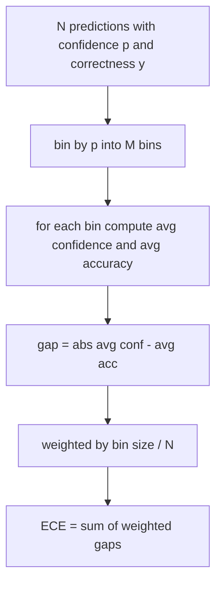
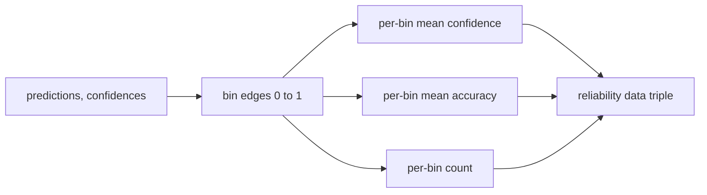

# 퍼플렉서티와 보정 (Perplexity and Calibration)

> 모델이 답변 1,000건에 90퍼센트 확신한다고 말해 놓고 600건만 맞혔다면, 그 모델은 보정이 잘 되어 있지 않은 것이다. 보정은 믿을 만한 평가의 절반이다. 나머지 절반은 퍼플렉서티이며, 모델이 따로 떼어 둔 문장을 애초에 그럴듯하다고 여기는지 알려 준다.

**Type:** Build
**Languages:** Python
**Prerequisites:** Phase 19 Track B foundations, lessons 70 and 71
**Time:** ~90 min

## 학습 목표 (Learning objectives)

- 모델 어댑터가 주는 토큰별 음의 로그 확률로, 따로 떼어 둔 말뭉치에 대한 토큰 수준 퍼플렉서티를 계산한다.
- 구간으로 나눈 예측 확률에서, 분류나 객관식 평가의 기대 보정 오차(ECE)를 계산한다.
- 브라이어 점수(정답 여부 지시값에 대한 평균 제곱 오차)를 계산하고, 그것이 ECE가 못 하는 무엇을 하는지 설명한다.
- 확신도와 정확도의 곡선을 그리는 데 필요한 신뢰도 도표 데이터를 만든다.
- 이 셋을 평가 하네스에 연결해서, 실행기가 모델 보고서에 `perplexity`와 `ece`, `brier` 수치를 붙일 수 있게 한다.

```figure
cd-reliability-diagram
```

## 퍼플렉서티가 알려 주는 것 (What perplexity tells you)

퍼플렉서티는 토큰당 평균 음의 로그 가능도에 지수를 취한 값이다. 낮을수록 좋다. 퍼플렉서티가 1이라면 모델이 실제로 나온 모든 토큰에 확률 1을 준다는 뜻이다. 퍼플렉서티가 어휘 크기와 같다면 모델이 균등 분포를 내놓았고 아무것도 배우지 않았다는 뜻이다. 실제 값은 그 사이에 놓인다. 2026년 기준으로 성능 좋은 기반 모델이 WikiText-103에서 8에서 12쯤을 기록한다. 나쁜 모델은 같은 문장에서 50이 넘는다.

하네스가 로그 확률을 직접 계산하지는 않는다. 그것은 모델 어댑터에서 온다. 하네스는 집계만 한다. 토큰별 로그 확률 목록과 시퀀스별 토큰 개수 목록을 받아 말뭉치 퍼플렉서티를 돌려준다.

```python
def perplexity(neg_log_probs, token_counts):
    total_nll = sum(neg_log_probs)
    total_tokens = sum(token_counts)
    return math.exp(total_nll / total_tokens)
```

구현에서는 토큰이 0개인 경계 사례를 처리하고, 음의 로그 확률이 음수가 아닌지 단언한다. 흔한 실수는 부호를 뒤집는 것을 잊는 것이다. 어댑터가 `-log p`가 아니라 `log p`를 돌려주면 퍼플렉서티가 1보다 작게 나오는데, 그것은 있을 수 없는 값이다. 이 함수가 그것을 계약 위반으로 잡아낸다.

## ECE가 재는 것 (What ECE measures)

기대 보정 오차는 예측을 확신도에 따라 정해진 개수의 구간으로 나눈 다음, 구간마다 확신도와 정확도의 차이를 구해 구간 크기로 가중 평균한다.



표준적인 정식화는 `[0, 1]`을 같은 너비의 구간 열 개로 나눈다. 여기 구현은 양의 정수라면 어떤 개수든 지원한다. `bins` 인자를 밖으로 내놓아, 실행기가 논문에서 쓰는 관례(10)와 비교에 쓰는 관례(15) 가운데 고를 수 있게 한다.

ECE는 구간 개수와 표본 수에 영향을 받는다. 구간이 열 개이고 예측이 100건이라면, ECE 0.02와 무작위 잡음을 구분할 수 없다. 그래서 구현은 ECE와 함께 실제로 값이 들어 있는 구간의 개수를 돌려준다. 표본이 너무 적을 때 실행기가 숫자 하나만 내놓기를 거부할 수 있게 하기 위해서다.

## 브라이어 점수가 ECE보다 더 하는 일 (What Brier score does that ECE does not)

ECE는 평균적인 차이만 본다. 구간의 절반에서는 과신하고 나머지 절반에서는 과소평가하는 모델은, 국소적으로는 보정이 나쁜데도 ECE가 낮게 나올 수 있다. 브라이어 점수는 예측마다 실제 결과에 대한 제곱 오차를 재므로, 그 흩어짐에 곧바로 벌점을 준다.

이진 결과에서 브라이어는 `mean((p_i - y_i)^2)`이다. 이 값은 신뢰도와 분해력, 불확실성으로 분해된다. 구현에서는 점수와 그 분해를 함께 계산한다. 실행기는 스칼라만 보고하고 분해는 대시보드용으로 기록해 둔다.

```python
def brier(p, y):
    return float(np.mean((p - y) ** 2))
```

## 신뢰도 도표 데이터 (Reliability diagram data)

신뢰도 도표는 구간마다 예측 확신도와 실제 정확도를 견주어 그린다. 대각선이 완벽한 보정이다. 이 함수는 배열 세 개를 돌려준다. 구간별 평균 확신도, 구간별 평균 정확도, 구간별 개수다. 그림을 그리는 코드는 그 뒤에 있고, 이 레슨은 데이터 형태까지만 다룬다.



돌려주는 튜플은 호출하는 쪽이 그림을 그리거나 ECE 변형(적응형 ECE, 스윕 ECE 등)을 직접 계산하는 데 필요한 것이다. numpy 배열로 돌려주므로 이후 코드가 다시 변환할 필요가 없다.

## 확신도는 어디에서 오는가 (Confidence sources)

하네스는 확신도가 소프트맥스에서 온다고 가정하지 않는다. 예측마다 `[0, 1]` 범위의 숫자라면 무엇이든 받는다. 객관식 과제라면 선택지별 로그 가능도에 소프트맥스를 건 값이 자연스러운 확신도다. 자유 형식이라면 모델이 스스로 밝힌 확률이나, 평균 로그 가능도에 지수를 취한 값이 자연스럽다. 평가는 그 숫자를 받아 쓸 뿐이다. 그것이 어디에서 오는지는 어댑터의 몫이다.

## 경계 사례 (Edge cases)

- 예측이 전부 틀린 경우. ECE는 평균 확신도가 되고, 브라이어는 높고, 퍼플렉서티는 모델이 그 문장을 어떻게 보느냐에 따라 정해진다.
- 예측이 전부 맞고 확신도도 높은 경우. ECE는 0에 가깝고 브라이어도 0에 가깝다.
- 확신도를 모두 0.5로 내놓는 예측기. ECE는 0.5에서 정확도를 뺀 값이고, 브라이어는 0.25에서 보정 항을 뺀 값이다.
- 입력이 빈 경우. ECE와 브라이어, 신뢰도 데이터는 `0.0`(또는 0으로 채운 배열)을 돌려준다. 퍼플렉서티는 토큰이 0개일 때 `NaN`을 돌려준다. 이 경로들은 경고를 내지 않는다. 실행기가 값을 살펴보고 보고할지 건너뛸지 정한다.

이 사례들은 테스트에 박아 두었다. 실제 모델을 실제 벤치마크에 돌리면 이런 경우를 만나지 않지만, 어댑터에 결함이 있거나 표본이 아주 적으면 만나게 된다. 그때 실행기가 죽어서는 안 된다.

## 분기 (Dispatch)

보정은 F1처럼 과제마다 재는 지표가 아니다. 모델 하나에 대한 보고서다. 실행기는 평가 전체에 걸쳐 `(확신도, 정답 여부)` 쌍을 모았다가 ECE와 브라이어, 신뢰도 데이터를 한 번에 계산한다. 퍼플렉서티는 과제별 채점과는 별도로, 따로 떼어 둔 문장 말뭉치에 대해 계산한다.

인터페이스는 이렇다.

```python
report = CalibrationReport.from_predictions(confidences, correct)
report.ece          # float
report.brier        # float
report.reliability  # tuple of three numpy arrays
report.populated_bins  # int
```

`PerplexityResult.from_token_nll(neg_log_probs, token_counts)`는 퍼플렉서티와 토큰당 평균 음의 로그 가능도를 돌려준다.

## 이 레슨이 하지 않는 일 (What this lesson does not do)

이 레슨은 모델을 부르지 않는다. 소프트맥스를 구현하지 않는다. 출력 토큰에서 확신도를 추정하지도 않는다. 그것은 어댑터의 몫이다. 온도 조정이나 플랫 조정도 하지 않는다. 그것들은 사후 보정 기법이고 다른 레슨에 있다. 이 레슨의 요점은 세 숫자(퍼플렉서티, ECE, 브라이어)를 믿을 수 있고 재현할 수 있게 만드는 것이다.

## 코드를 읽는 방법 (How to read the code)

`main.py`에는 `perplexity`와 `expected_calibration_error`, `brier_score`, `reliability_diagram`, 그리고 `CalibrationReport`와 `PerplexityResult` 데이터 클래스가 정의되어 있다. 데모는 정답을 이미 아는 합성 예측으로 돌아간다. 보정이 잘 된 모델, 과신하는 모델, 과소평가하는 모델을 각각 만들어 쓴다. `code/tests/test_calibration.py`의 테스트는 모든 경계 사례와 함께, 그 합성 예측기들에 대한 기준값을 못 박는다.

`main.py`를 위에서 아래로 읽어라. 함수는 스칼라에서 벡터로, 다시 보고서로 이어지는 순서로 놓여 있다. 함수마다 수식과 계약을 적은 짧은 설명 문자열이 붙어 있다.

## 더 나아가기 (Going further)

보정은 발표되는 평가에서 가장 자주 무시되는 축이다. 순위표 대부분은 정확도 숫자 하나를 보고하고 끝낸다. 정확도에서 이기고 브라이어에서 지는 모델은, 정확도가 몇 점 낮더라도 자기 불확실성을 믿음직하게 알려 주는 모델보다 실무 배포에서 더 나쁘다. 보정 배관을 갖추고 나면, 따로 떼어 둔 검증 구간에서 온도 조정을 적용하고 ECE를 다시 계산해서 그 차이가 줄어드는지 보라. 그것은 별도의 레슨이지만, 그 바닥은 여기에 있다.
