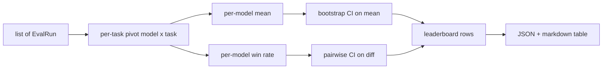
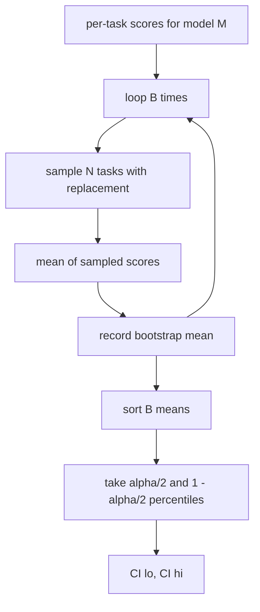

# 순위표 집계 (Leaderboard Aggregation)

> 과제별 점수를 내는 일은 쉽다. 성격이 제각각인 과제들에 걸쳐 모델의 순위를 매기는 일은 더 어렵다. 예측 1,000건짜리 순위표에서 통계적 유의성을 따지는 일은 다들 건너뛰는 부분이다. 이 레슨은 건너뛰지 않는다.

**Type:** Build
**Languages:** Python
**Prerequisites:** Phase 19 Track B foundations, lessons 70, 71, 73
**Time:** ~90 min

## 학습 목표 (Learning objectives)

- 여러 모델과 여러 과제에 걸친 과제별 점수를, 모델마다 한 행으로 정리해 집계한다.
- 성격이 다른 점수를 정규화해서, 통과율과 BLEU 값이 합계에 지나친 영향을 주지 않게 한다.
- 평균과 승률로 모델의 순위를 매기고, 각각이 언제 알맞은 요약인지 설명한다.
- 모델별 평균 점수와 모델 간 점수 차이에 대해 부트스트랩 신뢰 구간을 계산한다.
- 순위표를 JSON 보고서와, 75번 레슨의 실행기가 CI 코멘트에 그대로 붙일 수 있는 마크다운 표로 내놓는다.

```figure
ci-leaderboard-ci
```

## 입력의 형태 (The shape of input)

집계기는 `EvalRun` 레코드 목록을 받는다.

```python
@dataclass
class EvalRun:
    model_id: str
    task_id: str
    metric_name: str
    score: float          # in [0, 1]
    category: str
```

75번 레슨의 실행기가 `(모델, 과제)` 쌍마다 레코드를 하나씩 내놓는다. 집계기는 그 점수가 어떻게 만들어졌는지 신경 쓰지 않는다. 다만 정규화가 이미 끝나 있어야 한다. 모든 점수가 `[0, 1]` 안에 있어야 한다.

## 출력 (The output)

표 세 개가 나온다.



순위표의 한 행에는 `model_id`와 `mean_score`, `mean_ci_lo`, `mean_ci_hi`, `win_rate`, `tasks_completed`가 들어가고, 범주별 평균을 담은 `categories` 맵이 선택적으로 들어간다.

## 정규화 (Normalisation)

한 과제는 `[0, 1]`로 채점하고 다른 과제는 `[0, 100]`으로 채점한다면, 두 번째 과제가 조용히 평균을 지배한다. 집계기는 모든 입력 점수가 `[0, 1]` 안에 있는지 검증하고, 아니면 그 실행을 물리친다. 고칠 곳은 그 앞이다. 지표가 애초에 분수를 돌려주어야 한다. 71번부터 73번까지의 레슨이 그 계약을 강제한다.

## 평균과 승률 (Mean and win-rate)

두 가지 순위 매김 방식은 서로 다른 목적에 쓰인다.

평균 점수는 모델 하나의 과제별 점수를 평균 낸 값이다. 순위표가 대표 숫자로 내세우는 값이다. 이상치와 과제 구성의 치우침에 민감하다.

승률은 같은 과제에서 그 모델이 다른 모든 모델을 이긴 횟수를 센다. 과제마다 점수가 가장 높은 모델이 이긴다(동점은 나눠 갖는다). 승률은 이긴 횟수를 그 모델이 점수를 가진 과제 수로 나눈 값이다. 이상치와 척도 차이에 덜 민감하지만 정보를 잃는다.

```python
def win_rate(model_id, runs_by_task, all_models):
    wins, total = 0, 0
    for task_id, runs in runs_by_task.items():
        scores = {r.model_id: r.score for r in runs if r.model_id in all_models}
        if model_id not in scores:
            continue
        total += 1
        best = max(scores.values())
        if scores[model_id] >= best:
            wins += 1
    return wins / total if total else 0.0
```

하네스는 둘 다 보고한다. 75번 레슨의 실행기는 기본값으로 평균으로 순위를 매기고, 승률 열도 마크다운 표에 함께 두어 사용자가 원하면 그것을 볼 수 있게 한다.

## 부트스트랩 신뢰 구간 (Bootstrap confidence intervals)

모델별 평균에는 과제를 대상으로 한 부트스트랩 재표본 추출로 추정한 신뢰 구간이 붙는다. 과제 식별자를 복원 추출로 뽑아 그 집합의 평균을 구하고, 이것을 `B`번 되풀이한 다음, 신뢰 수준 `alpha`에 해당하는 백분위 구간을 취한다.



두 모델을 견줄 때는 과제별 차이 `score_A - score_B`를 부트스트랩해서 백분위 구간을 구하고 그것을 보고한다. 사용자는 그 구간이 0을 포함하지 않는지만 보면 된다. 포함하지 않으면 그 차이는 신뢰 수준 alpha에서 유의하다. 포함하면 순위표는 두 모델을 동점으로 다룬다.

낮은 수준의 보조 함수(`bootstrap_mean_ci`, `bootstrap_pairwise_diff`)는 기본값이 `B=1000`이고, 공개 집계 함수(`aggregate`, `pairwise_diffs`)는 데모와 테스트가 빠르게 끝나도록 기본값이 `b=500`이다. alpha의 기본값은 0.05다. 이 레슨의 부트스트랩은 순수 numpy만 쓰고 scipy는 쓰지 않는다.

## 범주 (Categories)

`EvalRun.category`가 설정되어 있으면 집계기는 범주별 평균도 보고한다. 순위표마다 `math`와 `reasoning`, `code`, `safety`라고 적혀 있는 그 열이다. 이것이 있으면, 전체적으로는 좋은데 코드에서만 약한 모델을 짚어 낼 수 있다. 대표 평균 하나로는 가려지는 정보다.

## 마크다운 렌더링 (Markdown rendering)

순위표는 마크다운 표로 렌더링한다.

```text
| Rank | Model | Mean | 95% CI | Win rate | Tasks |
|------|-------|------|--------|----------|-------|
| 1    | gpt   | 0.78 | 0.74-0.82 | 0.62 | 50 |
| 2    | claude| 0.75 | 0.71-0.79 | 0.34 | 50 |
| 3    | random| 0.10 | 0.07-0.13 | 0.04 | 50 |
```

표는 평균 점수로 정렬한다. 신뢰 구간은 소수점 둘째 자리까지 표시한다. 긴 모델 식별자는 스무 글자로 줄인다.

## 이 레슨이 하지 않는 일 (What this lesson does not do)

이 레슨은 모델을 실행하지 않는다. 지표 계층을 부르지 않는다. 적응형 ECE를 비롯한 보정 변형을 구현하지 않는다. 그것은 73번 레슨의 몫이다. 과제 가중치도 구현하지 않는다. 여기에서는 모든 과제가 같은 무게를 갖는다. 실무 순위표는 과제에 가중치를 주며, 우리는 `weight` 필드로 그 자리를 열어 두되 집계기에서는 무시한다. 필요하다면 후속 레슨에서 가중치를 더하라.

## 코드를 읽는 방법 (How to read the code)

`main.py`에는 `EvalRun`과 `LeaderboardRow`, `aggregate`, `bootstrap_mean_ci`, `bootstrap_pairwise_diff`, `render_markdown`이 정의되어 있다. 데모는 모델 세 개와 과제 열두 개로 이루어진 합성 묶음을 만들어 집계하고, 순위표와 함께 모델 간 차이 표를 출력한다. `code/tests/test_leaderboard.py`의 테스트는 부트스트랩과 마크다운 렌더링, 승률의 경계 사례, 입력이 빈 경우의 동작을 못 박는다.

`main.py`를 위에서 아래로 읽어라. 데이터 형태(EvalRun, LeaderboardRow)가 먼저 나오고, 집계기가 다음이고, 부트스트랩이 세 번째, 렌더링이 마지막이다. 함수마다 맡은 계약이 분명하다.

## 더 나아가기 (Going further)

자연스러운 다음 단계는, 짝을 짓지 않은 부트스트랩 대신 과제를 짝지은 유의성 검정을 쓰는 것이다. 모델 A와 B가 같은 과제 100개를 모두 돌았다면 알맞은 검정은 과제별 차이에 대한 짝지은 부트스트랩이고, 우리는 그것을 구현해 두었다. 그다음으로는 과제 계열을 존중하는 계층적 부트스트랩이 필요하다. 수학 문제들은 서로 독립이 아니고, 산술 오류 하나의 패턴이 열 문제에 영향을 주기 때문이다. 그것은 후속 작업이다. 이 레슨의 목적은 바닥을 제대로 다져서, 평가가 변호할 수 있는 숫자를 보고하게 만드는 것이다.
