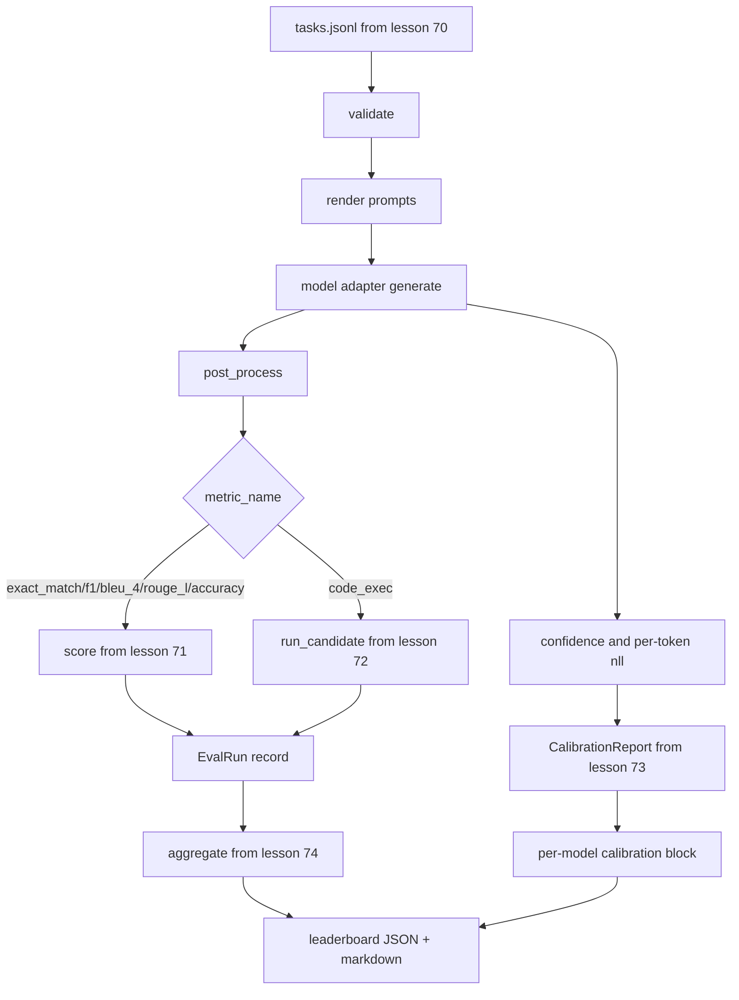

# 전 구간 평가 실행기 (End-to-End Eval Runner)

> 배관을 만드는 다섯 레슨과, 그것을 잇는 한 레슨. 실행기는 70번 레슨의 과제 명세를 읽고, 어댑터로 모델을 부르고, 71번과 72번 레슨으로 채점하고, 73번 레슨의 보정 보고서를 붙이고, 74번 레슨의 순위표를 내놓는다. 데모는 스스로 끝을 맺는다.

**Type:** Build
**Languages:** Python
**Prerequisites:** Phase 19 Track B foundations, lessons 70 through 74
**Time:** ~90 min

## 학습 목표 (Learning objectives)

- 어떤 모델이든(모의, 로컬, API) 작은 메서드 몇 개로 충족할 수 있는 `ModelAdapter` 인터페이스를 정의한다.
- 고정 JSONL 파일에 대해 평가를 돌리되, 작업자 풀로 과제를 나란히 실행한다.
- 지표 계층(exact_match, F1, BLEU-4, ROUGE-L, code_exec)과 보정 계층을 한 번의 순회로 함께 처리한다.
- 모델별 `EvalRun` 레코드를 내놓아 순위표 집계기에 곧바로 넘긴다.
- JSON 보고서와 마크다운 표를 모두 내놓고, 깨끗하게 끝나면 종료 코드 0으로, 검증이나 실행에 실패하면 0이 아닌 값으로 스스로 끝낸다.

```figure
eval-grid
```

## 파이프라인 (The pipeline)



실행기는 통합 지점이다. 70번부터 74번까지의 레슨이 각각 모듈 하나를 소유하고, 실행기가 그것들을 조립한다. 실행기는 그 모듈들의 로직을 다시 쓰지 않는다. 가져다 쓸 뿐이다.

## 어댑터 인터페이스 (The adapter interface)

어댑터는 실행기와 모델 사이의 이음매다. 인터페이스는 일부러 작게 두었다.

```python
class ModelAdapter:
    model_id: str

    def generate(self, prompt: str, task: TaskSpec) -> Generation: ...
```

`Generation`은 다음을 담은 데이터 클래스다.

- `text`. 모델의 자유 형식 출력이다.
- `confidence`. 그 답에 대해 모델이 스스로 밝힌 확률이며 `[0, 1]` 범위의 실수다.
- `token_nll`. 생성된 토큰들의 음의 로그 가능도 합이며 선택 항목이다.
- `token_count`. 생성된 토큰의 개수이며 선택 항목이다.

실행기에 들어 있는 모의 어댑터는 세 가지다. `RuleBasedAdapter`(결정적이고 거의 완벽하다), `NoisyAdapter`(과신하고 자주 틀린다), `BiasedAdapter`(한 범주에는 강하고 다른 범주에는 형편없다)다. 데모는 셋을 모두 70번 레슨의 고정 데이터에 돌린다.

## 나란히 실행하기 (Parallel execution)

실행기는 `concurrent.futures.ThreadPoolExecutor`를 써서 모델마다 과제를 나란히 돌린다. 작업자 수의 기본값은 8과 과제 개수 가운데 작은 값이다. 스레드로 충분하다. 실제 모델 호출의 병목은 네트워크 입출력이기 때문이다. 코드 실행 경로는 과제 안에서 자기 하위 프로세스를 띄우고, 실행기는 그 대기만 예약한다.

테스트를 결정적으로 돌리기 위해 `run_eval(adapters, tasks, parallel=False)`를 제공한다. 그러면 테스트가 실행 순서를 못 박을 수 있다.

## 한 번에 채점하는 루프 (The single-pass scoring loop)

과제마다 다음을 수행한다.

1. 프롬프트를 렌더링한다(퓨샷 앞부분과 프롬프트 본문을 잇는다).
2. 어댑터를 부르고 그 시간을 잰다.
3. 과제의 규칙에 따라 생성 결과를 후처리한다.
4. 지표 계층으로 분기한다.
5. 점수와 지표 메타데이터를 담은 `EvalRun` 레코드를 만든다.
6. `(확신도, 정답 여부)` 쌍을 보정 버퍼에 덧붙인다.

`정답 여부` 신호는 정확 일치 계열 지표(`exact_match`, `accuracy`, `code_exec`)에서는 `score >= 1.0`이고, 단계가 있는 지표에서는 `score >= 0.5`다. 그 기준은 `_correct_from_score`에 있고, 실행기는 그것을 밖에서 바꿀 수 있게 열어 두지 않는다.

## 집계 (Aggregation)

모든 과제에 결과가 나오면, 실행기는 74번 레슨의 `aggregate`와 `pairwise_diffs`, 그리고 73번 레슨의 `CalibrationReport.from_predictions`를 부른다. 출력은 JSON 봉투 하나다.

```json
{
  "leaderboard": [...],
  "pairwise": [...],
  "calibration": {
    "model_id_a": {"ece": 0.04, "brier": 0.10, "populated_bins": 8, ...},
    ...
  },
  "summary": {
    "tasks": 10,
    "models": 3,
    "wall_seconds": 1.2
  }
}
```

실행기는 마크다운 표도 표준 출력으로 내보내서, 사용자가 그것을 풀 리퀘스트 리뷰에 그대로 붙일 수 있게 한다.

## 스스로 끝을 맺는 데모 (Self-terminating demo)

데모는 70번 레슨의 고정 과제 열 개에 모의 어댑터 세 개를 돌린다. 실제 시간은 10초 아래여야 한다. 깨끗하게 끝나면 종료 코드는 0이다.

깨끗하게 끝났다고 보는 기준은 이렇다.

- 모든 과제가 70번 레슨 기준으로 검증을 통과했다.
- 모든 과제가 71번과 72번 레슨으로 채점되었다.
- 73번 레슨의 보정 보고서가 오류 없이 집계되었다.
- 순위표에서 규칙 기반 어댑터가 무작위 어댑터보다 확실히 위에 놓였다.

이 가운데 하나라도 깨지면 실행기는 JSON 봉투에 구조화된 오류를 담고 0이 아닌 종료 코드로 끝난다.

## 이 레슨이 하지 않는 일 (What this lesson does not do)

이 레슨은 실제 모델을 부르지 않는다. API 키 처리나 호출 한도 대응을 구현하지 않는다. 스트리밍이나 부분 생성도 구현하지 않는다. 어댑터는 호출마다 생성 결과 하나를 돌려준다. 재시도나 캐싱도 하지 않는다. 그런 관심사는 어댑터 계층의 몫이다. 실행기는 어떤 지표를 쓰든 어떤 공급자를 쓰든 상관하지 않는다.

## 코드를 읽는 방법 (How to read the code)

`main.py`가 통합 지점이다. 다른 다섯 레슨 모듈을 상대 경로로 찾아 주는 작은 `_load_sibling` 보조 함수로 가져다 쓴다. `Generation`과 `EvalReport`, `ModelAdapter` 데이터 클래스는 이 파일에 정의되어 있다. 모의 어댑터는 파일 맨 아래에 있다.

`main.py`를 위에서 아래로 읽어라. 임포트는 훑고 지나간 다음 `run_eval`을 보고, 그다음 `_score_one`을, 그다음 어댑터를 보라. 파일 끝의 데모가 진입점이다.

`code/tests/test_runner.py`의 테스트는 어댑터 인터페이스와 한 번에 도는 루프, 나란히 돌린 결과와 순차로 돌린 결과가 같은지, 보정 버퍼, JSON 봉투의 형태를 못 박는다.

## 더 나아가기 (Going further)

이 실행기는 바닥이다. 실무 평가 시스템은 여기에 다음을 더한다. `(task_id, model_id, model_version)`을 키로 삼는 결과 캐시, 실행마다 비용과 토큰을 기록하는 원장, 호출 한도에 걸리면 간격을 두고 다시 시도하는 재시도 계층, pass-at-k 과제를 위한 표본 추출 정책, 그리고 긴 평가 묶음을 위한 스트리밍 출력 형식이다. 이것들은 각각 하나의 관심사이고, 지표 계층이나 집계 계층을 건드리지 않은 채 실행기를 감싸면 된다. 계약을 나눠 둔 이유가 바로 그것이다.

모의 어댑터가 동작하고 나면 실제 공급자용 어댑터를 하나 붙여라. 무료 구간이 있는 곳을 골라 서른 줄쯤 되는 연결 코드를 쓰고, 순위표에 불이 들어오는 것을 보라. 그다음에 두 번째 공급자를 더하고 나머지는 하네스에 맡겨라.
