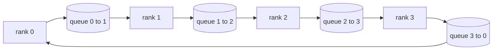

# 집합 통신 연산을 맨바닥에서 (Collective Ops From Scratch)

> 분산 학습을 떠받치는 집합 통신 연산은 allreduce와 broadcast, allgather, reduce_scatter 네 가지다. 학습 프레임워크가 제공하는 나머지 기본 연산은 모두 이 넷을 감싼 것이다. `multiprocessing.Queue`로 만든 고리 위에서 한 번 구현하고 참조 구현과 대조해 확인하고 나면, 이 트랙의 나머지는 배관 작업이 된다.

**Type:** Build
**Languages:** Python
**Prerequisites:** Phase 19 Track C lessons 42-49
**Time:** ~90 min

## 학습 목표 (Learning Objectives)

- 고리 방식 allreduce를 두 번의 순회(reduce-scatter 다음 allgather)로 구현하고, 랭크당 통신량이 원소당 2(N-1)/N 바이트임을 증명한다.
- `multiprocessing.Queue`를 통한 일대일 전송 위에 broadcast와 allgather, reduce_scatter를 만든다.
- 같은 입력에 대해 `torch.distributed`의 gloo 참조 구현과 대조해서 모든 기본 연산을 검증한다.
- 클러스터의 모양과 지연 시간의 바닥, 대역폭의 천장을 근거로 고리 방식과 트리 방식 가운데 무엇을 고를지 설명한다.

## 문제 (The Problem)

랭크가 N개일 때 단순한 allreduce는 텐서를 N번 루트로 보내고 N번 되돌려 보낸다. 랭크당 대역폭이 O(N)으로 늘고, 루트가 병목이 되고, 실제 시간의 바닥은 가장 느린 링크에 N을 곱한 값이 된다. 고리 방식 allreduce는 그것을 크기 T/N인 덩어리 2(N-1)개로 펴 놓는다. 그러면 랭크당 바이트가 2T(N-1)/N이 되고, 클러스터 크기와 무관해진다. 트리 방식 allreduce는 N이 작고 링크의 지연 시간이 클 때 이긴다. 깊이가 2(N-1)이 아니라 log2(N) 단계이기 때문이다. 클러스터 모양에 맞지 않는 방식을 고르면, 가장 느린 GPU가 스텝 시간을 좌우한다.

이 트랙에서 읽게 될 모든 분산 학습 프레임워크가 이 네 가지 기본 연산에 기댄다. PyTorch DDP는 파라미터 묶음마다 allreduce를 한 번씩 걸어 그래디언트를 맞춘다. ZeRO는 reduce_scatter로 옵티마이저 상태를 쪼개고 allgather로 갱신된 파라미터를 퍼뜨린다. FSDP는 순전파 전체를 allgather와 reduce_scatter로 바꾼다. 파이프라인 병렬은 단계 그룹 사이에서 활성값을 옮기는 데 broadcast가 필요하다. 네 가지 집합 통신 연산을 구현하지 못한다면, 학습이 왜 멈추는지, 왜 3번 랭크에서 그래디언트가 어긋나는지, 왜 방식을 바꾸면 파이프라인의 빈 구간이 두 배가 되는지 따져 볼 수 없다.

## 개념 (The Concept)



### 두 번 순회하는 고리 방식 allreduce

텐서를 크기가 같은 덩어리 N개로 나누고 0부터 N-1까지 번호를 매긴다. 각 랭크는 자기 번호와 같은 덩어리를 소유한다. 첫 번째 순회인 reduce-scatter는 N-1단계를 돈다. s단계에서 랭크 r은 덩어리 (r - s) mod N을 랭크 (r + 1) mod N으로 보내고, 랭크 (r - 1) mod N에서 덩어리 (r - s - 1) mod N을 받아 자기 사본에 더한다. N-1단계가 끝나면 랭크 r이 덩어리 r의 완전한 합을 갖는다. 두 번째 순회인 allgather는 다시 N-1단계를 돌며, 완성된 덩어리들을 고리를 따라 돌려서 모든 랭크가 모든 덩어리의 완전한 합을 갖게 만든다.

| 연산 | 랭크당 바이트 | 단계 수 | 쓸 때 |
|-----------|---------------|-------|-------------|
| 고리 방식 allreduce | 2T(N-1)/N | 2(N-1) | T가 크고 링크가 굵으며 장비가 고른 클러스터 |
| 트리 방식 allreduce | T log2(N) | 2 log2(N) | T가 작거나 링크의 지연 시간이 클 때 |
| Broadcast | T | 트리로 log2(N) | 파라미터 초기화, 스칼라 설정값 |
| Allgather | T(N-1)/N | N-1 | 쪼개 둔 상태의 순전파, ZeRO에서 다시 합칠 때 |
| Reduce_scatter | T(N-1)/N | N-1 | ZeRO에서 그래디언트를 쪼갤 때 |

### NCCL 대신 쓰는 큐 그물

NCCL은 PCIe와 NVLink 위에서 하드웨어가 처리하는 리덕션과 함께 돈다. CPU에는 그것이 없다. 고리의 간선마다 `multiprocessing.Queue`를 하나씩 두면, 생산자 하나와 소비자 하나로 순서가 보장되는 일대일 전달을 얻는다. 리덕션은 사용자 공간에서 일어나므로 Python 오버헤드를 치르지만, 실제로 오가는 통신 패턴은 NCCL 고리 방식 allreduce와 같다. 큐 판본에서 올바름을 따져 보면 클러스터에서의 동작도 그대로 따라온다.

### gloo와 대조해서 검증하기

모든 기본 연산에는 단위 테스트가 붙는다. 같은 텐서를 같은 규모의 세계에서, gloo 백엔드로 초기화한 `torch.distributed`에 돌린 결과와 비교한다. 고리 방식 allreduce가 gloo와 float32 오차 이상 벌어지면 테스트가 실패한다. 참조 구현과 대조하는 검증은 타협할 수 없다. 그것이 없으면 실제 학습의 10,000번째 스텝에 이를 때까지는 그 연산이 맞아 보인다.

```figure
ci-ring-allreduce
```

## 직접 만들기 (Build It)

`code/main.py`에 다음을 구현한다.

- `Mesh` 클래스. `multiprocessing.Queue` N개를 고리로 잇고, 랭크마다 `send(dst, tensor)`와 `recv(src)`를 제공한다.
- `ring_allreduce(mesh, rank, world_size, tensor)`. 두 번 순회하는 알고리즘을 돌린다.
- `broadcast(mesh, rank, world_size, tensor, src)`. 로그 깊이 트리로 돈다.
- `allgather(mesh, rank, world_size, tensor)`. N-1번 돌려서 모은다.
- `reduce_scatter(mesh, rank, world_size, tensor)`. allreduce의 앞 절반이다.
- `_gloo_reference(op, world_size, tensor)`. 같은 입력을 gloo를 쓰는 `torch.distributed`에 돌려 바이트 단위로 비교할 수 있게 한다.

다음으로 실행한다.

```bash
python3 code/main.py
```

출력은 이렇다. 큐 그물과 gloo의 출력을 비교한 연산별 검증 표가 나오고, 이어서 랭크별 바이트 집계가 2T(N-1)/N 비율을 증명해 준다.

## 실무에서 쓰이는 방법 (Production patterns in the wild)

세 가지가 이 기본 연산을 실제로 쓸 수 있을 만큼 단단하게 만들어 준다.

**allreduce 전에 그래디언트를 묶어라.** 파라미터가 10억 개인 모델에는 그래디언트 텐서가 수만 개 있다. 텐서마다 allreduce를 걸면 지연 시간의 바닥을 그만큼 되풀이해 치른다. DDP는 그래디언트를 25MB쯤 되는 덩어리로 묶고 덩어리마다 allreduce를 한 번 건다. 작은 텐서들이 큰 텐서의 등에 업혀 간다. 묶지 않으면 지연 시간 오버헤드가 스텝 전체를 잡아먹는다.

**통신과 계산을 겹쳐라.** 역전파는 레이어를 역순으로 돌며 그래디언트를 만든다. 마지막 레이어의 그래디언트가 나오는 순간, 다음 레이어가 계산하는 동안 그 allreduce를 시작하면 된다. PyTorch DDP는 덩어리가 준비될 때 호출되는 훅으로 이것을 연결한다. 네트워크에 여유가 있으면 이 겹침이 눈에 보이는 통신 시간을 절반으로 줄인다.

**신념이 아니라 메시지 크기로 고리와 트리를 골라라.** NCCL에는 연결 구조를 살펴 메시지가 약 1MB보다 크면 고리를, 작으면 트리를 고르는 판별기가 들어 있다. 갈리는 지점은 대역폭과 지연 시간의 균형이다. 1MB를 넘으면 대역폭 항인 2T(N-1)/N이 지배해서 고리가 이기고, 그 아래에서는 log2(N)이라는 단계 수가 이긴다. 한 방식을 못 박아 두면 반대쪽 메시지 크기에서 처리량을 잃는다.

## 실제로 써 보기 (Use It)

실무에서 쓰이는 모습이다.

- **PyTorch DDP.** 역전파가 끝난 뒤 묶어 둔 그래디언트에 `dist.all_reduce`를 부른다. 묶음 크기는 조절할 수 있고, 기본값 25MB는 100Gbit 이더넷에서 무난하다.
- **DeepSpeed ZeRO.** reduce_scatter로 그래디언트를 쪼개고, 순전파 전에 allgather로 완전한 파라미터를 되살린다. 이 레슨의 기본 연산이 곧 ZeRO가 부르는 것들이다.
- **FSDP.** 순전파는 allgather로 레이어를 되살리는 데서 시작해, 계산하고, reduce_scatter로 줄이고, 되살렸던 것을 버린다. 같은 기본 연산에 일정만 다르다.

## 결과물로 남기기 (Ship It)

이 큐 그물 기본 연산을 77번부터 81번까지의 레슨에서 쓴다. 77번 레슨은 allreduce를 DDP에 연결한다. 78번 레슨은 reduce_scatter를 ZeRO에 연결한다. 79번 레슨은 broadcast를 파이프라인 활성값에 연결한다. 81번 레슨은 넷을 모두 묶어 전 구간 데모를 만든다.

## 연습 문제 (Exercises)

1. 트리 방식 allreduce 변형을 추가하고, 메시지 크기에 따라 고리와 트리를 오가게 하라. 갈리는 지점을 측정하라.
2. `recv_timeout_ms`를 추가해서, 멈춰 버린 랭크가 영원히 기다리는 대신 기한 초과 오류를 드러내게 하라.
3. 네 가지 기본 연산에서 `multiprocessing.Queue`를 TCP 소켓으로 바꿔라. 테스트는 그대로 두고 실제 통신으로 돌려라.
4. 대역폭 계측 훅을 추가해서 랭크별 바이트 집계를 JSONL로 기록하게 하라.
5. 랭크 4개에서 크기 1KB, 1MB, 16MB인 텐서에 대해 고리와 트리의 실제 시간을 비교하라. 갈리는 지점을 측정값으로 설명하라.

## 핵심 용어 (Key Terms)

| 용어 | 흔히 쓰는 뜻 | 정확한 뜻 |
|------|----------------|------------------------|
| Allreduce | "랭크들에 걸쳐 더하기" | 호출이 끝나면 모든 랭크가 같은 리덕션 결과 텐서를 갖는다 |
| Ring | "빠른 방식" | 크기 T/N인 덩어리 N-1개가 고리를 두 바퀴 돈다 |
| Tree | "로그 방식" | 리덕션이 이진 트리를 따르며 깊이가 log2(N) 단계다 |
| Allgather | "쪼갠 것 이어 붙이기" | 모든 랭크가 다른 모든 랭크의 조각을 갖게 된다 |
| Reduce_scatter | "합을 나누기" | 각 랭크가 덩어리 하나에 대한 합만 갖게 된다 |
| Bucket | "작은 텐서 묶기" | 작은 allreduce N개를 큰 것 하나로 합치는 것 |

## 더 읽을거리 (Further Reading)

- [PyTorch Distributed: NCCL collectives](https://pytorch.org/docs/stable/distributed.html#collective-functions)
- [Horovod ring allreduce paper](https://arxiv.org/abs/1802.05799)
- [NCCL topology and algorithm selection](https://docs.nvidia.com/deeplearning/nccl/user-guide/docs/index.html)
- [Patarasuk and Yuan, Bandwidth optimal allreduce algorithms](https://www.cs.fsu.edu/~xyuan/paper/09jpdc.pdf)
- Phase 10 레슨 05. 분산 학습을 개관한다.
- Phase 19 레슨 77. 이 기본 연산 위에 DDP를 올린다.
