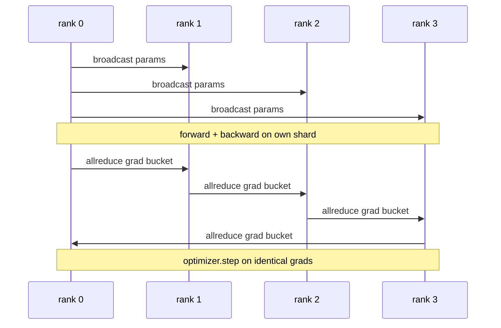

# 데이터 병렬 DDP를 맨바닥에서 (Data Parallel DDP From Scratch)

> DistributedDataParallel은 allreduce 위에 얹은 훅이다. 모델을 감싸고, 0번 랭크에서 초기 파라미터를 퍼뜨려 모든 랭크가 같은 상태에서 출발하게 하고, 파라미터마다 역전파 훅을 달아 그래디언트에 allreduce를 걸면, 나머지는 그냥 경사 하강이다. 이 전체가 200줄이다.

**Type:** Build
**Languages:** Python
**Prerequisites:** Phase 19 Track C lessons 42-49
**Time:** ~90 min

## 학습 목표 (Learning Objectives)

- 초기 파라미터를 퍼뜨리고 역전파 뒤에 그래디언트를 allreduce하는, `DistributedDataParallel` 모양의 감싸개를 만든다.
- gloo 백엔드와 파일 기반 만남 지점을 써서 `torch.multiprocessing.spawn`으로 CPU 랭크 N개를 띄운다.
- 같은 모델을 같은 데이터로 순차 학습시킨 결과와 스텝마다 파라미터가 같은지 보여서, 그래디언트 동기화가 올바름을 증명한다.
- 묶음(그래디언트 합치기)과 겹침(역전파 도중의 통신)이, 돌아가는 DDP를 실무용 DDP로 바꿔 주는 두 가지 변경임을 설명한다.

## 문제 (The Problem)

파라미터가 10억 개이고 활성값이 12GB인 모델은 소비자용 GPU 한 장에 들어가지 않는다. 들어간다 해도 학습에 몇 주가 걸린다. 데이터 병렬은 배치를 랭크 N개로 나누고, 각 랭크가 자기 몫에 대해 순전파와 역전파를 계산하고, 스텝마다 모든 랭크의 그래디언트를 더해서 N개의 사본이 같은 상태를 유지하게 한다. 옵티마이저가 밟는 것은 그렇게 더한 그래디언트다.

그래디언트를 맞추지 않으면 사본 N개는 두 번째 스텝부터 갈라진다. 그것은 더 이상 "더 많은 데이터로 학습한 모델 하나"가 아니라, 초기 가중치만 공유하는 서로 다른 모델 N개다. 그래디언트를 맞추되 서투르게 하면(파라미터마다 allreduce를 걸고, 겹치지도 않고, 묶지도 않으면) 네트워크가 병목이 되어 GPU가 통신을 기다리며 논다. DDP의 요령은 그래디언트 동기화를 계산에 견주어 거의 공짜로 만드는 것이다. PyTorch의 정석 DDP는 그래디언트를 묶고, allreduce를 다음 레이어의 역전파와 겹치고, NVLink 위에서 NCCL을 써서 그것을 이룬다. 우리는 CPU에서 gloo로 셋을 모두 해 보고 같은 것을 배울 수 있다.

## 개념 (The Concept)



### DDP에 필요한 세 가지 연산

| 단계 | 집합 통신 | 이유 |
|-------|-----------|-----|
| 초기화 | 0번 랭크에서 broadcast | 모든 랭크가 같은 파라미터로 출발해야 한다 |
| 역전파 뒤 | 그래디언트마다 allreduce | 옵티마이저가 밟는 것은 평균 그래디언트다 |
| 때에 따라 | 버퍼 broadcast | 배치 정규화의 이동 통계를 맞춰 둔다 |

### 합이 아니라 평균을 쓰는 이유

allreduce로 더한 값을 world_size로 나누면 평균 그래디언트가 된다. 평균은 world_size에 영향을 받지 않는다. 랭크 하나에서 맞춘 학습률이 랭크 넷에서도 통한다. 스텝마다의 그래디언트 크기가 달라지지 않기 때문이다. 나누지 않고 더하기만 하면 클러스터 크기를 바꿀 때마다 학습률을 다시 맞춰야 한다. DDP는 합을 감싸서 나눠 준다. 이 레슨에서도 똑같이 하라.

### 그래디언트를 묶는 이유

트랜스포머에는 파라미터 텐서가 수천 개 있다. 텐서마다 allreduce를 걸면 gloo의 지연 시간 바닥을 수천 번 치른다. DDP는 그래디언트를 25MB쯤 되는 묶음으로 모으고 묶음마다 allreduce를 한 번 건다. 전체 바이트 수는 같지만 지연 시간이 묶음 전체에 나뉘어 흡수된다. 이 레슨의 작은 모델에서는 전부를 묶음 하나에 넣는다. 옮겨 가는 것은 그 구조다.

### 시드를 고정하는 이유

모든 랭크가 데이터를 섞을 때는 `torch.manual_seed(seed + rank)`를 부르고, 파라미터를 초기화할 때는 `torch.manual_seed(seed)`를 불러야 한다. 시드를 하나로 공유하면 모든 랭크가 같은 배치 순서를 보게 되어 데이터 병렬이 무의미해진다. 반대로 파라미터에 랭크별 시드를 쓰면 초기 파라미터가 부동소수점 오차만큼 어긋나고, 그래디언트를 맞춰도 사본들이 같아지지 않는다. 시드 규칙을 제대로 잡아라. 그러지 않으면 파라미터 동일성 테스트가 첫 스텝부터 실패한다.

```figure
ci-ddp-grad-sync
```

## 직접 만들기 (Build It)

`code/main.py`에 다음을 구현한다.

- `MiniMLP`. 몇 초 만에 수렴할 만큼 작으면서도 연결 구조가 드러날 만큼은 큰 3층 MLP다.
- `DistributedDataParallel(model, world_size)`. 생성할 때 파라미터를 퍼뜨리고, allreduce로 더해진 그래디언트를 world_size로 나누는 `sync_grads`를 가진 감싸개를 돌려준다.
- `worker(rank, world_size, ...)`. gloo로 `torch.distributed`를 초기화하고 순전파, 역전파, 동기화, 갱신을 도는 전체 학습 루프다.
- `_reference_single_process_loop(...)`. 같은 모델을 같은 데이터로 랭크 하나에서 순차 학습시키며, 스텝마다 파라미터가 바이트 단위로 같은지 확인하는 테스트가 이것을 쓴다.

다음으로 실행한다.

```bash
python3 code/main.py
```

출력은 이렇다. 단일 프로세스의 손실 및 파라미터 검사합과, 랭크 4개로 돌린 DDP의 값을 스텝마다 비교하는 표가 나온다. 두 경로의 손실 곡선이 부동소수점 오차 안에서 같게 나오고, 그것이 그래디언트 동기화가 올바르다는 증거다.

## 실무에서 쓰이는 방법 (Production patterns in the wild)

세 가지가 DDP를 실제로 쓸 수 있을 만큼 단단하게 만들어 준다.

**쓰이지 않은 파라미터를 찾아라.** 조건에 따라 파라미터를 건너뛰는 순전파가 있다(조기 종료, mixture-of-experts 라우터 등). 건너뛴 파라미터에는 그래디언트가 없는데, DDP의 묶음 준비 훅은 여전히 그것을 기다리고 allreduce가 교착에 빠진다. `find_unused_parameters=True`를 주면 DDP가 리덕션 전에 어떤 파라미터에 그래디언트가 생겼는지 살펴본다. 대신 스텝마다 그래프를 훑는 비용이 드니, 순전파에 분기가 없다면 꺼 두어라.

**정적 그래프 최적화.** 순전파가 스텝마다 같다면 `static_graph=True`로 DDP가 묶음 일정을 미리 계산하게 할 수 있다. 규모가 커지면 이 최적화가 의미를 갖는다. 미리 계산해 두면 스텝마다 몇 밀리초를 아끼고, 그것이 10,000스텝에 걸쳐 쌓인다.

**그래디언트 누적은 조심해야 한다.** 마이크로배치 K개에 걸쳐 그래디언트를 누적하면서 매번 동기화하지 않으면 처리량이 열 배 가까이 좋아진다. DDP는 역전파 뒤의 allreduce를 잠시 멈추는 컨텍스트 매니저 `no_sync()`를 제공한다. 그것을 쓰지 않으면 아무 소용 없이 allreduce를 K번 걸게 되고 처리량은 바닥으로 떨어진다.

## 실제로 써 보기 (Use It)

실무에서 쓰이는 모습이다.

- **PyTorch DDP.** 정석 구현이다. `torch.nn.parallel.DistributedDataParallel(model)`이 묶음과 겹침, no_sync 컨텍스트를 모두 연결해 준다.
- **HuggingFace Accelerate.** `torchrun` 환경 변수를 다뤄 주는 실행기와 모델 감싸기를 더한다. 속은 같은 DDP다.
- **Megatron-LM의 데이터 병렬.** 큰 모델을 위해 DDP와 텐서 병렬을 함께 쓴다. 데이터 병렬 쪽은 역전파 뒤 allreduce를 거는 같은 방식이다.

## 결과물로 남기기 (Ship It)

78번 레슨(ZeRO 분할)은 파라미터마다 거는 allreduce를 reduce_scatter로 바꿔서, 각 랭크가 옵티마이저 상태의 자기 조각만 들고 있게 한다. 81번 레슨은 DDP와 ZeRO를 묶어 전 구간 데모를 만든다.

## 연습 문제 (Exercises)

1. 크기를 조절할 수 있는 그래디언트 묶음을 추가하고, 더 깊은 모델에서 파라미터마다 allreduce를 걸 때와 견주어 얼마나 빨라지는지 재라.
2. `no_sync()`를 컨텍스트 매니저로 구현하고, 마이크로배치 K개에 걸친 그래디언트 누적이 단일 프로세스 기준선과 맞는지 확인하라.
3. 순전파가 때때로 MLP 레이어 하나를 건너뛰는 `find_unused_parameters` 모드를 추가하라. 그 플래그가 없으면 실행이 교착에 빠져야 한다.
4. gloo를 `torch.distributed.barrier()`만 쓰는 동기화로 바꿔서, allreduce 기반 동기화와 장벽 기반 동기화의 차이를 체감하라.
5. 배치 크기 1과 16, 256에서 그래디언트 동기화가 스텝 시간의 몇 퍼센트를 차지하는지 재고, 그 변화를 설명하라.

## 핵심 용어 (Key Terms)

| 용어 | 흔히 쓰는 뜻 | 정확한 뜻 |
|------|----------------|------------------------|
| DDP | "데이터 병렬" | 파라미터를 퍼뜨리고 스텝마다 그래디언트를 allreduce하는 감싸개 |
| Bucket | "그래디언트 합치기" | 작은 allreduce N개를 큰 것 하나로 묶는 것 |
| Overlap | "통신 감추기" | 뒤쪽 레이어가 아직 역전파 중일 때 allreduce를 시작하는 것 |
| no_sync | "누적" | 그래디언트 누적을 위해 역전파 뒤 allreduce를 건너뛰는 것 |
| find_unused | "분기가 있는 순전파" | 리덕션 전에 그래디언트가 없는 파라미터를 찾아내는 것 |

## 더 읽을거리 (Further Reading)

- [PyTorch DistributedDataParallel docs](https://pytorch.org/docs/stable/generated/torch.nn.parallel.DistributedDataParallel.html)
- [PyTorch DDP internals tutorial](https://pytorch.org/tutorials/intermediate/ddp_tutorial.html)
- [Li et al, PyTorch Distributed: Experiences on Accelerating Data Parallel Training](https://arxiv.org/abs/2006.15704)
- Phase 19 레슨 76. DDP가 딛고 선 집합 통신 연산을 다룬다.
- Phase 19 레슨 78. 파라미터마다 걸던 allreduce를 reduce_scatter로 바꾸는 ZeRO 분할을 다룬다.
