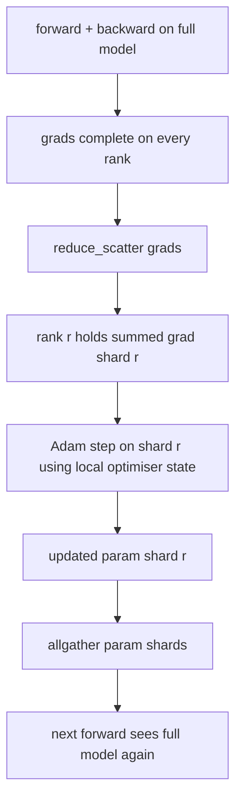

# ZeRO 옵티마이저 상태 분할 (ZeRO Optimizer State Sharding)

> Adam은 파라미터마다 모멘트 추정값을 두 개씩, 그것도 float32로 저장한다. 파라미터가 70억 개인 모델이라면 옵티마이저 상태만 56GB다. ZeRO 1단계는 그것을 랭크 N개에 나누어, 각 랭크가 옵티마이저의 1/N만 갖게 한다. 국소적으로 갱신을 마치면 갱신된 파라미터 조각을 서로에게 퍼뜨리고, 모든 랭크가 완전한 모델을 되살린 다음, 다음 스텝을 시작한다. 얻는 것은 학습 스택에서 가장 큰 메모리 덩어리가 랭크 수에 비례해 줄어드는 것이다.

**Type:** Build
**Languages:** Python
**Prerequisites:** Phase 19 Track C lessons 42-49
**Time:** ~90 min

## 학습 목표 (Learning Objectives)

- 옵티마이저 상태(1차 모멘트, 2차 모멘트, fp32 원본 사본)를 랭크 N개에 나누어 각 랭크가 1/N만 갖게 한다.
- reduce_scatter로 각 랭크에 자기 조각의 그래디언트 합만 전달하고, allgather로 갱신된 파라미터 조각을 되돌려 퍼뜨린다.
- 평범한 DDP와 견주어 1단계, 2단계, 3단계의 메모리 절감 표를 계산한다.
- 모델 크기와 대역폭 예산을 근거로 1단계와 2단계, 3단계 가운데 무엇을 고를지 설명한다.

## 문제 (The Problem)

평범한 DDP는 모든 것을 복제한다. 파라미터와 그래디언트, 옵티마이저 상태가 모든 랭크에 온전히 놓인다. fp16으로 다루는 70억 파라미터 모델이라면 랭크마다 파라미터 14GB, 그래디언트 14GB, 옵티마이저 상태 28GB가 된다. 옵티마이저 상태가 가장 큰 항이고, 순전파나 역전파가 아니라 갱신할 때만 건드리기 때문에 나누기도 가장 쉽다.

ZeRO 1단계는 옵티마이저 상태를 나눈다. 각 랭크가 Adam 모멘트의 1/N을 갖는다. 역전파가 끝나면 완전한 그래디언트를 allreduce해서 국소적으로 갱신하는 대신, reduce_scatter를 걸어 각 랭크가 자기 조각의 그래디언트 합만 받게 한다. 랭크는 자기 몫의 원본 파라미터 조각에 옵티마이저 갱신을 적용한다. 그렇게 갱신된 파라미터 조각을 allgather로 되돌려서, 모든 랭크가 다음 순전파를 위한 완전한 모델을 갖게 한다. 옵티마이저 메모리는 N분의 1로 줄어든다. 스텝마다 오가는 통신량은 DDP와 같다. reduce_scatter 한 번과 allgather 한 번을 더하면 대역폭 기준으로 allreduce 한 번과 같기 때문이다. 메모리는 줄고 처리량은 유지된다.

## 개념 (The Concept)



### ZeRO의 단계들

| 단계 | 무엇을 나누는가 | 랭크당 메모리 | 스텝당 통신 |
|-------|----------------|------------------|---------------|
| DDP | 아무것도 나누지 않는다 | 파라미터 + 그래디언트 + 옵티마이저 | allreduce 1회 |
| ZeRO-1 | 옵티마이저 상태 | 파라미터 + 그래디언트 + 옵티마이저/N | reduce_scatter 1회 + allgather 1회 |
| ZeRO-2 | 옵티마이저 + 그래디언트 | 파라미터 + 그래디언트/N + 옵티마이저/N | reduce_scatter 1회 + allgather 1회 |
| ZeRO-3 | 옵티마이저 + 그래디언트 + 파라미터 | 파라미터/N + 그래디언트/N + 옵티마이저/N | 레이어마다 allgather 1회 + reduce_scatter 1회 |

1단계가 가장 값싼 이득이다. 옵티마이저 상태가 메모리 예산을 가장 크게 차지하기 때문이다. 2단계는 그래디언트 조각을 누적하는 로직이 필요하지만 대역폭은 같다. 3단계(FSDP)는 순전파와 역전파마다 레이어별 통신 비용을 치르는 대신 파라미터 조각만큼의 메모리를 더 아낀다. 이 레슨은 1단계를 온전히 구현한다.

### 메모리 계산, 실제 숫자로

파라미터가 P개이고 Adam으로 혼합 정밀도 학습을 하는 모델이라면 이렇다.

| 항목 | 평범한 방식 | ZeRO-1 | 이유 |
|------|---------|--------|-----|
| fp16 파라미터 | 2P 바이트 | 2P 바이트 | 순전파에 필요하다 |
| fp16 그래디언트 | 2P 바이트 | 2P 바이트 | 역전파에 필요하다 |
| fp32 원본 사본 | 4P 바이트 | 4P/N 바이트 | 옵티마이저만 쓴다 |
| fp32 1차 모멘트 | 4P 바이트 | 4P/N 바이트 | 옵티마이저만 쓴다 |
| fp32 2차 모멘트 | 4P 바이트 | 4P/N 바이트 | 옵티마이저만 쓴다 |
| 합계 | 16P 바이트 | 4P + 12P/N 바이트 |   |

N이 8이면 평범한 방식은 16P이고 ZeRO-1은 5.5P로 65퍼센트 줄어든다. N이 64면 평범한 방식은 16P이고 ZeRO-1은 4.19P로 74퍼센트 줄어든다.

### allreduce 뒤에 나누는 것보다 reduce_scatter가 나은 이유

allreduce는 모든 랭크에 완전한 그래디언트 합을 준다. 랭크 r이 조각 r만 필요하다면, 리덕션된 그래디언트의 (N-1)/N은 그 랭크에서 버려진다. reduce_scatter는 각 랭크가 소유한 조각만 정확히 전달한다. 랭크당 바이트 수는 allreduce와 같지만(allreduce가 곧 reduce_scatter에 allgather를 더한 것이므로), 그 뒤 절반이 나중의 파라미터 조각 allgather로 대체된다. 전체 통신량은 DDP와 같고 메모리만 나뉜다.

```figure
cd-zero-shard
```

## 직접 만들기 (Build It)

`code/main.py`에 다음을 구현한다.

- `flatten_params(module)`와 `unflatten_into(module, flat)`. 모델의 파라미터를 이어진 텐서 하나로 묶고 다시 풀어낸다. 이렇게 평평하게 두어야 랭크별 분할이 단순한 슬라이스가 된다.
- `ZeroOptimizer(model, world_size, rank, lr)`. 그 랭크가 소유한 원본 사본 조각과 Adam 모멘트를 갖는다.
- `step()`. 평평한 그래디언트에 reduce_scatter를 걸고, 그 랭크의 조각에 Adam을 적용하고, 갱신된 파라미터를 allgather로 되돌린다.
- 3층 MLP를 20스텝 학습시키면서 스텝마다 메모리 예산을 평범한 DDP 기준선과 나란히 출력하는 데모.

다음으로 실행한다.

```bash
python3 code/main.py
```

출력은 이렇다. 스텝별 손실과 함께, ZeRO-1이 랭크마다 옵티마이저 상태의 1/N만 들고 있고 DDP는 전부 들고 있다는 것을 보여 주는 메모리 표가 나온다.

## 실무에서 쓰이는 방법 (Production patterns in the wild)

세 가지가 ZeRO를 실제로 쓸 수 있을 만큼 단단하게 만들어 준다.

**분할된 체크포인트가 중요하다.** ZeRO 1단계의 옵티마이저 상태는 랭크들에 나뉘어 있다. 그래서 체크포인트에 어느 랭크가 무엇을 소유하는지 기록해야 한다. 80번 레슨은 같은 규모의 세계에서 ZeRO 실행을 재개할 수 있게 해 주는 분할 체크포인트 목록을 만든다. 그것이 없으면 저장한 상태를 재시작할 때 읽어 들일 수 없다.

**혼합 정밀도가 핵심이다.** ZeRO는 혼합 정밀도를 전제로 한 기법이다. 나누는 대상이 바로 fp32 원본 사본이다. 혼합 정밀도 없이 ZeRO를 돌리면, fp16 순전파의 이득은 못 얻으면서 fp32 원본 사본의 메모리 비용만 치르게 된다. 실무 학습에서는 언제나 ZeRO를 autocast나 bf16 가중치와 함께 쓴다.

**1단계는 거의 공짜다.** 통신량이 대역폭 기준으로 DDP와 같다. 메모리 절감은 N에 비례한다. 치르는 비용은 옵티마이저 조각을 관리하는 부대 작업뿐이다. 실무 스택은 파라미터 조각의 메모리까지 문제가 되지 않는 한 기본값으로 1단계를 쓴다. 문제가 된다면 2단계나 3단계로 가서 통신을 내주고 메모리를 얻는다.

## 실제로 써 보기 (Use It)

실무에서 쓰이는 모습이다.

- **DeepSpeed ZeRO.** 참조 구현이다. `deepspeed_config.json`에서 1단계와 2단계, 3단계와 분할 크기를 고른다.
- **PyTorch FSDP.** PyTorch가 자체로 제공하는 대응물이다. `ShardingStrategy.SHARD_GRAD_OP`가 ZeRO-2이고, `FULL_SHARD`가 ZeRO-3이다.
- **HuggingFace Accelerate.** DeepSpeed와 FSDP를 하나의 설정 형식으로 감싼다.

## 결과물로 남기기 (Ship It)

79번 레슨(파이프라인 병렬)은 서로 직교하는 다른 분할 축이다. 같은 모델의 옵티마이저 상태를 나누는 대신, 레이어를 랭크들에 나눈다. 81번 레슨은 DDP와 ZeRO를 묶어 전 구간 데모를 만든다.

## 연습 문제 (Exercises)

1. 그래디언트를 나누어 ZeRO-2로 확장하라. 역전파 뒤에 자기 조각이 아닌 부분을 0으로 만들어서, 각 랭크가 자기 조각의 그래디언트만 저장하게 하라.
2. 0번 랭크에서 실제 fp32 바이트 사용량을 출력하는 메모리 측정기를 추가하고, 수식이 예측한 값과 비교하라.
3. 평범한 DDP와 ZeRO-1의 스텝당 실제 시간을 재고, 그것을 순전파와 역전파, 통신으로 나누어 보라.
4. ZeRO-1 아래에서 그래디언트 클리핑을 구현하라. L2 노름은 국소 노름의 제곱을 allreduce해서 모든 조각에 걸쳐 계산해야 한다.
5. reduce_scatter 대신 allreduce를 쓰는 "단순한 ZeRO"를 구현하고 통신 시간 차이를 재라. 숫자로 reduce_scatter를 고른 이유를 설명하라.

## 핵심 용어 (Key Terms)

| 용어 | 흔히 쓰는 뜻 | 정확한 뜻 |
|------|----------------|------------------------|
| ZeRO-1 | "옵티마이저를 나눈다" | 각 랭크가 fp32 원본 사본과 Adam 모멘트의 1/N을 갖는다 |
| ZeRO-2 | "그래디언트도 나눈다" | reduce_scatter 뒤에 자기 조각이 아닌 그래디언트까지 버린다 |
| ZeRO-3 | "파라미터를 나눈다" | 각 랭크가 fp16 파라미터의 1/N을 갖고, 순전파에서 레이어마다 allgather한다 |
| Master copy | "fp32 가중치" | 옵티마이저가 갱신하는 높은 정밀도의 파라미터 사본 |
| Reduce_scatter | "합을 나눈다" | 각 랭크에 자기 조각의 그래디언트 합만 전달하는 것 |

## 더 읽을거리 (Further Reading)

- [Rajbhandari et al, ZeRO: Memory Optimizations Toward Training Trillion Parameter Models](https://arxiv.org/abs/1910.02054)
- [DeepSpeed ZeRO documentation](https://www.deepspeed.ai/tutorials/zero/)
- [PyTorch FSDP documentation](https://pytorch.org/docs/stable/fsdp.html)
- Phase 19 레슨 76. 이 레슨이 딛고 선 reduce_scatter와 allgather를 다룬다.
- Phase 19 레슨 80. ZeRO 상태가 반드시 써야 하는 분할 체크포인트를 다룬다.
