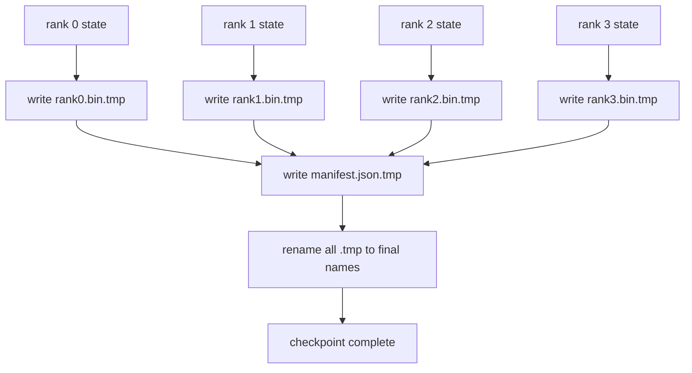

# 분할 체크포인트와 원자적 재개 (Sharded Checkpoint and Atomic Resume)

> 700억 파라미터 학습 작업은 몇 시간에 한 번씩 노드 장애로 멈춘다. 체크포인트 형식이 30분을 잃을지 30시간을 잃을지를 결정한다. 분할 체크포인트는 모든 랭크의 조각을 나란히 기록하고 소유 관계를 목록 파일에 남긴다. 재개할 때는 랭크마다 자기 파일에서 조각을 읽어, 같은 규모의 세계에서 상태를 되살리고, 아무 일도 없었던 것처럼 옵티마이저가 갱신을 이어 간다. 원자적 쓰기는 절반만 쓰인 체크포인트가 다음 재개를 망치는 일을 막는다.

**Type:** Build
**Languages:** Python
**Prerequisites:** Phase 19 Track C lessons 42-49
**Time:** ~90 min

## 학습 목표 (Learning Objectives)

- 여러 랭크의 체크포인트를 랭크별 조각 파일과, 어느 랭크가 무엇을 소유하는지 기록한 목록 파일로 저장한다.
- 임시 경로에 쓴 다음 이름을 바꾸는 원자적 쓰기 방식을 써서, 쓰는 도중에 죽어도 절반만 쓰인 체크포인트가 남지 않게 한다.
- 목록 파일로 재개하고, fp16 파라미터와 ZeRO 옵티마이저 상태가 모든 랭크에서 바이트 단위로 같은지 확인한다.
- 세 가지 실패 양상에 맞서 목록 파일의 스키마를 설명한다. 세계 규모가 바뀐 경우, 조각 개수가 맞지 않는 경우, 쓰다 만 경우다.

## 문제 (The Problem)

평범한 체크포인트는 모든 파라미터와 옵티마이저 상태를 0번 랭크로 모아서 파일 하나로 쓴다. 700억 파라미터 모델이라면 상태 1.1TB가 랭크 하나의 네트워크 포트를 통과한다. 다른 랭크들은 모으기가 끝나기를 기다리며 놀기 때문에 그 쓰기가 전체를 멈춰 세운다. 입출력 대역폭은 클러스터 전체가 아니라 가장 느린 GPU 하나의 네트워크 링크로 정해진다. 실제 클러스터에서는 모아서 쓰는 이 단계가 직전 한 시간의 학습보다 오래 걸리기도 하고, 그러면 하루에 체크포인트를 한 번도 제대로 남기지 못한다.

분할 체크포인트는 방식을 뒤집는다. 모든 랭크가 자기 조각을 자기 파일에 나란히 쓴다. 목록 파일이 어느 랭크가 어느 조각을 소유했는지 기록하므로, 재개할 때 각 조각을 원래 자리에 되돌릴 수 있다. 전체 쓰기 대역폭이 클러스터 규모에 비례한다. 랭크 하나로 4시간 걸리던 1TB 체크포인트가 랭크 64개로는 4분이면 끝난다. 게다가 목록 파일이 호환되지 않는 재개에 대한 계약이 되어 준다. 세계 규모가 바뀌었는지 알 수 있고, 쓰다 만 것도 알 수 있으며, 낡은 데이터를 조용히 쓰는 대신 소리 내어 실패할 수 있다.

## 개념 (The Concept)



### 목록 파일의 스키마

```json
{
  "world_size": 4,
  "step": 1234,
  "wall_clock_seconds": 4521,
  "shards": [
    {"rank": 0, "path": "rank0.bin", "sha256": "...", "param_shard_offset": 0, "param_shard_numel": 65536},
    {"rank": 1, "path": "rank1.bin", "sha256": "...", "param_shard_offset": 65536, "param_shard_numel": 65536}
  ],
  "schema_version": 1
}
```

무게를 받치는 필드는 셋이다. `world_size`는 다른 규모에서 재개할 때 조용히 망가지는 대신 소리 내어 실패하게 한다. 조각마다의 `sha256`은 일부만 쓰였거나 손상된 경우를 잡아낸다. 조각마다의 `param_shard_offset`과 `param_shard_numel`은, 읽어 들이는 쪽이 평평한 파라미터 텐서의 올바른 위치에 그 조각을 되돌려 놓게 해 준다.

### 원자적 쓰기 (Atomic write)

표준적인 방식은 이렇다. 조각마다 `<이름>.tmp`에 쓰고, 목록 파일도 `manifest.json.tmp`에 쓰고, 각각을 디스크에 확실히 내려보낸 다음, 이름을 바꾼다. 같은 파일 시스템 안에서의 POSIX 이름 바꾸기는 원자적이다. 새 파일이 온전히 있거나 예전 파일이 그대로 있거나 둘 중 하나다. 마지막 이름 바꾸기 전에 죽으면 직전 체크포인트가 그대로 살아 있는 것이 된다. 원자적 쓰기를 하지 않으면, 죽었을 때 조각은 일부만 쓰였는데 그것을 가리키는 목록 파일은 멀쩡히 남을 수 있고, 그것을 읽어 들이면 재개할 때 옵티마이저 상태가 망가진다.

### 스키마가 막아야 하는 세 가지 실패 양상

| 실패 | 증상 | 막는 방법 |
|---------|---------|---------|
| 세계 규모가 바뀜 | N=4로 만든 목록 파일을 N=8에서 재개한다 | 목록 파일의 world_size가 맞지 않으면 소리 내어 실패한다 |
| 조각 개수가 맞지 않음 | 목록 파일의 조각 수보다 rank*.bin 파일이 적다 | 조각을 하나씩 훑어 모두 존재하는지 확인한다 |
| 쓰다 만 경우 | 파일을 내려보내던 중에 조각이 잘렸다 | 읽어 들일 때 sha256으로 확인한다 |

각 방어 장치는 잘못된 읽기를 일찍 물리친다. 그러지 않으면 100스텝 뒤에 손실이 NaN이 되고 나서야 드러나는 조용한 손상이 생긴다.

### 큰 파일 하나가 아니라 랭크별 파일을 쓰는 이유

`O_APPEND`로 한 파일에 동시에 쓰는 것은, 바이트 경계가 맞는 쓰기라면 POSIX에서 동작한다. 하지만 실제로는 조각 하나 안의 위치들이 메가바이트 단위 구간에 걸쳐 있고 잠금이 전체를 좌우한다. 랭크별 파일은 다툴 일이 없고, 바탕 파일 시스템이 병렬일 때(Lustre, GPFS) 줄무늬 배치의 이득까지 얻는다. 실무 스택(DeepSpeed, FSDP, NeMo)이 모두 그 이유로 랭크별 파일을 쓴다.

```figure
ci-sharded-checkpoint
```

## 직접 만들기 (Build It)

`code/main.py`에 다음을 구현한다.

- `ShardManifest` 데이터 클래스. 위 스키마와 함께 `to_json`과 `from_json`을 갖는다.
- `save_sharded(state_dict_per_rank, dir, step)`. 랭크마다 이진 상태를 자기 파일에, 임시 파일에 쓴 뒤 이름을 바꾸는 원자적 방식으로 기록하고, 그다음 목록 파일을 쓴다.
- `load_sharded(dir, expected_world_size)`. 목록 파일을 읽고, 조각마다 sha256을 확인하고, 랭크별 상태 딕셔너리를 돌려준다.
- 왕복 테스트. 랭크별 상태를 만들고, 저장하고, 읽어 들이고, 바이트 단위로 같은지 단언한다.

다음으로 실행한다.

```bash
python3 code/main.py
```

출력은 이렇다. 조각 파일 네 개와 목록 파일을 쓰고, 다시 읽어 들여 바이트 단위로 같은지 확인한 결과가 나온다.

## 실무에서 쓰이는 방법 (Production patterns in the wild)

세 가지가 체크포인트를 실제로 쓸 수 있을 만큼 단단하게 만들어 준다.

**비동기 쓰기.** 실무 스택은 체크포인트 쓰기를 별도 스레드나 프로세스에 맡겨서 학습을 이어 간다. 다음 체크포인트가 그 관문이다. 직전 저장이 끝나기 전에는 다음 저장을 시작하지 않는다. DeepSpeed의 `async_io` 플래그가 정확히 이 일을 한다. 이 레슨에서는 단계가 눈에 보이도록 쓰기를 동기로 둔다.

**빠른 로컬 디스크에 먼저 쓰고 비동기로 올린다.** 로컬 NVMe에 빠르게 쓰고, 그다음 S3나 GCS로 비동기 업로드한다. 이렇게 두 층으로 두면 클러스터 안의 체크포인트는 재개에 쓸 만큼 빠르고, 오래 보관할 사본은 클러스터 밖으로 보낼 수 있다. 목록 파일에는 로컬 경로가 담기고, 업로드 목록 파일에는 원격 경로가 담긴다.

**돌려 쓰기가 중요하다.** 실무 실행은 최근 K개(보통 3개에서 5개)를 남기고 가장 오래된 것을 지운다. 이렇게 돌려 쓰지 않으면 실행 도중에 디스크가 차서 다음 체크포인트가 실패한다. 돌려 쓰면 다음 저장이 가장 오래된 것을 먼저 지워 자리를 낸다.

## 실제로 써 보기 (Use It)

실무에서 쓰이는 모습이다.

- **DeepSpeed 체크포인트.** `deepspeed.save_checkpoint(tag=step)`이 랭크별 파일과, 지금 유효한 태그를 가리키는 `latest` 파일을 쓴다.
- **PyTorch FSDP 체크포인트.** `torch.distributed.checkpoint`가 랭크별 배치를 정하는 `Planner`와 함께 분할된 상태를 저장한다.
- **NeMo.** DeepSpeed와 FSDP를 감싸고, 메타데이터를 더한 하나의 `save_to_checkpoint` API를 제공한다.

## 결과물로 남기기 (Ship It)

81번 레슨은 DDP와 ZeRO로 돌린 전 구간 실행의 분할 체크포인트를 저장하고, 같은 규모의 세계에서 다시 읽어 들여 재개 계약이 지켜지는지 증명한다.

## 연습 문제 (Exercises)

1. 비동기 쓰기를 추가하라. 저장을 스레드에서 시작하고 학습을 이어 가게 하라. 직전 저장이 끝날 때까지 다음 저장은 막아라.
2. `last_5_steps` 방식의 돌려 쓰기를 추가하라. 가장 최근 다섯 개를 남기고, 새로 저장하기 전에 가장 오래된 것을 지워라.
3. 안쪽 루프에서 다시 읽어 들일 때 쓸, CRC만 확인하는 빠른 검증 경로를 추가하라(돌려 쓰기가 어떤 체크포인트를 새로 유효한 것으로 올릴 때는 sha256을 전부 확인하지 않는다).
4. 세계 규모를 넘나드는 읽기를 추가하라. 목록 파일을 읽어 조각들을 이어 붙인 다음, N=4에서 N=8로 다시 나눠라.
5. 가짜 S3(두 번째 디렉터리)로 업로드하고 업로드 목록 파일을 써라. 그리고 두 층으로 저장하는 정책을 설명하라.

## 핵심 용어 (Key Terms)

| 용어 | 흔히 쓰는 뜻 | 정확한 뜻 |
|------|----------------|------------------------|
| Sharded checkpoint | "랭크별 저장" | 각 랭크가 자기 조각 파일을 나란히 쓰는 방식 |
| Manifest | "색인" | 조각의 경로와 위치, sha256을 기록한 JSON 파일 |
| Atomic write | "임시 파일에 쓰고 이름 바꾸기" | .tmp에 쓴 뒤 POSIX 이름 바꾸기를 해서, 죽어도 직전 파일이 살아 있게 하는 방식 |
| Partial write | "잘린 조각" | 쓰는 도중에 죽어 손상된 조각이며, sha256이 그것을 잡아낸다 |
| Rotation | "최근 K개만 남기기" | 새로 쓰기 전에 가장 오래된 체크포인트를 지워 디스크 사용량을 묶는 것 |

## 더 읽을거리 (Further Reading)

- [DeepSpeed checkpointing](https://deepspeed.readthedocs.io/en/latest/model-checkpointing.html)
- [PyTorch torch.distributed.checkpoint](https://pytorch.org/docs/stable/distributed.checkpoint.html)
- [POSIX rename atomicity](https://pubs.opengroup.org/onlinepubs/9699919799/functions/rename.html)
- Phase 19 레슨 78. 이 체크포인트가 저장하도록 만들어진 ZeRO 상태를 다룬다.
- Phase 19 레슨 81. 저장한 상태를 왕복시키는 전 구간 데모를 다룬다.
