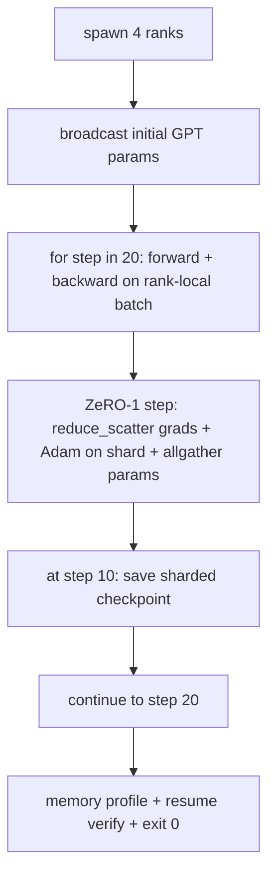

# 전 구간 분산 학습 (End-to-End Distributed Training)

> 76번부터 80번까지의 레슨이 부품을 하나씩 만들었다. 이 레슨은 그 조립이다. 흉내 낸 랭크 4개에 걸쳐, 그래디언트 동기화에는 DDP를, 옵티마이저 상태 분할에는 ZeRO-1을 쓰고, 중간 지점에서 분할 체크포인트를 남기며 작은 GPT를 학습시킨다. 데모는 20스텝을 돌고 스스로 끝을 맺으며, 손실 곡선과 메모리 사용 현황을 출력하고, 재개할 수 있는 체크포인트를 남긴다.

**Type:** Build
**Languages:** Python
**Prerequisites:** Phase 19 Track C lessons 42-49
**Time:** ~90 min

## 학습 목표 (Learning Objectives)

- DDP(레슨 77)와 ZeRO-1(레슨 78), 분할 체크포인트(레슨 80)를 하나의 학습 루프로 조립한다.
- 작은 합성 말뭉치로 2층 트랜스포머 언어 모델을, 흉내 낸 랭크 4개에 걸쳐 20스텝 학습시킨다.
- 스텝별 손실 표와 랭크별 메모리 사용 현황, 그리고 같은 규모의 세계에서 바이트 단위로 같게 재개되는 체크포인트 목록 파일을 출력한다.
- 이 조립을 설명한다. 각 부품은 앞선 레슨에서 따로 시험할 수 있었고, 이 레슨은 그것들이 함께 맞물린다는 것을 증명한다.

## 문제 (The Problem)

캡스톤은 부품들이 서로 맞물린다는 증명이다. 76번 레슨은 집합 통신 연산을 구현했다. 77번 레슨은 그것을 DDP로 감쌌다. 78번 레슨은 reduce_scatter로 옵티마이저 상태를 나눴다. 79번 레슨은 파이프라인을 분석했다. 80번 레슨은 분할 체크포인트를 저장했다. 각 레슨은 자기 테스트와 함께 홀로 섰다. 그런데 실제 학습은 그 기본 연산을 한꺼번에 쓴다. 조립이 잘못되면 손실이 발산하거나, 체크포인트가 재개를 거부하거나, 줄어들어야 할 랭크별 메모리가 오히려 늘어난다.

이 레슨은 전 구간 데모를 돌리고 네 가지 불변 조건을 확인한다. (가) 20스텝에 걸쳐 손실이 부동소수점 잡음 범위 안에서 단조롭게 줄어드는지, (나) 모든 랭크가 스텝마다 같은 파라미터 노름을 갖는지, (다) 랭크별 옵티마이저 메모리가 ZeRO-1 수식인 12P/N 바이트와 맞는지, (라) 10번 스텝의 체크포인트가 재시작할 때 바이트 단위로 같게 읽히는지다. 데모는 스스로 끝을 맺는다. 20스텝, 명령 하나, 종료 코드 0이다.

## 개념 (The Concept)



### 작은 GPT

모델은 일부러 작게 만든다. 트랜스포머 블록 2개, 임베딩 차원 32, 어텐션 헤드 4개, 어휘 64개, 시퀀스 길이 16, 배치 4다. 파라미터는 수천 개다. 연결에 관한 모든 판단을 건드릴 만큼은 크다. 멀티헤드 어텐션이 표준적인 마스크 경로를 돌고, LayerNorm에 맞춰야 할 가중치가 있고, 언어 모델 헤드가 어휘로 되돌아가는 별도의 선형 사영이다. 그러면서도 CPU 랭크 4개로 20스텝을 몇 초 만에 끝낼 만큼 작다.

### 조립 규칙

| 레슨의 부품 | 그 부품이 맡는 것 | 루프에 남겨 두는 것 |
|--------------|--------------|----------------------------|
| DDP broadcast | 초기 파라미터 맞추기 | 생성할 때 한 번 부르기 |
| ZeRO-1 step | 그래디언트 동기화, 원본 사본 갱신, 파라미터 퍼뜨리기 | optimiser.step을 대신하는 스텝당 호출 한 번 |
| 분할 체크포인트 | 랭크별 상태 저장, sha256이 붙은 목록 파일 | allgather로 모은 상태를 가지고 0번 랭크에서 호출 |
| 학습 루프 | 순전파, 역전파, 손실 기록 | 위 셋을 순서대로 부르기 |

루프는 reduce_scatter나 만남 지점 파일에 대해 알지 못한다. ZeRO 모듈과 체크포인트 모듈이 좁은 인터페이스만 내놓고, 루프는 그것을 조립할 뿐이다.

### MLP가 아니라 작은 GPT를 쓰는 이유

77번 레슨의 MLP는 그래디언트 동기화를 확인하기에는 충분했다. 작은 GPT는 세 가지를 더한다. 어휘에 대한 별도의 언어 모델 헤드(이 레슨에서는 설명을 분명히 하려고 묶지 않았지만, 실제 GPT는 보통 헤드를 토큰 임베딩과 묶는다), 손실로 쓰는 소프트맥스와 교차 엔트로피(MSE보다 수치상의 경계 사례가 많다), 그리고 비대칭적인 순전파(임베딩을 거쳐 레이어마다 어텐션과 MLP를 지난다)다. 캡스톤에서 MLP를 그대로 썼다면, 이 조립이 LayerNorm이나 임베딩 레이어의 그래디언트 모양을 제대로 다루는지 드러나지 않았을 것이다.

### 스스로 끝을 맺는다는 것은 종료 코드 0을 뜻한다

루프는 정해진 20스텝을 돌고 끝난다. `while True`도 없고, 사람이 끼어들 일도 없고, 외부 상태에서 이어받는 일도 없다. 켜 두고 자리를 비워도 되고 끝나면 완결된 기록이 남아 있는 캡스톤이라야, 그 시스템이 제대로 연결되었다는 것을 증명한다. 어느 부품이라도 교착에 빠지면 데모가 돌아오지 않고, 테스트 장치가 그것을 잡아낸다.

```figure
ci-distributed-assembly
```

## 직접 만들기 (Build It)

`code/main.py`에 다음을 구현한다.

- `MiniGPT`. 마스크된 셀프 어텐션과 별도의 언어 모델 헤드를 가진 2층 트랜스포머다.
- `make_corpus(seed, total_tokens)`. 결정적인 다음 토큰 예측 데이터를 만든다.
- `_train_worker`. 랭크마다 띄우며, 초기 파라미터를 퍼뜨리고, 루프를 돌고, ZeRO 갱신을 부르고, 10번 스텝에서 분할 체크포인트를 쓴다.
- `verify_resume`. 본 실행이 끝난 뒤 10번 스텝의 체크포인트를 같은 프로세스에서 다시 읽어, 저장된 원본 조각이 메모리에 있던 것과 바이트 단위로 같은지 단언한다.
- `main`. 데모 전체를 조율하고, 손실 표와 메모리 사용 현황, 확인 결과를 출력한다.

다음으로 실행한다.

```bash
python3 code/main.py
```

출력은 이렇다. 20행짜리 손실 표와 랭크 4개의 메모리 사용 현황, 체크포인트 목록 파일, 그리고 성공하면 "RESUME VERIFIED" 줄이 나온다.

## 실무에서 쓰이는 방법 (Production patterns in the wild)

세 가지가 실제 실행을 위한 조립을 마무리해 준다.

**K스텝마다가 아니라 K분마다 체크포인트를 남겨라.** 스텝 시간은 시퀀스 길이와 마이크로배치 수에 따라 달라진다. 10분 주기로 체크포인트를 남기면 모델 크기와 상관없이 같은 양의 연산을 지킬 수 있다. 이 레슨은 설명을 단순하게 하려고 스텝 기준을 쓰지만, 실무는 실제 시간 기준을 쓴다.

**발산을 일찍 잡아내라.** 실무 실행은 역전파 뒤에 NaN 감시와 손실 급등 감지를 둔다. 한 스텝에 손실이 두 배 넘게 뛰면, 옵티마이저가 망가진 상태로 계속 나아가게 두지 말고 직전 체크포인트로 되돌린다. 이 레슨의 손실 곡선은 매끄러워서 그 감시가 발동하지는 않지만, 붙일 자리는 남겨 둔다.

**메모리 사용 현황을 랭크들에 걸쳐 모아라.** 실제 실행에서는 랭크마다 메모리 사용량이 다르다. 가장 큰 파이프라인 단계를 맡은 랭크가 활성값을 더 많이 들고 있다. 실무는 랭크들의 최댓값과 평균을 함께 기록한다. 이 레슨은 수식과 맞는지 보여 주려고 랭크별로 출력한다.

## 실제로 써 보기 (Use It)

실무에서 쓰이는 모습이다.

- **DeepSpeed.** DDP와 ZeRO, 파이프라인, 활성값 체크포인팅을 설정 하나로 묶는다. 이 레슨의 조립이 곧 DeepSpeed의 축소판이다.
- **PyTorch FSDP.** PyTorch가 자체로 제공하는 대응물이다. `ShardingStrategy.SHARD_GRAD_OP`를 쓴 `FullyShardedDataParallel`이 ZeRO-2다.
- **NeMo와 Megatron-LM.** 아주 큰 모델을 위해 텐서 병렬을 더한다. 그 밖의 조립 구조는 같다.

## 결과물로 남기기 (Ship It)

트랙 전체가 여기에서 끝난다. 여섯 레슨을 합치면, 실제 팀이 DeepSpeed를 도입하기 전에 직접 만들어 볼 법한 분산 학습 하위 시스템이 된다. 추상화는 gloo와 대조해 검증했고 실패 양상도 하나씩 겪어 보았다. 이것을 실제 클러스터로 옮기는 일은 Phase 17(인프라와 프로덕션)의 몫이다.

## 연습 문제 (Exercises)

1. 어텐션 헤드를 텐서 병렬로 나누고 손실이 단일 랭크 기준선과 맞는지 확인하라. 랭크 두 개에 헤드를 절반씩 두고 어텐션 출력을 allreduce한다.
2. 마이크로배치 네 개에 걸친 그래디언트 누적을 추가하고, 그 그래디언트가 큰 배치 하나로 구한 그래디언트와 같은지 증명하라.
3. 10번 스텝에서 재개해서 실제로 20번 스텝까지 학습을 이어 가는 경로를 추가하고, 원래 실행과 같은 최종 손실이 나오는지 확인하라.
4. 손실과 그래디언트 노름, 스텝 시간을 JSONL로 내보내는 지표 기록을 추가해서, 나중에 그 실행을 그림으로 볼 수 있게 하라.
5. 손실이 급등하면 직전 체크포인트로 되돌리는 NaN 감시를 추가하고, 한 스텝만 학습률에 배수를 걸어 일부러 급등을 일으켜 그 되돌리기를 시험하라.

## 핵심 용어 (Key Terms)

| 용어 | 흔히 쓰는 뜻 | 정확한 뜻 |
|------|----------------|------------------------|
| End-to-end | "전부 이어 붙이기" | 부품마다 단위 테스트를 두는 대신, 한 번의 실행이 모든 부품을 조립해 돌리는 것 |
| Memory profile | "랭크당 몇 GB" | 각 랭크가 파라미터와 그래디언트, 옵티마이저 상태로 들고 있는 바이트 수 |
| Resume contract | "저장하고 읽기" | 체크포인트를 왕복시킨 뒤에도 랭크별 상태가 바이트 단위로 같은 것 |
| Self-terminating | "정해진 만큼만 도는 실행" | 스텝 수가 정해져 있고, 끝나면 종료 코드 0으로 끝나며, 사람이 끼어들지 않는 것 |

## 더 읽을거리 (Further Reading)

- [DeepSpeed end-to-end training tutorial](https://www.deepspeed.ai/getting-started/)
- [PyTorch FSDP advanced tutorial](https://pytorch.org/tutorials/intermediate/FSDP_advanced_tutorial.html)
- [Megatron-LM training script reference](https://github.com/NVIDIA/Megatron-LM)
- Phase 19 레슨 76부터 80까지. 이 레슨이 조립하는 각 부품을 다룬다.
- Phase 17. 이 조립을 실제 클러스터로 옮기는 일을 다룬다.
