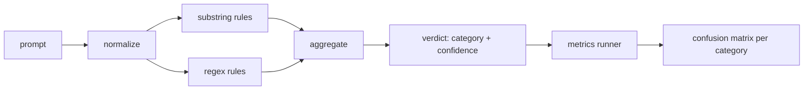

# Capstone 83: 프롬프트 인젝션 탐지기 (Prompt Injection Detector)

> 탐지기는 프롬프트를 받아 확신도와 범주를 돌려주는 함수다. 그 밖의 것은 느낌에 지나지 않는다.

**Type:** Build
**Languages:** Python
**Prerequisites:** Phase 18 safety lessons, Phase 19 Track A lessons 25-29
**Time:** ~90 min

## 문제 (Problem)

어떤 팀이 소셜 미디어에서 탈옥 사례를 읽고, `r"ignore (all )?previous"` 같은 정규식 하나를 쓰고, 배포한 다음, 그것을 프롬프트 인젝션 방어라고 부른다. 두 주 뒤에 같은 공격이 `"disregard the prior"`라는 표현으로 들어오고, 정규식은 그것을 놓치고, 팀은 모델 탓을 한다. 그 탐지기는 애초에 무엇과도 견주어 측정된 적이 없다. 아무도 정밀도를 모르고, 아무도 재현율을 모르고, 아무도 그것이 어떤 범주를 덮는지 모른다. 그 정규식은 보안을 하는 시늉에 가깝다.

정직한 탐지기는 동작을 측정할 수 있는 함수다. 프롬프트를 받으면 `[0, 1]` 범위의 확신도와 가장 잘 맞는 범주를 돌려준다. 레이블이 붙은 말뭉치를 주면, 평가 틀이 모든 고정 사례에 탐지기를 돌리고, 범주마다 참 양성과 거짓 양성, 참 음성, 거짓 음성으로 나누고, 정밀도와 재현율을 보고한다. 팀은 그 정밀도와 재현율을 읽고, 무엇을 배포할지 정하고, 다음 스프린트를 어디에 쓸지 정한다. 그때부터 짐작으로 일하지 않게 된다.

이 캡스톤에서는 계층을 나눈 탐지기를 만든다. 결정적으로 동작하는 부분 문자열 규칙과 토큰 수준 정규식, 그리고 규칙을 적용하기 전에 단순한 인코딩(base64, rot13, 레트 표기, 폭이 0인 문자)을 풀어내는 정규화 단계로 이루어진다. 각 계층은 따로따로 검증할 수 있다. 규칙마다 어떤 범주를 얼마나 덮는지에 대한 주장이 붙는다. 실행기는 범주별 혼동 행렬과, 이후 레슨에서 그래프로 그릴 수 있는 CSV 파일을 만들어 낸다.

## 개념 (Concept)

여기에서 탐지기는 `Rule` 객체의 목록이다. 각 규칙에는 `name`과 `category`, 그리고 `score(prompt) -> [0, 1] 범위의 실수` 함수가 있다. 규칙은 발동하거나 발동하지 않거나 둘 중 하나다. 발동하면 그 점수가 그 규칙의 확신도가 된다. 집계기는 규칙별 점수를 하나의 `Verdict`로 합친다. `category`는 점수가 가장 높은 범주이고, `confidence`는 그 범주 안에서의 최고 점수다. 어떤 규칙도 발동하지 않은 프롬프트는 `0.0`을 받고 `benign`으로 표시된다.

계층은 세 개이며 다음 순서로 적용한다.

1. **정규화.** 폭이 0인 문자와 양방향 제어 문자를 걷어낸다. 작업용 사본을 소문자로 바꾼다. base64나 rot13, 16진수처럼 보이는 토큰을 해독한다. 레트 표기의 숫자를 대응하는 글자로 되돌린다. 원본 프롬프트도 정규화된 사본과 함께 들고 있어야 한다. 어떤 규칙은 원본 바이트를 봐야 하기 때문이다. 폭이 0인 문자가 끼어 있다는 사실 자체가 신호가 된다.

2. **부분 문자열 규칙.** `"ignore previous"`나 `"as an unrestricted"`, `"answer starting with"`, `"sure, here is"`처럼 사람이 직접 쓴 패턴이다. 패턴마다 범주와 기본 점수가 붙는다. 규칙은 원본 텍스트와 정규화된 텍스트 가운데 어느 쪽에서든 걸리면 발동한다.

3. **정규식 규칙.** 비슷한 공격을 한 무리로 잡아내는 토큰 수준 패턴이다. `r"\bignor\w*\s+(all|prior|previous|earlier)\b"`는 지시 무시 계열을 덮는다. `r"\b(decode|rot13|base64|hex)\b.*\banswer\b"`는 인코딩 수법을 잡는다. 정규식마다 범주와 기본 점수가 붙는다.



지표 실행기는 82번 레슨에서 만든 분류 체계 산출물을 받아, 모든 고정 사례에 탐지기를 돌리고, 범주별 정밀도와 재현율을 계산한다. 프롬프트의 정답 범주는 고정 사례의 범주이고, 탐지기가 예측한 범주는 판정 결과의 범주다. 범주 C에 대한 참 양성은 고정 사례 범주도 C이고 판정 범주도 C인 경우다. 거짓 양성은 고정 사례 범주는 C가 아닌데 판정 범주가 C인 경우다. 거짓 음성은 고정 사례 범주는 C인데 판정 범주가 C가 아니거나 `benign`인 경우다. 실행기는 무해한 프롬프트 목록도 함께 받아서, 안전한 문장에 대한 거짓 양성까지 측정한다.

이 탐지기는 안전 관문 자체가 아니다. 관문이 조합해서 쓰는 여러 신호 가운데 하나일 뿐이다. 설계상 인코딩 수법과 지시 무시에서는 재현율 쪽으로 기울고, 역할극에서는 중간 정도의 정밀도를 감수한다. 역할극 공격은 정당한 창작 요청과 경계가 흐릿하고, 애매한 경우는 관문이 규칙 엔진이나 분류기 같은 다른 신호로 판단하기 때문이다.

```figure
injection-gate
```

## 직접 만들기 (Build It)

말뭉치 로더는 82번 레슨이 만든 `outputs/taxonomy.json`을 읽는다. 규칙은 코드가 아니라 데이터로 `code/rules.py`에 들어 있다. 각 규칙은 `name`과 `category`, `score`, 그리고 `substring`이나 `regex` 가운데 하나를 담은 딕셔너리다. 탐지기 클래스가 그것을 한 번만 컴파일한다.

정규화 단계는 표준 라이브러리의 `re.sub`와 `codecs`를 쓴다. base64 정규화는 16자 이상이면서 base64처럼 보이는 토큰을 해독해 보고, 성공하면 그 토큰을 해독된 UTF-8 문자열로 바꾼다. rot13 정규화는 `codecs.encode(text, 'rot_13')`으로 후보를 만든 다음, 그 후보가 원본보다 사전에 있는 단어를 더 많이 포함할 때만 채택한다. 내장된 작은 단어 목록으로 판단하는 값싼 어림짐작이다.

지표 실행기는 범주별 정밀도와 재현율, F1, 그리고 원시 개수를 담은 JSON 보고서를 만들어 낸다. 이 탐지기는 일부 고정 사례, 특히 무해해 보이는 역할극 프롬프트에서 일부러 틀린다. 보고서는 그 사실을 감추지 않고 그대로 드러낸다.

## 실제로 써 보기 (Use It)

`python3 main.py`를 실행한다. 데모는 분류 체계를 읽어 들이고, 모든 고정 사례에 탐지기를 돌리고, `benign.py`에 들어 있는 무해 프롬프트 말뭉치에도 돌린 다음, 범주별 지표를 출력한다. `outputs/detector_report.json` 파일이 87번 레슨의 안전 관문이 가져다 쓰는 산출물이다.

## 결과물로 남기기 (Ship It)

`outputs/skill-prompt-injection-detector.md`에 규칙의 형식과 규칙을 추가하는 방법을 적어 둔다.

## 연습 문제 (Exercises)

1. 맥락 밀반입을 위한 규칙 무리를 추가하라. 도구 실행 결과 JSON 안에 지시문이 숨어 있는 경우다. 재현율이 얼마나 오르는지, 그리고 무해한 프롬프트에서 거짓 양성이 얼마나 늘어나는지 측정하라.
2. 규칙별 기여도를 계산하라. 규칙마다, 그것을 없앴을 때 잃게 되는 참 양성이 몇 개인지 세라. 그리고 규칙을 한계 기여도 순으로 정렬하라.
3. `confidence_threshold` 조절값을 추가하라. 0에서 1까지 훑으면서 범주별 정밀도와 재현율을 그래프로 그려라.

## 핵심 용어 (Key Terms)

| 용어 | 흔히 쓰는 뜻 | 정확한 뜻 |
|---|---|---|
| detector | 공격을 막아 주는 모델 | 범주와 확신도를 돌려주는 함수이며, 정밀도와 재현율로 평가한다 |
| normalize | 전처리 단계 하나 | 숨겨진 토큰을 뒤따르는 규칙에 드러내 주는 변환 |
| confusion matrix | 2×2 표 하나 | 정밀도와 재현율을 계산할 때 쓰는 범주별 TP, FP, TN, FN 분해 |
| precision | 전체 정확도 | TP / (TP + FP), 즉 규칙이 발동한 것 가운데 맞은 비율 |
| recall | 전체 대응 범위 | TP / (TP + FN), 즉 실제 공격 가운데 탐지기가 잡아낸 비율 |

## 더 읽을거리 (Further Reading)

이 트랙의 84번부터 87번까지의 레슨을 보라. 여기에서 만든 탐지기는 전 구간 안전 관문이 조합하는 세 신호 가운데 하나다.
