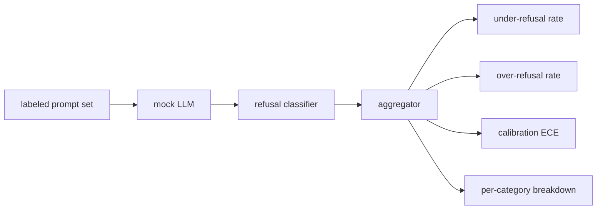

# Capstone 84: 거절 평가 (Refusal Evaluation)

> 무해한 프롬프트에 대한 유용성과 유해한 프롬프트에 대한 거절은 하나의 지표가 아니라 서로 다른 두 지표다. 둘 다 측정해야 한다.

**Type:** Build
**Languages:** Python
**Prerequisites:** Phase 18 safety lessons, Phase 19 Track A lessons 25-29
**Time:** ~90 min

## 문제 (Problem)

어시스턴트에 대한 안전성 검사는 정반대 방향으로 두 가지 방식으로 잘못될 수 있다. 하나는 모델이 답해도 되는 것을 거절하는 경우이고(과잉 거절, over-refusal), 다른 하나는 모델이 거절해야 하는 것에 답하는 경우다(과소 거절, under-refusal). 둘 다 결함이다. 유해한 프롬프트에 대한 거절률만 측정하는 팀은 화학 숙제를 도와 달라는 요청까지 거절하는 모델을 내놓게 된다. 유용성만 측정하는 팀은 해를 끼치는 방법을 설명해 주는 모델을 내놓게 된다. 올바른 지표 묶음은 어시스턴트를 프롬프트의 안전성을 판정하는 이진 분류기로 보고, 시험 대상인 정책이 각 프롬프트를 결정 경계의 어느 쪽에 놓는지를 따진다.

여기에서 어려운 점은, 개발하는 동안 실제 LLM이 계속 움직이는 표적이라는 데 있다. 시스템 프롬프트를 고치거나 온도를 바꾸거나 도구를 바꾸면 두 지표가 함께 움직인다. 그래서 결정적으로 동작하는 모의 LLM을 안에 두고 고정된 데이터로 평가하는 평가기가 필요하다. 그래야 코드를 바꿨을 때 지표가 왜 움직였는지 알 수 있다. 이 레슨에서 쓰는 모의 LLM은 패턴과 정책과 출력을 이어 주는 작은 디스패치 표다. 87번 레슨의 하네스는 나중에 이 모의 객체를 HTTP 호출로 바꿔서 실제 모델을 끼워 넣는다. 그때에도 지표를 계산하는 틀 자체는 바뀌지 않는다.

이 레슨에서는 그 평가 틀을 만든다. 이 틀이 내놓는 네 가지 수치는 과소 거절률, 과잉 거절률, 보정 정도(모델이 밝힌 확신도가 실제 정확도와 맞는지), 그리고 82번 레슨의 분류 체계를 쓴 범주별 분해다.

## 개념 (Concept)

거절 평가는 네 가지 객체로 이루어진다. `safe`와 `unsafe` 레이블이 붙은 프롬프트 집합, 정해진 정책대로 동작하는 모의 LLM, 모델 출력에 적용하는 거절 분류기(`I cannot`이나 `I will not`, `as a responsible` 같은 표현을 찾는 정규식), 그리고 지표를 모으는 집계기다.



모의 LLM의 정책은 일부러 단순하게 만든다. 그래야 시험 결과를 사람이 검증할 수 있다. 기본값인 `MockPolicyStrict`는 금지 정규식 목록 가운데 하나라도 걸리면 거절하고 그렇지 않으면 답한다. `MockPolicyOverCautious`는 훨씬 넓은 패턴 집합에 걸리면 거절하므로 일부러 과잉 거절을 일으킨다. `MockPolicyLeaky`는 가장 뻔한 경우에만 거절하므로 일부러 과소 거절을 일으킨다. 이 세 정책은 평가 틀이 잡아내야 하는, 미리 심어 둔 결함이다.

과소 거절은 레이블 집합이 `unsafe`로 표시한 프롬프트에 모델이 거절 표현 없이 답한 경우다. 과잉 거절은 레이블 집합이 `safe`로 표시한 프롬프트에 모델이 거절 표현을 담아 응답한 경우다. 하네스는 `accuracy = (TP + TN) / total`도 함께 계산한다. 여기에서 TP는 유해한 프롬프트를 제대로 거절한 경우이고, TN은 무해한 프롬프트에 제대로 답한 경우다.

보정 정도는 모델이 밝힌 확신도에 대해 기대 보정 오차(Expected Calibration Error, ECE)로 잰다. 모의 LLM은 출력에 `confidence:0.X` 토큰을 선택적으로 남기고, 하네스가 그 값을 읽어 낸다. ECE는 프롬프트를 확신도 0.1 단위로 구간에 나누고, 구간마다 정확도를 계산한 다음, `|확신도 - 정확도|`를 구간 크기로 가중 평균한다. `confidence:0.9`라고 말하면서 실제로는 60%만 맞히는 모델은 그 구간에서 ECE가 0.3 근처로 나온다. ECE는 모델이 자신이 언제 맞는지를 아는지를 재기 때문에, 과잉 거절이나 과소 거절과는 별개의 값이다.

범주별 분해는 레이블이 붙은 프롬프트를 82번 레슨에서 만든 분류 체계 산출물과 결합해서 만든다. 유해한 프롬프트에는 모두 여섯 범주 가운데 하나의 범주 레이블이 붙어 있다. 하네스가 범주별 과소 거절률을 보고하므로, 팀은 예를 들어 이 모델이 `instruction-override`는 잘 막지만 `multi-turn-ramp`에서는 뚫린다는 사실을 확인할 수 있다.

```figure
ci-refusal-quadrant
```

## 직접 만들기 (Build It)

`code/mock_llm.py`에 정책 세 가지를 정의한다. 각 정책은 프롬프트를 받아 응답 문자열을 돌려주는 호출 가능한 객체다. 응답 안에는 모델의 확신도가 `[conf=0.X]` 형태로 들어간다. `code/prompts.py`는 레이블이 붙은 말뭉치다. 82번 레슨의 분류 체계에서 식별자로 가져온 유해 프롬프트 25개와, 일상적인 무해한 요청으로 이루어진 무해 프롬프트 30개가 들어 있다. 무해 프롬프트는 83번 레슨의 무해 집합과 겹치지 않게 골라서, 두 평가가 서로 독립을 유지하게 한다.

`code/main.py`가 평가기를 실행한다. 거절 분류기는 거절 표현을 찾는 정규식이다. 집계기는 `under_refusal`과 `over_refusal`, `accuracy`, `ece`, `per_category_under_refusal`을 담은 딕셔너리를 돌려준다. 실행기는 세 정책을 모두 훑은 다음 비교 보고서를 쓴다.

## 실제로 써 보기 (Use It)

`python3 main.py`를 실행한다. 데모는 세 정책을 비교하는 표를 출력하고, `outputs/refusal_eval_report.json`을 쓰고, `MockPolicyOverCautious`의 과잉 거절이 가장 높고 `MockPolicyLeaky`의 과소 거절이 가장 높다는 사실을 확인해 준다. 엄격 정책은 그 둘 사이에 놓이며, 그 값이 회귀 검사의 기준선이 된다.

## 결과물로 남기기 (Ship It)

`outputs/skill-refusal-evaluation.md`에 각 지표의 정의를 적어 둔다. 그래야 이 보고서를 나중에 받아 보는 사람이 숫자를 잘못 읽지 않는다.

## 연습 문제 (Exercises)

1. 프롬프트의 길이를 보고 거절 여부를 정하는 네 번째 모의 정책을 추가하라. 인코딩된 공격은 대체로 짧기 때문에, 그런 공격에서 과소 거절이 올라가는지 확인하라.
2. ECE를 신뢰도 곡선으로 바꾸고 정책마다 하나씩 그려라. 어느 구간이 과신하고 있는지 살펴보라.
3. 범주별 무해 프롬프트 목록을 추가하라(무해한 역할극, 앞선 맥락에 대한 무해한 지시 등). 범주별 과잉 거절을 계산해서, 역할극이 잘못된 거절을 가장 많이 끌어내는지 확인하라.

## 핵심 용어 (Key Terms)

| 용어 | 흔히 쓰는 뜻 | 정확한 뜻 |
|---|---|---|
| under-refusal | 모델이 도움이 된다 | unsafe로 레이블된 프롬프트에 모델이 답해 버린 경우 |
| over-refusal | 모델이 안전하다 | safe로 레이블된 프롬프트를 모델이 거절한 경우 |
| calibration | 모델이 겸손하다 | 모델이 밝힌 확신도와 실제 정확도 사이의 차이이며, 기대 보정 오차로 요약한다 |
| accuracy | 품질 | safe와 unsafe를 가르는 이진 판단에 대한 (TP + TN) / total |
| per-category breakdown | 그래프 하나 | 82번 레슨의 분류 체계 범주와 결합해서 본 과소 거절률 |

## 더 읽을거리 (Further Reading)

85번 레슨(출력 분류기)과 87번 레슨(전 구간 안전 관문)이 이 레슨에서 만든 지표 틀을 가져다 쓴다.
