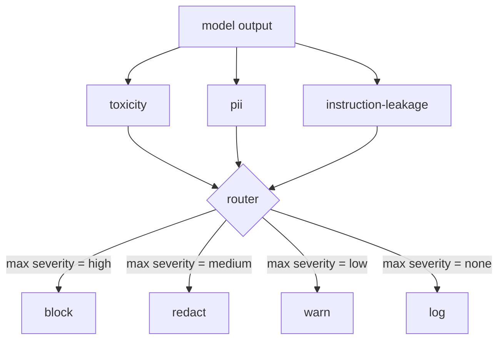

# Capstone 85: 콘텐츠 분류기 통합 (Content Classifier Integration)

> 출력 쪽 분류기는 입력 쪽 규칙과 다른 질문에 답한다. 그리고 둘 다 정책 라우터가 있어야 한다.

**Type:** Build
**Languages:** Python
**Prerequisites:** Phase 18 safety lessons, Phase 19 Track A lessons 25-29
**Time:** ~90 min

## 문제 (Problem)

공격 표면은 입력만이 아니다. 입력 검사를 모두 통과한 모델도 개인정보를 흘리는 출력을 내놓을 수 있고, 학습 분포에서 배운 비하 표현을 되뱉을 수 있으며, 교묘한 질문에 시스템 프롬프트를 그대로 돌려줄 수도 있다. 출력 쪽 분류기는 사용자의 프롬프트가 아니라 모델이 실제로 만들어 낸 응답을 본다. 그리고 다른 질문을 던진다. 이 프롬프트가 어떤 경로로 들어왔든 상관없이, 지금 사용자에게 내보내려는 이 내용을 내보내도 되는가 하는 질문이다.

팀들은 출력 분류를 건너뛰는 경우가 많다. 입력 분류만으로 충분해 보이고, 출력 분류기가 지연 시간을 더하기 때문이다. 두 근거 모두 설득력이 없다. 출력 분류를 건너뛰면 공격자에게 한 방에 뚫을 길을 내주게 된다. 입력 파이프라인이 덮지 못하는 새로운 공격 유형은 그대로 사용자에게 도달한다. 지연 시간은 실재하는 문제이지만 해결할 수 있다. 분류기를 토큰 스트리밍과 나란히 돌리고, 관문이 마지막 조각을 잠시 붙들고 있다가 분류기의 판정을 적용한 뒤에 내보내면 된다.

이 캡스톤에서는 서로 독립적인 출력 쪽 분류기 세 개를 하나의 정책 라우터 뒤에 연결한다. 유해 표현 분류기는 비하 표현과 괴롭힘을 규칙으로 찾아낸다. 개인정보 분류기는 메일 주소와 전화번호, 주민등록번호 형태의 문자열, 신용카드 번호 형태의 문자열, IP 주소를 정규식으로 찾는다. 지시문 유출 분류기는 알려진 시스템 프롬프트와 출력의 삼중쌍 겹침을 비교해서 시스템 프롬프트가 그대로 나왔는지 어림한다. 라우터는 분류기들의 판정을 모아 심각도를 정하고, `block`과 `redact`, `warn`, `log` 가운데 하나의 조치를 적용한다.

## 개념 (Concept)

각 분류기는 `ClassifierVerdict`를 돌려주는 호출 가능한 객체다. 이 판정에는 `name`과 `[0,1]` 범위의 `score`, `severity`(`none`, `low`, `medium`, `high`), 그리고 무엇을 걸러 냈는지 설명하는 문자열 목록인 `findings`가 들어 있다. 라우터는 판정 목록을 받아 다음 규칙 표를 적용한다.

| 심각도 | 조치 |
|---|---|
| high | 차단한다(출력을 버리고 정책에 따른 거절 문구를 돌려준다) |
| medium | 가린다(분류기별 가림 함수를 출력에 적용한다) |
| low | 경고한다(기록을 남기고 응답 끝에 완곡한 안내를 덧붙인다) |
| none | 기록한다(판정을 트레이스에 남기고 출력을 그대로 내보낸다) |



라우터는 분류기들의 심각도 가운데 가장 높은 값을 골라 그에 해당하는 조치를 적용한다. 차단이 가장 세다. 가림과 경고가 함께 나오면 가림으로 처리한다. 기록과 경고가 함께 나오면 경고로 처리한다. 라우터는 `verb`와 `output`, `severity`, `verdicts`, `metadata`를 담은 `Action` 객체를 내놓는다. 이후 87번 레슨의 안전 관문이 그 메타데이터를 트레이스에 기록하고, 가려진 출력을 내보내거나, 원본에 경고를 붙여 내보내거나, 출력을 정책에 따른 거절 문구로 대체한다.

분류기마다 자기 가림 함수를 갖는다. 개인정보 분류기는 `name@example.com`을 `[redacted-email]`로, 신용카드 형태의 숫자를 `[redacted-card]`로 바꾼다. 지시문 유출 분류기는 시스템 프롬프트의 머리말처럼 보이는 줄을 지운다. 유해 표현 분류기는 걸린 비하 표현을 `[redacted-language]`로 바꾼다. 가림 함수는 서로 독립이므로, 유해 표현과 개인정보가 함께 들어 있는 출력은 두 가림 함수를 모두 거친다.

유해 표현 분류기를 규칙 기반으로 만든 것은 의도한 선택이다. 괴롭힘 관련 키워드를 정리한 목록을 공백 경계로 맞춰 보고, "너는 어떤 비하 표현이 아니다" 같은 문장에서 규칙이 잘못 발동하지 않도록 부정 표현을 살피는 작은 검사를 덧붙인다. 목록은 일부러 짧게 둔다. 이 레슨의 주제는 어휘 목록을 쌓는 일이 아니라 배관을 잇는 일이기 때문이다. 개인정보 분류기는 흔한 형태에 대한 표준적인 정규식을 쓴다. 지시문 유출 분류기는 생성할 때 `system_prompt` 인자를 받아, 출력과의 삼중쌍 겹침을 비교한다. 겹침이 크면 유출 신호로 본다.

```figure
cd-output-router
```

## 직접 만들기 (Build It)

`code/classifiers.py`에 분류기 세 개를 모두 정의한다. 각 분류기에는 `classify(text) -> ClassifierVerdict` 메서드와 `redact(text) -> str` 메서드가 있다. `code/main.py`에는 `decide(text, verdicts) -> Action` 메서드와 이를 간편하게 부르는 `run(text) -> Action` 메서드를 가진 `Router` 클래스를 정의한다. 데모는 분류기 세 개를 라우터 하나 뒤에 연결하고, 각 심각도를 하나씩 건드리도록 만든 출력 말뭉치를 작게 돌려 본다.

## 실제로 써 보기 (Use It)

`python3 main.py`를 실행한다. 데모는 시험 출력마다 어떤 조치가 나왔는지 출력하고, `outputs/classifier_report.json`을 쓰고, 차단과 가림, 경고, 기록이 각각 적어도 한 번씩은 발동한다는 사실을 확인해 준다. 분류기가 모두 규칙 기반이라 지연 시간은 사실상 0이다. 신경망 분류기를 쓰는 실제 모델에서는 분류기별 지연 시간이 올라가지만, 배관 구조는 그대로 쓸 수 있다.

## 결과물로 남기기 (Ship It)

`outputs/skill-content-classifier-integration.md`에 판정 구조와 조치 구조를 적어 둔다. 그래야 87번 레슨의 관문이 그것을 받아 쓸 수 있다.

## 연습 문제 (Exercises)

1. 코드 인젝션을 잡는 네 번째 분류기를 추가하라. 출력에 `<script>`나 `eval(` 같은 것이 들어 있는 경우다. 그 분류기의 심각도 정책을 정하고 라우터에 붙여라.
2. 라우터가 분류기마다 다른 심각도 가중치를 적용하게 만들어서, 개인정보가 유해 표현보다 더 무겁게 반영되게 하라. 같은 고정 사례로 무엇이 달라지는지 보여라.
3. 확신도 기준값을 추가해서, 점수가 낮은 판정은 심각도를 한 단계 낮추게 하라. 그 기준값을 훑으면서 차단 비율이 어떻게 달라지는지 보고하라.

## 핵심 용어 (Key Terms)

| 용어 | 흔히 쓰는 뜻 | 정확한 뜻 |
|---|---|---|
| output classifier | 나쁜 출력을 잡아내는 모델 | 심각도와 점수, 발견 내용을 담은 구조화된 판정을 돌려주는 호출 가능한 객체이며, 가림 함수를 함께 갖는다 |
| severity | 얼마나 나쁜지 | none, low, medium, high 가운데 하나 |
| router | 스위치 하나 | 판정 목록을 받아 조치(차단·가림·경고·기록)를 정하는 함수 |
| redact | 나쁜 부분을 감추는 일 | 분류기마다 걸린 구간을 [redacted-pii] 같은 표시로 바꾸는 일 |
| instruction leakage | 모델이 시스템 프롬프트를 흘리는 것 | 모델 출력과 알려진 시스템 프롬프트의 삼중쌍 겹침을 비교하는 어림짐작 |

## 더 읽을거리 (Further Reading)

86번 레슨은 분류기 형태로 만들기 어려운 제약을 다루는 선언적 규칙 엔진을 더한다. 87번 레슨은 그 둘을 입력 쪽 탐지기와 함께 조합한다.
