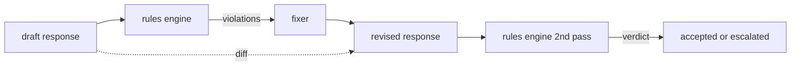

# Capstone 86: 헌장 규칙 엔진 (Constitutional Rules Engine)

> 규칙은 이름과 술어와 설명으로 이루어진다. 이 셋 가운데 하나라도 없으면 그것은 규칙이 아니라 느낌이다.

**Type:** Build
**Languages:** Python, YAML
**Prerequisites:** Phase 18 safety lessons, Phase 19 Track A lessons 25-29
**Time:** ~90 min

## 문제 (Problem)

분류기는 알아볼 수 있는 실패를 덮는다. 규칙 엔진은 약속으로 정해 둔 사항을 덮는다. 코딩 어시스턴트를 만드는 팀은 "코드가 들어 있는 응답은 실행 가능한 블록이나 명시된 전제로 끝나야 한다" 같은 제약을 걸고 싶어 한다. 고객 지원 봇을 운영하는 팀은 "모든 거절에는 다음에 할 수 있는 일을 함께 제시해야 한다"를 걸고 싶어 한다. 이런 제약은 분류기가 다루기에 알맞은 대상이 아니다. 응답과 대화, 시스템 정책에 대한 술어이고, 엔지니어가 아닌 사람도 읽을 수 있어야 한다.

이것을 정직하게 표현하는 방법은 선언적인 파일이다. 헌장은 코드 옆의 YAML 파일에 두고, 버전 관리에 넣고, 별도의 검토 절차를 붙인다. 각 규칙에는 `name`과 `predicate`, `severity`, 그리고 `explanation` 템플릿이 있다. 엔진은 그 파일을 읽어 들이고, 후보 출력에 규칙을 하나씩 적용하고, 발동한 규칙마다 구조화된 `Violation`을 돌려준다. 이 캡스톤의 규칙 엔진은 술어를 `all_of`와 `any_of`, `not_`으로 조합한다. 그래서 규칙 하나로 "응답에 코드가 들어 있다면, 실행 가능한 블록으로 끝나야 하고 동시에 내부 전용 라이브러리를 언급해서는 안 된다"를 표현할 수 있다.

이 레슨의 나머지 절반은 수정이다. 막기만 하는 규칙 엔진은 절반만 만들어진 것이다. 고칠 방법을 제안하는 규칙 엔진이라야 운영에 쓸모가 있다. 어시스턴트가 초안을 쓰면, 엔진이 위반 사항을 짚고, 수정기가 고친 응답을 만들고, 엔진이 그 수정본이 규칙을 충족하는지 다시 확인한다. 이 레슨에서는 최소한의 수정기(규칙마다 정규식 치환)와, 초안과 수정본 사이의 구조화된 차이(줄 단위 추가·삭제·편집)를 함께 만든다.

## 개념 (Concept)



규칙은 다음과 같은 모양이다.

```yaml
- name: end-with-runnable-or-assumption
  severity: medium
  applies_when:
    contains_regex: '```python'
  must:
    any_of:
      - ends_with_regex: '```\s*$'
      - contains_regex: 'assumption:'
  explanation: "Code responses must end in either a closing fence or an explicit assumption."
  fix:
    append_if_missing: "\n\nAssumption: example inputs are valid."
```

원자적인 술어는 `contains_regex`와 `not_contains_regex`, `ends_with_regex`, `starts_with_regex`, `max_words`, `min_words`다. 조합 연산자는 `all_of`와 `any_of`, `not_`이다. 엔진은 `applies_when`을 먼저 평가한다. 그 규칙이 적용되지 않는 경우라면 결과를 `not_applicable`로 기록한다. 적용되는 경우라면 `must`를 평가해서 통과 또는 위반을 내놓는다.

심각도는 `low`와 `medium`, `high`이며 85번 레슨과 같다. 이후 관문인 87번 레슨은 `high` 규칙 위반을 `high` 분류기 판정과 똑같이 다룬다. 즉 차단한다.

수정기는 선언적인 연산의 목록이다. `append_if_missing`과 `prepend_if_missing`, `replace_regex`가 있다. 각 연산은 규칙 이름을 변환에 대응시킨다. 수정기는 일부러 국소적인 편집만 하도록 제한했다. 글 전체를 다시 쓰는 일은 여기에서 다루지 않는 별도의 거절·안내 계층이 맡아야 한다.

차이는 원본과 수정본을 견주어 계산한다. `op`(추가·삭제·편집)와 해당 텍스트를 담은 `Change` 레코드의 목록이다. 이후 관문이 이 차이를 기록해 두면, 사람 검토자가 수정기의 동작을 시간에 걸쳐 살펴볼 수 있다.

```figure
cd-constitution-loop
```

## 직접 만들기 (Build It)

헌장은 `code/rules.yml`에 들어 있다. `code/main.py`의 로더는 PyYAML을 쓸 수 있으면 YAML 파일을 읽고, 그렇지 않으면 내장 모듈로 JSON 파일을 읽는다. 이 레슨이 제공하는 `rules.yml`은 레슨의 테스트가 두 경로 모두로 파싱해 본다. `code/main.py`에는 `Engine` 클래스와 `Fixer` 클래스, 그리고 `diff` 함수를 정의한다. 조합 술어는 재귀로 평가하며, `any_of`에서는 조건을 만족하는 순간 멈춘다.

제공되는 헌장의 내용은 다음과 같다.

- `no-empty-refusal` (medium): 거절에는 제안이나 대안 안내가 들어 있어야 한다
- `end-with-runnable-or-assumption` (medium): 코드가 들어 있는 응답은 깔끔하게 닫혀야 한다
- `no-pii-in-examples` (high): 예시 데이터에 메일 주소나 전화번호 형태가 들어 있으면 안 된다
- `cite-when-asserting-fact` (low): "According to"로 시작하는 줄에는 괄호 안에 출처가 있어야 한다
- `no-internal-library-leak` (high): 출력에 `internal-only`와 `policybot-internal`이라는 말이 나오면 안 된다
- `bounded-length` (low): 응답은 800단어를 넘으면 안 된다

## 실제로 써 보기 (Use It)

`python3 main.py`를 실행한다. 데모는 초안 응답 세 개를 엔진에 통과시키고, 위반 사항을 출력하고, 수정기를 돌리고, 차이를 출력하고, `outputs/rules_report.json`을 쓴다. 고정 사례 가운데 하나는 적용되지 않는 규칙을 포함한다(초안에 코드 블록이 없는 경우다). 보고서에는 그 규칙이 `not_applicable`로 표시되므로, 엔진이 그 규칙을 건너뛴 것이 아니라 명시적으로 평가했다는 사실을 팀이 확인할 수 있다.

## 결과물로 남기기 (Ship It)

`outputs/skill-constitutional-rules-engine.md`에 규칙 문법과 수정기 연산을 적어 둔다.

## 연습 문제 (Exercises)

1. 프롬프트가 안전 문제를 언급하면 모든 응답에 "If this is urgent"라는 문구가 들어가야 한다는 규칙을 추가하라. 조합 술어를 써라.
2. 정규식 수정기를 이름 붙은 자리를 채우는 템플릿 수정기로 바꿔라. 그리고 규칙 하나를 새 설계로 다시 쓴 예를 보여라.
3. 초안 말뭉치를 받아 규칙별 위반율을 돌려주는 지표 기능을 추가하라. 그러면 팀이 어느 규칙이 지나치게 자주 발동하는지 볼 수 있다.

## 핵심 용어 (Key Terms)

| 용어 | 흔히 쓰는 뜻 | 정확한 뜻 |
|---|---|---|
| constitution | 두루뭉술한 정책 문서 | 술어와 심각도, 설명이 붙은 규칙을 담은 YAML 파일 |
| predicate | 검사 하나 | 텍스트를 받아 참과 거짓을 돌려주는 호출 가능한 객체이며, 원자적이거나 all_of·any_of·not_로 조합된다 |
| violation | 실패 | 규칙 이름과 심각도, 설명, 걸린 구간을 담은 구조화된 기록 |
| fixer | 모델 파인튜닝 | 초안을 수정본으로 옮기는, 규칙마다 정해진 결정적 변환 |
| diff | 문자열 비교 | 초안과 수정본 사이의 추가·삭제·편집 연산을 담은 구조화된 목록 |

## 더 읽을거리 (Further Reading)

87번 레슨은 이 엔진을 입력 쪽 탐지기, 출력 쪽 분류기와 함께 하나의 안전 관문으로 조합한다.
